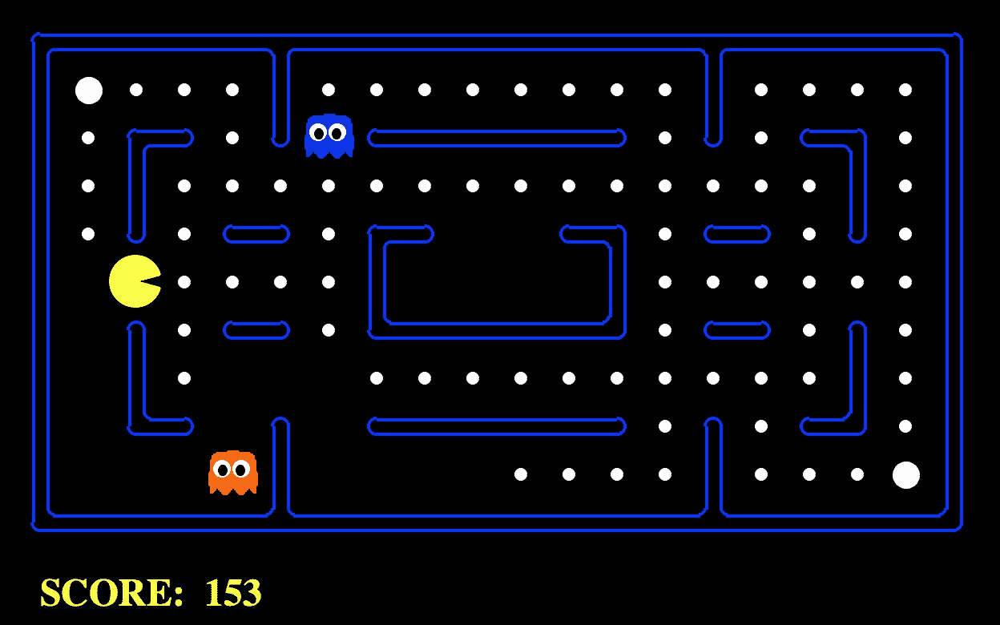
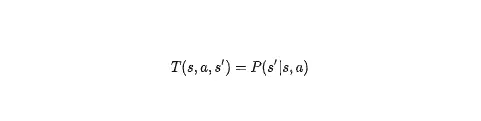
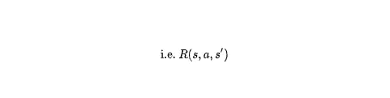
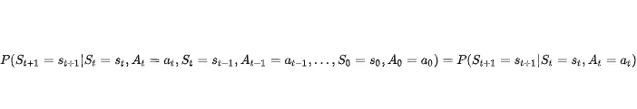
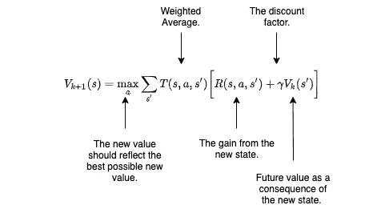
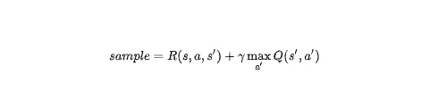
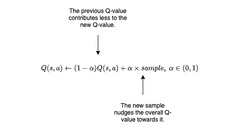
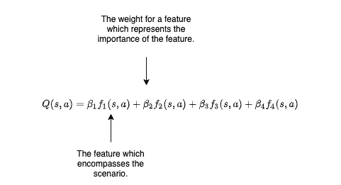
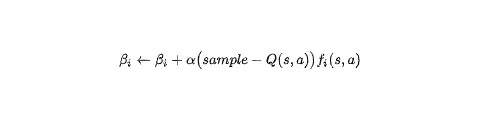

# 强化吃豆人

> 原文：<https://towardsdatascience.com/reinforced-pac-man-8e51409f4fc?source=collection_archive---------23----------------------->

## 趣味语境下的 AI 深度解析。

逃避 2020 年的严酷现实有多种形式。对一些人来说，2020 年已经充斥着阅读、听播客或深夜狂欢最新的网飞系列。对我来说，没有什么比建立一个人工智能代理来胜过阿朵的鬼谁是死心塌地吃它更好的背离现实了。是的，你猜对了，我说的是吃豆人，我说的是 AI。我们开始吧！

# **游戏设置**

游戏将在包含我们的角色和物品的平铺游戏板上进行。在这种情况下，时间以离散的方式工作，而不是连续的，因此，下面的讨论将涉及时间步长(例如第 **k** 个时间步长)。在这个世界里，存在着:

*   吃豆人——主角
*   恩奇和克莱德——对立方
*   颗粒——我们饥饿朋友的食物来源
*   能量球——能让吃豆人的对手变得可食用的物体。

图 1:吃豆人游戏板(图片由作者提供)。

这些角色和他们周围的世界之间的互动被封装在一个完整的游戏棋盘表示中，也就是所谓的状态。每个状态代表特定时间点的世界，吃豆人或幽灵的任何动作都会导致状态的改变。Pac-man 或 ghosts 可用的动作是基于移动的动作，指示实体是向上、向下、向左还是向右移动。此外，像任何好的游戏一样，存在一个与传统游戏略有不同的积分系统。

*   每吞噬一个小球，分数增加 10。
*   状态每改变一次，就会招致 1 的生存惩罚。这是专门为了防止人工智能代理发现自己处于一种永远逃避墨奇和克莱德的模式中，从而不可能完成游戏。
*   如果 AI 代理能够完成游戏，那么将会增加 500。可观的增长激励代理人完成游戏。
*   类似地，死刑是用来阻止代理人被幽灵吃掉而退出游戏。
*   吞噬一颗能量丸后吃掉任一个幽灵，会得到 200 的奖励。

在这个版本的吃豆人中，Inky 和 Clyde 并不特别聪明，并以随机行为遍历游戏棋盘。虽然这确实让吃豆人更容易赢得游戏，但目的是双重的:

1.  吃豆人的主要动机是不被因基或克莱德吃掉而赢得游戏。
2.  随着时间的推移，吃豆人必须学会如何在活着的时候最大限度地增加点数。

下面的解决方案将在不运行单一搜索算法的情况下处理这两个目标。

# **马尔可夫决策过程**

马尔可夫决策过程(MDP)是一种对存在一组状态和动作的场景进行建模的正式方式。提交一个动作会以某种特定的概率导致不同的状态。也就是说，在给定先前状态 **s** 和所选动作 **a** 的情况下，存在描述到达状态**s’**的概率的转移函数。

每个状态也有与之相关联的奖励，因此有奖励功能。奖励值取决于先前的状态、动作和结果状态。

为了能够描述这个过程的开始和结束，还有一个开始和结束状态。不需要总是有终止状态，但这是对不同上下文的构造。

顾名思义，MDP 具有马尔可夫性质，即未来状态的条件概率严格依赖于当前状态。在这个结构中，这可以写成:

这类流程的目标是找到最佳策略。策略是 AI 代理在任何给定状态下遵循的一组指令。这是通过一种称为值迭代的迭代方法来完成的。该算法是搜索问题的一个非常好的解决方案，因为它保证收敛到一个最优策略。该算法取决于贝尔曼方程的计算:

对上述等式的解释比看起来要简单得多。正在计算的是在第 **(k+1)** 时间步的状态值 **s** 。状态的值是与到新状态的转变相关联的奖励，**s’**，以及将从新状态接收的随之而来的奖励。然而，由于这些奖励是未来的奖励，它们现在对吃豆人来说价值较低，因此它使用了一个贴现因子 **𝛾** 来表示收益递减。因为新状态**s’**是不确定的，所以该等式取每个可能的新状态的平均值，并基于转移概率对它们进行加权。最后，在每一个可能的行动中取最大值的原因是，存在一种乐观的观点，即不是通过最坏的结果，而是通过最好的结果来定义一个国家的价值。

# **数值迭代算法**

该算法源于上述解释，给出如下:

1.  从所有值为 0 的状态开始。
2.  使用贝尔曼方程迭代并更新每个状态。
3.  重复直到收敛。

随着时间的推移，行动的最优选择将收敛到确定每个国家的最优政策。

# **MDPs 和 Pac-man**

所以你可能会问自己，这和吃豆人有什么关系？吃豆人游戏的设置类似于 MDP。在任何给定的时间点，存在封装游戏的状态，Pac-man 可以选择采取的行动，以及当代理到达新的状态时以点数形式的奖励。然而，上述迭代寻找最优策略的构造并不是真正的学习，而是一种模拟场景和寻找最佳计划的方法。从这个意义上来说，它与搜索算法并没有太大的不同，我也不会违背自己不进行搜索的承诺。所以，建筑需要多一点…

# **Q-学习**

上面所描述的被称为“离线”解决方案，它在给定一个转移函数和奖励的情况下制定一个最优策略。通常，准确定义是不可能的或非常困难的，因此，代理需要了解真实的分布，而不是不切实际地提供它。因此，需要一种“在线”解决方案，除了它所处的状态和它可以采取的行动之外，它一无所知。

与上面的值迭代相反，优化 Q 函数是对所述问题的解决方案。为什么？价值迭代的等式是期望的成本和回报对等状态。另一方面，Q 函数是当你处于一个状态 s 并应用一个动作 a 时的预期成本和回报。通过这样做，当代理探索每个状态下可用的动作时，下一次将理解随之而来的回报。该实现采用其值符合贝尔曼方程的新样本，并将先前的 Q 值推向新的经验值。这在数学上描述如下:

在实现中，⍺是学习率，并且该值可以被解释为模型对新样本的存在有多敏感。学习速率越高，新信息的价值就越大，因为当观察到新样本时，新信息的价值会发生相当大的变化。

虽然这种方法在足够高的重复次数后确实能很好地逼近转移概率，但一个明显的问题是在勘探和开采之间的选择。如果主角在状态 s 决定了一个动作 a，并实现了一个积极的回报，那么什么会阻止 Pac-man 在稍后的时间点重复同样的动作。在目前的结构中，什么都没有。这就是引入勘探率的原因。它迫使吃豆人在每次ϵ的时候选择一个随机的移动。最初， **ϵ=1** ，这意味着吃豆人将总是随机选择一个动作，因为它对游戏板一无所知，因此它将允许吃豆人做出相当数量的好和坏的决定。随着时间的推移， **ϵ** 将收敛到 0，以反映周围游戏知识的增长和探索新动作的需求的缺乏。重要的是要警惕ϵ收敛过快或过慢的影响。收敛太快将导致 Pac-man 在特定状态下不采取足够的行动，结果，估计的转移函数将是不准确的。另一方面，收敛太慢将导致次优决策，即使在多次学习迭代后也是如此，这是随机决策的结果。

# **Q-Learning 和 Pac-man**

在一个典型的固定状态场景中，每个状态都有一个固定的奖励，并且终端状态也是固定的，上述结构将足以遍历棋盘并随着时间优化奖励。然而，吃豆人是一个更有活力的游戏。总共有 3 种终端情况:

*   因基的好意，游戏结束
*   克莱德的好意，游戏结束了
*   吞噬最后一颗子弹

此外，一旦吃豆人吃了一个小球或能量球，并意识到这种行为的回报，它就不能再吞噬同样的小球或能量球。这些事实给了吃豆人一个更加动态的本质，因此要求我们将游戏的这些“特征”编码到学习模型中。这样做还可以降低从基于状态的学习模型到基于特征的学习模型的模型复杂度。

用于简化游戏的功能:

*   一步之遥的幽灵数量(该特征赋予附近有 1 或 2 个敌人的状态以重要性)
*   吃食物(强调吃食物行为的特征)
*   最接近的食物(赋予最接近的颗粒重要性的特征)
*   偏差(包含其他可能情况的偏差术语)

在这样做的时候，近似 Q 学习是近似的，并且将所有可能的情况总结为 4 个特征。

因此，对算法进行适当的修改，以学习每个特征的每个 **β** 权重。重量代表了吃豆人对每个功能的重视程度。结果，我们对算法进行了适当的修改，使得每个特征的重要性 **β** 被学习。

# 结果呢

最后，我们现在有了一个主角，他穿越周围的世界，建立直觉来躲避对手，同时最大化其一生的回报。

假设我们用 1000 次迭代和以下参数训练这个模型:

*   **𝛾 = 0.7**
*   **⍺ = 0.1**

# 认可和改进

我希望我们的黄种朋友的上述示范对你和对我一样令人满意。如果没有加州大学伯克利分校的 Pac-man 游戏引擎，这一切都是不可能的，该引擎已经被修改为与 Python 3 兼容。构建和解释我的解决方案的过程是非常宝贵的，尽管还有很多后续步骤。其中包括:

1.  通过为每个幽灵引入传统的目标逻辑使 Pac-man 变得困难。
2.  从 Q-learning 开始，下一个增加的复杂性层可能是深度 Q-Learning 模型。
3.  使用包来优化实现(Github 源代码将很快推出)。
4.  能量球被吞噬而鬼魂可以食用的情况很少发生，因此吃豆人不知道如何瞄准鬼魂。

我希望读者已经被我的第一篇博客吸引住了，并且能够理解强化学习的整体思想和细节。请留下您的评论和反馈。谢谢大家！