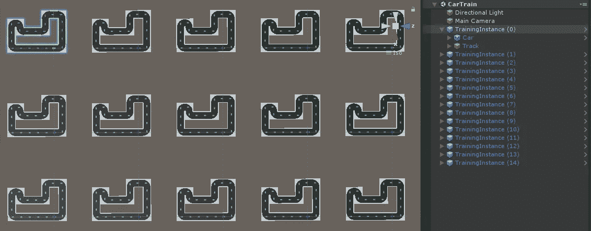

# Unity 中自动驾驶汽车人工智能的强化学习

> 原文：<https://towardsdatascience.com/reinforcement-learning-a-self-driving-car-ai-in-unity-60b0e7a10d9e?source=collection_archive---------11----------------------->

> *自动驾驶汽车的时代几乎就要降临在我们身上，至少* [*据埃隆马斯克*](https://www.extremetech.com/extreme/290029-tesla-well-have-full-self-driving-by-2020-robo-taxis-too) *。因此，大概是时候学习如何为自己做一个了。虽然这篇文章没有深入到这种深度，但它足以制作出精通任何赛道的模拟汽车。*
> 
> 编辑:本故事已于 2021 年 1 月 1 日更新，以匹配 ML-Agents 的发布(1.0)版本。

*注:本文面向已经对使用*[*Unity*](https://unity3d.com/)*有基本概念，并且对神经网络和* [*强化学习*](https://skymind.ai/wiki/deep-reinforcement-learning) *感兴趣的人。不需要神经网络和/或博士学位的经验！本文提供了获得以下结果所需的一切:*


上面三辆车都是用本文的代码训练出来的，一辆是作者控制的，你能猜到是哪一辆吗？

*所有必要的代码都可以在 GitHub 的* [*资源库*](https://github.com/xstreck1/cAr-drIve) *中找到。*

# 最基本的乘坐方式

我们首先构建一个赛车游戏的基本功能——为此你只需要一个 Unity 的功能版本(用 [20](https://unity3d.com/get-unity/download/archive) 20.1 测试)。因为我们并不是要制造一场有趣或真实的比赛，这可以用几行代码来完成。

## 赛道

为了创建一个轨道，我创建了一组 3 块瓷砖(直行、左转、右转)，我们可以以任何方式组合它们来创建一个轨道。


直走，左转，右转。每个瓷砖都由三个网格组成—一个正方形地板(带箭头的黑色)和两个边界。每个对象都是静态的，在所有三个网格上都有一个碰撞器。边界块必须标记为“**墙**”。

如您所见，每个瓷砖都有一个箭头。这个箭头显示了瓦片的退出方向，并匹配每个瓦片的`forward`向量，我们将在后面使用。

通过将瓷砖放置在彼此相距 10 米的位置(我建议将[捕捉设置](https://unity3d.com/de/learn/tutorials/topics/tips/snapping)设置为 10)，我们可以构建任何自定义轨道。这是我们将用于培训的工具:


训练跑道。注意，它与文章开头的赛道不同——在这条赛道上训练的 AI 可以很容易地在赛道瓷砖的任何组合上使用。

## 汽车

第二，我们制造汽车。我提供了一个 b̶e̶a̶u̶t̶i̶f̶u̶l 方便的三维模型作为这个项目的基础。


汽车是一个单独的物体，带有一个箱式碰撞器和一个动态刚体。由于我们只对平面上的运动感兴趣，所以可以关闭围绕 Y(绿色)轴的运动以及围绕 X、Z(红色、蓝色)轴的旋转。

同样，汽车的前进矢量指向它的运动方向。我们现在可以让我们的汽车移动了，这是使用下面的脚本完成的。

```
public class Car : MonoBehaviour
{
    public float speed = 10f;
    public float torque = 10f;

    private void Update()
    {
        float horizontal = Input.GetAxis("Horizontal");
        float vertical = Input.GetAxis("Vertical");
        float dt = Time.deltaTime;
        MoveCar(horizontal, vertical, dt);
    }

    private void MoveCar(float horizontal, float vertical, float dt)
    {    
        // Translated in the direction the car is facing
        float moveDist = speed * vertical;
        transform.Translate(dt * moveDist * Vector3.forward);

        // Rotate alongside it up axis 
        float rotation = horizontal * torque * 90f;
        transform.Rotate(0f, rotation * dt, 0f);
    }
}
```

就是这样。如果你一直跟着，你可以开车去兜风。

请注意，该脚本仅基于向上或向下箭头键向前/向后移动，并向左或向右旋转。

我们完成了，我们的单人赛车游戏现在完成了！自己做一些测试，然后让我们看看人工智能在上面会有什么表现。

# 训练汽车

现在我们将转移到项目的 ML 代理部分。为此，如果您还没有安装 ML-agents 插件，您需要安装它。详情请参考 [ML-Agents 安装说明](https://github.com/Unity-Technologies/ml-agents/blob/master/docs/Installation.md)。

为了让代理进行自我培训，我们需要执行以下操作:

1.  观察代理的状态(位置、方向等)。)
2.  根据状态决定行动。
3.  评估该行动的结果。

为此，我们创建了一个名为`CarAgent.cs`的新类，它扩展了`Car.cs`并赋予我们从环境中学习的能力。这个类需要从一个`Agent`而不是`MonoBehaviour`继承，以便连接到底层的 ML-Agents 机器。

## 通晓人情世故

首先我们将比较代理的方向和轨迹的方向。为此，我们将在一个全局变量`_track`中存储当前的轨迹。我们使用以下函数获得当前音轨:

```
private Transform GetTrackTile()
{
    var carCenter = transform.position + Vector3.up;Physics.Raycast(carCenter, Vector3.down, out var hit, 2f);
    return hit.transform;
}
```


带符号的角度是沿着当前图块的黄色箭头和定义汽车前进方向的蓝色箭头之间的向上(Y 轴)方向获得的。

然后我们可以比较瓷砖和汽车方向的差异，如上图所示。这给了我们最初的观察——从逻辑上来说，赛车会尽量减小这个角度，以便跟随赛道。我们还使用一个带符号的角度(在-180 度和 180 度之间)来告诉汽车是向左还是向右转向。

```
public override void CollectObservations(VectorSensor vectorSensor)
{
    _track = GetTrackTile();
    float angle = Vector3
         .SignedAngle(track.forward, transform.forward, Vector3.up);
    vectorSensor.AddObservation(angle / 180f); // Map to (-1,1)
}
```

注意，该方法扩展了`Agent` 类的`CollectObservations()`方法，确保观察结果得到正确解释。

其次，我们需要判断汽车离障碍物的距离。在真正的自动驾驶应用中，经常使用的技术是[激光雷达](https://en.wikipedia.org/wiki/Lidar)——一种利用光线反弹测量距离的方法。这里我们用光线投射来观察周围固体物体的距离。


这些射线被可视化为黄线。可以看到施法距离限制在 5m 以内。

为了投射光线，我们使用下面的辅助函数，它获取相对于汽车的位置和角度，并检查碰撞。如果有，我们将信息存储为[0，1]之间的正值，如果没有，我们返回`-1`。

```
// Casts a ray from a point in a direction based on the car position
// z: offset of the ray origin from the car centre on the z axis
// x: as above but on the x
// angle: direction of the ray from its origin
private float ObserveRay(float z, float x, float angle)
{
    var tf = transform;

    // Get the start position of the ray
    var raySource = tf.position + Vector3.up / 2f; 
    const float **RAY_DIST** = 5f;
    var position = raySource + tf.forward * z + tf.right * x;

    // Get the angle of the ray
    var eulerAngle = Quaternion.Euler(0, angle, 0f);
    var dir = eulerAngle * tf.forward;

    // See if there is a hit in the given direction
    Physics.Raycast(position, dir, out var hit, **RAY_DIST**);
    return hit.distance >= 0 ? hit.distance / **RAY_DIST** : -1f;
}
```

要投射所有四条光线，我们只需向`AddObservation()`方法添加以下调用。

```
vectorSensor.AddObservation(ObserveRay(1.5f, .5f, 25f)); // FrontR
vectorSensor.AddObservation(ObserveRay(1.5f, 0f, 0f)); // Front
vectorSensor.AddObservation(ObserveRay(1.5f, -.5f, -25f)); // FrontL
vectorSensor.AddObservation(ObserveRay(-1.5f, 0, 180f)); // Back
```

## 艾掌握方向盘

这也是定义代理人大脑的时候。我们从`BehaviourParameters`开始，这将允许我们在培训前测试我们的代理:


我们使用 a5 观察和 2 个连续动作。这些动作分别映射到水平轴和垂直轴，与我们在非自主汽车上测试的输入相匹配。

现在我们只缺少一个`DescisionRequester`——一个控制人工智能应该多久做一次决定的脚本:


我们将决策周期设置为 1，即每一步都做出决策。

我们现在将输入动作到我们的学院。现在我们只把`Update`函数替换为`AgentAction`，它为代理定义了基本的事件循环。

```
public override void OnActionReceived(float[] vectorAction)
{      
    float horizontal = vectorAction[0];
    float vertical = vectorAction[1];
    float dt = Time.fixedDeltaTime;
    MoveCar(horizontal, vertical, dt);
}
```

注意，由于`AgentAction`发生在固定时间，我们必须改变单个移动动作之间的时间差。

现在，您可以用`Car.cs`替换`CarAgent.cs`并继续使用键盘驾驶。

## 奖励时间到了

最后，为了让代理能够自学，我们需要添加什么是好结果和坏结果的概念。我们特别要做到以下两点:

1.  奖励沿着轨道前进。
2.  处罚碰撞。

第一个更复杂，所以我们从它开始。这将在我们的`OnActionReceived`方法中完成。我们首先通过比较移动前后的位置来获得移动矢量。这让我们知道我们“沿着”轨道移动了多少。然后，这从范围(180，0)映射到(-1，1)-角度越大，奖励越低，角度> 90 是一个惩罚。请注意，这是一个与`CollectObservation`不同的地图。为了促进高速运动，我们将运动方向与垂直速度结合起来

```
var moveVec = transform.position - lastPos;
float angle = Vector3.Angle(_track.forward, moveVec);
float dirReward = 1f - (angle / 90f);
AddReward((dirReward + vertical) * dt);
```

注意，我们乘以时间步长(通常是 1/60 ),这样我们每秒最多得到 1 的回报。这与我们移动一个方块的速度相匹配——最多每秒 1 个，并确保奖金和奖励值以类似的方式贡献。当与前面的代码结合使用时，我们

```
public override void OnActionReceived(float[] vectorAction)
{
    var lastPos = transform.position;float horizontal = vectorAction[0];
    float vertical = vectorAction[1];
    float dt = Time.fixedDeltaTime;
    MoveCar(horizontal, vertical, dt);

    var moveVec = transform.position - lastPos;
    float angle = Vector3.Angle(_track.forward, moveVec);
    float dirReward = 1f - (angle / 90f);
    AddReward((dirReward + vertical) * dt);
}
```

其次，我们希望避免与墙壁碰撞——这是通过将奖励设置为`-1f`并结束当前训练集来惩罚的。

```
private void OnCollisionEnter(Collision other)
{
    if (other.gameObject.CompareTag("wall"))
    {
        SetReward(-1f);
        EndEpisode();
    }
}
```

## 最后润色

为了完成我们的代码，我们只需要添加代码进行重置。当汽车撞到墙时，我们希望将汽车重置到它的起始位置——结合负面奖励，这有助于训练避墙行为(如果汽车沿着墙卡住，我们可能会以许多小插曲结束)。这是在从代理继承的最后一个函数中完成的:

```
public override void OnEpisodeBegin()
{
    if (resetOnCollision)
    {
        transform.localPosition = Vector3.zero;
        transform.localRotation = Quaternion.identity;
    }
}
```

请注意，我们使用了`resetOnCollision`参数，这意味着冲突并不总是以重置结束——事实上，在玩游戏时，代理应该处理冲突，而不是重新开始。

# 驾校

我们终于拥有了运行培训流程的所有组件。

由于 Unity 支持多代理强化学习，所以最好一次使用多个代理。为此，我们将复制粘贴曲目。这些需要简单地在 x-z 平面上隔开，以便它们不重叠:



我们把轨道和汽车放在一个父对象中来创建一个训练实例。然后，15 个实例在两个方向上彼此等距 100 米。

最后，我们需要为培训过程设置参数。我们保留当前的默认参数，只是增加了报告频率。为此，我们在项目文件夹中创建以下名为`trainer_config.yaml`的配置文件:

```
behaviors:
    CarDrive:
        trainer_type: ppo    
        summary_freq: 10000
```

现在一切都准备好了。如果你遵循了 [ML-Agents 安装说明](https://github.com/Unity-Technologies/ml-agents/blob/master/docs/Installation.md)，你应该有 python 和 mlagents 包。打开命令行，导航到放置`trainer_config.yaml` 的位置，然后运行以下命令:

```
mlagents-learn trainer_config.yaml --train --run-id=CarDrive
```

您应该得到一个响应，描述 ml-agents 版本并要求您按下 play 按钮。切换到 Unity，按 play，训练应该开始了。该过程需要几分钟时间，具体取决于您的 CPU(或 GPU，如果您安装了 TensorFlow 的 GPU 版本)。

## 你的训练现在完成了