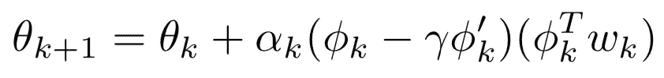

# 强化学习——梯度时间差分学习算法介绍

> 原文：<https://towardsdatascience.com/reinforcement-learning-an-introduction-to-gradient-temporal-difference-learning-algorithms-4a72ce5ab31e?source=collection_archive---------17----------------------->

## 对政策评估中一些最新算法的全面介绍，包括 GTD 和 GTD2。

Rafif Prawira 在 [Unsplash](https://unsplash.com/s/photos/maze?utm_source=unsplash&utm_medium=referral&utm_content=creditCopyText) 上拍摄的照片

**目录:**

*   介绍
*   线性函数逼近
*   推导 GTD2 算法
*   结论
*   鸣谢和资源

# 介绍

强化学习是目前最热门的领域之一，具体的应用正在以令人难以置信的速度增长，从击败视频游戏到机器人。从本质上来说，**强化学习(RL)** 处理的是决策——也就是说，它试图回答一个主体在给定环境中应该如何行动的问题。

> 强化学习处理决策

不严格地说，所有的 RL 都归结为发现或评估一个**策略**，这只是一种行为方式。例如，策略可以是下棋的策略。

> 策略接受一个状态(在国际象棋的例子中，是棋盘上所有棋子的位置)并为其分配一个动作。

例如，给定你的棋盘的状态，你的策略可能要求你向前移动你的皇后。当你退出一个状态，你会得到一些奖励。这个很直观。例如，如果我们用快乐/痛苦来衡量我们作为人类的回报，那么把我们的手放在沸水中(退出之前手很冷的状态)会产生一些痛苦(因此，会有回报)。

在本文中，我们将关注一个叫做**策略评估**的东西，它可以归结为评估策略。这是什么意思？给定一个策略，我们希望找到其关联的**值函数**。这意味着如果我们遵循一些给定的策略，就能够给每个状态赋值。但是我们所说的*值*是什么意思呢？如果我们处于某种状态，那种状态的值就是我们从这种状态中得到的预期回报。

> TD 不一定在非政策环境下收敛

由 Richard Sutton 在 20 世纪 80 年代提出的 TD 学习的变体是一些最健壮和最常用的策略评估算法，尤其是在 **on-policy** 设置中，即当您遵循您正在评估的策略时。然而，在**非策略**设置中——当遵循不同于您正在评估的策略时——TD 学习算法的收敛性在某些情况下无法保证(例如，当使用线性近似时，我们将在下一节中讨论)。这使得萨顿等人在 2009 年引入了 GTD 和 GTD 2(GTD 的改进版本)，以保证在非政策设置下的收敛性[1] [2]。

# 线性函数逼近

当你第一次开始学习 RL 时，你可能会开始学习马尔可夫链、马尔可夫奖励过程(MRP)，最后是**马尔可夫决策过程(MDP)** 。然后，您通常会转到典型的策略评估算法，如蒙特卡罗(MC)和时间差异(TD)学习，然后是控制算法，如 SARSA 和 Q-learning。

> 对于大多数 RL 应用程序来说，表查找并不实用

在所有这些情况下，您可能一直在使用状态值和动作值函数的**表格表示**。这意味着您直接更新了每个状态的值。实际上，这对于具有大量状态的 MDP 或者在我们使用连续状态空间的情况下是非常不切实际的。例如，如果你试图在三维空间中引导一架直升机，你的状态可能是它的当前位置、速度、角速度、加速度等。正如您所猜测的，状态的数量是无限的，这意味着没有办法在一个表中存储所有的东西。

这个问题的解决方法是什么？我们将使用一个函数(由某个权重向量 **θ** 参数化)来逼近真实值函数，而不是直接更新每个状态。这个函数可以是任何东西(例如，您可以使用神经网络)，但我们将重点关注线性函数逼近。数学上，我们在寻找一个函数

其中 **ϕ(s)** 是包含给定状态信息(例如:速度、加速度等)的特征向量。)和 **θ** 是我们正在努力学习的权重向量。在某些状态下，价值函数的估计就是**ϕ(s**和 **θ** 之间的点积。上式中， **γ ∈ (0，1)**称为折现率；直觉上，这意味着我们更重视获得短期回报，而不是长期回报——这与我们人类的工作方式是一致的，除了数学上的便利。

> 我们的目标是找到权重向量 **θ** ，这将允许我们的价值函数逼近尽可能精确。

如果我们用**s’**表示下一个状态，我们可以用**贝尔曼方程**写出 **TD 误差**如下:

我们记得，我们将在后面使用的贝尔曼算子被定义为 **TV = R + γ PV，**其中 **P** 是转移矩阵。任何给定值函数 **V** 必须满足贝尔曼方程，即 **V = TV** 。利用 TD 误差，我们可以获得传统的 TD 更新:

对于某些学习率 **α(k)** 。如果这对你来说是新的，这可能看起来很复杂，但这并不新奇！的确，这只是一个简单的随机梯度下降！在线性近似器的情况下，我们注意到梯度减少到 **ϕ(k)** ，这使得一切都变得美好而简单。

# 目标函数

现在我们有了一个价值函数逼近器，问题就变成了:我们如何让这个逼近器尽可能好？为此，我们首先需要定义某种误差函数。

> 一个**目标函数**只是一个 **θ** 的函数，我们将努力使其相对于 **θ** 最小化。

在做 TD 学习的时候，最自然的测量误差的方式就是通过测量 **V(θ)** 符合贝尔曼方程的程度。这被称为**均方贝尔曼误差(MSBE)** ，其定义为

其中 **D** 是一个对角矩阵，包含衡量每种状态出现频率的权重

对于某些矢量 **v** 。

> 对于任何 **θ** ，TV(θ)通常不能表示为 **V(θ)**

这个目标函数在许多先前的研究中被使用，但是大多数 TD 算法不收敛到 MSBE 的最小值。这是由于贝尔曼算子遵循马尔可夫链的基本状态动力学，这意味着对于任何 **θ** ，通常不能用 **V(θ)** 来表示 **TV(θ)** (例如，如果我们考虑线性函数逼近器，我们不能精确地表示非线性函数是有意义的)。然后，通常所做的是将最优解投影到最近的可表示值函数，其中运算符**π**定义为

如果我们考虑一个线性架构，其中对于某个矩阵**φ**，其行是 **ϕ(s)** ，我们可以独立于 **θ** 将**π**写成

到目前为止，所有的 TD 算法都收敛到值**θ**(TD 固定点)，使得

GTD2 的推导使用了不同的目标函数，即**均方投影贝尔曼误差(MSPBE)** ，它考虑了投影**π**，

MSBE 和 MSPE 之间有一种非常简洁的几何关系，我们可以在下图中看到(摘自萨顿关于 GTD2 的原始论文):

两个贝尔曼误差目标函数之间的几何关系[1]

有趣的是，对于 GTD 来说，使用的目标函数是预期 TD 更新(NEU)的标准，

我们很快就会看到，这两个方程确实非常相似。

# 推导 GTD2 算法

我们现在将推导 GDT2 算法，这是由 Sutton 等人在 2009 年引入的算法，它在偏离策略的情况下收敛。我们首先承认下列重要的关系，这将有助于以后简化某些方程。

现在，我们可以根据期望将 MSPBE 写成

我们应该在这里看到一些有趣的东西！

> 我们看到，MSPBE 与 NEU 的不同之处仅在于包含了特征协方差矩阵的逆。

为了避免需要两个独立的样本，我们可以使用一个可修改的参数 **w ∈ Rⁿ** 来形成目标函数梯度中除了一个期望之外的所有期望的准平稳估计

利用这一点，我们得到

其可以被直接采样。由此，我们得到 GTD2 算法:

GTD2 算法的θ更新

现在，我们想为 **w** 找到一个迭代更新。首先，我们意识到

我们看到上面的右边是下面最小二乘问题的解决方案:

这可以通过具有以下更新的随机梯度下降来解决:

**w** 为 GTD2 算法更新

**θ** 和 **w** 更新一起组成了 GTD2 算法，可以很容易地用你喜欢的编程语言实现。注意，为了让算法收敛，我们需要

# 结论

谢谢你走了这么远！我希望您现在对策略评估有了更好的理解，更具体地说，对强化学习中的一些新算法有了更好的理解，比如梯度时间差异学习。此外，我希望你对算法背后的数学有所了解，并对它们是如何推导出来的有更多的直觉。

# 鸣谢和资源

这篇文章主要依赖于 Sutton 等人在 2009 年发表的 GTD2 论文，以及最初的 GTD 论文。艾尔。

[1] Sutton，R. S .，Maei，H. R .，Precup，d .，Bhatnagar，s .，Silver，d .，Szepesvari，Cs .和 Wiewiora，E. (2009 年)。线性函数逼近的时差学习快速梯度下降法。在*第 26 届机器学习国际会议记录*中，第 993–1000 页。全媒体。

[2]萨顿、塞佩瓦里、Cs。，Maei，H. R. (2009 年)。线性函数逼近的非策略时差学习收敛 O(n)算法。*神经信息处理系统进展 21* 。麻省理工出版社。