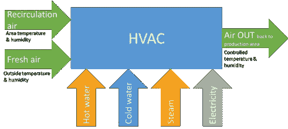
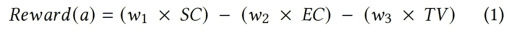
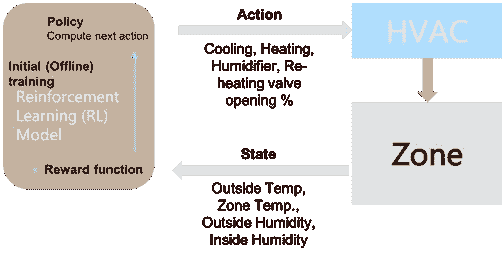
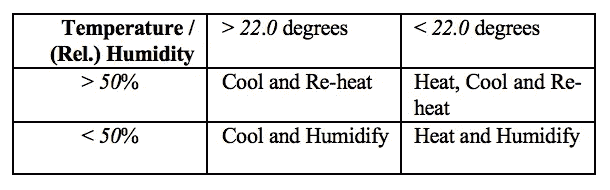
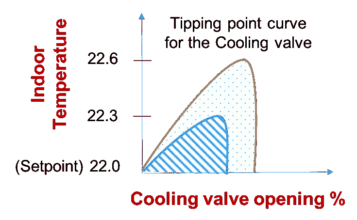
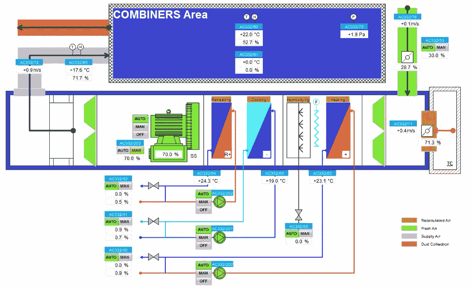
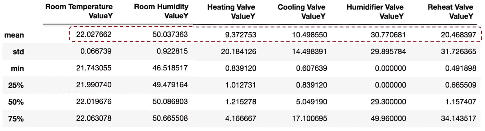
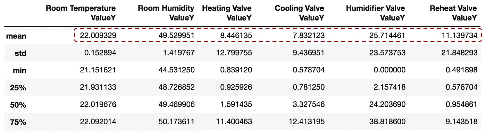

# 基于强化学习的工厂能源优化

> 原文：<https://towardsdatascience.com/reinforcement-learning-based-energy-optimization-dea8fb687cda?source=collection_archive---------10----------------------->

## 面向可持续未来的工厂暖通空调优化

***摘要。*** *供暖、通风和空调(HVAC)单位负责维持建筑物内的温度和湿度设置。研究表明，暖通空调占建筑能耗的近 50%，占全球用电量的 10%。因此，暖通空调优化有可能为我们的可持续发展目标做出重大贡献，减少能耗和二氧化碳排放。在这项工作中，我们探索优化工厂 HVAC 控制的方法。不幸的是，这是一个复杂的问题，因为它需要考虑多个可变因素来计算最佳状态，例如，占用、制造进度、运行机器的温度要求、建筑物内的气流动态、外部天气条件、节能等。我们提出了一种基于强化学习(RL)的能源优化模型，该模型已在我们的工厂中得到应用。我们表明 RL 是一个很好的选择，因为它能够实时学习和适应多参数系统动力学。它比以前使用的比例-积分-微分(PID)控制器节能约 25%。*

这篇论文的**发表版本**如下，发表在 2020 年 6 月第 11 届美国计算机学会电子能源会议论文集([PPT](https://www.slideshare.net/DebmalyaBiswas/reinforcement-learning-based-hvac-optimization-in-factories-238645532))[https://dl.acm.org/doi/10.1145/3396851.3402363](https://dl.acm.org/doi/10.1145/3396851.3402363)


图一。可持续发展的能源优化(来自 [Pexels](https://www.pexels.com/photo/sky-clouds-building-industry-39553/?utm_content=attributionCopyText&utm_medium=referral&utm_source=pexels) 的 [Pixabay](https://www.pexels.com/@pixabay?utm_content=attributionCopyText&utm_medium=referral&utm_source=pexels) 摄影)

# 1 导言

供暖、通风和空调(HVAC)装置负责维持建筑物内的温度和湿度设置。在这项工作中，我们特别考虑了它们在工厂中的使用，其中 HVAC 装置的主要目标是将温度和(相对)湿度保持在规定的制造公差范围内。这需要与节能和减少二氧化碳排放相平衡，以抵消运行它们对环境的影响。

> 因为它们不仅普遍存在于工厂，而且存在于家庭和办公楼中；任何有效的控制逻辑都有可能对环境影响做出重大贡献。不幸的是，考虑到 HVAC 单元的复杂性，设计有效的控制逻辑是一个困难的优化问题。

控制逻辑需要考虑多个可变因素，例如，占用、制造进度、运行机器的温度要求、建筑物内的气流动态、外部天气条件、节能等。；以便决定该区域的加热、冷却或湿度。

HVAC 优化文献可以大致分为两类:(I)了解优化参数之间的循环模式，以更好地调度 HVAC 功能，以及(ii)建立 HVAC 单元的模拟模型，并评估模型上的不同控制策略，以确定最有效的策略。

第一类的例子包括[1，2]，其采用建筑热力学模型来预测建筑的温度演变。不幸的是，这并不真正适用于我们的工厂，那里的制造工作量每天都在变化，而且没有可以预测的时间表。另外值得一提的是，大多数此类模型每次只考虑一个优化参数，即控制加热/冷却来调节温度；而在我们的情况下，我们需要同时调节温度和(相对)湿度，以保持最佳的制造条件。

第二类基于模型的方法适用于 PID 和 RL 控制器。PID(比例积分微分)控制器[3]使用控制回路反馈机制来控制过程变量。不幸的是，基于 PID 的控制器需要相对于基础 HVAC 单元进行大量的校准，以便能够有效地控制它们。[4]概述了一种基于模拟工具组合的 PID 校准方法。

基于强化学习(RL) [5]的方法[6，7]最近被提出来解决这些问题，因为它们能够实时学习和优化多参数系统。基于 RL 的方法需要初始(离线)训练阶段，因为在实时设置(在线)中训练 RL 算法可能需要时间来收敛，从而在 RL 代理探索其状态空间时导致潜在的危险违反。[6，7]根据基于暖通空调装置模拟模型的 EnergyPlus，概述执行该离线培训的解决方案。EnergyPlus [8]是美国能源部的一款开源 HVAC 模拟器，可用于模拟能耗(供暖、制冷、通风、照明、插头和过程负载)和建筑用水。不幸的是，开发 HVAC 单元的精确的基于能量+的仿真模型是一个重要的、耗时且昂贵的过程；因此是他们在离线训练中使用的一个障碍。

> 在这项工作中，我们提出了一个有效的基于 RL 的 HVAC 优化算法，它能够在几周内学习并适应一个实时 HVAC 系统。该算法可以独立部署，或作为“训练模块”来生成可用于执行 RL 模型离线训练的数据，以进一步优化 HVAC 控制逻辑。这使得所开发的 RL 模型的部署快速且具有成本效益。

此外,[6，7]中的模型输出是最佳温度和湿度设定值，这些设定值依赖于 HVAC 控制逻辑，以确保以有效的方式达到规定的设定值。在这项工作中，我们提出了一个更细粒度的 RL 模型，其输出是加热、冷却、再加热和加湿器单元的实际阀门打开百分比。这实现了一种更加自给自足的方法，RL 输出绕过任何内置的 HVAC 控制逻辑(消除任何依赖性并使其冗余),从而实现更加独立于供应商(平台)的解决方案。

文章的其余部分组织如下:第 2 节介绍了基础知识，提供了暖通空调优化问题的 RL 公式。第 3 节概述了 RL 逻辑，其最初被部署来生成用于离线训练的训练数据，从而导致第 4 节中的(训练的)RL 模型实时提供推荐的阀门打开百分比。在第 5 节中，我们提供了已开发的 RL 模型的一些基准测试结果，该模型已部署在我们的一个工厂区域中。初步研究表明，我们能够在现有 PID 控制器逻辑的基础上实现 *25* %的能效。第 5 节对论文进行了总结，并为未来的工作提供了方向。

# 2 问题场景

# 2.1 暖通空调

图 2 显示了 HVAC 装置的能量平衡。简而言之，HVAC 装置必须使再循环空气和新鲜空气的混合达到将区域温度和(相对)湿度保持在所需水平所需的温度和湿度。通过计算流出空气和流入空气的能量之差，很容易监控所需的理论能量，将该量与机组所需的能量进行比较，即可得出 HVAC 机组的能效。

能量流可以根据介质(空气、热水、冷水、蒸汽)的流量以及介质供应和回流之间的温差来确定。和消耗的电能。



图二。暖通空调控制(图片由作者提供)

# 2.2 强化学习

RL 指的是人工智能(AI)的一个分支，它能够通过实时最大化一个奖励函数来实现复杂的目标。奖励功能的工作原理类似于用糖果和打屁股来激励孩子，这样算法在做出错误决定时会受到惩罚，在做出正确决定时会受到奖励——这就是强化。有关 RL 框架的详细介绍，感兴趣的读者可以参考[5]。

# 2.3 RL 公式

我们现在将场景映射到我们的 HVAC 设置。在任何时间点，工厂区域都处于以区域内外观察到的温度和(相对)湿度值为特征的状态。

在这种情况下，游戏规则对应于温度和湿度的容许水平，其基本要求区域温度和湿度值应分别在:*19–25*度和*45–55*%的范围内。在这种情况下，可用的动作集是冷却、加热、再加热和加湿器阀门打开百分比(%)。

总的来说，根据(内部和外部)温度和湿度值给定区域状态，RL 模型需要决定将冷却、加热、再加热和加湿器阀门打开多少。为了在这种情况下做出明智的决定，RL 模型需要首先了解 HVAC 系统的行为，例如通过将冷却阀打开到 *X* %,可以预期区域温度下降多少？

一旦 RL 模型理解了 HVAC 系统的行为，最后一步是设计控制策略，或 RL 术语中的“策略”。例如，RL 模型现在必须选择是否在区域温度达到 *23* 度时将冷却阀打开至 25%，或者等到区域温度达到 *24* 度时再将冷却阀打开至 *40* %。注意，在打开阀门之前等待的时间越长，对降低能耗有积极的作用；然而，由于外部天气条件总是不可预测的，这就有违反温度/湿度耐受水平的风险。因此，如果等待时间更长，它可能实际上不得不将冷却阀打开到更高的百分比，从而消耗更多的能量。上述概率由 RL 术语中的奖励函数(等式 1)量化，该函数基于以下三个参数为每个可能的行为分配奖励:



控制策略是决定三个参数的权重:设定点接近度(SC)、能量成本(EC)、公差违反(TV)。能源成本体现在电力消耗和二氧化碳排放方面。例如,“安全”控制策略会为违反容差的行为分配非常高的负权重(惩罚),确保它们永远不会发生，尽管会付出更高的能源成本。同样,“能源优化政策”会将节能置于其他两个参数之上。设定值接近度鼓励“商业友好”政策，RL 模型试图将区域温度保持在尽可能接近温度/湿度设定值的水平，这无疑降低了违规风险，但能源成本较高。

> 我们选择“平衡”控制策略，最大化节能和设定值接近度，同时最小化违反公差的风险。

图 3 中示出了上述 RL 公式。



图 3。暖通空调强化学习公式(图片由作者提供)

# 基于 3 RL 的暖通空调优化

> 我们概述了 RL 算法，该算法基于当前室内温度和湿度(在时间 *t* )以及先前的加热、冷却、加湿器、再加热阀打开百分比值、时间 *t-1* 的室内温度和湿度值，输出在时间 *t* 打开加热、冷却、加湿器和再加热阀的程度。

*rl_hvac* 功能运行，每隔 *1* 分钟实时计算新的阀门开度值。

```
**#input values:**
i_tl #Indoor Temp (previous, at time t-1)
i_hl #Indoor Humidity (previous)
i_t  #Indoor Temp (current, at time t)
i_h  #Indoor Humidity (current)
y_hl #Heating Valve Opening (previous, at time t-1)
y_ul #Humidifier Valve Opening (previous)
y_rl #Re-heating Valve Opening (previous)
y_cl #Cooling Valve Opening (previous)**#output values:** y_h  #Heating Valve Opening (current, at time t)
y_u  #Humidifier Valve Opening (current)
y_r  #Re-heating Valve Opening (current)
y_c  #Cooling Valve Opening (current)**#static variables:** hiW  #Heating step increment
uiW  #Humidifier step increment
riW  #Re-heating step increment
ciW  #Cooling step increment*#invoked every 1 min* ***rl_hvac*** *(i_tl, i_hl, i_t, i_h, y_hl, y_ul, y_rl, y_cl)***# Heat and Humidify**
if (i_t < 22.0) and (i_h < 50.0):    
    if (i_t < i_tl):
        inc = hiW + abs((i_t - i_tl) / 0.1)
        y_h += inc
    if (i_h < i_hl):
        inc = uiW + abs((i_h - i_hl) / 0.1)
        y_u += inc
    y_r = 0.0
    y_c = 0.0
**# Cool and Reheat**
if (i_t > 22.0) and (i_h > 50.0):
    if (i_t > i_tl):
        inc = ciW + abs((i_t - i_tl) / 0.1)
        y_c += inc
    if (i_h > i_hl):
        inc = riW + abs((i_h - i_hl) / 0.1)
        y_r += inc
    y_h = 0.0
    y_u = 0.0
**# Heat, Cool and Reheat**
if (i_t < 22.0) and (i_h > 50.0):
    if (i_t < i_tl):
        inc = hiW + abs((i_t - i_tl) / 0.1)
        y_h += inc
    if (i_h > i_hl):
        inc = ((ciW + riW) / 2.0) + abs((i_h - i_hl) / 0.1)
        y_c += inc
        y_r += inc
    y_u = 0.0
**# Cool and Humidify**
if (i_t > 22.0) and (i_h < 50.0):
    if (i_t > i_tl):
        inc = ciW + abs((i_t - i_tl) / 0.1)
        y_c += inc
    if (i_h < i_hl):
        inc = uiW + abs((i_h - i_hl) / 0.1)
        y_u += inc
    y_h = 0.0
    y_r = 0.0***return*** *(y_h, y_u, y_r, y_c)*
```

RL 逻辑可以解释如下:回想一下，我们希望保持的温度和(相对)湿度设定值是 *22* 度和 *50* %;允许公差范围分别为 *3* 和 *5* 。在每次迭代( *1* 分钟)时， *rl-hvac* 功能根据以下控制逻辑确定打开哪个阀门:



知道打开哪个(些)阀，每个阀打开多少取决于奖励值，该奖励值作为先前(输出)阀打开的“有效性”的度量来计算。例如，假设室内温度目前为 *20.5* 度(低于温度设定值)，这意味着需要打开供暖阀。在前一次迭代期间，室内温度也低于设定值，比如说 *21.0* 度，导致 *rl_hvac* 功能建议在比如说 *15* %时打开加热阀。考虑到当前的室内温度甚至更低( *20.5* 度)，我们推断先前的加热阀打开不够有效——赋予其负奖励——并且加热更多，其量与当前和先前的室内温度之间的差成比例。其他阀门的行为可以类似地解释。这是一种强化，确保阀门能够有效地平衡奖励函数(等式 1)的“设定点接近度”和“能量成本”参数。

奖励函数的剩余参数是“公差违反”,其中如果室内温度/湿度违反了允许的公差范围，则需要施加惩罚。在我们的情况下，违规意味着相应的阀门需要更快地反应。这由步进增量常数调节: *hiW，ciW，uiW，riW* 。我们以离线方式调整它们，以便在给定时间段内，如果公差违反的数量超过某个阈值，则调整它们的值。

```
**# Check tolerance violations and adapt respective increment values**
if (count (i_t > 25.0) > n):    
    ciW += 1.0
if (count (i_t < 20.0) > n):    
    hiW += 1.0
if (count (i_h > 55.0) > n):    
    riW += 1.0
if (count (i_h < 45.0) > n):    
    uiW += 1.0
```

# 4 连续 RL 优化

在本节中，我们扩展了 RL 模型，以适应“长期回报”，用 RL 术语中的 Q 值来量化。(回想一下，上一节中概述的 RL 算法中的奖励函数是随机的，在某种意义上，它仅取决于最后的状态。)状态-动作对 *(s，a)* 的 Q 值被定义为从当前状态 *s* 开始的所有未来步骤的期望回报值的加权和，假设在状态 *s* 采取动作 *a* 。

为了适应“长期回报”，我们将原来的问题扩展到一个连续的空间设置。该设置中的每个事件对应于室内温度和(或)湿度开始偏离其各自设定值的时间，以及室内条件返回其各自设定值的时间——这是打开相关阀门的结果。



图 4。阀门倾点计算(图片由作者提供)

现在让我们来关注一个这样的插曲(在一个连续的空间设置中)。假设随机 RL 算法(第 3 节)总是在 *0.0%* 开始打开阀门，温度和(或)湿度与设定值的偏差持续增加，直到阀门打开百分比达到临界点，之后偏差再次开始减小，直到变为 *0* 。这种阶段性行为如图 4 所示。为了简单起见，我们只显示了温度——冷却曲线，但是对于其他情况，包括那些涉及湿度的情况，可以预期类似的行为。图 4 中的能量成本对应于阴影区域。鉴于这种行为，很容易看出，如果我们事先知道冷却临界点是 *22.3* 度，我们可以更早地将冷却阀打开到临界点——导致更低的能量成本(由虚线阴影区域描绘)。这里需要注意的是，需要正确估计所有阀门的临界点，否则打开阀门超过临界点的百分比实际上可能会导致更高的能源成本。

> 接下来，我们将展示如何将第 3 节中 RL 算法生成的数据用作训练数据，以开发一个模型来预测工厂区域每个状态的阀门“临界点”。

对于每个时间点 *t* ,(第 3 部分)RL 算法数据可被认为由以下输入和值组成:(室内温度、室内湿度、加热阀开度%、冷却阀开度%、加湿器阀开度%、再加热阀开度%)。我们对该数据应用以下过滤标准(仅针对湿度)来提取训练数据:

```
**# Extraction filter (for humidity) — to extract the training data** # loop through rows of the generated data
for i in range(1, dataset.shape[0]):
   cRow = dataset.iloc[i] #current row
   pRow = dataset.iloc[i-1] #previous row

   if cRow['Indoor Humidity'] > 50.0 and cRow['Indoor Humidity'] < pRow['Indoor Humidity']:
       ctr = ctr + 1
       #write row to training data

   if cRow['Indoor Humidity'] < 50.0 and cRow['Indoor Humidity'] > pRow['Indoor Humidity']:
       ctr = ctr + 1
       #write row to training data
```

通过这一更新(粗体)，RL 算法能够引导阀门开启百分比，因此每次事件将以训练模型提供的相应“临界点”值开始(而不是从 *0.0%* 开始)，从而降低能源成本，如图 4 所示。

```
**# Heat and Humidify**
if (i_t < 22.0) and (i_h < 50.0):
    if (y_h == 0.0):
        y_h = **loaded_h_model.predict(Xnew)**
    elif (i_t < i_tl):
        inc = hiW + abs((i_t - i_tl) / 0.1)
        y_h += inc
    if (y_u == 0.0):
        y_u = **loaded_u_model.predict(Xnew)**
    elif (i_h < i_hl):
        inc = uiW + abs((i_h - i_hl) / 0.1)
        y_u += inc
    y_r = 0.0
    y_c = 0.0
```

# 5 基准测试 RL 与 PID

提出的 RL 模型已经部署在我们罗马尼亚工厂的一个区域中。指定区域有五个(类似的)HVAC 单元，其中 HVAC 单元的示意图如下图 5 所示。



图 5。暖通空调示意图(图片由作者提供)

对于该区域，我们首先给出(图 6)一周内运行带 PID 控制器的 HVAC 的室内条件和 HVAC 阀门开启百分比(约 10，000 个读数，相当于每分钟一个读数)。



图 6。基于 PID 的 HVAC 控制读数(图片由作者提供)

对于同一个区域，我们随后运行了由 RL 模型控制的 HVAC 单元的基准测试。我们确保两种情况下的制造工作负载相似。我们首先运行第 3 节中概述的 RL 算法一周。接下来，应用第 4 节中概述的过滤器来生成训练数据。然后使用 AWS Sagemaker Autopilot [9]训练四个模型: *h_model、u_model、r_model、c _ model*，以产生基于 XGBoost 的回归模型，其验证误差(来自超参数调整的 MSE)约为 *25.0* 。训练好模型后，我们又运行了一周第 4 节中介绍的 RL 算法(同样，使用类似的生产工作负载)。结果显示在图 7 中。



图 7。基于 RL 的 HVAC 控制读数(图片由作者提供)

> 比较平均阀门开启百分比(由图 6 和图 7 中的红色边界框突出显示)，我们可以看到所有基于 RL 的阀门开启百分比较低；从加热阀的 *10* %节约到再加热阀的几乎 *45* %节约—平均节约 *25* %。

# 6 结论

在这项工作中，我们考虑了工厂中的暖通空调能源优化问题，这有可能在节能和减少二氧化碳排放方面产生重大的环境影响。为了解决问题的复杂性，我们概述了一种基于 RL 的 HVAC 控制器，它能够学习并适应现实生活中的工厂设置，而无需任何离线培训。据我们所知，这是在实际工厂中报告 RL-HVAC 模型现场部署的首批作品之一。我们提供的基准测试结果显示，在能效方面有可能节省高达 *25* %。

请注意，我们认为节能与阀门开启百分比成正比(越低越好)。实际上，不同阀门的能量消耗和 CO2 排放可能不成比例，即根据基本机制，打开相同百分比的加热和冷却阀门可能消耗不同数量的能量。我们将此作为将来的工作来调整 RL 逻辑，以适应能耗和 CO2 排放方面。

# 参考

[1] F. Oldewurtel 等人*使用随机模型预测控制和天气预测进行节能建筑气候控制*。事故赔偿委员会，2010 年。

[2] Y. Ma 等*建筑制冷系统运行的模型预测控制*。IEEE 控制系统技术汇刊，20(3):796–803，2012。

[3] F .皮科克。*PID 算法的白痴指南*。https://www.pidcontrol.net/index.html

[4] C .布拉斯科等人*根据能效和舒适度标准*对暖通空调系统进行建模和 PID 控制。In:能源和建筑的可持续性。智能创新，系统和技术，第 12 卷(2012)。

[5] Harmon，m . e . Harmon，S.S.: *强化学习:教程*。[http://www . cs . Toronto . edu/~ zemel/documents/411/rl tutorial . pdf](http://www.cs.toronto.edu/~zemel/documents/411/rltutorial.pdf)

[6] T. Weiand 等人.."*建筑暖通空调控制的深度强化学习* l "第 54 届年度设计自动化会议论文集，第 22 页，2017。

[7] T. Moriyama 等人*用于功耗优化的强化学习试验台*。《第 18 届亚洲模拟会议(AsiaSim)论文集》，第 45–59 页，2018 年。

[8] EnergyPlus，[https://energyplus.net](https://energyplus.net/)

[9]亚马逊 SageMaker 自动驾驶，[https://aws.amazon.com/sagemaker/autopilot/](https://aws.amazon.com/sagemaker/autopilot/)