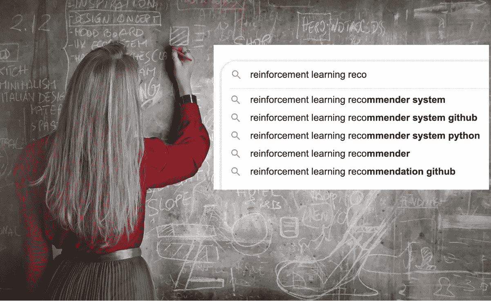
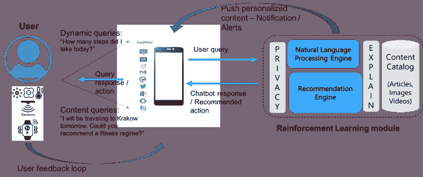
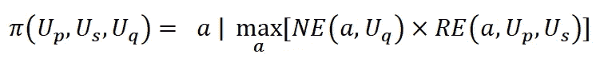
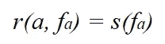
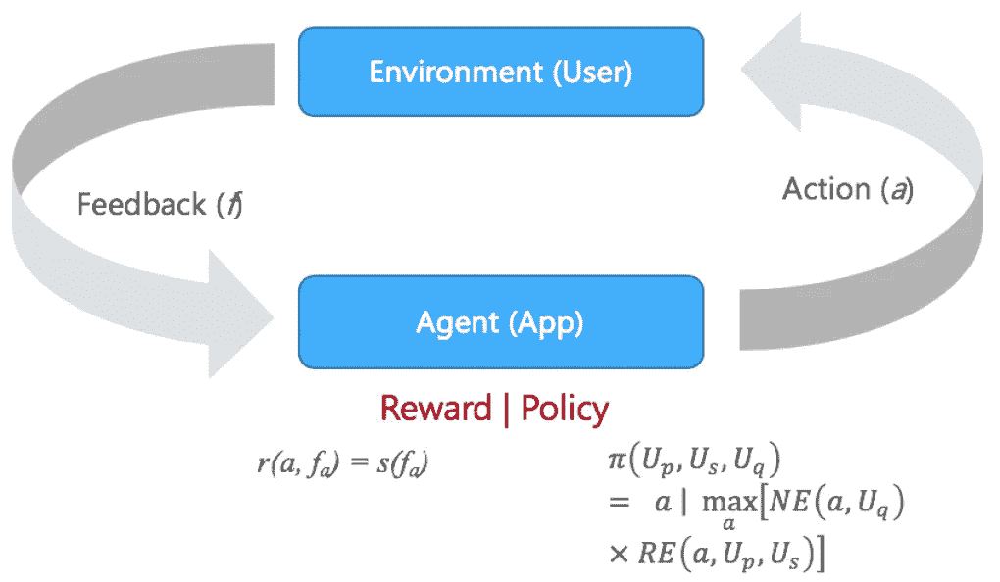
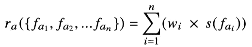
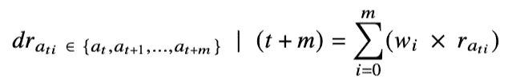
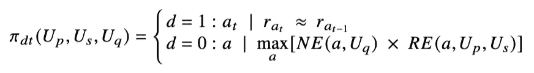
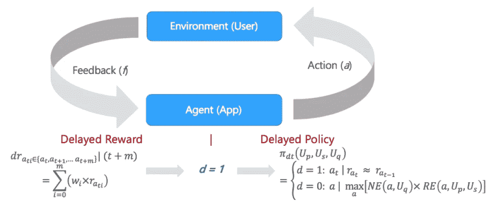
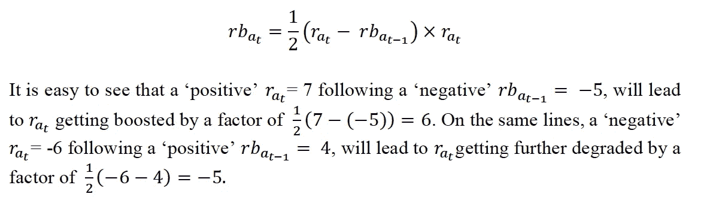

# 基于强化学习的推荐系统

> 原文：<https://towardsdatascience.com/reinforcement-learning-based-recommender-systems-492a2674fcc?source=collection_archive---------25----------------------->

## [理解大数据](https://towardsdatascience.com/tagged/making-sense-of-big-data)

## 结合强化学习和 NLP/聊天机器人开发个性化应用

**摘要。** *我们提出了一种基于强化学习的方法来实现推荐系统。这些结果是基于一个现实生活中的健康应用程序，该应用程序能够以互动的方式向用户提供个性化的健康/活动相关内容。不幸的是，当前的推荐系统无法适应不断发展的特征，例如用户情绪，以及需要基于多个不可靠的反馈通道(例如传感器、可穿戴设备)来计算 RL 奖励的场景。为了克服这一点，我们提出了三个构造:(I)加权反馈通道，(ii)延迟奖励，和(iii)奖励提升，我们认为这对于 RL 用于推荐系统是必不可少的。*

这篇论文发表在 **AAI4H** —医疗保健人工智能进展研讨会的会议录上，与第 24 届欧洲人工智能会议( **ECAI** 2020)，2020 年 9 月 *(* [*论文 pdf*](http://ceur-ws.org/Vol-2820/AAI4H-10.pdf)*)(*[*PPT*](https://www.slideshare.net/DebmalyaBiswas/delayed-rewards-in-the-context-of-reinforcement-learning-based-recommender-systems)*)*

基于强化学习的推荐系统:基于来自 [Pexels](https://www.pexels.com/photo/woman-in-red-long-sleeve-writing-on-chalk-board-3769714/?utm_content=attributionCopyText&utm_medium=referral&utm_source=pexels) 的 [Andrea Piacquadio](https://www.pexels.com/@olly?utm_content=attributionCopyText&utm_medium=referral&utm_source=pexels) 的 pic

# 1 导言

健康/保健应用程序的采用率一直很低。通过向用户提供越来越相关和及时的建议，个性化推荐有可能提高采用率。虽然推荐引擎(以及基于它们的应用程序)已经成熟，但它们仍然受到“冷启动”问题的困扰，事实上它基本上是一种基于推送的机制，缺乏使这种应用程序吸引千禧一代所需的交互性。

> *我们展示了一个健康应用案例研究，其中我们应用了强化学习(RL)和自然语言处理(NLP) /聊天机器人的组合，以向用户提供高度个性化的交互式体验。我们专注于应用程序的交互方面，应用程序能够实时描述用户并与用户交谈，提供适应用户当前情绪和过去偏好的相关内容。*

这种聊天机器人的核心是一个意图识别自然语言理解(NLU)引擎，它通过问题变体的硬编码示例进行训练。当没有符合 30%以上置信度的意图时，聊天机器人会返回一个后备答案。基于(显式的)用户响应和(隐式的)环境方面来计算用户情绪，例如位置(住宅、办公室、市场……)、温度、照明、一天中的时间、天气、附近的其他家庭成员等等；来进一步适应聊天机器人的反应。

RL 指的是人工智能(AI)的一个分支，它能够通过实时最大化一个奖励函数来实现复杂的目标。奖励功能的工作原理类似于用糖果和打屁股来激励孩子，这样算法在做出错误决定时会受到惩罚，在做出正确决定时会受到奖励——这就是强化。强化方面还允许它更快地适应用户情绪的实时变化。有关 RL 框架的详细介绍，感兴趣的读者可以参考[1]。

以前的工作已经在推荐系统的背景下探索了 RL[2，3，4，5]，并且随着云 API(例如 Azure Personalizer [6，7])和 Google 的 RecSim [8]的最近可用性，企业采用也似乎正在获得动力。然而，它们仍然像典型的推荐系统一样工作。给定用户简档和分类推荐，系统基于流行度、兴趣、人口统计、频率和其他特征来做出推荐。这些系统的主要新颖之处在于，它们能够识别推荐的特征(或特征的组合),从而为特定用户获得更高的回报；然后可以为该用户定制以提供更好的推荐[9]。

> *不幸的是，这对于现实生活中的系统来说仍然是低效的，这些系统需要适应不断发展的功能，例如用户情绪，并且需要根据多个不可靠的反馈渠道(例如传感器、可穿戴设备)来计算奖励。*

本文的其余部分组织如下:第 2 节概述了问题场景，并将其表述为 RL 问题。在第 3 节中，我们建议

> *需要三种 RL 结构来克服上述限制:(I)加权反馈通道，(ii)延迟奖励，以及(iii)奖励提升，我们认为这是 RL 用于推荐系统的基本结构。*

在这种情况下,“延迟回报”不同于延迟 RL [10]的概念，在延迟 RL 中，遥远未来的回报被认为不如即时回报有价值。这与我们的“延迟奖励”概念有很大不同，在延迟奖励中，只有在后续行动验证了奖励的一致性后，才会应用奖励。第四部分总结了本文，并提出了未来研究的方向。

# 2 问题场景

# 2.1 健康应用

该应用程序支持基于推送的通知，其中个性化的健康，健身，活动等。向用户推送相关推荐；以及应用程序响应用户查询的交互式聊天。我们假设存在一个知识库 KB 的文章、图片和视频，根据它们与不同用户简档/情感的相关性对工件进行排序。

图 1 中描述了健康应用架构，其示出了用户和环境条件(包括用户反馈)如何:

1.使用可用传感器收集以计算“当前”反馈，包括环境背景(例如，用户的网络摄像头 pic 可用于推断用户对聊天机器人响应/通知的情绪、房间照明条件和附近存在的其他用户)，

2.其然后与用户对话历史相结合，以量化用户情感曲线，并排除由于不相关因素引起的情感的任何突然变化；

3.导致与提供给用户的最后聊天机器人响应/应用通知相对应的合计奖励值。

然后，该奖励值作为反馈提供给 RL 代理，以从知识库中选择下一个最佳聊天机器人响应/应用程序通知。

图一。健康应用架构(图片由作者提供)

# 2.2 互动聊天— RL 公式

我们将上述场景的 RL 引擎公式化如下:

*动作* ( *a* ):在这种情况下，动作 *a* 对应于一篇知识库文章，该文章作为推送通知或者作为对用户查询的响应或者作为正在进行的对话的一部分被传递给用户。

*Agent* ( *A* ):是执行动作的一方。在这种情况下，代理是向用户交付操作的应用程序，其中操作是基于其策略选择的(如下所述)。

*环境*:指智能体与之交互的世界，它响应智能体的动作。在我们的例子中，环境对应于与应用程序交互的用户。 *U* 对 *A* 的行为做出反应，提供不同类型的反馈，既有显性的(以聊天反应的形式)，也有隐性的(如面部表情的变化)。

*策略* (𝜋):是代理用来选择下一个基于动作的策略。给定一个用户简档 *Up* 、【当前】情绪 *Us* ，并查询*Uq*；策略功能计算分别由 NLP 和推荐引擎返回的文章分数的乘积，选择具有最高分数的文章作为下一个最佳动作:(a)NLP 引擎( *NE* )解析查询，并基于文章与用户查询的“文本相似性”输出每个知识库文章的分数。(b)类似地，推荐引擎( *RE* )基于与每篇文章相关联的奖励，针对用户简档和情感，为每篇文章提供分数。策略函数可以形式化为如下形式:

*奖励* ( *r* ):是指我们用来衡量代理推荐行为的成败的反馈。反馈可以例如指用户阅读推荐文章所花费的时间量。我们考虑两步奖励函数计算，其中接收到的关于推荐动作的反馈 *fa* 首先被映射到情感分数，然后情感分数被映射到奖励。

其中 *r* 和 *s* 分别指奖励和情感函数。图 2 中示出了上述 RL 公式。

图二。RL 公式(图片由作者提供)

# 3 RL 奖励和政策扩展

# 3.1 加权(多个)反馈通道

如图 1 所示，我们考虑一个多反馈渠道，从用户(边缘)设备/传感器捕获反馈，例如网络摄像头、恒温器、智能手表，或者嵌入在托管应用的移动设备中的摄像头、麦克风、加速度计。例如，捕捉用户面部表情的网络摄像头帧、用户智能手表提供的心率，可以与用户提供的文本响应“谢谢你的好建议”一起考虑；在计算用户对推荐动作的情绪时。

设 *{fa1，fa2，… fan}* 表示行动 *a* 收到的反馈。回想一下 *s(f)* 表示基于各自的感官反馈 *f* 独立计算的用户情绪。用户情感计算可以被认为是输出在*1–10*之间的值的分类器。然后，可以将奖励计算为情感分数的加权平均值，如下所示:

其中权重 *{wa1，wa2，… wan}* 允许系统协调接收到的反馈，因为一些反馈信道可能遭受低可靠性问题。例如，如果 *fi* 对应于用户键入的响应， *fj* 对应于网络摄像头快照；则给予 *fi* 更高的权重。这里的理由是，用户可能在快照中“微笑”，然而“微笑”是由于他的孩子进入房间(也在帧中被捕捉)，而不一定是对所接收的推荐/动作的响应。同时，如果基于用户文本响应计算的情感指示他“有压力”，那么在这种情况下，我们给予用户明确(文本响应)反馈更高的权重。

# 3.2 延迟奖励

> *在奖励不一致的情况下应用“延迟奖励”策略，其中(当前)计算的奖励对于已知用户积极响应的行为(对于历史上相同类型的行为)是“负面的”；反之亦然。给定这种不一致，延迟奖励策略缓冲在时间 t 的行动的计算的奖励比率；并且向 R1 代理策略(𝜋)提供指示，以在更新时间 t 和 t+1 的行为奖励之前尝试相同类型的另一个推荐，从而验证用户情绪。*

为了适应“延迟奖励”策略，奖励功能扩展了一个内存缓冲区，允许从时间( *t+m)到 t* 的最后 *m* 个动作的奖励被聚集并在时间( *t+m* )追溯应用。延迟奖励功能 *dr* 表示如下:

其中，|𝑡+𝑚暗示对行动的报酬从时间( *t+m)到 t* 行动，尽管是单独计算的；只能在时间( *t+m* )应用。如前所述，各自的权重*和*允许我们协调不一致的反馈的影响，其中对𝑎t 时间𝑡𝑖的行为的奖励是基于在时间(𝑡+1)𝑖.

为了有效地执行“延迟奖励”策略，策略𝜋也被扩展为推荐与先前推荐的动作相同类型的动作；如果延迟标志 *d* 置位(*d = 1*)；则“延迟”策略𝜋𝑑𝑡表示如下:

图 3 示出了用延迟奖励/策略扩展的 RL 公式。

图 3。延迟奖励——基于政策的 RL 公式(图片由作者提供)

# 3.3 奖励提升

> 奖励增加，或者说奖励正常化，主要适用于持续的聊天互动。在这种情况下，如果用户对推荐动作的情绪是“负面的”；这可能不仅仅是上一个动作的错。可能对话情绪已经在下降，最后推荐的操作只是跟随下降趋势。另一方面，在对话情绪恶化的情况下，对推荐行为的“积极”情绪意味着它对用户产生了非常积极的影响；因此相应的回报应该增加。

对于在时间 *t* 的处的动作*的提升的奖励𝑟𝑏𝑎𝑡计算如下:*

我们把它作为将来的工作来扩展‘boost’函数到最后的 *n* 动作(而不仅仅是上面的最后一个动作)。在这个扩展场景中，系统维护最后 *n* 个动作的情绪曲线，并且相对于曲线而不是离散值来计算偏差。这里预期的好处是，它应该允许系统对用户情绪趋势做出更好的反应。

# 4 结论

在这项工作中，我们考虑在现实生活中的健康应用程序的背景下实现基于 RL 的推荐系统。RL 是解决此类问题的强大原语，因为它允许应用程序实时学习和适应用户偏好/情绪。然而，在案例研究中，我们意识到当前的 RL 框架缺乏应用于这种推荐系统所需的某些结构。为了克服这个限制，我们引入了三个 RL 构造，我们必须为我们的 Wellness 应用程序实现它们。建议的 RL 结构在本质上是基本的，因为它们影响奖励和政策功能之间的相互作用；我们希望将它们添加到现有的 RL 框架中会增加企业的采用。

# 参考

[1]巴尔托，a .，萨顿，R.S.: *强化学习:导论*。麻省理工学院出版社，麻省剑桥，2018 年，[http://incompleteideas.net/book/RLbook2018.pdf](http://incompleteideas.net/book/RLbook2018.pdf)

[2]崔顺实，哈，h，黄，U..Kim，c .，Ha，j .，Yoon，S.: *使用双聚类技术的基于强化学习的推荐系统*。arXiv:1801.05532，2018。

[3]刘，李，李，叶，陈，郭，张，杨:*基于深度强化学习的推荐与显式用户-项目交互建模*。arXiv:1810.12027，2018

[4] Taghipour，n .，Kardan，a .，Ghidary，S.S.: *基于使用的网络推荐:强化学习方法*。摘自:美国计算机学会推荐系统会议，第 113-120 页(2007)。

[5] Ricciardelli，e .，Biswas，D.: *基于强化学习的自我改进聊天机器人*。In:第四届强化学习与决策制定多学科会议(2019)。

[6] *微软 Azure Personalizer* 、
https://Azure . Microsoft . com/en-us/services/cognitive-services/Personalizer/

[7]李，李，朱，w，兰福德，J.C .，沙皮雷，R.E.: *一种语境强盗式的个性化新闻文章推荐方法*。摘自:第 19 届万维网国际会议，第 661–670 页(2010 年)。

[8] *谷歌 RecSim* ，
[https://ai . Google blog . com/2019/11/rec sim-configurable-simulation-platform . html](https://ai.googleblog.com/2019/11/recsim-configurable-simulation-platform.html)，最后访问时间 2019/02/03。

[9]用于更好的推荐系统的强化学习。[https://analyticsindiamag . com/reinforcement-learning-recommender-system-recsim-Google-ai/](https://analyticsindiamag.com/reinforcement-learning-recommender-system-recsim-google-ai/)

[10] *延迟强化学习。*[http://heim . ifi . uio . no/~ mes/INF 1400/COOL/REF/Standford/ch11 . pdf](http://heim.ifi.uio.no/~mes/inf1400/COOL/REF/Standford/ch11.pdf)