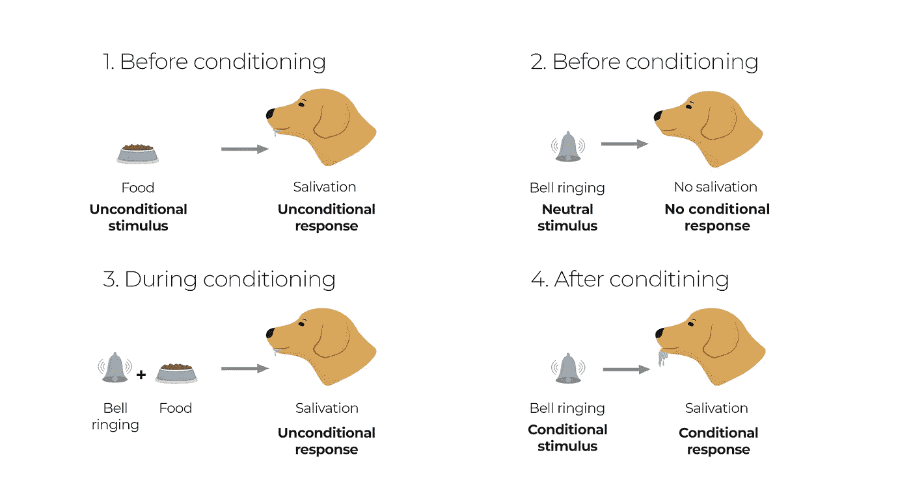
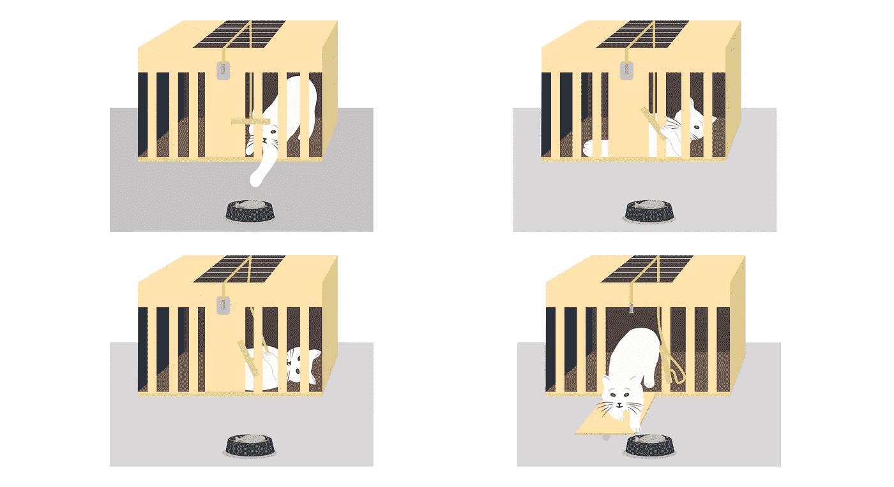

# 强化学习、大脑和心理学:经典和工具性条件作用

> 原文：<https://towardsdatascience.com/reinforcement-learning-brain-and-psychology-part-2-classical-and-instrumental-conditioning-217a4f0a989?source=collection_archive---------18----------------------->

## [强化学习、人工智能和人类](https://towardsdatascience.com/tagged/rl-and-humans)

## 心理学研究如何启发强化学习中的主体训练？

> "一个人相信事物是因为他已经习惯于相信它们。"—阿尔多斯·赫胥黎，美丽新世界。

在强化学习领域，有两大类算法:用于**预测的算法**和用于**控制的算法**。
对于稍微熟悉题目的人来说，*预测算法*通常是**基于值的**算法，也就是说它们的目的是预测一种情况的结果(*奖励*)。而*控制算法*大多是**基于策略的**算法，应该引导你度过难关。

同样，这些类别对应着心理学的两项研究:**经典(巴甫洛夫)** **条件反射**和**工具(操作)条件反射**。*预测算法*和*经典条件作用*之间的对应关系取决于它们预测即将到来的刺激的共同特性，无论这些刺激是奖励还是惩罚。有了*工具性条件作用*，一个*主体*根据它所做的得到奖励或惩罚，因此它学会增加产生奖励行为的倾向，减少产生惩罚行为的倾向。当然，这种对应不是偶然的，因为心理学对 RL 的影响很大。

这是灵感来源系列的第二部分，所以让我们跳进兔子洞，看看如何让人们相信。

# **经典条件作用**

我敢肯定，你们所有人都听说过**伊凡·巴甫洛夫**和他用狗做的实验，这是*经典条件反射*的最好例子，尽管在这个领域还有许多其他作品，让我们坚持到底。

巴甫洛夫博士正在研究一只狗对**无条件刺激** (US)的**无条件反应** (UR)，分别是流涎和食物演示。当给狗一些食物时，它几乎立刻开始分泌唾液。这个过程对我们来说非常简单和直观，但这引发了一个想法，即是否可以训练狗对其他刺激做出类似的反应。

**条件刺激** (CS)是狗以前不关心的东西，它可以是声音、光或基本上任何其他最初是中性刺激的东西。在巴甫洛夫的实验中，这是节拍器的声音。对 CS 的反应被称为**条件反应** (CR)，它有时类似于 UR，但通常开始得更早，通常更强烈。

回到巴甫洛夫的实验，在重复播放了几次节拍器的声音(CS)之后，就在展示食物(US)之前不久**，狗学会了对节拍器的声音(CR)分泌唾液，就像它对食物(UR)分泌唾液一样。美国被称为“强化者”,因为它强化了铬的产生以回应铯。**

巴甫洛夫实验管道

最初的中性刺激变成了条件刺激，因为狗知道它预测到了美国，所以开始产生条件刺激。

关于这个项目还有许多其他有趣的细节，但这对我们来说已经足够了。

## 强化学习和经典条件作用

狗的学习过程有点类似于我们如何训练一个 RL *代理*。如我所说，*经典条件*对应于*预测*算法，该算法在给定的*状态下预测*奖励*。*这与狗身上发生的事情非常相似(*一个代理*)。

在*状态*中，当食物出现时，狗开始分泌唾液，这意味着它期待*奖励*。所以我们以这样一种方式构建我们的训练循环，当我们在食物演示之前引入 CS 时，有另一个*状态*。经过几个训练时期后，狗学会了 CS 的*状态*和食物之间的依赖性，因此它开始分泌唾液(表明它期待 CS 的*奖励*)。

就强化学习而言，我们可以把这个问题写成如下。

吃的过程本身可以设定为 RL *奖励*(食物美味营养)*，动作*会流口水，或者不流口水，̶t̶h̶a̶t̶̶i̶s̶̶t̶h̶e̶̶q̶u̶e̶s̶t̶i̶o̶n̶，即使狗不是故意的，*状态*是食物演示过程和节拍器的声音。

现在你知道了，当*状态*包括节拍器的声音时，我们的*代理*将会预测(垂涎)奖励*。*

*让我们引用这一领域之父的话来结束这一部分:*

> *“很明显，在自然条件下，正常的动物不仅必须对自己带来直接利益或伤害的刺激做出反应，而且还必须对其他物理或化学机构——声波、光波等——做出反应，这些反应本身只标志着这些刺激的接近；虽然对小动物有害的不是猛兽的视觉和声音，而是它的牙齿和爪子。”——伊凡·巴甫洛夫博士。*

# *工具性学习*

*与经典的条件反射实验不同，在 T2，仪器条件反射实验依赖于动物的具体行为。在*经典条件反射*中，无论动物的行为如何，它都会被呈现一个强化物(我们)。而这也是为什么*乐器调理*远比大家都知道的更接近 RL。*

**工具性条件反射*通常被认为与**操作性条件反射**相同，后者是由 **B. F .斯金纳**引入的术语，但我们不打算深究差异，而是将它视为一个单一的事物。*

***爱德华·桑戴克**是这个领域的先驱，他用被放进**“拼图盒子”**的猫做实验。这些盒子有多种变化，但理念是相同的。猫要完成一系列动作才能从盒子里出来取食物。*

**

*桑代克对猫的实验*

*看，又回到食物上了。这是我们的代理人 T21 的增强剂，对所有这些实验都至关重要。正所谓“没钱没蜜”。你必须为你的*代理*提供某种*奖励*(积极的或消极的)，因为没有它就无法工作。*

*所有这一切真正有趣的是，在几次连续的经历后，猫学会了如何更快地逃离，它们不再凭直觉(随机)行动。桑代克是这样描述的:*

> *“在她冲动的挣扎中在盒子里到处抓的猫可能会抓绳子、环或按钮来开门。逐渐地，所有其他不成功的冲动将被消除，导致成功行为的特定冲动将被由此产生的快乐所取代，直到经过多次尝试后，猫在被放入盒子后，会立即以确定的方式抓住按钮或环。”爱德华·桑戴克博士。*

*所以，简单地说，猫会想出一系列的动作，引导它们走出盒子，最终它们会得到食物。但对我们来说重要的是，他们是通过桑代克发现并称之为**效果法则**也就是**试错法**来学习的。*

*现在让我们更关注强化学习部分，因为它有一些令人兴奋的方面。*

## *强化学习和仪器条件作用*

**效果法则* 描述了反映在 RL 算法中的动物学习的两个基本特征。首先，一个算法必须是*选择的*，，这意味着它尝试不同的*动作*，并通过比较它们的结果在其中进行选择。第二，算法必须是*关联的*，这意味着它将特定情况(*状态*)与在选择阶段发现的*动作*相关联。*

**效果定律*说，重要的是不仅要找到给予大量*奖励*的*动作*，还要将那些*动作*与*状态*联系起来。*

*选择过程最臭名昭著的例子是进化中的自然选择——最强的生命——但它不是相关的。*关联*方法的一个例子可以是监督学习，但它不是*选择*，因为它需要直接指令来改变它的行为。*

*对于 RL 算法*来说，选择*过程就是探索，有很多方法可以实现。例如，**ε-贪婪策略**，它声明一个*代理*以ε 的概率挑选一个随机的*动作*，它以 1-ε的概率挑选贪婪(选择给予最大*即时奖励*的*动作*)。通过在训练期间逐渐减少ε，我们试图解决*探索-开发困境，*简单地说，就是什么时候应该停止探索，开始开发。*

*另一个好奇的事情是*动机*。对于*工具性条件反射*来说，它影响行为的强度和方向。在桑代克的实验中，是放在盒子外面的食物。每当我们的猫逃出盒子，它就会得到食物，这加强了它逃跑的行动。*

*当然，它并不直接对应于 RL，但*奖励*信号基本上就是我们所说的动机，整个技巧就是让*代理人的*体验获得奖励。尽管我们自己的动机是非常复杂和高度等级化的东西，我们可以得到一些想法。例如，当我们饿的时候，我们更有动力去获取食物，而当我们刚吃东西的时候，我们就没有动力了，也许我们可以把这种行为转移到强化学习中。然而，关于这一主题的作品却很少。至少据我所知，最近的一本是 Nathaniel D. Daw 和 Daphna Shohamy 的《动机和学习的认知神经科学》。*

*如你所见，*工具性条件作用*的抽象与强化学习非常相似，但它们在任何方面都不是等同的陈述。将动物行为这样复杂的东西映射到计算问题上，就像用棍子和石头解释弦理论一样。*

# *结论*

*我希望这种相似性现在对你来说已经很清楚了，但是请记住 RL 方法只是受到心理学的启发，它们从来不应该严格地反映动物和人类的行为。*

*可能不清楚为什么所有的东西都是关于动物而不是人类的，首先，这是因为我们人类和我们的狗和猫一样都是动物。第二，我们的行为模式非常相似，但难度成倍增加，所以在我们的宠物身上做实验更容易。但是仍然有可能使用*操作性条件反射*来训练人，例如，谢尔顿在《生活大爆炸》中对佩妮所做的。*

*我们仍然有太多关于自己的探索，加入这项研究永远都不晚。也许我们，人类，真的在我们的生物学和心理学上有一些特别之处，这让我们成为了优势物种，或者也许我们只是运气好。重要的是我们学习的方式中有一个谜，我们试图用棍子和石头解释弦理论，这可能是解释我们为什么在这里的重要一步吗？*

*P.S. Pavlov 实际上是个好人，他养了所有的狗，并在实验后照顾它们。*

**在*[*Twitter*](https://twitter.com/poddiachyi)*，*[*LinkedIn*](https://www.linkedin.com/in/poddiachyi/)*，* [*脸书*](https://www.facebook.com/poddiachyi) *上与我连线并关注*[*GitHub*](https://github.com/Poddiachyi)*！**