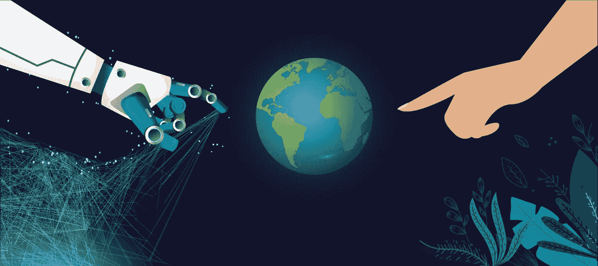
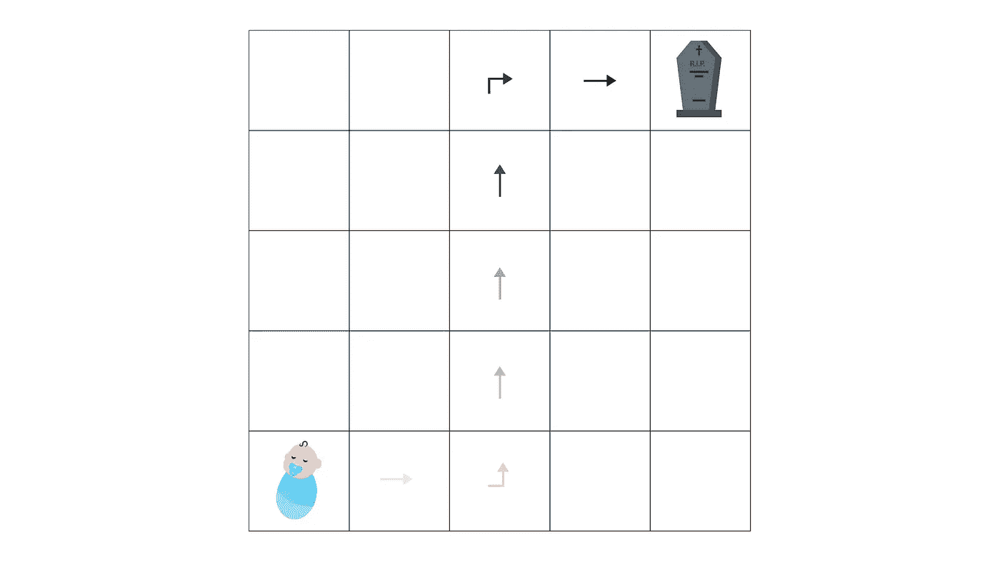
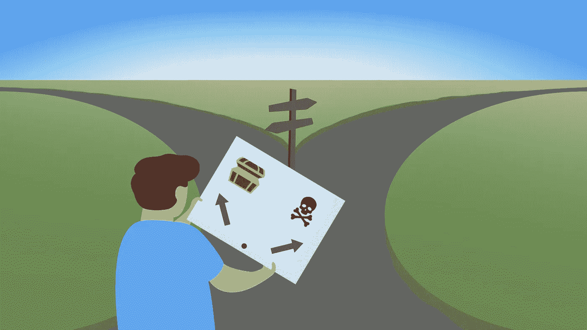
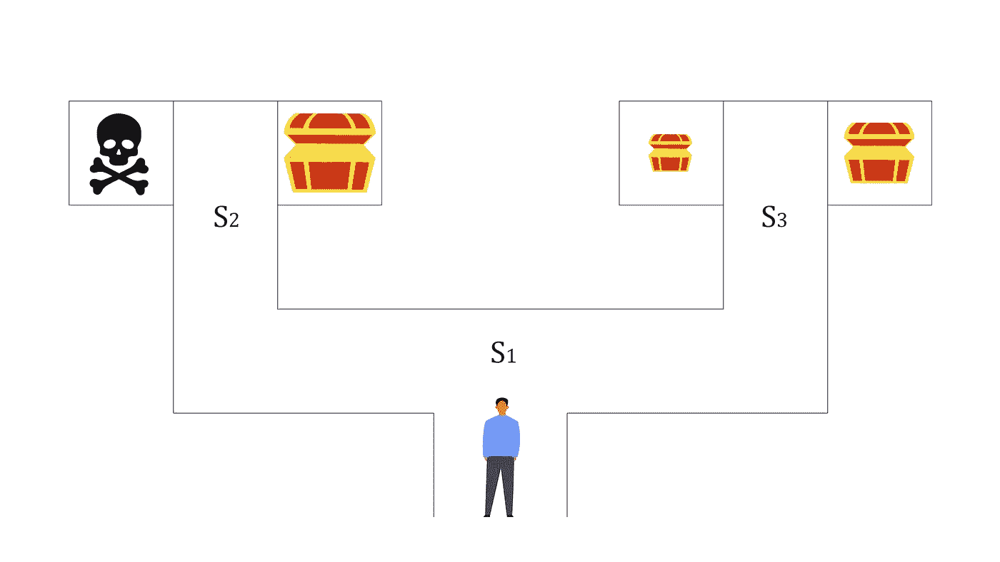
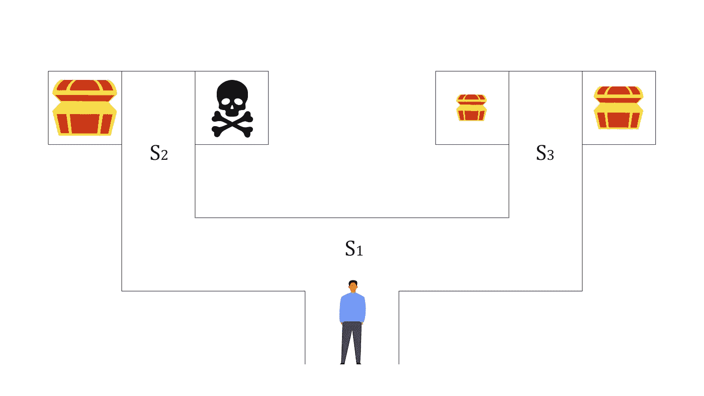

# 强化学习、大脑和心理学:延迟强化、认知地图和行为

> 原文：<https://towardsdatascience.com/reinforcement-learning-brain-and-psychology-part-3-delayed-reinforcement-cognitive-maps-and-7d304747e62c?source=collection_archive---------29----------------------->

## 强化学习、人工智能和人类

## 延迟强化是如何工作的，通过认知地图进行知识优化，以及为什么我们的行为会随着时间而改变。

在强化学习中，以及在一般的机器学习中，特别是深度学习中，通常很难甚至不可能解释为什么事情会以这种方式发生。这被称为**信用分配问题**，研究人员正在努力解决这个问题，他们试图为算法开发某种推理，但到目前为止还没有运气。但是我们，人类，更好吗？我们真的知道为什么我们会做出这样的决定，为什么我们会这样做吗？

让我们设法解决它。这是 RL 灵感来源系列的第三部分，让我们深入探讨一下。

# 延迟强化

> "拖延是不可避免的."——埃斯库罗斯。

*信用分配问题*在 RL 领域大放异彩。简而言之，在训练期间，一名*特工*多次问自己*“我到底做了什么才来到这里？”。实际上，这就是他学习的方式，他捕捉到了什么样的*行为*会导致最高的*奖励*。但是当有上百个*行为*而你最后只得到*奖励*时，如何理解哪些*行为*是好的？而当有几十万而没人给你*奖励*的时候，就像发生在我们身上一样，人呢？*

在强化学习中，有一种叫做**资格追踪**的技术，你可能已经猜到了，它是受动物研究的启发。

巴甫洛夫指出，刺激必须在神经系统中留下痕迹，资格痕迹很像我们大脑中的刺激痕迹。很难想出一个好的例子，但是让我们想象一下你的一生。关于你的童年，你能说些什么？年纪越大，记忆越淡，对吗？

为了描绘它，让我们想象你生活在̶ ̶F̶l̶a̶t̶l̶a̶n̶d̶ ̶网格区。对你来说，整个人生就是从左下角的细胞，你出生的地方，移动到右上角，你将要死去的地方。

你的整个人生轨迹

当你接近终点时，对你早期生活的记忆正在消退，但你至少还能回忆起一些事情。这是你独特的经历，这是我们知识的积累，只有最重要的部分，这就是为什么你是特别的，这就是*资格痕迹*是什么。

在生物层面上，在完成一个*动作*并收到一个*奖励*后，突触，即我们大脑中神经元之间的连接，具有那些随着时间流逝而衰减的临时刺激痕迹。因此，当强化被引入时，例如，在一次精彩的演讲后鼓掌，我们的大脑会对最近的*行为*给予更多的信任，因为对于你演讲的当前成功来说，你小时候穿什么 t 恤并不重要。

我们将在本系列的稍后部分探索神经科学，敬请关注。

但是它和延迟强化有什么关系呢？人们可以为了一份薪水工作几天，为了升职工作几年，但是我们的记忆会告诉我们为了达到这个目标我们做了什么。RL *代理*也是一样，*资格痕迹*是他的记忆，它们告诉他重复什么*动作*才能获得*奖励*。

处理*信用分配问题*的方法还有很多，但这个方法是最“人性化”的。如果你感兴趣，我强烈推荐你阅读关于 AlphaZero 的论文。它展示了计算机如何利用它们完美的记忆来解决信用分配问题。

# 认知地图

> “在磁盘世界里，地图制作从来就不是一门精确的艺术。人们倾向于以良好的意图开始，然后被喷出的鲸鱼、怪物、海浪和其他无聊的制图家具弄得晕头转向，以至于经常忘记把无聊的山脉和河流放进去。”—特里·普拉切特，电影

我们还没有谈到的是**无模型**和**基于模型的**算法。这一次不是关于机器学习模型之类的模型而是关于*环境* s 的模型，它们是*状态*之间的所有转换，所有*奖励*和*动作*导致那些*奖励*。这是非常重要的，你不应该被这些术语所迷惑。

有了*无模型*的，你的*代理*其实对他所处的*环境*一无所知。他在训练过程中通过试错(或者通过效果定律如果你看过我之前的文章)获得世界的所有动态。

另一方面，利用基于*模型的*算法，*智能体*从一开始就拥有关于世界的所有信息，或者他可以在与世界的交互过程中学习这些信息。所以他有一张*环境*的地图，明白我要去哪里吗？

向左走，你会变得富有，向右走，你会发现死亡

这种关于转场的知识和**认知图谱**非常相似，对于我们人类来说，是生活经验、教育等知识的积累。它们是在日常基础上下意识形成的，目的是减少记忆的使用，增强回忆和学习。但是，当然，你也可以利用思维导图、记忆宫殿等技术来有意应用它们。如果你对记忆术感兴趣的话，读一读吧。

心理学家爱德华·托尔曼在 20 世纪 40 年代对老鼠进行的实验表明，老鼠能够形成它们穿过的迷宫的潜在表征，这与 RL *特工非常相关。*利用*无模型*算法，一个*代理*以及一只老鼠，必须弄清楚*环境*的转变，或者用我们的新术语来说，创建一个*认知地图*。抓住世界上发生的事情有助于他表现得更好。

所以再一次，一个*环境*的模型是在那个*环境*里面的所有转换。过渡被优化并服务于特定的目标，很像*认知地图*。那些过渡可以由*代理*自己学习(*无模型*算法)或者交给他(*基于模型*算法)，他要么画地图，要么买地图。

# 行为

> "她通常给自己很好的建议，尽管她很少遵循。"—刘易斯·卡罗尔，《爱丽丝漫游奇境记》

*无模型*和*基于模型*的强化学习算法之间的区别对应于心理学家对**习惯性**和**目标导向**行为模式之间的区别。*习惯*是由适当的刺激触发的行为模式，然后或多或少地自动执行。根据心理学家如何使用这个短语，行为是有目的的，因为它是由对目标的价值以及行动和结果之间的关系的了解所控制的。

让我们看看例子。这里我们有一个迷宫赛跑者，他正试图逃离迷宫，同时也变得富有。

迷惑

*无模型*算法依赖于通过多次试验获得的经验。在几次尝试后，我们的跑步者利用他的额外生命猜出了迷宫，现在知道该做什么了。我们甚至可以说，他为这个迷宫学会了一种习惯。

正如我们现在所知，使用基于模型的算法，跑步者有一张迷宫地图。通过看着它，他计划他的行动去得到最大的宝藏，然后逃跑。这里我们要说的是，利用过渡的知识和应用逐步计划，跑步者的行为*目标直接*。

现在让我们稍微改变一下迷宫。我们会交换最大的宝藏和死亡屋的位置。

改变迷宫

如果跑步者正在应用*无模型*算法，他会死，因为他是在不同的*环境*中训练的，并且在某种程度上过度适应了它。为了解决这个变化了的迷宫，他需要再花一些时间通过试错来学习，探索这个勇敢的新世界。

但是基于*模型的*算法却不是这样。跑步者将会得到一张改变后的迷宫地图，并很容易找到宝藏。那就是*习惯性*和*目标导向的*行为与*无模型*和*基于模型的*算法之间的关系。
然而，形象地说，我们人类并没有一个离散的世界地图，所以我们应用我们的认知地图(对周围发生的事情的理解)来规划和行动，但这并不重要，因为我们只直接针对目标*行事*。

克里斯托弗·亚当斯(Christopher Adams)在 1982 年对老鼠进行的实验表明，将老鼠放在一个有杠杆的房间里，当按下杠杆时，会释放少量食物，可以过度训练，并学会按杠杆的习惯。

将大鼠分成两组，一组训练 100 次迭代，另一组训练 500 次迭代。在第二阶段，两组人每次得到食物时，都会被注射引起恶心的毒药，因为早期的实验表明，这应该会降低他们按下操纵杆的兴趣。

未过度训练的老鼠确实开始显示出杠杆按压率的下降，这意味着它们的行为目标是直接的。相比之下，过度训练的老鼠几乎没有效果，事实上，它使它们更有活力。就好像他们忘记了食物是善意的，而现在却要求得到它。

这就是这两种行为的联系。过了一会儿，有目标的行为变成了习惯性的行为。这让我想起了我们生活中类似的时刻，当我们开始认为事情是理所当然的:金钱，健康，食物，甚至我们爱的人。

# 结论

我们是地球上最聪明的生物，然而我们却无法评估自己的大部分行为。我们给别人建议和教训，却不知道自己该做什么。我们说我们专注于我们的目标，惩罚坏习惯的代理人，然而我们每天都在做蠢事。然而，我们在有史以来最复杂的环境中工作，而电脑只能玩游戏。怎么会？

*联系我上* [*推特*](https://twitter.com/poddiachyi) *，* [*领英*](https://www.linkedin.com/in/poddiachyi/) *，* [*脸书*](https://www.facebook.com/poddiachyi) *并关注*[*GitHub*](https://github.com/Poddiachyi)*！*