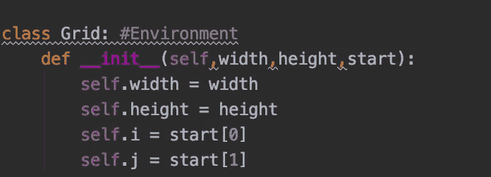
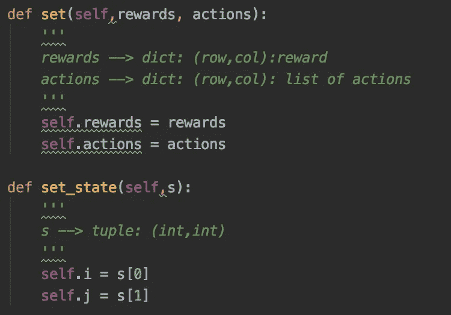
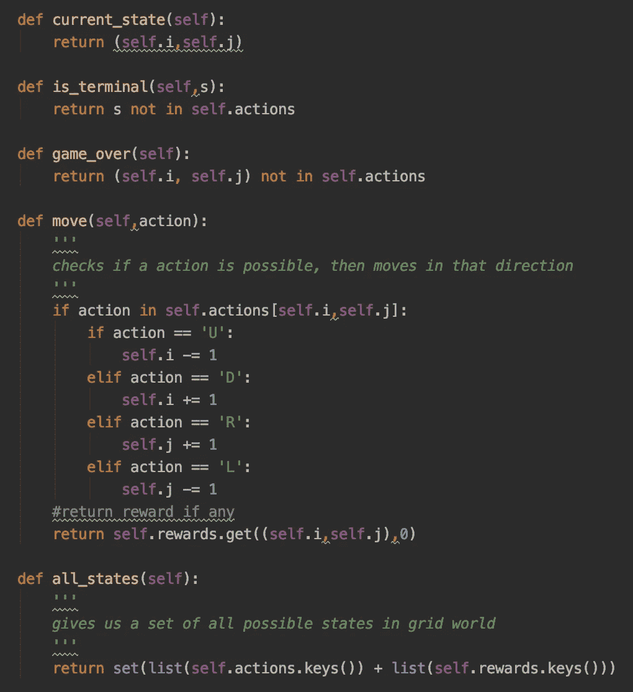
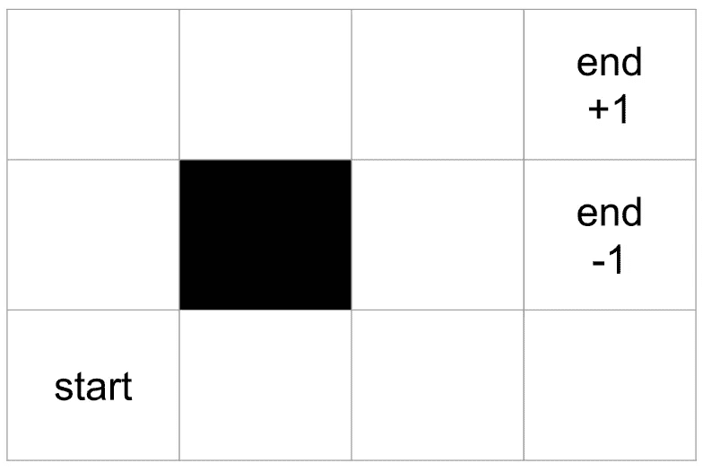
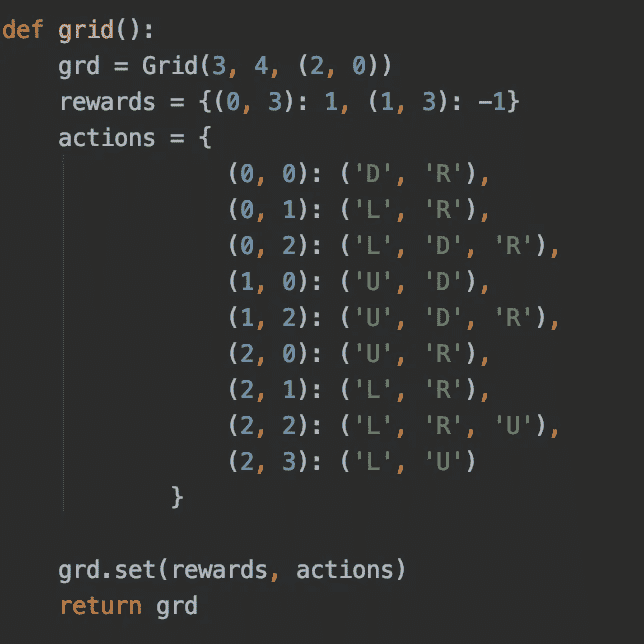
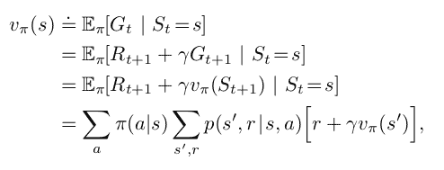
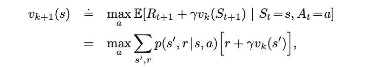
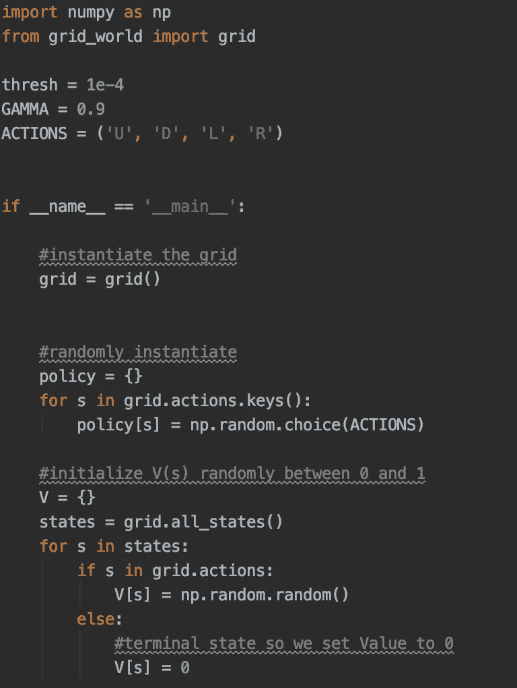
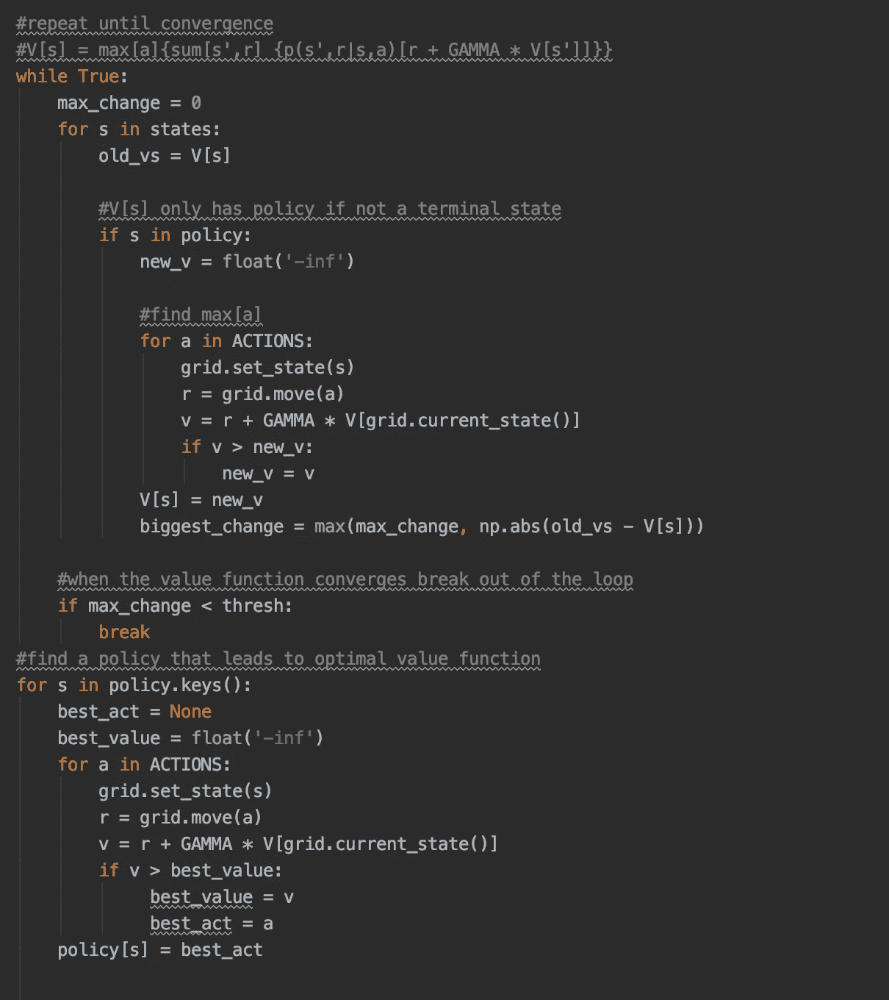

# 强化学习:动态编程

> 原文：<https://towardsdatascience.com/reinforcement-learning-dynamic-programming-2b89da6ea1b?source=collection_archive---------14----------------------->

## 利用动态规划在网格世界中寻找最优策略

在之前的两篇文章中，我分解了大多数人在钻研强化学习时遇到的第一件事:[多武装土匪问题](https://medium.com/@jmtennenbaum/starting-with-reinforcement-learning-the-multi-armed-bandit-problem-f124076775a4)和[马尔可夫决策过程](https://medium.com/@jmtennenbaum/markov-decision-processes-and-grid-world-45dee8d85fdb)。大多数游戏都满足马尔可夫决策过程的要求，特别是我们将要使用的游戏叫做网格世界。对于那些不熟悉的人来说，环境是一个二维网格，每个瓦片/节点要么有一个值(通常为 0，但有些变化有负值)，一个死空间，或者一个结束游戏的奖励(称为终端状态)。代理能够向任何方向移动，它的目标是最大化它的报酬。我们用来估算这些回报的算法叫做动态规划。

在我们深入研究算法如何工作之前，我们首先需要构建我们的游戏(这是我的 [Github](https://github.com/jmt0221/reinforcement_learning) 的链接，里面有我构建的所有其他算法)。要做到这一点，我们只需要 Python。我们可以使用一个类结构来创建网格世界，所以我们要做的第一件事就是建立我们需要的属性。要将一个变量实例化为网格类，我们需要给它传递三个参数，高度和重量都是控制网格大小的整数；start 是一个包含 2 个整数的元组，用于控制代理的起始位置。

从这里开始，我们需要建立一些方法，允许我们为网格设置/更新奖励、动作和状态，这样我们就可以在游戏开始和中间都使用这些值。在这之后我们只需要五个方法，我们的类就完成了。我们使用三个来简单地返回信息，例如:当前状态、状态是否结束以及游戏是否结束。在这之后，剩下的就是给我们的代理移动的能力，并在我们的游戏中创建一组所有可能的状态。

下面是我的网格布局。右角有两个终端瓷砖，中间有一个死角。您可以做的一些事情来个性化您的网格是改变大小，网格布局，或添加一个非终端的所有国家的负奖励，以激励代理人移动最少的步骤。你不应该让惩罚变得那么大，但是你可以用它来观察代理如何改变它的行为。

来源:[走向数据科学](/reinforcement-learning-implement-grid-world-from-scratch-c5963765ebff)

最后，我们创建了一个最终的函数网格，我们将在以后学习动态编程时导入它。这个函数简单地创建了我们的网格类对象，然后建立了哪些位置有奖励，以及如果我们不使用策略，而只是出于探索目的随机移动，可能会采取什么行动。

# 贝尔曼方程

正如我在之前关于[马尔可夫决策过程](https://medium.com/@jmtennenbaum/markov-decision-processes-and-grid-world-45dee8d85fdb)的博客中所说，为了估计每个状态和行动的回报，我们需要求解贝尔曼方程。

来源:*萨顿和巴尔托*

我们可以将上面的等式分成三部分:

*   第一个片段π(a|s)，实际上并不指任何值，而是指一个策略。策略仅仅是在状态下执行动作的概率，我们的目标是调整策略以最大化代理的回报。
*   P(s '，r|s，a)是指在给定当前状态和动作的情况下，以特定状态-奖励对结束的概率。例如，网格世界有一个变种叫做风网格世界，每次你做一个动作，有 50%的概率你会采取另一个随机动作。这在现实世界中的一个应用是在信息不完全的游戏中，我们并不总是在我们想要或期望的地方结束。
*   最后一部分[r + GAMMA * Vπ(s')]是当前奖励和给定策略π的未来状态 s '的指数衰减奖励的组合。

由于这是一个依赖于未来值的递归方程，我们需要使用动态规划来收敛到值函数的解。我们面临的另一个问题是优化我们的政策。如果 Vπ2 >Vπ1，一个策略比另一个策略“更好”,我们的最优策略标记为π*。

# 动态规划

动态编程实际上由两种不同的实现方式组成:

*   策略迭代
*   价值迭代

我将简要介绍策略迭代，然后展示如何在代码中实现值迭代。策略迭代由一个内部和外部循环组成，但在此之前，第一步是随机初始化策略，并将每个状态的值函数设置为 0。然后，我们执行被称为迭代策略评估的内部循环，在该循环中，我们遍历并迭代地更新价值函数，直到变化低于某个阈值，然后我们可以中断并继续前进。一旦发生这种情况，我们进入外部循环，在这里我们遍历每个状态，看看更新政策是否会增加我们的奖励。如果我们的策略改变，我们回到迭代策略评估，并重复这个过程，直到我们不再改变策略。

值迭代是策略迭代的替代技术，它运行起来更简单、更快，因为它只需要一个循环，而不是两个。此外，在策略迭代的前半部分，我们必须等待策略评估收敛，但在现实中，我们不需要等待这种情况发生，我们可以在策略评估步骤完成之前估计价值函数。值迭代将策略评估和迭代合并到一个步骤中，在所有可能的操作中取最大值，策略迭代使用 argmax。

资料来源:萨顿和巴尔托

# 代码中的值迭代

对于值迭代，我们只需要 Python、我们之前的 Grid-World 文件和 Numpy。在下面的代码中，我们的游戏是确定性的，所以我们不用担心 P(s '，r|s，a)。我们首先需要设置一个打破循环的阈值，一个惩罚未来奖励的折扣因子 Gamma，以及一个我们可以采取的所有可能行动的元组。

接下来，我们进入要运行的主代码块，开始创建网格世界对象。然后为策略随机选择动作，并为所有可能的状态初始化 0 到 1 之间的值函数。唯一的例外是始终没有策略且值为 0 的终端状态。

重复下一个代码块，直到我们的值函数收敛。

如您所见，我们浏览了所有我们有政策的州，并为最大化奖励的行动设定了价值。与策略迭代一样，我们重复这一过程，直到值函数收敛，但是，没有我们必须满足的第二个循环，所以我们可以直接进入优化我们的策略。我们只需遍历所有状态，并将策略设置为使价值函数最大化的动作。

# 后续步骤

虽然动态编程比暴力要有效得多，但它仍然需要一个完整的环境模型才能使用。在现实世界的场景中，甚至在更复杂的游戏中，这并不总是能实现的。在这之后，我将转向一种被称为蒙特卡罗的无模型方法，看看它如何采用不同的方法来解决网格世界，以及代理如何更接近于真正“玩”游戏。

## 引用作品:

[https://www . udemy . com/course/artificial-intelligence-reinforcement-learning-in-python/](https://www.udemy.com/course/artificial-intelligence-reinforcement-learning-in-python/)