# 可视化解释强化学习(第 3 部分):无模型解决方案，循序渐进

> 原文：<https://towardsdatascience.com/reinforcement-learning-explained-visually-part-3-model-free-solutions-step-by-step-c4bbb2b72dcf?source=collection_archive---------1----------------------->

## 直观强化学习系列

## 用简单的英语为*基于价值和基于政策的解决方案*所使用的技术提供可视化指南。

照片由[艾丹·豪](https://unsplash.com/@aidanhowe?utm_source=medium&utm_medium=referral)在 [Unsplash](https://unsplash.com?utm_source=medium&utm_medium=referral) 上拍摄

这是我关于强化学习(RL)系列的第三篇文章。现在我们已经了解了什么是 RL 问题，以及可用的解决方案的类型，我们现在将了解所有解决方案使用的核心技术。使用迭代算法作为框架来逐步改进预测，我们将理解基于价值和基于策略的解决方案之间的基本相似性和差异。

这里是对本系列之前和之后文章的一个快速总结。我的目标是不仅要理解事物是如何工作的，还要理解它为什么会这样工作。

1.  [基本概念和术语介绍](/reinforcement-learning-made-simple-part-1-intro-to-basic-concepts-and-terminology-1d2a87aa060) *(什么是 RL 问题，以及如何使用马尔可夫决策过程的技术和概念(如回报、价值和政策)将 RL 问题解决框架应用于该问题)*
2.  [解决方案方法](/reinforcement-learning-made-simple-part-2-solution-approaches-7e37cbf2334e) *(热门 RL 解决方案概述，并根据这些解决方案之间的关系进行分类。贝尔曼方程的重要提示，它是所有 RL 算法的基础。)*
3.  **无模型算法 *—本文*** *(基于价值和基于政策的解决方案的异同使用迭代算法来逐步提高预测。剥削、探索和贪婪的政策。)*
4.  [Q-Learning](/reinforcement-learning-explained-visually-part-4-q-learning-step-by-step-b65efb731d3e) 发展直觉，了解为什么这个算法会收敛到最优值。)
5.  [深度 Q 网络](/reinforcement-learning-explained-visually-part-5-deep-q-networks-step-by-step-5a5317197f4b) *(我们的第一个深度学习算法。一步一步地演示它是如何工作的，以及为什么做出那些架构选择。)*
6.  [策略梯度](/reinforcement-learning-explained-visually-part-6-policy-gradients-step-by-step-f9f448e73754) *(我们第一个基于策略的深度学习算法。)*
7.  演员评论家*(复杂的深度学习算法，结合了深度 Q 网络和政策梯度的最佳效果。)*
8.  惊喜话题😄*(敬请期待！)*

# 无模型算法可以是基于策略或基于值的

## 使用值函数来比较两个策略

正如我们在[第一篇](/reinforcement-learning-made-simple-part-1-intro-to-basic-concepts-and-terminology-1d2a87aa060)文章中所讨论的，每个策略都有两个相应的价值函数，即状态价值(或 V 值)和状态动作价值(或 Q 值)，我们可以使用一个策略的价值函数来比较两个策略。如果政策 Y 的价值函数比政策 X 的高，那么政策 Y 就比政策 X 好。

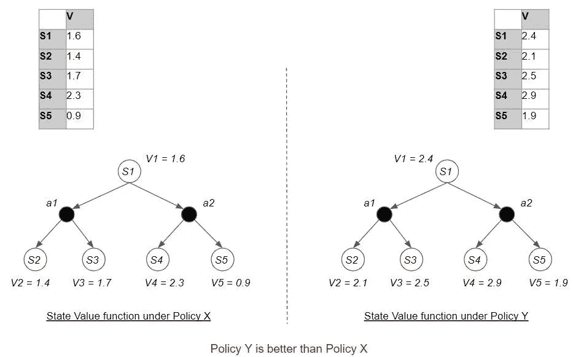

通过比较策略各自的价值函数来比较策略(图片由作者提供)

## 最优策略

我们还讨论过，如果我们不断寻找越来越好的政策，我们最终将能够找到比所有其他政策都更好的“最佳”政策。这是最佳策略。

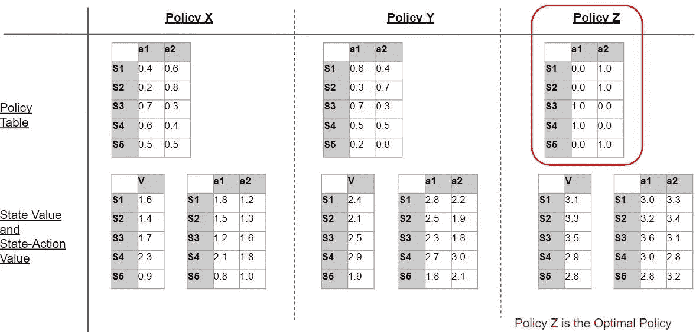

最优策略优于所有其他策略(图片由作者提供)

## 最佳政策与最佳价值密切相关

最优策略有两个相应的价值函数。根据定义，这些价值函数优于所有其他价值函数。因此这些价值函数也是最优的。最佳状态值和最佳状态-动作值。

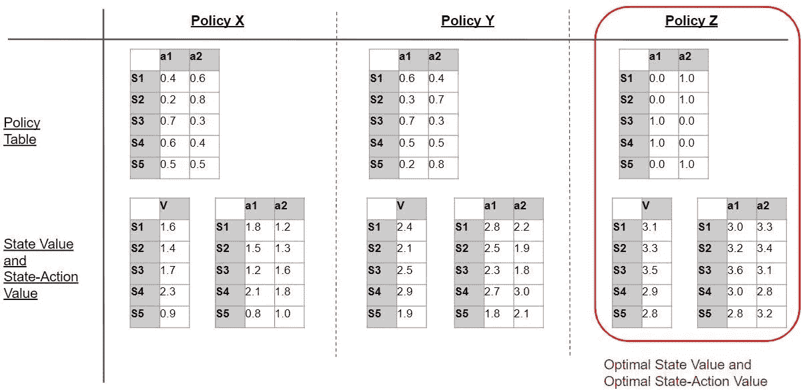

对应于最优策略的价值函数是最优价值函数。(图片由作者提供)

这就告诉我们，找到一个最优的政策就相当于找到了最优的国家-行动值，反之亦然。通过找到一个，我们也得到了另一个，如下所示。

## 基于策略与基于值的算法

因此，无模型算法可以直接或间接地找到最优策略。它们是:

*   基于状态-动作值(间接)。为了简单起见，我们将这些简单地称为“基于价值的”
*   基于策略(直接)

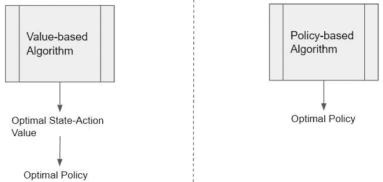

无模型解决方案直接或间接找到最优策略(图片由作者提供)

基于值的算法找到最佳状态-动作值。然后可以从中得出最优策略。基于策略的算法不需要最优值，直接找到最优策略。

## 从最佳状态-动作值导出最佳策略

一旦基于值的算法找到了最优的状态-动作值，它如何从中找到最优的策略呢？

一旦我们找到了最优的状态-动作值，我们就可以通过挑选具有最高状态-动作值的动作来容易地获得最优策略。

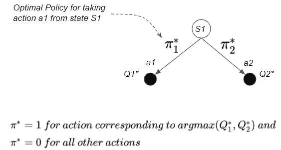

我们可以从最优状态-行为值中获得最优策略(图片由作者提供)

考虑上面的例子。如果 Q1* > Q2*，那么最优策略将选择 S1 的行动 a1。

因此，π1* = 1，π2* = 0

## 这给了我们一个确定性的最优策略

一般来说，最优策略是确定性的，因为它总是选择最佳行动。

然而，如果两个 Q 值之间存在联系，那么最优策略可能是随机的。在这种情况下，最优策略以相等的概率选择两个相应动作中的任何一个。这通常是代理与对手进行博弈的问题。随机最优策略是必要的，因为确定性策略会导致代理人采取其对手可以轻易击败的可预测的行动。

## 基于状态值的预测问题算法

除了上面提到的用于解决控制问题的基于状态-动作值的算法之外，我们还有用于预测问题的基于状态-值的算法。换句话说:

*   预测算法是基于状态值的
*   控制算法要么基于状态-动作值，要么基于策略

# 无模型算法类别

## 查找表与函数

较简单的算法将策略或值实现为查找表，而更高级的算法使用函数逼近器(如神经网络)来实现策略或值函数。

因此，我们可以将无模型算法分为以下几类:

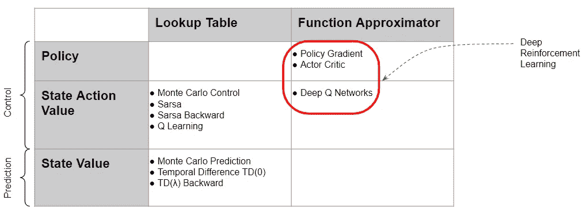

(图片由作者提供)

# 无模型算法使用迭代解决方案

RL 问题不能用代数方法解决。我们需要使用迭代算法。

有几种这样的基于值和基于策略的算法。当我开始深入研究这些算法的细节时，一开始我觉得很困惑。然而，过了一段时间，我开始意识到所有这些算法都可以归结为它们都采用的一些基本原则。

因此，相反，如果我们专注于学习这些原则是什么，那么理解这些算法如何相互关联以及它们的相似之处和不同之处将变得非常容易。

然后，当我们在后面的文章中深入每个算法的细节时，您将能够很快地看到这些共同的原则是如何被应用的，而不会迷失方向。

在一个高层次上，所有算法，包括基于值和基于策略的算法，都有四个基本操作要执行。他们从对想要寻找的数量的任意估计开始，然后通过从环境中获取数据来逐步改进这些估计。

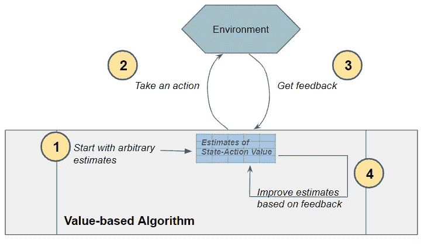

基于值算法(以及基于策略的算法)执行这四个基本操作。(图片由作者提供)

让我们来看看这四种操作中的每一种，并比较基于价值和基于策略的方法。

# 1.初始化评估

第一步是初始化我们的估计。基于值的算法使用估计的最佳状态-动作值表，而基于策略的算法使用估计的最佳策略表，该表具有每个状态中每个动作的概率。

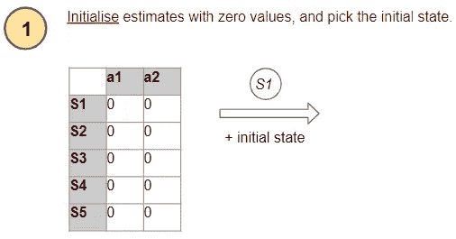

(图片由作者提供)

开始时，因为它不知道什么是正确的值，所以它简单地将所有值初始化为零。

# 2.采取行动

接下来，代理需要从当前状态中选择一个要执行的操作。

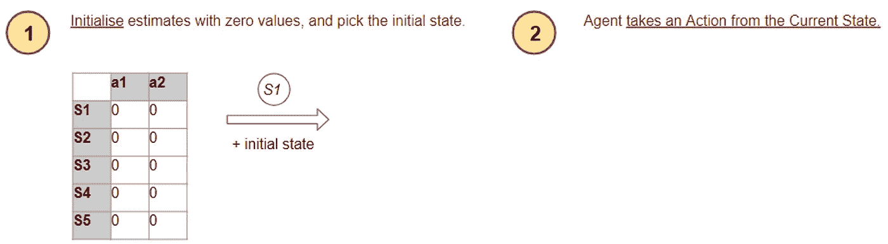

(图片由作者提供)

代理希望确保充分尝试所有可用路径，以便发现最佳路径，并且不会错过最佳选项。它是怎么做到的？

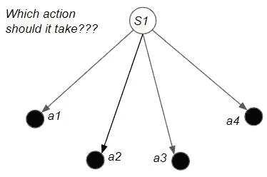

(图片由作者提供)

为了解决这个问题，我们需要理解探索和开发的概念。

## 探索与开发

**探索** —当我们刚开始学习时，我们不知道哪些行为是“好”的，哪些是“坏”的。因此，我们经历了一个发现的过程，在这个过程中，我们随机尝试不同的行动，并观察回报。

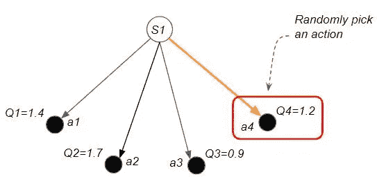

探索:通过随机选择一个动作来发现新的路径(图片由作者提供)

**开发** —另一方面，当模型被完全训练时，我们已经探索了所有可能的行动，因此我们可以选择将产生最大回报的最佳行动

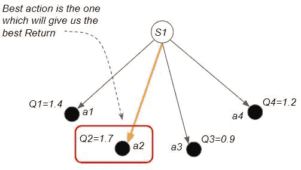

剥削:选择最佳行动以获得最大回报(图片由作者提供)

代理需要在探索和开发之间找到正确的平衡。基于策略的代理和基于价值的代理使用不同的方法来实现这一点。

## 基于策略使用自己的估计来选择操作

基于策略的代理的策略表已经有了对最佳策略的持续估计，它告诉您在任何给定状态下可以采取的所有操作的期望概率。所以它只是根据估计的最优策略的概率来选择行动。行动的概率越高，就越有可能被选中。

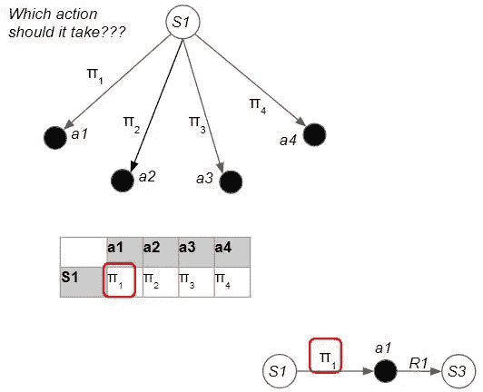

基于政策的方法来选择最佳行动(图片由作者提供)

## 基于价值使用ε-贪婪策略来选择动作

基于价值的代理采用一种称为ε-贪婪的动态策略。它使用一个探索率ε，随着训练的进行而调整，以确保在训练的早期阶段进行更多的探索，并在后期阶段转向更多的开发。

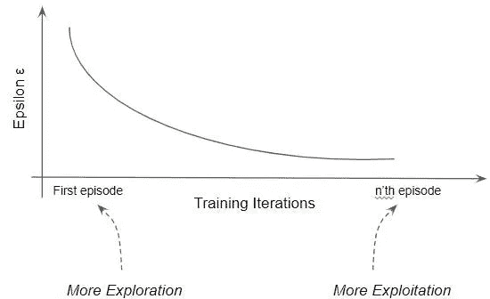

基于价值的方法使用ε贪婪策略(图片由作者提供)

我们最初将ε设为 1。然后，在每集的开始，我们以一定的速率衰减ε。

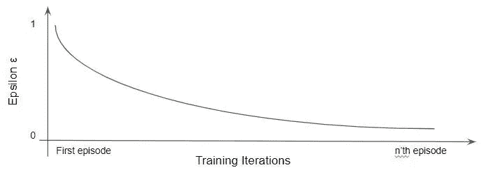

(图片由作者提供)

现在，每当它在每个状态中选择一个动作时，它选择一个随机动作(即探索)与概率ε。由于ε在早期较高，代理人更有可能探索。

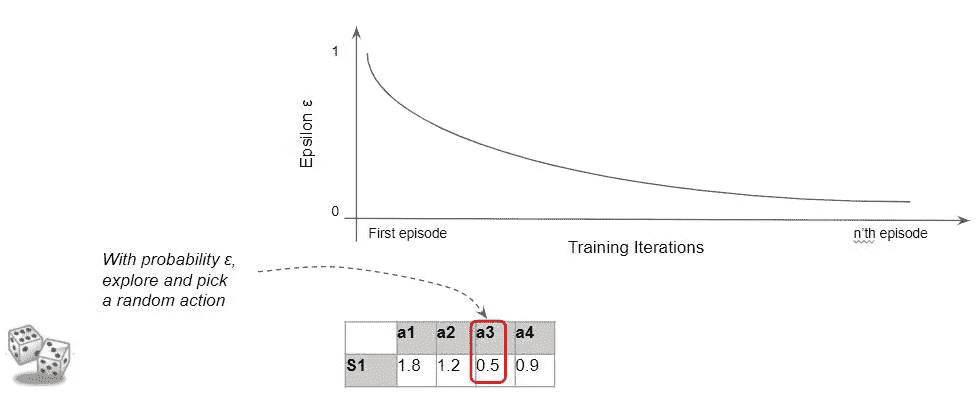

(图片由作者提供)

同样，以概率‘1—ε’，它选择最佳行动(即 exploit)。随着ε下降，探索的可能性变小，代理人变得“贪婪”,越来越多地利用环境。

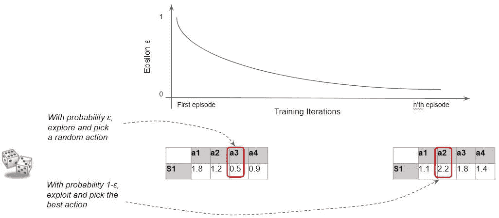

(图片由作者提供)

# 3.从环境中获得反馈

代理采取它所选择的动作，并从环境中获得反馈。

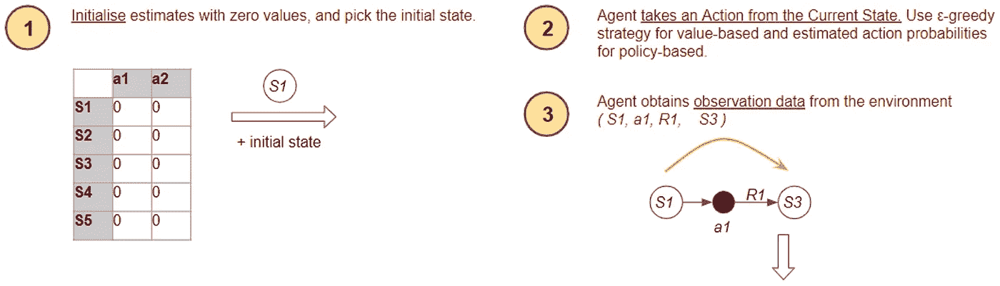

(图片由作者提供)

代理以奖励的形式接收来自环境的反馈。

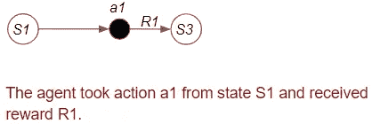

(图片由作者提供)

# 4.改进估计

代理如何使用奖励来更新它的估计，使它们变得更准确？

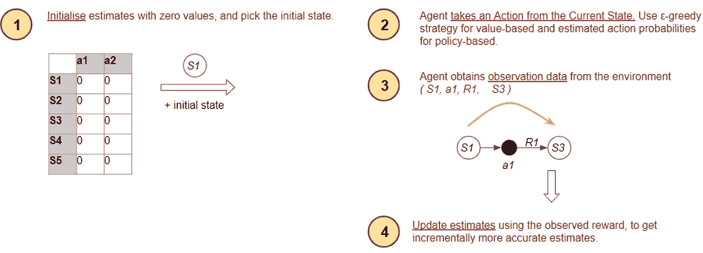

(图片由作者提供)

基于策略的代理使用该反馈来改进基于该回报的估计最优策略。基于价值的代理使用该反馈来改进基于该回报的估计最优值。这样，下次他们必须决定从该状态采取何种行动时，该决定将基于更准确的估计。

## 基于策略更新动作的概率

代理说,“如果我得到了积极的奖励，那么我将更新我的策略表，以增加我刚才采取行动的概率。”。这样，下次我就更有可能采取行动

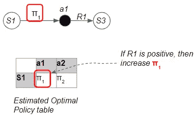

(图片由作者提供)

## 基于值根据贝尔曼方程更新其值

一位基于价值的经纪人说，我之前的估计告诉我，这次行动会带来这么大的价值。基于我刚刚得到的奖励，贝尔曼方程告诉我，我的价值应该更高(或更低)。我将更新我的价值表以缩小差距。

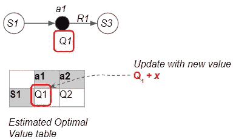

(图片由作者提供)

我们将更深入地探讨基于价值的代理如何使用贝尔曼方程来改进它的估计。我们在第二篇文章中深入讨论了贝尔曼方程，所以最好回去复习一下。

该等式描述了计算 Q 值的递归关系。由此得出的第一个重要见解是，如果我们知道下一个状态-行动对的 Q 值，那么我们就可以利用它，而不必遍历除此之外的整个事件。

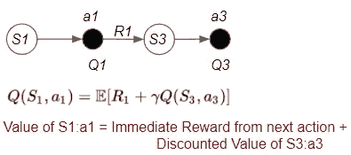

(图片由作者提供)

第二个重要的观点是，贝尔曼方程认为有两种方法可以计算状态-动作值:

1.  一种方式是来自当前状态的状态-动作值
2.  另一种方式是采取一个步骤的直接回报加上下一个状态的状态行动值

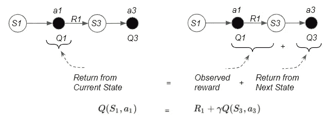

(图片由作者提供)

这告诉我们，我们可以通过两种不同的方式获得状态值。如果这些都是非常精确的值，这两个量就会完全相等。

但是，由于算法使用的是估计值，我们可以通过比较这两个量来检查我们的估计是否正确。

如果它们不相等,“差异”告诉我们估计中的“误差”量。

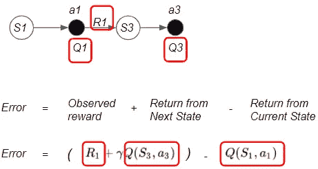

(图片由作者提供)

第一项包含一个实际奖励加上一个估计，而第二项只是一个估计。

该算法以减少误差的方式递增地更新其 Q 值估计。

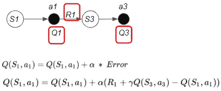

(图片由作者提供)

# 把所有的放在一起

代理现在已经改进了估计。这就完成了四个操作的流程。该算法继续执行该流程，直到剧集结束。然后，它重新开始一个新的插曲，并重复。

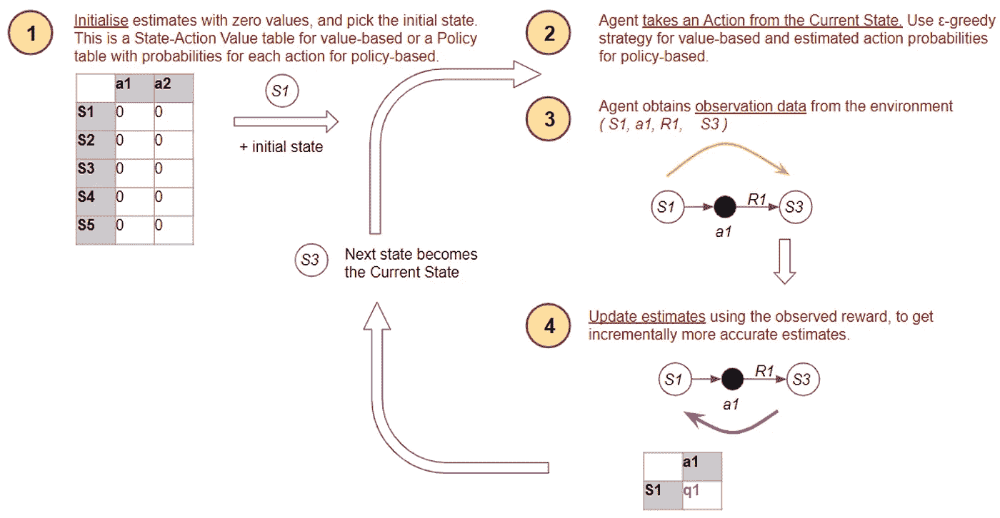

(图片由作者提供)

# 改进估算的不同方法

该算法的核心是如何改进它的估计。不同的算法使用的技术略有不同。这些变化主要与三个因素有关:

*   **频率** —更新前前进的步数。
*   **深度** —传播更新的后退步数。
*   **用于计算更新估算值的公式**。

让我们简要回顾一下这些因素，了解一下这些变化是什么。

## 频率

在更新我们的估计之前，代理可以采取的前进步骤数有三个选项:

*   最简单的想法是，它采取一个行动，观察奖励，保存它们，然后采取另一个行动，观察这些奖励，保存它们，并一直这样做，直到这一集结束。最后，在这一集的结尾，算法会获取所有这些奖励，并使用它们来更新我们的估计。
*   一步**——或者，我们可以只走一步，观察那些奖励，然后马上更新，而不是一直等到这一集结束。**
*   ****N 步** —以上两个选项是谱的两端。在这之间，我们可以在 N 步之后进行更新。**

**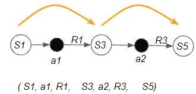**

**(图片由作者提供)**

**在一般情况下，代理采取一些前进的步骤。这可能是一步，N 步，或者直到这集结束。**

## **深度**

**在采取了一些前进的步骤之后，下一个问题是该算法应该在多远之前传播它的更新估计？同样，有三种选择:**

*   ****插曲** —如果代理向前迈出一步，直到插曲结束，算法可以更新它在此过程中采取的每个状态-动作对的估计。**
*   ****一步** —或者，它可以只更新当前状态-动作对的估计。**
*   ****N 步** —以上两个选项是谱的两端。在这之间，我们可以一路更新 N 步**

**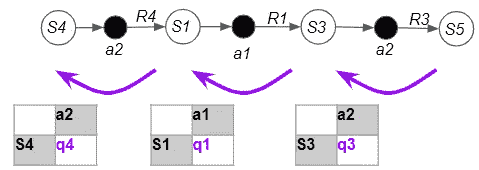**

**(图片由作者提供)**

**在采取一些向前的步骤之后，算法更新它所采取的状态和动作的估计。这可以是当前状态-动作对的单个步骤，N 个步骤，或者直到情节开始。**

## **更新公式**

**用于更新估计值的公式有许多变化，例如:**

*   **基于值的更新使用某种形式的贝尔曼方程来用“误差”值更新 Q 值。例如，这个公式用一个称为 TD 误差的误差值来递增地更新 Q 值估计。**

**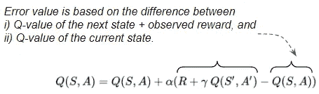**

**(图片由作者提供)**

*   **基于策略的更新增加或减少了代理采取行动的可能性，这取决于我们是否收到了好的奖励。**

# **无模型算法之间的关系**

**如果你研究不同的算法，每个算法看起来都非常不同。然而，正如我们刚刚看到的，它们都遵循一些相似的模式。**

**在本系列中，我们不会深入研究每一种算法，而是将重点放在深度强化学习中常用的几种算法上。**

**然而，为了完整起见，我整理了一个表格，总结了这些算法之间的关系。当我学习的时候，它帮助我把事情看得更清楚了。所以我希望它对你也有帮助。**

**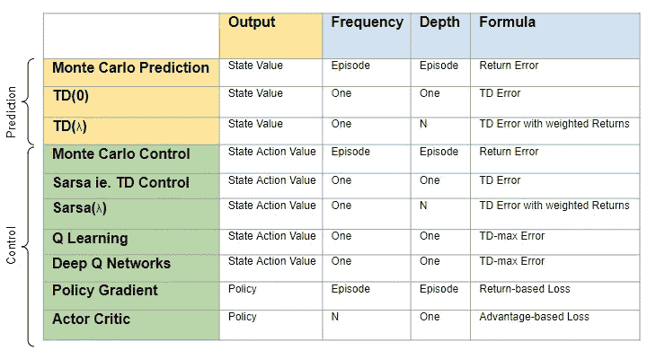**

**(图片由作者提供)**

# **结论**

**在本文中，我们对 RL 问题的解决方案进行了概述，并探讨了一些流行算法使用的常见主题和技术。我们主要关注用于解决大多数现实问题的无模型控制算法。**

**我们现在准备深入研究基于神经网络的深度学习算法的细节。它们是最令人感兴趣的，因为在过去几年中，它们在解决复杂和以前难以解决的问题方面取得了巨大进展。**

**我们将在接下来的几篇文章中选择一种算法，从 Q 学习开始，Q 学习是深度学习算法的基础。**

**最后，如果你喜欢这篇文章，你可能也会喜欢我关于变形金刚和音频深度学习的其他系列。**

** [## 直观解释的变压器(第 1 部分):功能概述

### NLP 变形金刚的简明指南，以及为什么它们比 rnn 更好，用简单的英语。注意力如何帮助…

towardsdatascience.com](/transformers-explained-visually-part-1-overview-of-functionality-95a6dd460452)  [## 音频深度学习变得简单(第一部分):最新技术

### 颠覆性深度学习音频应用和架构世界的温和指南。以及为什么我们都需要…

towardsdatascience.com](/audio-deep-learning-made-simple-part-1-state-of-the-art-techniques-da1d3dff2504) 

让我们继续学习吧！**