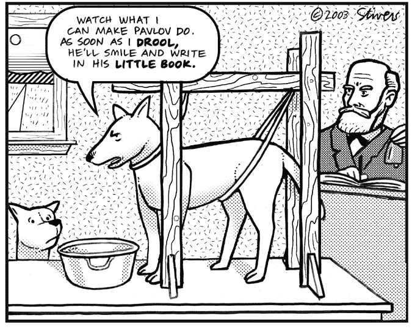
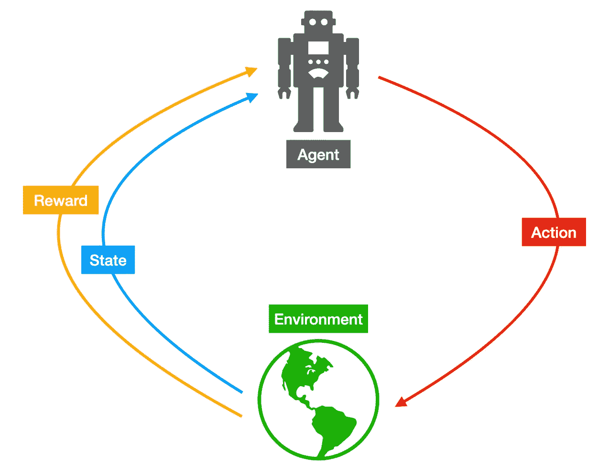
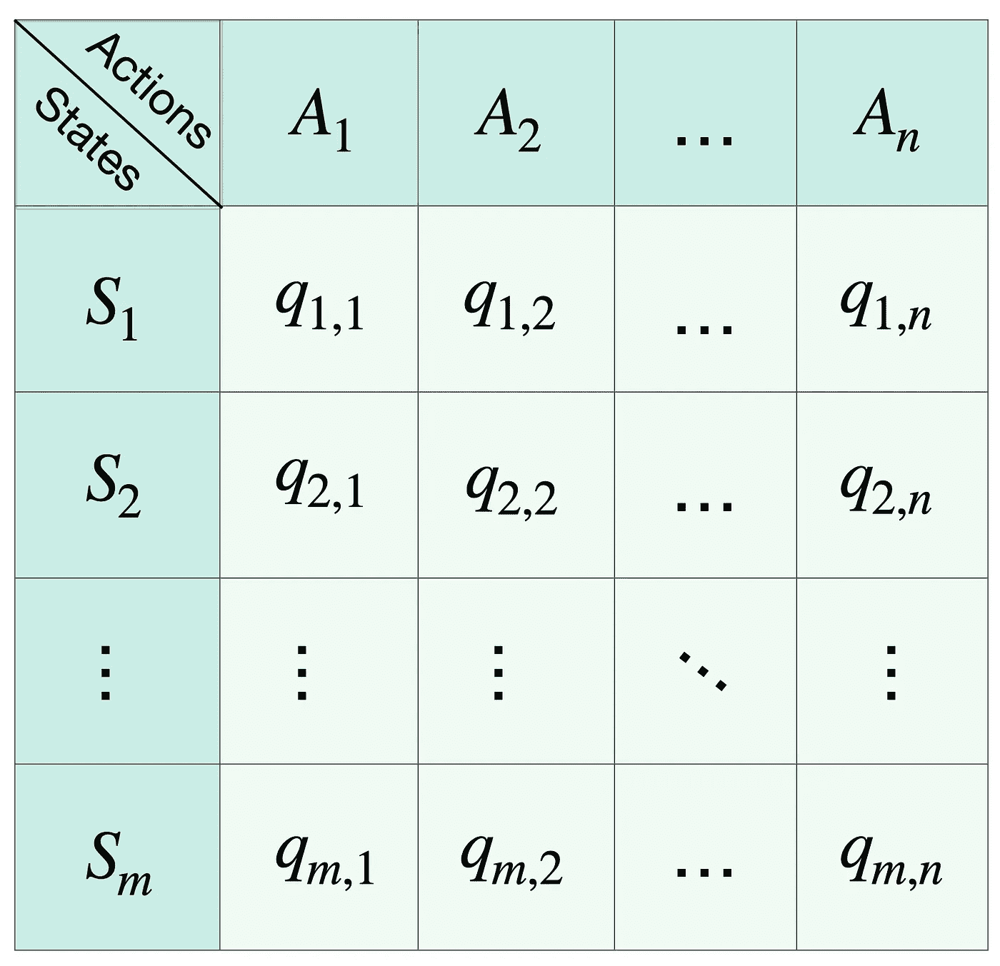

# 每个人的强化学习

> 原文：<https://towardsdatascience.com/reinforcement-learning-for-everyone-9c1163f61440?source=collection_archive---------36----------------------->

## RL 已经在 AI 社区流行起来，但是大多数人还不知道它是关于什么的。来读吧，不管你是什么背景！

如果你在技术领域工作，尤其是在人工智能/机器学习领域，你可能已经习惯了人们不理解你的工作。这就是我的生活，我不得不说我为此感到有点自豪:因为这意味着我学到了许多大多数人不知道的东西，而且我对这个话题足够深入，能够理解对大多数人来说非常复杂的事情。然而，每当你想与你关心的人分享一项成就时，这也有点令人沮丧，因为他们无法理解所有这些模糊之处。

这就是我决定写这篇文章的原因，希望我能把我的观点传达给任何对 ML 特别是强化学习感兴趣的人，不管你的背景如何。

不，机器学习无法像电影中那样建造终结者——然而[图片来自 [PublicDomainPictures](https://www.publicdomainpictures.net/en/view-image.php?image=107453&picture=terminator) 。]

# 巴甫洛夫条件反射

尽管当你想到人工智能时，你会想到未来，但我们的故事始于 100 多年前，19 世纪 90 年代，在伊凡·巴甫洛夫的实验室里。他在研究狗的唾液分泌，为此，他测量了狗看到食物时唾液分泌的多少，在吃食物之前是 T4。他已经对这些实验感到兴奋，但他意识到一些意想不到的事情:狗甚至会在看到任何食物之前*分泌唾液。当他们注意到巴甫洛夫的助手向他们走来时，他们会开始垂涎三尺。注意到这一点后，他测试了如果在喂狗之前，他会按铃会发生什么(或者实际上是根据[维基百科](https://en.wikipedia.org/wiki/Classical_conditioning)的节拍器)，你可能猜到了:它们也开始垂涎三尺，**因为它们已经知道铃响后，食物就会来了**。这种铃声被称为条件刺激，因为狗不会因为铃声响而流口水，而是因为它知道食物会跟着铃声走。*

最终，巴甫洛夫也受到了狗的影响。]

# 不错！但是我来这里是为了学习…

事实证明，RL 是基于心理学的基本原理。在 RL 中，一个智能体基于一个被称为奖励的“条件刺激”来学习如何行为。RL 的设置如下:

RL 的框架及其元素【自制。]

我们有一个**代理**，它位于一个**环境**中并与之交互，在这个环境中，它可以执行**动作**，同时观察环境的**状态**并接收对其动作的**奖励**。此外，我们在离散时间中解决我们的问题，所以我们的时间线是由**步骤**构成的；在每一步中，代理观察环境的状态，对环境执行改变环境状态的动作，并接收对其动作的奖励。

为了使它更简单，让我们考虑一个例子:我们的代理将是一个机器人，我们希望它学会走路，直到一个目标区域，所以当它到达这个区域时，我们会给它一些不错的奖励。为了到达这个目标区域，机器人可以使用不同的动作，例如:右转、左转、前进和后退。机器人将在每一步开始尝试随机的动作组合，直到它到达我们希望它到达的位置。一旦发生这种情况，我们改变它的位置并重新开始，这就像一个“*对*的游戏”，因为机器人已经实现了它的目标，没有其他动作是可能的。这段时间从机器人处于随机位置开始，直到它到达目标区域，这被称为一个**集**，我们将重复这些集，直到机器人知道它需要做什么才能获得好的奖励。在这之后，机器人会一直做同样的事情:导航到目标区域，因为它知道这样做，它会得到很好的回报。

# 但是，代理*如何学习*？

你可能已经朝着正确的方向思考了:*数学*！代理的行为是由它的**策略**定义的，根据我们使用的方法，它可以用不同的方式来表示:一个表，一个函数，甚至是神经网络。

在 RL 最基本的情况下，称为表格 Q-learning，代理保存一个表，其中每个状态一行，每个动作一列，如图所示。该表告诉代理在给定状态下执行某个操作的预期结果，因此当环境状态发生变化时，代理会检查与给定状态对应的行，并可以选择过去回报最高的操作。每个动作和状态的值称为 Q 值。

使用表格 Q-learning 时的策略。

该表是表格 Q-learning 中的一个策略。每个 Q 值被初始化为 0，然后在每一步之后用更新规则更新其值，该更新规则基于采取行动之后收到的奖励和新状态的“有多好”。我在这篇文章中跳过了数学，以避免你们中的许多人可能不感兴趣的技术问题，但是如果你想看数学和这些值如何更新的所有细节，你可以在这里看到它们。

代理将重复情节几次，用它的新体验(状态、动作、新状态、奖励)更新它在每个步骤中的策略。一段时间后，代理人将学会一种策略，这种策略会在一集里产生很好的回报，就像一个人将学会如何玩视频游戏以获得高分一样。

事实上，视频游戏是尝试 RL 代理的非常好的环境，这就是为什么它们是 RL 最常见的用例之一。然而，视频游戏的状态通常被定义为游戏的每一帧，所以我们处理的状态空间太大，无法用表格 Q-learning 来管理，所以这是使用神经网络而不是 Q-table 的地方。这就是我们所说的深度 RL 或者深度 Q 学习，因为使用了深度神经网络。在接下来的视频中，从两分钟的论文中，你可以看到谷歌的 DeepMind 的 Deep Q-learning 的代理在玩雅达利游戏。

DeepMind 的深度 Q 学习

# 就是这样！

还不算太糟糕，对吧？我希望您现在对 RL 是什么以及它是如何工作的有一个(非常)宽泛的概念。如果您仍然对 RL 感兴趣，并且想要更深入地了解它，那么网上有一些令人惊奇的资料可以帮助您正确地理解它，并在代码中实现它！这些是我最喜欢的资源:

*   **RL 圣经:《强化学习:导论》出自萨顿&巴尔托(在亚马逊** [**纸面上得到美国**](https://amzn.to/33r3cLM)**[**英国**](https://amzn.to/2RkYI3V)**[**德**](https://amzn.to/2GMyyor)**[**IT**](https://amzn.to/3khE0ON)**[**FR**](https://amzn.to/3miY4lG)这本神奇的书包含了你需要理解和开始使用 RL 的所有信息，包括代码示例。********
*   ****[**如何用 Python 和 OpenAI Gym 实现 RL 的教程**](https://www.learndatasci.com/tutorials/reinforcement-q-learning-scratch-python-openai-gym/) 。如果你想实现你的第一个 RL 解决方案，这是一个很好的教程。****
*   ******你还在怀疑 RL 是不是适合你的方法吗？我也许能帮你解决问题。******

****感谢您的阅读！****