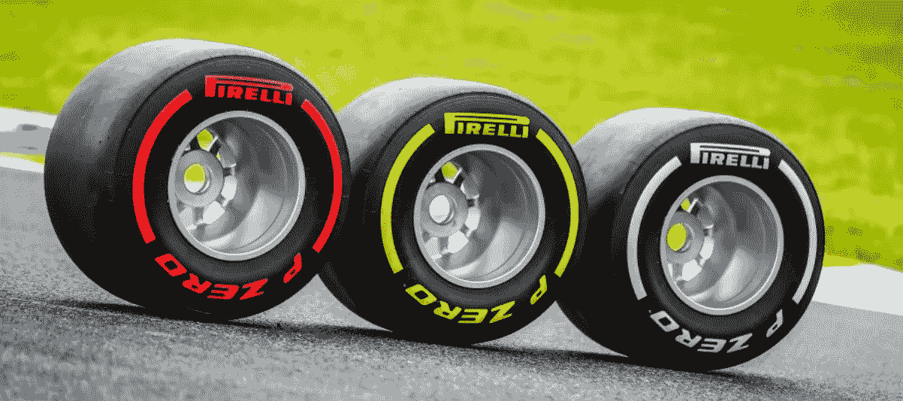

# 一级方程式赛车策略的强化学习

> 原文：<https://towardsdatascience.com/reinforcement-learning-for-formula-1-race-strategy-7f29c966472a?source=collection_archive---------19----------------------->

## 了解深度 Q-Networks 如何像 AlphaGo 学习下围棋一样学习决定进站。

本文介绍了我的实验原型一个深度强化学习代理，以帮助 f1 车队在比赛中实时优化他们的策略决策。神经网络被设计为从观察到的圈数据到控制动作和即时奖励信号的映射函数。这里介绍的概念框架是在摩纳哥大奖赛的背景下分析的，但同样的方法可以改进并推广到所有的大奖赛活动。

# 为什么重要？

f1 是一场没有子弹的战争，这场战争的主要武器是创新。决定比赛策略是这项运动中的黑暗艺术。车迷们通常喜欢在电视上看到的由优秀车手表演的高速机动。他们看不到的是，要获得更好的结果，需要事先做多少准备，包括使用数学模型和概率论。对于比赛策略，我们主要指以下两个关键决策:

*   车手应该什么时候去维修站换轮胎？
*   车队应该给赛车安装哪种轮胎？

古斯塔沃·坎波斯在 [Unsplash](https://unsplash.com?utm_source=medium&utm_medium=referral) 上的照片

轮胎在比赛中会老化，这可能会导致圈速变慢。这个过程是不可避免的，根据化合物(软、中、硬等)可以更快或更平滑。)和举行比赛的赛道。
如果圈速慢到赛车在几圈后损失的时间比停站花费的时间还多，那么轮胎可能需要更换。

如今，f1 车队使用蒙特卡洛模拟，他们在比赛前运行数小时，以便为他们的两位车手确定策略。这些模拟的工作方式是通过在不同的配置(进站圈、轮胎配方、位置等)下逐圈数千次地对比赛事件进行采样。)对有问题的车手，也对所有其他对手。由于可能情景的空间很大，他们只能运行有限数量的模拟，并且他们在这些模拟中选择能够产生最佳平均结果的策略。

[国际汽联 2019 & 2020](https://www.fia.com/news/fia-and-pirelli-announce-2020-f1-tyre-specification) 干轮胎化合物(软、中、硬)

在赛事期间，可能会发生许多新的情况，比赛策略师有时会发现自己不得不根据人类的判断来调整他们的决策。有时这些决定很有效，并导致获得更多的冠军积分。在其他情况下，它会导致挫败感——将重要的职位让给其他做出更好决策的竞争者。

这种情况促使我思考如何教会人工智能系统玩种族策略游戏。我们的目标是帮助一级方程式车手跨越终点线，在与其他竞争团队的竞争中赢得名次(或不失去任何名次)。

# RL 问题公式

强化学习(RL)是一种先进的机器学习(ML)技术，它采用了与其他机器学习方法非常不同的方法来训练模型。它的超能力在于，它可以学习非常复杂的行为，而不需要任何标记的训练数据，并且可以在为长期目标优化的同时做出短期决策。

一级方程式赛车背景下的 RL

在 RL 中，智能体通过直接与环境交互并最大化其获得的总回报来学习执行特定任务的最佳行为。在一级方程式赛车中，总奖励(回报)可以被认为是特定车手在比赛结束时获得或失去的名次。因此，如果代理认为车手在比赛结束时会获得更好的位置，它可以决定在某一圈进站并失去一些位置。

为简化起见，我们将考虑每一圈可能采取的行动如下:

*   行动 0:软化合物的进站
*   行动 1:中间化合物的进站
*   行动 2:硬质化合物的进站
*   行动 3:继续(没有中途停留)

## 预测与控制

将 RL 应用于 f1 比赛策略的第一个有趣想法是“控制”的概念。

强化学习中的预测任务是给出一个策略，目标是衡量它在任何给定状态下的表现。这在某种程度上类似于 F1 车队试图实现的模拟。在比赛前，他们想预测某个策略如果从第一圈就开始应用会有多好。

但是，当我们开始执行控制时，RL 中的事情变得非常有趣！控制任务是当策略不固定时，目标是找到最优行为。也就是说，在给定任何状态的情况下，寻找最优策略，总是提供使期望总回报最大化的最佳决策。在 f1 中，这将非常有趣，因为它提供了一种方法来学习如何利用非常复杂的模式，并提出实时适应每一圈的策略，并有望击败竞争中最好的策略专家。

## MDP &无模型控制

让我们考虑一级方程式赛车环境中的一个状态对应于我们在下面的电视屏幕上获得的信息。

F1 电视数据频道

一个状态主要由圈数、车手排名、车手之间的时间间隔和他们的速度(最后一圈时间)以及他们的轮胎成分(软、中或硬)和年龄(圈数)来表示。也可以考虑安全车标志。此外，有一条规则要求每辆车在比赛中至少使用两种不同的干化合物。因此，我们可以为每个司机设想一个标志，表明是否使用了第二种干化合物。

一级方程式赛车可以被公式化为马尔可夫决策过程(MDP ),其中从一个状态转移到另一个状态的概率仅取决于最后观察到的状态。在第 11 圈，我们需要为下一圈做的就是我们在第 11 圈观察到的情况(第 1 圈到第 10 圈变得不那么重要了)。

> "鉴于现在，未来独立于过去."

规划比赛中接下来几圈的策略可能需要一个完美的环境模型，其中我们确切地知道在状态 s 时采取行动 a 会得到什么回报，以及在行动 a 下从状态 s 转换到状态 s’的概率。但实际上，完美的环境模型很难获得，比赛期间发生的许多事件可能是随机的。想想奖励是如何依赖于其他赛车的行为，单圈时间和车手位置的不断变化。所以，我们不能使用像动态编程这样的方法。根据定义，状态值 V(s)是处于状态 s 并遵循向前发展的策略所估计的累积奖励。动态编程是一种迭代方法，依赖于这些状态值的全宽度备份。当可能状态的数量太大时，就像 f1 赛车的情况一样，成本太高。

出于这些原因，我们将依靠[无模型强化学习](https://en.wikipedia.org/wiki/Model-free_(reinforcement_learning))，其主要思想是从一个状态中采样特定轨迹，通过与环境的交互来评估试错设置中的动作。

# 设计一级方程式赛车模拟器

最先进的强化学习通常在雅达利、国际象棋或围棋等经典游戏中演示。这些是完全可以观察到的环境，我们喜欢研究它们，因为它们可以用简单的规则来表达。它们还允许轻松地将人工智能性能与人类水平的性能进行对比。

然而，一级方程式赛车是一个现实世界的问题。这是一个不完全信息博弈，因为部分可观察。主要的挑战在于建立一个能尊重游戏逻辑和复杂规则的模拟器。

我们之前讨论了一系列可能的行动(进站和轮胎胶料)和环境状态(我们在电视上看到的信息)。这些信息可以通过 F1 转播中心和像 [SBG 体育软件](https://sbgsportssoftware.com/)这样的平台提供给所有车队。我们将使用熊猫数据帧来表示环境中的每个状态。还包括进一步的信息，例如汽车的潜在步速[potential_pace]和指示第二干化合物是否已经被使用的标记[second_dry]。

f1 比赛环境中的状态示例

潜在速度是对自由空气中未被其他汽车阻挡时汽车速度的估计。它是用一个特定的函数计算出来的，考虑到了燃油质量、轮胎成分和轮胎的使用年限。

每一圈都是环境中的一个新的步骤，引入了可观察到的测量(速度、轮胎年龄、间隔等)的变化。)并能导致新的驱动程序排名。代理决定一次只对一辆车的策略。在环境中的每一步之后，奖励被计算为特定汽车获得或失去的位置的数量。

计算步长所需的一些重要工具是超越模型。这个模型为每个驾驶员提供了超车的可能性。它考虑了与前方车手的间隔、前方车手的潜在速度、相关车手的潜在速度以及一个表示赛道超车难度的参数。另一个重要的工具是花在进站上的时间，这可以从过去的比赛中学到，也可以在周末估计，这对停站后赛车的最终位置有很大的影响。

[Open AI Gym](https://gym.openai.com/) 是一个开源框架，为构建和实现定制环境提供了重要帮助。建立一个能够很好地模拟 f1 比赛动态的强化学习环境是非常重要和具有挑战性的。这需要对这项运动有深刻的理解，并在编码和测试实现方面付出很多努力。为了开发和评估这种方法，我们决定像摩纳哥大奖赛一样对模拟器进行参数化，这是一条众所周知超车困难的赛道。我们使用了[摩纳哥 2019](https://www.formula1.com/en/results.html/2019/races/1005/monaco/qualifying.html) 的排位赛结果来初始化发车区，并为这场特殊的比赛训练系统。

# 设计代理(深度 Q 网络)

在实现了环境之后，我们需要设计一个负责在每一圈推荐进站决定的代理。当与一辆特定的汽车相关联时，代理人有一个最终目标，那就是最大化该汽车可以获得的总回报。请记住，总奖励是指在整个比赛中获得或失去的名次。

Q-learning 是强化学习中使用的技术之一，用于寻找代理应该根据其调整其行为的最佳策略。对于每个州来说，通过采取特定的行动并持续遵循该政策，可以估计出总的回报。从(状态，动作)对获得的总回报被称为 Q 值。如果我们可以估计每个(状态，动作)对的 Q 值，代理将在每个状态下通过决定具有最大估计 Q 值的动作来优化行为，从而最大化总回报。

因为 Formula1 race 中可能状态的空间是无限的，所以我们无法将所有状态存储在内存中，也无法计算每个(状态、动作)组合的 Q 值。我们需要一个神经网络来逼近 Q 值函数。通常，它被称为深度 Q 网络(DQN)，这个想法首先由 [DeepMind](https://deepmind.com/) 用于建立一个人工智能系统，能够比最好的人类专家更好地[玩雅达利游戏](https://web.stanford.edu/class/psych209/Readings/MnihEtAlHassibis15NatureControlDeepRL.pdf)。如果没有这种方法，保持计算和内存效率将变得非常困难，特别是在像 f1 赛车这样的情况下，它具有连续和高基数的特征空间。

深度 Q 网络

我们在 [TensorFlow](https://www.tensorflow.org/) 中实现了一个密集神经网络。它将环境状态的矢量化表示作为输入，并输出每个动作的估计 Q 值。下一步行动由该网络的最大输出决定。

与简单的 Q 学习相比，有两个主要的想法使这种方法稳定:经验重放和固定的 Q 目标。

**体验回放:**我们将代理的体验(状态、动作、奖励、下一个状态)存储在回放存储器中，以便我们可以随机抽样成批的转换，并将它们用作训练数据。应用这种技术的主要优点是它稳定了 Q 学习方法，因为它去相关轨迹并使用神经网络的有效更新。通常在文献中，建议使用大小约为 1M 跃迁的重放存储器。然而，这个用例的最佳结果是通过使用约 15000 个转换的重放存储器的缩减尺寸和 32 个转换的批量尺寸获得的。这迫使网络在短时间内频繁且更快地从每个转变中学习，直到它明确地从重放存储器中消失，并被通过遵循改进的策略采样的新的看不见的转变所取代。

**固定 Q 目标:**通过使用目标网络获得用于训练该模型的目标值，该目标网络是主要行为网络的过去版本。我们在小批量学习过程中的一定数量的步骤中保持这个目标网络冻结，并教导行为网络估计这些冻结目标的 Q 值。通过选择正确的步数，然后我们更新目标网络~760 步，我们可以实现稳定的训练。

q-估计量 MSE 损失

优化的目标是最小化使用目标网络生成的目标值和使用行为网络生成的估计值之间的 [MSE](https://en.wikipedia.org/wiki/Mean_squared_error) 损失。

我们可能认为网络将学习它自己的预测，但是因为回报 r 是无偏的真实回报，所以网络将使用反向传播来更新它的权重，以最终收敛到最优 Q 值。

在下面的例子中，我们可以观察应用于 Pierre Gasly 的汽车(气体)的 Q 网络的行为。它估计了给定状态(第 3 圈)和所有可能动作(动作 0:软坑，动作 1:中坑，动作 2:硬坑，动作 3:继续)的每个组合的总奖励。代理人估计，如果实施行动 3(继续),到比赛结束时，总奖励为+0.69 个名次。因为这个 Q 值是最高的结果，所以它将推荐动作 3 作为该特定状态的决定。根据下面估计的 Q 值列表，如果加斯利在那一圈为软化合物进站，这将使他在比赛结束时面临失去 3 个位置的风险。

# 多代理设置中的培训

2017 年，DeepMind 推出了 [AlphaGo Zero](https://deepmind.com/blog/article/alphago-zero-starting-scratch) ，这是一种强化学习算法，它在没有看到任何先前人类下棋的情况下，学会了掌握围棋的游戏。该系统开始时不知道任何技术，只通过玩自己来学习提高能力。这个想法的本质是，为了击败人类水平的性能，人工智能系统不应该受到人类知识限制的约束。

以此类推，我们可以将一级方程式赛车视为一场涉及 20 辆汽车的多人游戏，其中每辆汽车都试图在比赛结束时最大化自己的排名，并击败其他对手。如果所有其他参与者都修正了他们的策略，那么最佳对策就是针对这些策略的最优策略。因此，朝着[纳什均衡](https://en.wikipedia.org/wiki/Nash_equilibrium)优化系统是有趣的，纳什均衡是所有参与者的联合策略，使得每个参与者的策略都是最佳对策。最佳对策是解决单个代理人的 RL 问题，其中其他参与者成为环境的一部分。我们通过生成 RL 体验来填充重放存储器，其中代理正在播放其自身的旧版本。除了行为网络和目标网络之外，我们决定使用第三个网络，负责在针对特定汽车进行优化时为其他汽车做出决策。就像目标网络一样，这个对手网络是行为网络的过去版本，但是更新频率比目标网络低 10 倍(每~7600 步)。

奖励 15000 集(纳什均衡)

当训练系统与自己进行 15000 场比赛时，我们可以注意到向纳什均衡的收敛，因为对于不同的赛车和比赛轨迹，每集获得的总奖励在零附近波动。在这个过程中，该系统正在学习设计一个比赛策略，并通过自我发挥来提高自己的能力！

该图显示了在学习过程的早期阶段，系统在每圈为每辆车做出的决定。我们可以看到，这是太频繁的点蚀，这不是一级方程式中的常识，因为浪费了太多的时间。

然而，下面的图表准确地显示了系统如何学习它应该更经常地继续和优化轮胎的使用。对于每一集，我们计算除了前两圈(用于环境初始化)之外的每一个动作的圈数。请注意，系统正在学习如何增加继续决策的频率(动作 3)，以及与其他更快的复合(中复合和软复合)相比，如何更少地使用硬复合(动作 2)。

在多智能体训练过程之外评估最终系统的一个好方法是将它用于一辆特定的汽车，并让它与应用于其他汽车的旧版本进行竞争。我们将使用训练了 15000 集的代理作为佩雷斯(PER)的控制代理，并使用只训练了 12000 集(80%)的同一代理来决定所有其他汽车的对手策略。知道佩雷斯在第 16 位开始了[摩纳哥 2019](https://www.formula1.com/en/results.html/2019/races/1005/monaco/qualifying.html) 比赛，有趣的是看到他如何在比赛结束时按照最新的代理人行为政策获得+1 位。

基于最优代理的 PER 竞争模拟

在这种情况下，我们将代理的性能与它自己的老版本进行比较，老版本看起来也是一个强大的战略家。注意对手策略系统是如何学会为许多没有先验知识的驾驶员决定一站式策略的。它根据自己控制的每辆赛车的具体情况来决定进站圈和轮胎的选择，并设法保持车手的位置，作为纳什均衡的一部分。

对于莱科宁(RAI)来说，它决定在最快的软胎上进行两次冲刺，然后在比赛结束时停在硬胎上。这最后一次进站的原因是为了遵守在同一场比赛中使用两种不同干化合物的规则。它清楚地展示了智能体在自主学习游戏规则的同时优化其决策的能力。

更有趣的是，在与真实的比赛事件进行交互时，将代理的性能与 f1 车队决定的预定义策略进行比较。

# 摘要

在这项工作中，我们引入了一种深度强化学习方法，这种方法具有在比赛期间实时优化 f1 比赛策略的优势。该解决方案与经典模拟方法有一些显著的不同:

*   比赛前采样的蒙特卡洛模拟不适应比赛期间发生的事件的现实，并且它们不能保证找到最佳策略。介绍的方法收敛到一个最佳的政策，并可以在比赛中的每一个特定圈应用，以决定最佳的可能行动。
*   通过神经网络和函数逼近，我们大大降低了估计环境中极大量可能(状态、动作)对的值所需的计算和存储复杂性。不像传统的蒙特卡罗方法只在小的和有限的 MDP 上工作，这种方法具有可伸缩性的优点。
*   由神经网络组成的代理被训练成在没有预先假设的情况下跨越许多代表环境状态的特征。这可能有助于了解人类难以识别的非常复杂的种族动态模式。
*   通过一个单一的神经网络，我们可以为网格上的任何驾驶员定义一个最佳策略。这提供了控制同一个车队的两位车手和评估由比赛决定的所有行动的可能性。

RL 令人兴奋的是，该系统并不主要依赖历史数据来改善决策。它通过与环境的互动直接学习。令人惊讶的是，对于许多现实世界的应用程序来说，与环境交互是可能的。我们定义了一组行动，观察空间，并集中精力设计最方便的回报函数。一级方程式赛车策略的人工智能框架可以通过考虑安全车的概率和可能改变比赛进程的天气条件来增强。