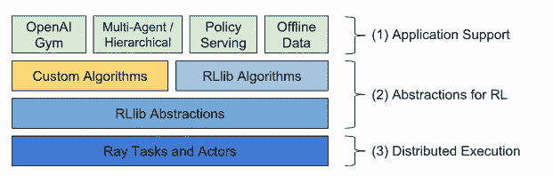

# 强化学习框架

> 原文：<https://towardsdatascience.com/reinforcement-learning-frameworks-e349de4f645a?source=collection_archive---------16----------------------->

## [深度强化学习讲解— 20](https://towardsdatascience.com/tagged/deep-r-l-explained)

## **在 Ray 框架上使用** RLlib 解决 CartPole 环境


欢迎来到这第 20 篇文章，它总结了 *"* [*深度强化学习讲解*](https://torres.ai/deep-reinforcement-learning-explained-series/) *"* 系列，该系列提供了一种实用的方法来开始令人兴奋的深度强化学习世界。

到目前为止，在[之前的帖子](/policy-gradient-methods-104c783251e0)中，我们已经看到了相对容易编程的 RL 算法集的基本表示(尽管我们跳过了几个)。但是从现在开始，我们需要考虑 RL 算法的规模和复杂性。在这种情况下，从头开始编写强化学习实现可能会变得单调乏味，并且存在很高的编程错误风险。

为了解决这个问题，RL 社区开始构建框架和库来简化 RL 算法的开发，既通过创建新的部分，又特别是通过涉及各种算法组件的组合。在本帖中，我们将对那些**强化学习框架**做一个大致的介绍，并使用[**rl lib**](http://rllib.io/)(Python 中的一个开源库)基于 [Ray](https://ray.io/) 框架解决前面的 CartPole 问题。

> [本出版物的西班牙语版本](https://medium.com/aprendizaje-por-refuerzo/11-frameworks-de-aprendizaje-por-refuerzo-ray-rllib-1329e93f14ee)

[](https://medium.com/aprendizaje-por-refuerzo/11-frameworks-de-aprendizaje-por-refuerzo-ray-rllib-1329e93f14ee) [## 11.难民保护框架:Ray+RLlib

### 请访问第 11 页的自由介绍

medium.com](https://medium.com/aprendizaje-por-refuerzo/11-frameworks-de-aprendizaje-por-refuerzo-ray-rllib-1329e93f14ee) 

# 强化学习框架

## 动机

但是在继续之前，作为一个激励的例子，让我们记住在[之前的帖子](/policy-gradient-methods-104c783251e0)中，我们提出了[加强](http://incompleteideas.net/williams-92.pdf)及其局限性。研究界创造了许多训练算法来解决它:[、A3C、DDPG、TD3、SAC、PPO](https://docs.ray.io/en/latest/rllib-toc.html#algorithms) 等等。但是从头开始编写这些算法比 REINFORCE 更复杂。此外，你在这个领域参与得越多，你就越会意识到你在一遍又一遍地写同样的代码。

与深度学习等其他领域相比，强化学习的实际应用相对年轻，在深度学习中，TensorFlow、PyTorch 或 MXnet 等成熟的框架简化了 DL 实践者的生活。然而，RL 框架的出现已经开始，现在我们可以从几个项目中进行选择，这些项目极大地促进了高级 RL 方法的使用。

在介绍这些 RL 框架之前，让我们先了解一下它们的背景。

## 从互动中学习，而不是从例子中学习

在过去的几年中，模式识别一直是深度学习社区中许多工作和讨论的焦点。我们正在使用强大的超级计算机处理大型标记数据集(专家为训练集提供输出)，并应用基于梯度的方法在这些数据集中找到模式，这些模式可用于预测或试图找到数据内部的结构。

这与我们对世界的知识的重要部分是通过互动获得的事实形成对比，没有外部老师告诉我们我们采取的每一个行动的结果会是什么。人类能够从互动和经验中发现新问题的解决方案，通过积极探索获得关于世界的知识。

由于这个原因，当前的方法将通过深度强化学习(DRL)的镜头研究从模拟环境的交互中学习的问题，这是一种从交互中进行目标导向学习的计算方法，不依赖于专家的监督。即，强化学习代理必须与环境交互以生成其自己的训练数据。

这激发了与一个环境的多个实例的并行交互，从而更快地产生更多可以学习的经验。这导致了越来越大规模的分布式和并行系统在 RL 训练中的广泛使用。这带来了许多工程和算法上的挑战，我们正在谈论的这些框架可以解决这些挑战。

## 开源拯救世界

近年来，TensorFlow 或 PyTorch ( [我们在本博客](/tensorflow-or-pytorch-146f5397278a)中广泛讨论了这两种框架)等框架已经出现，有助于将模式识别转化为商品，使深度学习更容易被实践者尝试和使用。

类似的模式也开始在强化学习领域上演。我们开始看到许多开源库和工具的出现，通过帮助创建新的部分(而不是从头开始编写)，以及最重要的，涉及各种预构建算法组件的组合来解决这一问题。因此，这些强化学习框架通过创建 RL 算法核心组件的高级抽象来帮助工程师。总之，这使得代码更容易开发，阅读起来更舒服，并提高了效率。

接下来，我提供了一个最流行的 RL 框架列表。我认为读者会从使用已经建立的框架或库的代码中受益。在写这篇文章的时候，我可以提到最重要的几个(我肯定我漏掉了其中的一些):

*   [Keras-RL](https://github.com/keras-rl/keras-rl)
*   [RL 蔻驰](https://github.com/NervanaSystems/coach)
*   [试剂](https://github.com/facebookresearch/ReAgent)
*   [射线+RLlib](https://ray.readthedocs.io/en/master/rllib.html)
*   [多巴胺](https://github.com/google/dopamine)
*   [张量力](https://github.com/tensorforce/tensorforce)
*   [RLgraph](https://github.com/rlgraph/rlgraph)
*   [车库](https://github.com/rlworkgroup/garage)
*   [鹿](https://github.com/VinF/deer)
*   [极致](https://github.com/deepmind/acme)
*   [基线](https://github.com/openai/baselines)
*   [PFRL](https://github.com/pfnet/pfrl)
*   [稳定基线](https://github.com/DLR-RM/stable-baselines3)

决定使用这里列出的 RL 框架中的哪一个，取决于您的偏好以及您想用它做什么。读者可以通过链接了解更多信息。

我们在研究中心使用 [**Acme**](https://github.com/deepmind/acme) 进行研究。但是为了描述这些环境中的一个，以便读者可以看到它们提供的可能性，我个人选择了基于 [Ray](https://ray.io) 的 [RLlib](https://docs.ray.io/en/master/rllib.html) ，原因我将在下面解释。

# RLlib:使用 Ray 的可扩展强化学习

我们使用 [**Acme**](https://github.com/deepmind/acme) 在我们的研究中心做研究。但是为了描述这些环境中的一个，以便读者可以看到它们提供的可能性，我选择了基于 [Ray](https://ray.io) 的 [RLlib](https://docs.ray.io/en/master/rllib.html) ，原因我将在下面解释。

## 计算需求的增长

深度强化学习算法涉及大量模拟，这给深度学习本身的计算复杂性增加了另一个倍增因素。大多数情况下，这是我们在本系列中尚未看到的算法所需要的，例如分布式行动者-批评家方法或多代理方法等。

但是，即使找到最佳模型，也常常需要超参数调整和在各种超参数设置中搜索；这可能很昂贵。所有这些都需要由基于异构服务器的分布式系统(具有多核 CPU 和硬件加速器，如 GPU 或 TPU)的超级计算机提供高计算能力。

两年前，当我作为一名作者在 Medium 上首次亮相时，我已经在文章“[超级计算](/supercomputing-the-heart-of-deep-learning-and-artificial-intelligence-49218c6bdee5)”中解释了这种类型的基础设施是什么样的。在巴塞罗那，我们现在有一台超级计算机，名为 Marenostrum 4，计算能力为 13 Petaflops。

> [巴塞罗那超级计算中心](https://www.bsc.es)明年将托管一台新的超级计算机 Marenostrum 5，它将把计算能力提高 x17 倍。

目前的超级计算机 MareNostrum 4 分为两个不同的硬件模块:一个通用模块和一个基于 IBM 系统的模块，专为深度学习和人工智能应用而设计。

在硬件方面，Marenostrum 的这一部分包括一个 54 节点集群，基于 IBM Power 9 和 NVIDIA V100，采用 Linux 操作系统，通过 Infiniband 网络以每秒 100 千兆位的速度互连。每个节点都配备了 2 个 IBM POWER9 处理器，每个处理器有 20 个物理核心和 512GB 内存。这些 POWER9 处理器中的每一个都连接到两个 16GB 内存的 NVIDIA V100(Volta)GPU，每个节点共有 4 个 GPU。

如何有效管理这种硬件结构？

## 系统软件堆栈

用分布式和并行系统加速强化学习在管理程序执行的并行化和分布方面引入了几个挑战。为了解决这种日益增长的复杂性，已经开始提出新的软件层，我们在现有的软件层上进行堆叠，试图在逻辑上保持系统的分层**软件栈**的不同组件的分离

由于这个关键的抽象，我们可以专注于不同的软件组件，今天的超级计算机合并，以执行复杂的任务。我想提一下[丹尼尔·希利斯](https://dl.acm.org/doi/book/10.5555/554797)，他是开发并行连接机器的思维机器公司的联合创始人，他说*抽象的层次结构是我们理解复杂系统最重要的工具，因为它让我们一次专注于问题的一个方面。*

我选择的框架 RLlib 就是这种情况，它遵循分而治之的理念，对软件堆栈进行分层设计。



RLlib 的软件栈(来源: [docs.ray.io](https://docs.ray.io/en/latest/rllib.html) )

允许这种功能抽象的这种抽象层次结构是基本的，因为它将让我们操纵信息而不用担心它的底层表示。丹尼尔·希利斯说*一旦我们知道如何完成一个给定的功能，我们就可以把这个机制放在一个“积木”的“黑匣子”里，不再去想它。积木体现的功能可以反复使用，不用参考里面的细节。*

## 光线

简而言之，并行和分布式计算是强化学习算法的主要内容。我们需要利用多核和加速器(在多台机器上)来加速 RL 应用，Python 的[多处理模块](https://docs.python.org/2/library/multiprocessing.html)不是解决方案。一些 RL 框架，像 [**Ray**](https://ray.io/) 可以很好地处理这个挑战。

在[官方项目页面](https://docs.ray.io/en/latest/)上，Ray 被定义为构建和运行分布式应用的快速简单框架:

1.  为构建和运行分布式应用程序提供简单的原语。
2.  支持最终用户并行处理单个机器代码，几乎不需要修改代码。
3.  包括应用程序、库和工具的大型生态系统，以支持复杂的应用程序。

Ray Core 为应用程序构建提供了简单的原语。在 Ray Core 之上，除了 [RLlib](https://docs.ray.io/en/latest/rllib.html#rllib-index) 之外，还有其他解决机器学习问题的库: [Tune(可扩展超参数调优](https://docs.ray.io/en/latest/tune/index.html))、 [RaySGD(分布式训练包装器)](https://docs.ray.io/en/latest/raysgd/raysgd.html#sgd-index)、 [Ray Serve(可扩展可编程服务](https://docs.ray.io/en/latest/serve/index.html#rayserve))。

## RLlib

[RLlib](https://docs.ray.io/en/latest/rllib.html#rllib-index) 是一个用于强化学习的开源库，它为各种应用程序提供了高可扩展性和统一的 API。RLlib 原生支持 TensorFlow、TensorFlow Eager 和 PyTorch，但它的大部分内部是框架不可知的。

目前，这个库已经有了大量的文档( [API 文档](https://docs.ray.io/en/latest/rllib-toc.html))，除了允许创建[自定义算法](https://docs.ray.io/en/latest/rllib-concepts.html)之外，还提供了大量的[内置算法](https://docs.ray.io/en/latest/rllib-toc.html#algorithms)。

RLlib 中的关键概念是策略、样本和训练器。简而言之，**策略**是定义代理在环境中如何行为的 Python 类。RLlib 中的所有数据交换都是以**样本**批次的形式进行的，这些样本对轨迹的一个或多个片段进行编码。**训练器**是将上述组件放在一起的样板类，管理算法配置、优化器、训练指标、执行并行组件的工作流等。

在本系列的后面，当我们在分布式和多代理算法方面取得更多进展时，我们将更详细地介绍 RLlib 的这些关键组件。

## TensorFlow 或 PyTorch

在之前的一篇帖子中， [TensorFlow vs. PyTorch:战斗仍在继续](/tensorflow-vs-pytorch-the-battle-continues-9dcd34bb47d4)，我展示了深度学习重量级公司 TensorFlow 和 PyTorch 之间的战斗正在全面展开。而在这方面，RLlib 采取的选项，允许用户在 TensorFlow 和 PyTorch 之间无缝切换，用于他们的强化学习工作，似乎也非常合适。

为了允许用户在 RLlib 中作为后端在 TensorFlow 和 PyTorch 之间轻松切换，RLlib 包含了“框架”[训练器配置](https://docs.ray.io/en/master/rllib-training.html#common-parameters)。例如，要切换到 PyTorch 版本的算法，我们可以指定`{"framework":"torch"}`。在内部，这告诉 RLlib 尝试对算法使用策略的 torch 版本(查看 [PPOTFPolicy](https://github.com/ray-project/ray/blob/master/rllib/agents/ppo/ppo_tf_policy.py) 与 [PPOTorchPolicy](https://github.com/ray-project/ray/blob/master/rllib/agents/ppo/ppo_torch_policy.py) 的示例)。

# 用 RLlib 解决磁极环境问题

现在，我们将展示一个玩具示例来帮助您入门，并向您展示如何使用 RLlib 使用 PPO 算法解决 OpenAI Gym 的 [Cartpole 环境](/a-pair-of-interrelated-neural-networks-in-dqn-f0f58e09b3c4)。PPO 是解决增强的局限性的建议之一，由 John Schulman 等人(2017)在 OpenAI 的论文“[近似策略优化算法](https://arxiv.org/pdf/1707.06347.pdf)”中介绍。但是读者可以使用本节中提出的代码来测试任何已经在这个框架中编程的算法。

这篇文章的[完整代码可以在 GitHub](https://github.com/jorditorresBCN/Deep-Reinforcement-Learning-Explained/blob/master/DRL_20_RLlib.ipynb) 上找到，并且[可以使用这个链接](https://colab.research.google.com/github/jorditorresBCN/Deep-Reinforcement-Learning-Explained/blob/master/DRL_20_RLlib.ipynb)作为一个 Colab google 笔记本运行。

> 警告:鉴于我们正在 Colab 中执行我们的示例，我们需要在安装 ray 包并卸载 pyarrow 后重新启动运行时。

您可以通过`ray.rllib.agents`访问各种算法。[在这里](https://github.com/ray-project/ray/tree/master/rllib/agents)，您可以在 PyTorch 和 Tensorflow 中找到一长串不同的实现来开始使用。

如果您想使用 PPO，您可以运行以下代码:

```
import ray
from ray.rllib.agents.ppo import PPOTrainer, DEFAULT_CONFIGray.init()
```

`ray.init()`命令启动所有相关的光线进程。这必须在我们实例化任何 RL 代理之前完成，例如我们示例中的`PPOTrainer`对象:

```
config = DEFAULT_CONFIG.copy()
config["num_gpus"] = 1 # in order to use the GPU
agent = PPOTrainer(config, 'CartPole-v0')
```

我们可以在一个`config`对象中传递许多指定网络和训练过程应该如何配置的超参数。更改超参数就像将它们作为字典传递给`config`参数一样简单。查看可用内容的一个快速方法是调用`trainer.config`来打印出适用于您选择的算法的选项:

```
print(DEFAULT_CONFIG){
‘num_workers’: 2, 
‘num_envs_per_worker’: 1, 
‘rollout_fragment_length’: 200, 
‘num_gpus’: 0, 
‘train_batch_size’: 4000, .
.
.}
```

一旦我们指定了我们的配置，调用我们的`trainer`对象上的`train()`方法将更新并发送输出到一个名为`results`的新字典。

```
result = agent.train()
```

所有算法都遵循相同的基本结构，从小写缩写到大写缩写，后跟`Trainer`。例如，如果您想尝试 DQN，您可以拨打:

```
from ray.rllib.agents.dqn import DQNTrainer, DEFAULT_CONFIG
agent = **DQNTrainer**(config=DEFAULT_CONFIG, env='CartPole-v0')
```

从一个训练有素的代理程序计算动作的最简单方法是使用`trainer.compute_action()`:

```
action=agent.compute_action(state)
```

该方法在将观察结果传递给代理策略之前对其进行预处理和过滤。下面是一个如何观察使用`compute_action()`的代理的简单示例:

```
def watch_agent(env):
   state = env.reset()
   rewards = []
   img = plt.imshow(env.render(mode=’rgb_array’))
   for t in range(2000):
       action=agent.compute_action(state) img.set_data(env.render(mode=’rgb_array’))
       plt.axis(‘off’)
       display.display(plt.gcf())
       display.clear_output(wait=True)

       state, reward, done, _ = env.step(action)
       rewards.append(reward)
       if done:
          print(“Reward:”, sum([r for r in rewards]))
          break
       env.close()
```

使用`watch_agent`函数，我们可以比较代理在被训练运行多个更新之前和之后的行为，为给定的数字调用`train()`方法:

```
for i in range(10):
   result = agent.train()
   print(f'Mean reward: {result["episode_reward_mean"]:4.1f}')
```

最后一行代码显示了我们如何监控包含在方法`train()`的返回中的训练循环打印信息。


训练前


训练后

这是一个简单算法的玩具实现，非常简单地展示了这个框架。RLlib 框架的实际价值在于它在执行固有并行的大型基础设施中的使用，同时，从头开始编写代码的复杂算法是完全不可行的。

正如我所说的，在看了上面提到的所有其他框架之后，我选择了 RLlib。原因是多样的；有些已经在本帖中介绍过了。给我加上那个；相关的是，它已经被包括在主要的云提供商中，如 [AWS](https://docs.aws.amazon.com/sagemaker/latest/dg/reinforcement-learning.html) 和 [AzureML](https://docs.microsoft.com/en-us/azure/machine-learning/how-to-use-reinforcement-learning) 。或者有一个像 [ANYSCALE](https://anyscale.com/) 这样的推动公司已经筹集了[2000 万](https://anyscale.com/blog/page/3/)并组织了 [**射线峰会**](https://events.linuxfoundation.org/ray-summit/?utm_source=ion&utm_medium=blog&utm_campaign=ray_summit) **会议**，该会议将于本周(9 月 30 日至 10 月 1 日)在网上举行，并有伟大的演讲者(如我们的朋友[Oriol Vinyals](https://scholar.google.com/citations?user=NkzyCvUAAAAJ&hl=en)；-).也许可以添加更多的背景细节，但对我来说，与上述原因同样重要的是，有来自加州大学伯克利分校的伟大研究人员[参与其中，包括有远见的](https://arxiv.org/abs/1712.09381)[扬·斯托伊察](https://people.eecs.berkeley.edu/~istoica/)，我在 Spark 的问题上见过他，他们显然是对的！

# 从这里去哪里

我希望这些帖子能够鼓励读者了解这项令人兴奋的技术，它是人工智能领域最新突破性进展的真正推动者。我们真的没有看到太多，只是最基本的，让你继续自己发现和享受这个神话般的世界。以下参考资料可能有用。

## 书

*   理查德·萨顿和安德鲁·巴尔托。 [*强化学习:导论*](https://mitpress.mit.edu/books/reinforcement-learning-second-edition) ，麻省理工出版社，2018。[【incompleteideas.net 在线】](http://incompleteideas.net/book/the-book-2nd.html)。Python 代码的相关独立[回购。](https://github.com/Pulkit-Khandelwal/Reinforcement-Learning-Notebooks)
*   米格尔·莫拉莱斯。 [*摸索深度强化学习*](https://www.manning.com/books/grokking-deep-reinforcement-learning) 。曼宁，2020。
*   亚历山大·宰和布兰登·布朗。 [*深度强化学习在行动*](https://www.manning.com/books/deep-reinforcement-learning-in-action) 。曼宁，2020。
*   马克西姆·拉潘。 [*深度强化学习*](https://www.packtpub.com/data/deep-reinforcement-learning-hands-on-second-edition) 。帕克特出版有限公司，第二版，2020 年。
*   迈克尔·兰哈姆。 [*游戏动手强化学习*](https://www.packtpub.com/product/hands-on-reinforcement-learning-for-games/9781839214936) 。帕克特出版社，2020 年。
*   菲尔·温德。 [*强化学习、工业应用和智能代理*](https://www.oreilly.com/library/view/reinforcement-learning/9781492072386/) 。奥瑞丽媒体公司，2020 年。
*   Sudharsan Ravichandiran。 [*深度强化学习用 Python*](https://www.packtpub.com/product/deep-reinforcement-learning-with-python-second-edition/9781839210686) 。帕克特出版有限公司，第二版，2020 年。

## 在线资源

*   [大卫·西尔弗在 RL 上的 UCL 课程](https://www.davidsilver.uk/teaching/)
*   由谢尔盖·莱文创作的加州大学伯克利分校 CS 285
*   哈多·范·哈瑟尔特的《UCL》
*   [斯坦福 CS234，作者艾玛·布伦斯基尔](http://web.stanford.edu/class/cs234/index.html)
*   [马里奥·马丁的 UPC 巴塞罗那理工学院](https://www.cs.upc.edu/~mmartin/url-RL.html)
*   [滑铁卢大学 CS 885，作者帕斯卡·普帕特](https://cs.uwaterloo.ca/~ppoupart/teaching/cs885-spring20/schedule.html)
*   彼得·阿比尔等人的伯克利 DRL 训练营
*   [Xavier giróI-Nieto 等人的 UPC 巴塞罗那技术公司](https://telecombcn-dl.github.io/drl-2020/)
*   Josh Achiam 的 OpenAI
*   [莉莲翁:一(长)窥强化学习](https://lilianweng.github.io/lil-log/2018/02/19/a-long-peek-into-reinforcement-learning.html)
*   [证件代码](https://paperswithcode.com/methods/area/reinforcement-learning)
*   [Alex Irpan:有点见地:深度强化学习还没起作用](https://www.alexirpan.com/2018/02/14/rl-hard.html)
*   [Andrej Karpathy 博客:从像素进行深度强化学习](https://karpathy.github.io/2016/05/31/rl/)

# 深度强化学习讲解系列

**由** [**UPC 巴塞罗那理工**](https://www.upc.edu/en) **和** [**巴塞罗那超级计算中心**](https://www.bsc.es/)

一个轻松的介绍性[系列](https://torres.ai/deep-reinforcement-learning-explained-series/)以一种实用的方式逐渐向读者介绍这项令人兴奋的技术，它是人工智能领域最新突破性进展的真正推动者。

[](https://torres.ai/deep-reinforcement-learning-explained-series/) [## 深度强化学习解释-乔迪托雷斯。人工智能

### 本系列的内容](https://torres.ai/deep-reinforcement-learning-explained-series/) 

## 关于这个系列

我在五月份开始写这个系列，那是在巴塞罗那的封锁期。老实说，由于封锁，在业余时间写这些帖子帮助了我 [**#StayAtHome**](https://twitter.com/hashtag/StayAtHome?src=hashtag_click) 。感谢您当年阅读这份刊物；它证明了我所做的努力。

**免责声明** —这些帖子是在巴塞罗纳封锁期间写的，目的是分散个人注意力和传播科学知识，以防对某人有所帮助，但不是为了成为 DRL 地区的学术参考文献。如果读者需要更严谨的文档，本系列的最后一篇文章提供了大量的学术资源和书籍供读者参考。作者意识到这一系列的帖子可能包含一些错误，如果目的是一个学术文件，则需要对英文文本进行修订以改进它。但是，尽管作者想提高内容的数量和质量，他的职业承诺并没有留给他这样做的自由时间。然而，作者同意提炼所有那些读者可以尽快报告的错误。

## 我们在 DRL 的研究

我们在 [**UPC 巴塞罗那理工**](https://www.upc.edu/en) 和 [**巴塞罗那超级计算中心**](https://www.bsc.es/) 的课题组正在做这个课题的研究。我们在这一领域的最新论文是在第 37 届国际机器学习会议(ICML2020) 上发表的“[探索、发现和学习:状态覆盖技能的无监督发现](https://arxiv.org/pdf/2002.03647.pdf)”。提出了一种新的强化学习无监督技能发现范式。是我们博士生之一的 [@vcampos7](https://twitter.com/vcampos7) 和 [@DocXavi](https://twitter.com/DocXavi) 共同建议的最后一篇投稿。本文由来自 [Salesforce Research](https://einstein.ai/) 的 [@alexrtrott](https://twitter.com/alexrtrott) 、[@蔡明雄](https://twitter.com/CaimingXiong)、 [@RichardSocher](https://twitter.com/RichardSocher) 共同撰写。