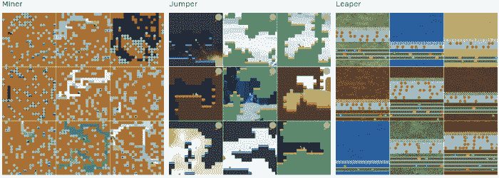
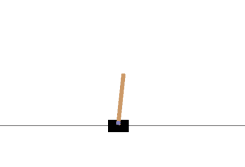
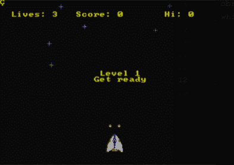
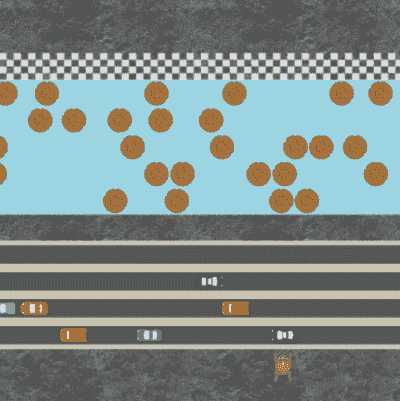
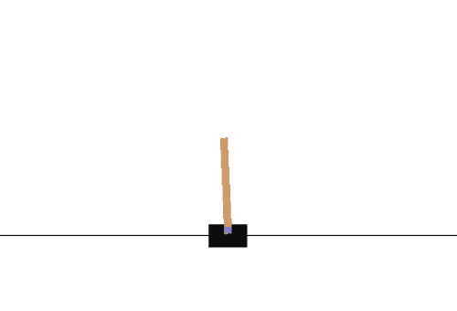

# 几行代码中的强化学习

> 原文：<https://towardsdatascience.com/reinforcement-learning-in-a-few-lines-of-code-d6c8af1e0fd2?source=collection_archive---------13----------------------->

## 强化学习

## 使用稳定基线和 Gym 训练 SOTA RL 算法



从 Procgen 检索

强化学习在过去的一年里有了很大的改进，最先进的方法每两个月出现一次。我们已经看到 AlphaGo 击败世界冠军围棋手[柯洁](https://deepmind.com/alphago-china)，多智能体玩[捉迷藏](https://www.youtube.com/watch?v=kopoLzvh5jY&feature=youtu.be)，甚至 AlphaStar 在[星际](https://deepmind.com/blog/article/alphastar-mastering-real-time-strategy-game-starcraft-ii)中也竞技性地守住了自己。

实现这些算法可能非常具有挑战性，因为它需要对深度学习和强化学习有很好的理解。本文的目的是给你一个使用一些简洁的包的快速入门，这样你就可以很容易地开始强化学习。

关于如何实现 SOTA 深度强化学习算法的深入教程，请参见[本](https://simoninithomas.github.io/Deep_reinforcement_learning_Course/)和[本](https://github.com/dennybritz/reinforcement-learning)。强烈推荐他们！

# 环境

在我们开始实现这些算法之前，我们首先需要创建一个工作环境，即游戏。对于算法来说，理解什么是动作和观察空间是很重要的。为此，我们将进入几个可用于选择有趣环境的包。

## 体育馆

Gym 是一个开发和比较强化学习算法的工具包。它通常用于实验和研究目的，因为它提供了一个简单易用的环境工作界面。

简单地用`pip install gym`安装包。完成后，您可以使用以下代码创建一个环境:

```
import gym
env = gym.make(‘CartPole-v0’)
```

在**推车**环境中，你的任务是防止通过未启动的接头连接到推车上的杆子翻倒。

`env`变量包含关于环境(游戏)的信息。要了解侧手翻的**动作空间**是什么，只需运行`env.action_space`就会产生`Discrete(2)`。这意味着有两种可能的独立动作。要查看**观察空间**，您运行`env.observation_space`，这将产生`Box(4)`。这个方框表示 n (4)个闭区间的
笛卡儿积。

要渲染游戏，请运行以下代码:



我们可以看到，如果我们选择采取随机行动，购物车就会不断失灵。最终，目标将是运行一个强化学习算法，学习如何解决这个问题。

有关健身房环境的完整列表，请参见[本](http://gym.openai.com/envs/#classic_control)。

**注意**:如果您在运行雅达利游戏时遇到问题，请参见[本](https://github.com/openai/gym/issues/1726)。

## 重新流行

创造有趣环境的另一个选择是使用[复古](https://github.com/openai/retro)。这个包是由 OpenAI 开发的，允许你使用 ROMS 来模拟游戏，如空袭者-创世纪。

只需用`pip install gym-retro`安装软件包即可。然后，我们可以通过以下方式创建和查看环境:

```
import retro
env = retro.make(game='Airstriker-Genesis')
```

再次，为了渲染游戏，运行下面这段代码:



要安装 ROMS，你需要找到相应的。sha 文件，然后运行:

```
python3 -m retro.import /path/to/your/ROMs/directory/
```

**注意**:要获得可用环境的完整列表，运行`retro.data.list_games()`。

## **宝洁公司**

强化学习的一个典型问题是，产生的算法通常在特定环境下工作得很好，但无法学习任何通用的技能。例如，如果我们要改变一个游戏的外观或者敌人的反应呢？

为了解决这个问题，OpenAI 开发了一个名为 Procgen 的包，它允许创建程序化生成的环境。我们可以用这个包来衡量强化学习代理学习一般化技能的速度。

渲染游戏很简单:



这将生成一个可以训练算法的单一级别。有几个选项可用来有步骤地生成同一环境的许多不同版本:

*   `num_levels` -可以生成的独特级别的数量
*   `distribution_mode` -使用哪种级别，选项为`"easy", "hard", "extreme", "memory", "exploration"`。所有游戏都支持`"easy"`和`"hard"`，而其他选项则是游戏特有的。

# 强化学习

现在，终于到了实际强化学习的时候了。虽然有许多可用的软件包可以用来训练算法，但由于它们的可靠实现，我将主要进入稳定的基线。

请注意，我不会在这篇文章中解释 RL 算法实际上是如何工作的，因为这需要一篇全新的文章。有关 PPO、SAC 和 TD3 等最新算法的概述，请参见[本](https://simoninithomas.github.io/Deep_reinforcement_learning_Course/)或[本](https://github.com/dennybritz/reinforcement-learning)。

## 稳定基线

[稳定基线](https://github.com/hill-a/stable-baselines) (SB)基于 OpenAI [基线](https://github.com/openai/baselines/)，旨在使研究社区和行业更容易复制、提炼和识别新想法。他们在基线的基础上进行改进，以制作一个更加稳定和简单的工具，允许初学者在不被实现细节所困扰的情况下尝试强化学习。

由于 SB 能够简单快速地应用最新的强化学习算法，因此经常被使用。此外，创建和训练 RL 模型只需要几行代码。

安装可以简单地通过`pip install stable-baselines`完成。然后，为了创建和学习一个 RL 模型，例如， [PPO2](https://openai.com/blog/openai-baselines-ppo/) ，我们运行下面几行代码:

有几件事可能需要一些解释:

*   `total_timesteps` -用于训练的样本总数
*   `MlpPolicy` -实现 actor-critical 的策略对象。在这种情况下，一个多层感知器有 2 层 64。还有针对视觉信息的策略，例如`CnnPolicy`甚至`CnnLstmPolicy`

为了将这个模型应用到 CartPole 示例中，我们需要将我们的环境包装在一个假人中，以使它对某人可用。在 CartPole 环境中训练 PPO2 的完整示例如下:



正如我们在上面的图片中看到的，仅用了 50，000 步，PPO2 就设法找到了保持杆子稳定的方法。这只需要几行代码和几分钟的处理时间！

如果要将其应用于 Procgen 或 Retro，请确保选择允许基于卷积的网络的策略，因为观察空间可能是环境当前状态的图像。

最后，横翻筋斗的例子非常简单，只需 50，000 步就可以完成。大多数其他环境通常需要数千万个步骤才能显示出显著的改进。

**注意**:稳定基线的作者警告初学者，在产品中使用这个包之前，要很好地理解强化学习。强化学习有许多至关重要的组成部分，如果其中任何一个出错，算法就会失败，并可能留下很少的解释。

## 其他包

还有其他几个常用于应用 RL 算法的软件包:

*   `[TF-Agents](https://github.com/tensorflow/agents)` -比稳定基线需要更多的编码，但通常是强化学习研究的首选包。
*   用 Pytorch 用最少的代码实现了最先进的 RL 算法。这无疑有助于理解算法。
*   `[DeepRL](https://github.com/p-christ/Deep-Reinforcement-Learning-Algorithms-with-PyTorch)` -另一个 Pytorch 实现，但是这个版本还实现了额外的环境来使用。
*   `[MlAgents](https://github.com/Unity-Technologies/ml-agents)` -一个开源的 Unity 插件，支持游戏和模拟作为训练代理的环境。

# 结论

强化学习可能是一个棘手的问题，因为如果代码中出现问题，很难调试。希望这篇文章能帮助你开始强化学习。

所有代码都可以在以下位置找到:

[](https://github.com/MaartenGr/ReinforcementLearning) [## MaartenGr/强化学习

### 使用 Stable-baselines、Gym、Retro 和 Procgen 在动态环境中创建最先进的强化学习算法。

github.com](https://github.com/MaartenGr/ReinforcementLearning) 

如果你和我一样，对人工智能、数据科学或心理学充满热情，请随时在 [LinkedIn](https://www.linkedin.com/in/mgrootendorst/) 上添加我。