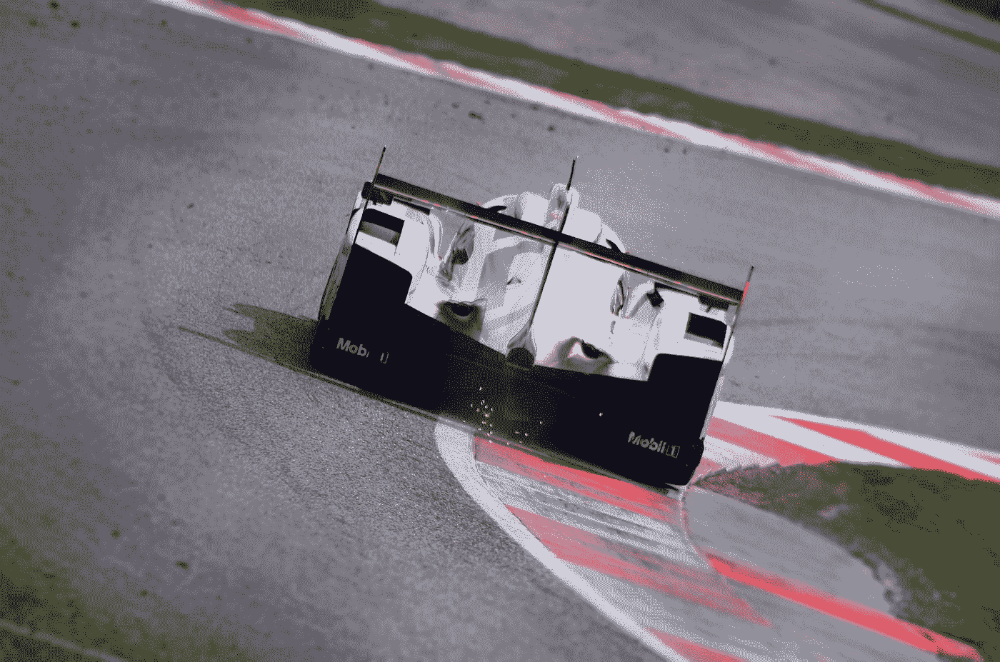
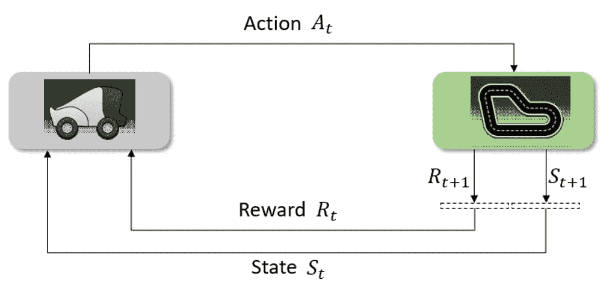
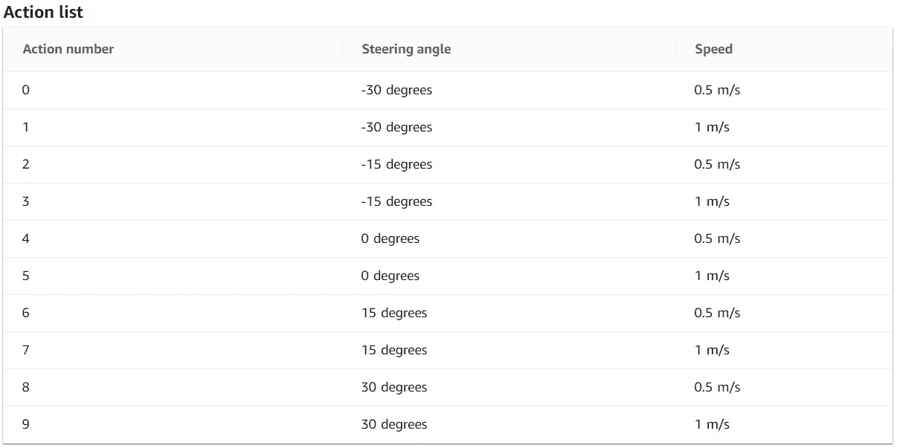
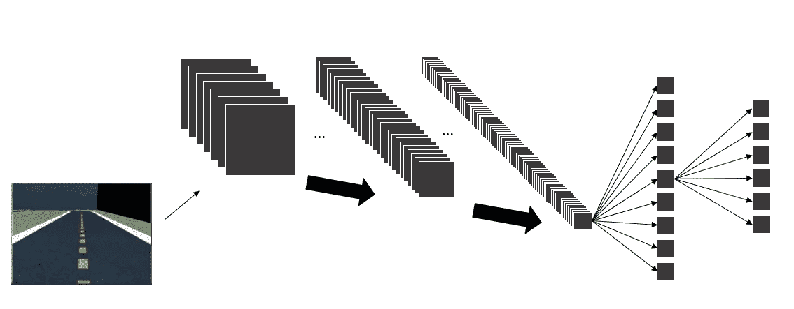

# 自主赛车中的强化学习

> 原文：<https://towardsdatascience.com/reinforcement-learning-in-autonomous-race-car-c25822def9f8?source=collection_archive---------25----------------------->

## “邀请所有有志 RL 从业者”系列第 2 集

菲利普·维特在 [Unsplash](https://unsplash.com?utm_source=medium&utm_medium=referral) 上拍摄的照片

在本系列的[第一部分中，我们已经了解了强化学习(RL)中的一些重要术语和概念。我们还学习了 RL 在高层是如何工作的。](/invitation-to-all-aspiring-reinforcement-learning-practitioner-5f87384cee67)

在我们深入研究 RL 背后的理论之前，我邀请你和我一起了解基于其超级酷的应用程序 AWS DeepRacer 的 RL。

# 什么是 AWS DeepRacer？

AWS DeepRacer 是一款 1/18 比例的自主赛车，旨在通过在物理赛道上比赛来测试 RL 模型。AWS DeepRacer 中有三种比赛类型:

1.  计时赛——代理在没有固定障碍物或移动竞争者的标记清晰的跑道上与时间赛跑。
2.  物体回避——车辆在双车道轨道上行驶，轨道上放置了固定数量的固定障碍物。
3.  短兵相接的比赛——车辆在双车道赛道上与其他行驶中的车辆进行比赛。

# AWS DeepRacer 中的强化学习

我假设你熟悉 RL 在高层是如何工作的。如果您不知道，请查看本系列的第一篇文章以了解更多信息。

RL 如何在 AWS DeepRacer 中工作的基本想法。[图片由作者提供]

在 AWS DeepRacer 中，我们希望我们的车辆( *agent* )在赛道(*环境*)中独自比赛，同时获得最大的累计总奖励，以便我们可以实现我们的目标——赢得与时间的比赛，或避开所有障碍，或赢得与另一辆车的比赛。

> 因此，它被归类为一个阶段性任务，其最终状态可能是终点线或脱离轨道。

国家呢？这里，状态是由车辆上的前置摄像头捕获的图像。车辆将以大约 15 fps 的速度拍摄图像(160x120)。

杰克·布吕克在 [Unsplash](https://unsplash.com?utm_source=medium&utm_medium=referral) 上拍摄的照片

在现实驾驶体验中，我们可以“平稳”地控制速度和转向角度，而在这里，我们只能“艰难”地控制它们。换句话说，动作空间是一组离散的动作。

> 需要注意的是:动作空间越细，模型收敛的时间就越长。

AWS DeepRacer 行动空间示例。[图片来自 AWS DeepRacer 控制台]

至于奖励，它是由一个奖励函数返回的，这个函数只是一个 Python 函数，它将基于捕获图像的一些参数(*状态*)作为输入。AWS DeepRacer 中有几个重要参数:

1.  轨道上的位置
2.  标题
3.  航点
4.  磁迹宽度
5.  离中心线的距离
6.  所有车轮都在轨道上
7.  速度
8.  转向角度。

我们可以利用这些参数作为我们自己定义的奖励函数的输入。请参见[文档](https://docs.aws.amazon.com/deepracer/latest/developerguide/deepracer-reward-function-input.html)以了解所有可用参数的更多信息。

# 培训过程怎么样？

培训的目标是找出在所有可能的未来驾驶决策中，哪种状态下的哪种行动将导致最大的预期累积奖励。

> 换句话说，网络必须计算出车辆在每种状态下应该获得多少**速度**和**转向角**，这样我们才能获得**最大预期累积回报**。

杰克·吉文斯在 Unsplash 上的照片

## 但是……网络是什么？

在 MDP(马尔可夫决策过程)中，政策是在开始时给我们的，而在 RL 中不是。这里，我们利用神经网络(NN)来帮助我们创建一个策略网络。神经网络的输出是每个可能动作的概率。

在 AWS DeepRacer 中，NN 模型基本上是 CNN +前馈 NN，它接收来自特定剧集的经验(超参数)作为输入。一旦模型被训练，它将结果发送回代理以收集更多的经验。

神经网络架构。[图片由作者提供]

在训练过程中，网络将发现哪种行为更有可能给予更多奖励，这取决于熵超参数。熵(随机程度)告诉代理探索更多的动作，或者只利用已经被理解的动作。

> 熵越大，代理采取的行动就越随机。

根据探索-开发策略，车辆仍可能有小概率采取随机行动来探索环境。RL [这里](https://medium.com/@awjuliani/maximum-entropy-policies-in-reinforcement-learning-everyday-life-f5a1cc18d32d#:~:text=Entropy%20in%20Reinforcement%20Learning&text=With%20these%20kinds%20of%20policies,entropy%20of%20that%20probability%20distribution.&text=The%20greater%20the%20entropy%2C%20the,discrete%20probability%20distribution%20(p).)有一篇关于熵的好文章。

# 关于 AWS DeepRacer 的更多信息

AWS DeepRacer 令人兴奋的部分之一是车库。我们可以定义我们的车辆配置:要使用的传感器、动作空间(速度和转向旋转可变性)、车辆的颜色和车辆的名称！

# **最后的话**

照片由[安东·大流士](https://unsplash.com/@thesollers?utm_source=medium&utm_medium=referral)在 [Unsplash](https://unsplash.com?utm_source=medium&utm_medium=referral) 拍摄

恭喜你坚持到这一步！！

看完这篇文章，你应该知道 RL 是如何应用在自主赛车上的。请记住，我们的 RL 之旅仍处于早期阶段！我还有很多材料要和大家分享。所以，如果你喜欢这些内容，并想在接下来的两个月里继续和我一起学习，请关注我的媒体账号，以获得关于我未来帖子的通知！

我们将在下一篇文章中了解更多关于 RL 算法分类的鸟瞰图。[来看看](https://louisowen6.medium.com/birds-eye-view-of-reinforcement-learning-algorithms-landscape-2aba7840211c)！

# 关于作者

Louis Owen 是一名数据科学爱好者，他总是渴望获得新知识。他在印度尼西亚最好的大学之一[*Institut Teknologi Bandung*](https://www.itb.ac.id/)攻读数学专业，并获得了最后一年的全额奖学金。最近，2020 年 7 月，他刚刚以优异的成绩毕业。

Louis 曾在多个行业领域担任分析/机器学习实习生，包括 OTA(*)、电子商务( [*Tokopedia*](https://www.linkedin.com/company/pt--tokopedia/) )、FinTech ( [*Do-it*](https://www.linkedin.com/company/doitglotech/) )、智慧城市 App ( [*Qlue 智慧城市*](https://www.linkedin.com/company/qluesmartcity/) )，目前在 [*世界银行*](https://www.linkedin.com/company/the-world-bank/) 担任数据科学顾问。*

*去路易斯的网站了解更多关于他的信息吧！最后，如果您有任何疑问或需要讨论的话题，请通过 LinkedIn 联系 Louis。*