# 约翰·康威的强化学习

> 原文：<https://towardsdatascience.com/reinforcement-learning-in-honor-of-john-conway-5d15fb394c63?source=collection_archive---------49----------------------->

照片由[肯尼·罗](https://unsplash.com/@kennyluoping?utm_source=unsplash&utm_medium=referral&utm_content=creditCopyText)在 [Unsplash](https://unsplash.com/collections/9524181/go-players?utm_source=unsplash&utm_medium=referral&utm_content=creditCopyText)

## 为哲学家的足球创造一个人工智能球员

哲学家的足球是由已故的传奇数学家[约翰·康威](https://en.wikipedia.org/wiki/John_Horton_Conway)(病毒的另一个受害者)发明的棋盘游戏。为了纪念他，我建了一个网站，你可以在这里玩游戏，了解更多关于这个游戏的信息。

你可以在网上或本地找其他人一起玩，你也可以和一个人工智能玩家对战来感受游戏。虽然在写这篇文章的时候，人工智能还在训练中——可能需要几个星期才能有所进步。

我今天的目标是快速解释这个游戏，并涵盖足够的强化学习基础知识，以解释我正在使用的 TD(λ)算法的定制修改，我称之为交替 TD(λ)。顺便说一下，TD 的意思是“时间差异(学习)”，而λ是一个超参数，用于设置“资格轨迹”的衰减(类似于动量)。这些将在下面解释。

在 PyTorch 中实现是从零开始的，你可以在 [Github](https://github.com/rcharan/phutball) 上找到代码。我选择不使用像 OpenAI Gym 这样的强化学习框架，因为算法相对简单。对于一个定制的“环境”(例如游戏)和修改的算法，框架增加了比它们解决的更多的复杂性。

作为背景，我假设你熟悉 PyTorch 和神经网络的一些基础知识，特别是它们是什么以及在随机梯度下降(SGD)(带动量)中使用的反向传播。当前的实现使用了残差(卷积)神经网络，本质上是一个较小版本的 [ResNet](https://arxiv.org/abs/1512.03385) ，但这对理解本文并不重要。没有强化学习的先验知识。

本文的其余部分简要介绍了这个游戏，然后进入强化学习的基础。从那里，它涵盖了时间差异学习和资格跟踪的基础。最后，它涵盖了我在一个对称的双人棋盘游戏中使用的修改，我称之为交替 TD(λ)。

# 哲学家的足球

我在[哲学家.足球](http://philosophers.football)为这个游戏建了一个网站，所以你可以亲自体验一下。言语不能公平对待一切。要有感觉，你可以阅读规则，然后在沙盒模式下玩(对自己)，或者对像 RandoTron 这样的基线机器人，他总是随机玩。

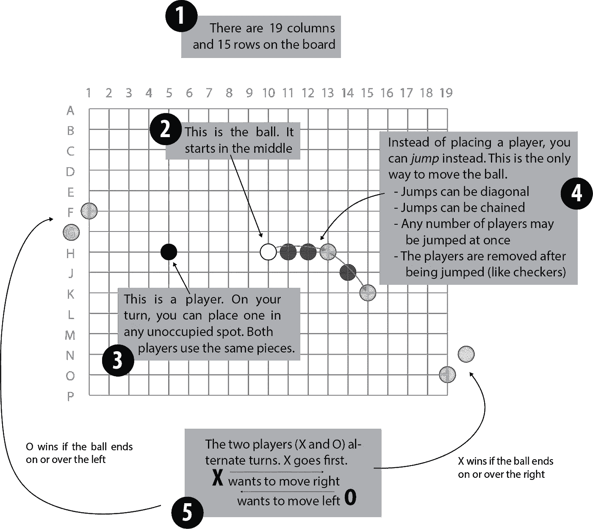

否则，这里有一个精简版的规则，删除了一些细节。在一个像围棋棋盘一样的 19x15 的棋盘上(通常用于游戏)，放置石头。只有一块白色的石头，球。黑石是“玩家”。两个对手传统上被称为 X 和 O。X 和 O 都可以放置一个球员或在他们移动时将球跳过一些球员。如果球停在或越过最右边的一栏，x 获胜；o 赢在左边。

这个游戏是约翰·康威在剑桥玩的，并在一本名为 [*的书中描述了数学游戏*](https://en.wikipedia.org/wiki/Winning_Ways_for_your_Mathematical_Plays) *的获胜方式。*它是以一个搞笑的[巨蟒剧团的小品](https://www.youtube.com/watch?v=LfduUFF_i1A)命名的。康威最出名的可能是他的生命游戏和有限单群的分类工作，但是他一生中还做了许多其他有趣的事情！

当我读到康威的病毒消亡时，在考虑强化学习问题之前，我选择了这个游戏。但是这个游戏后来被证明有一个非常有用的对称性，这将大大简化下面讨论的强化学习。

考虑这样一种情况，你扮演 X，该你走了。你要考虑 O 对你的行动的反应。在你移动之后，轮到 O。现在，如果我们*将棋盘转到*的位置，又轮到你了，你向右打(如 X)。因为两个玩家使用完全相同的棋子，所以理解如何评估你作为 X 面对的位置与理解你作为 o 面对的位置是完全相同的。

这与井字游戏、国际象棋或围棋等游戏略有不同，例如，在这些游戏中，你可能想在你移动之后使用你对位置*的评估来告知你有多喜欢在你移动*之前的位置*(反之亦然)。有其他方法来解决这个问题，但哲学家的足球有这个很好的对称性，消除了它。*

# 强化学习基础

我在这一节的目标不是写一篇关于强化学习的完整介绍。相反，我的目标是“尽可能简单，但不要更简单”,因为我们解释(交替)TD(λ)算法的目的有限。特别是(对于那些了解内情的人来说)，一个两人输赢的游戏不需要奖励( *R* )或者折扣率(γ)，所以我会假装这些不存在。游戏不是随机的，所以只处理确定性的情况。我们也不会谈论 Q 学习或政策梯度。

## 国家(*年代*)

这是设置。对我们来说有状态 *S.* ，每一个都是假设 X 要移动的棋盘位置。我们可以假设 X 按照上面讨论的对称性移动。如果只计算游戏还没有结束的状态，可能的状态(#S ≈ 10⁸⁸)比宇宙中的原子要多得多。当然，大多数状态在实际游戏中是不太可能出现的。

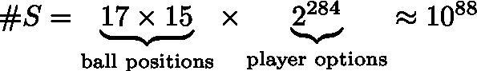

还有两种游戏结束的“终结”状态。一个用于 X 获胜的情况，一个用于 o。导致两者之一的所有位置(分别)是相同的。

## 时间(吨)

现在一个游戏由不同时间的一系列状态组成。将时间标记为 *t* ，游戏开始时 t=0，第一步棋后 t=1，依此类推。此外，让 t=∞表示游戏的结束(尽管它实际上并不花费无限的时间)。

我们将用下标表示不同时刻的状态。例如，Sₒ是游戏开始时的状态。同样，下标 1、t 或∞。

## 行动(一)

给定一个状态 S，有一组可能的行动(移动)可以由轮到它的玩家采取(再次，我们将总是考虑 X 来玩)。表示这组动作 *A(S)* ，因为它取决于状态。单个动作将用小写字母表示为 *a.*

在上下文中，一个动作或者是放置一个棋子(最大可能的 19⨉15–1=284)，或者是一个可用的跳转(如果你适当地安排棋子，可能有很多可能的跳转)。对于一个终端状态(游戏结束)，动作集合将被视为空。

和以前一样，我们将使用下标来表示给定时间的动作集，或在给定时间采取的动作。例如，Aₒ = A(Sₒ)是开始时可能的动作的集合(284 个可能的位置，没有可能的跳跃)。同样， *a* ₒ是在时间 0 采取的动作，即第一步动作。

## 政策(π)

政策 *π* 是玩游戏的核心意义。给定一个状态 S，你必须选择一个要采取的行动！

现在，即使在像“哲学家的足球”这样确定的完美信息游戏中，政策也可能是随机的(有点随机)。考虑一下“约翰·康威会演奏什么”的政策。换句话说，给定一个状态 S，X 要移动，约翰·康威会怎么移动？不管是什么，放那个。

现在，这个康威政策并不简单(祝你在电脑上评估它好运)。但这肯定是一项政策。⁴:它也不是决定性的。(大多数)人并不总是在相同的位置做出相同的动作。这首先会很难记住，其次会很无聊。

因此，我们将认为该策略是一个函数 *π(a|S)* 给出采取行动 *a* 的*概率*，给定状态 S。注意，我们必须知道行动 *a* 是合法的行动( *a∈ A(S))。*此外，不会为终端(游戏结束)状态定义策略功能。

现在做事情，非确定性往往会让事情变得更复杂，而不会更有启发性。因此，请随意考虑策略函数只是将一个状态作为输入，并将一个动作作为输出的情况。

## 价值函数

有一个值函数 *v(S)* 将状态 S 作为输入并返回“值”在我们的例子中，这个值将是玩家获胜的概率。它的值介于 0 和 1 之间。

我们还必须加上一个限制，即在两个终端(游戏结束)状态下评估的价值函数在 O 获胜时总是 0，在 X 获胜时总是 1。(这是因为我们可以假设我们总是根据对称性来计算 X)。

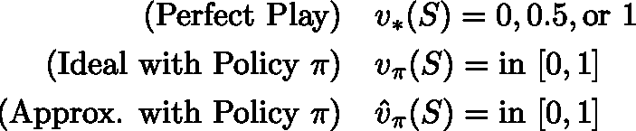

现在，价值函数有几种风格(在左边)。在确定性完全信息博弈中的完美博弈中，博弈必然以 X 赢、输或无限循环结束，我们称之为有价值的平局。出于我们的目的，我们可以假设第三种情况永远不会发生。

给定一个策略π，假设对手也在玩同样的策略，有一个“*理想*”函数，正好决定了获胜的概率，一个 0 到 1 之间的数。如果策略是确定性的，获胜的概率要么是 0，要么是 1(忽略平局情况)。

不幸的是，如果我们知道如何完美地演奏，就没有必要训练计算机来演奏了。此外，理想函数在计算上很难处理:

1.  如果它是一个有输入/输出值的简单表格，那么每个状态都必须有一个条目，其中大约有 10⁸⁸——比宇宙中的原子还多。
2.  没有任何已知的数学函数可以简化计算(尽管你可以试着找到一个)。
3.  最后，我们可以通过模拟(玩游戏)精确地计算出理想函数。但是如果π是随机的，这将花费太长时间来得到一个精确的答案。
4.  如果π是确定性的，那么理想函数仍然不会有用，因为它不会告诉我们如何*学习，*也就是让π变得更好。

因此，取而代之的是，我们将使用*近似*值函数，此后我们仅将其称为 *v* 。最常见的是，近似值函数可以用神经网络来实现，这就是我们要做的。

## 学问

到目前为止，我们所做的就是建立一个上下文和一些符号。我们还没有描述我们的 AI 玩家将如何*学习*来玩一个更好的策略。(当然)有多种算法可以做到这一点。粗略地说，学习算法可以尝试直接学习策略函数π(策略梯度)。它可以尝试学习决定哪些行动是最好的(Q-learning)。或者它可以只学习价值函数——简单地学习一个职位有多好。我们只讨论最后一种情况。

在这种情况下，给定一个价值函数 *v* ，我们可以让我们的政策“选择一个我们认为对我们最有利的结果。”特别是，由于我们的博弈是确定性的，选择一个动作 *a* 就相当于在时间 t+1 选择下一个状态 S。因此，稍微滥用符号，将π视为从状态到动作的简单函数:

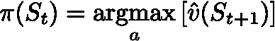

在π(a|S)符号中，如果 *a* 是最佳移动，则π为 1，否则为 0。

注意，我们暂时忽略了处理在 X 之后是 O 的事实，我们说过所有的状态都假设 X 是 0。目前，价值函数在概念上是 X 对他们获胜可能性的估计，给定状态 S *包括*关于谁要移动的信息。

## 概述

我们的 AI 玩家遵循某种策略π，它在时间 *t* 采取状态 *S* 并确定一个动作(移动)*a–*或者给出单个移动或者每个移动的概率*。*还有一个价值函数 *v* 来估计我们在给定状态下，遵循策略π时获胜的概率。反过来，如果π是“选择最佳移动”(或几个最佳移动的概率分布)，那么我们可以将 *v* 视为一等对象，并从中导出π。我们的学习问题简化为一个很好的估计

以下是我们定义的符号及其简要解释。

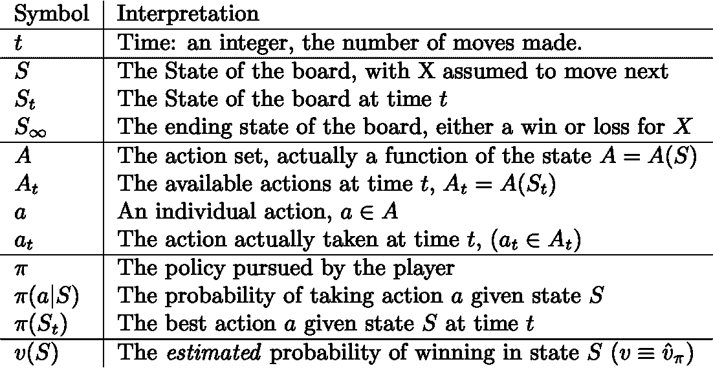

# 时间差异学习:TD(0)

所以我们已经建立了强化学习的基本环境。我们的目标是估计一个价值函数 *v.* 在每一步，人工智能玩家只需选择产生最佳结果值(即获胜概率)的一步。这是一种确定性策略，但是我们可以通过给出前 3 或 5 步的概率分布或其他方法来使它变得随机(不那么无聊)。

现在我们要如何学习 *v* ？现在，让我们考虑这样一种情况，即 *v* 仅仅是一个巨大的表，其中包含所有可能的状态及其值。这里在计算上是不可能的，但是概念上很简单。

下面是我们可以对学习算法进行升级的列表，从显而易见的开始，向聪明的方向前进。

1.  评估 *v(S)* 的最简单方法是采用确定性策略。给定一个状态，玩游戏，看看谁赢。
2.  如果策略不是确定性的，我们可以模拟一些游戏，从每一步的概率分布中取样。总的来说，我们将产生一个可能的游戏样本，我们可以用它来估计获胜的概率。这些被称为*蒙特卡罗*方法。
3.  我们可以利用这样的事实:在从状态 *S* 移动 *a* 导致新的状态 Sʹ *，*之后，我们已经知道了新的值 v(Sʹ).为了保持一致，如果我们做出最佳选择，我们希望 v(S) = v(Sʹ).这被称为*自举*(见下面的等式)。不要与来自统计学或 web 框架的术语相混淆。
4.  一般来说，我们可以混合搭配选项(2)和(3):我们可以模拟出 3 个步骤，然后自举，或做两者的线性组合。

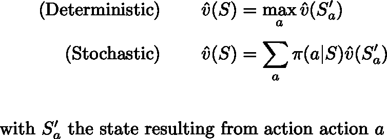

用 TD(0)自举价值函数估计

选项 3，时间差异学习也称为 TD(0)，是*学习*真正发挥作用的地方。我们经历了一系列的状态，每一步我们都更新我们对 v(S)的估计，以匹配我们对 v(Sʹ).的估计一般来说，我们从一个用随机数或零初始化的表开始，并用学习速率α进行更新。我们引入一个*时间差δ* 并进行如下更新:

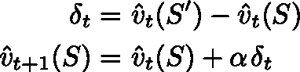

用学习率α更新时间差

仔细注意下标。我们的价值函数 *v* 现在在每个时间步都发生变化，所以我们必须跟踪我们在哪个时间步进行评估。

## 政策外学习

如果我们的机器人只是一遍又一遍地玩同样的动作，所有这些都会很无聊。它需要尝试不同的动作，看看他们是否有任何好处。这被称为*勘探-开发*权衡，涉及的内容很多，所以我就不多谈了。

我们的 TD(0)算法的一个好处是，当我们与机器人对弈并学习近似值函数 *v* 时，我们可以随机移动而不进行更新。这使得尝试新动作变得非常简单。蒙特卡罗方法遇到了问题，因为你必须在政策下模拟整个游戏来了解它们。如果你在中间做了一个随机的(很可能是坏的)移动，你必须试着弄清楚它如何影响你对早期移动的估计。这是可能的，但也有不好的一面(主要是高方差)。

## 使用神经网络

上面我们考虑了函数 *v* 只是一个数值表的情况。为了更新 *v(S)* ，我们只需改变表中的值。如上所述，这种表格方法在计算上对于哲学家的足球是不可能的。所以我们需要将 *v* 升级为神经网络。它将把状态的某种表示作为输入，如一个张量或一列张量。并且它将产生 0 和 1 之间的数字作为输出。我们需要在每次 *t.* 时添加一组参数(网络权重) *w* ，因此我们将 *v* 的定义阐明为如下所示:

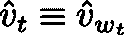

我们需要修改我们的更新算法以使用反向传播:

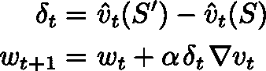

基于神经网络的时间差分学习

请注意以下几点:

*   我们使用梯度*上升*。我们想要使 v(S) *更接近*v(sʹ)，而不是最小化它的值(如在标准随机梯度下降中)。这一更新的结果是:

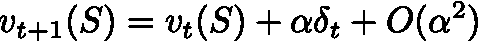

*   如往常一样，梯度∇v 是 v 在时间 *t* 相对于参数 *w* 的(分量)导数，在预先存在的 *w* 和 *S* 处评估。
*   在更新之后，不能保证在任何其他状态下评估 v。希望神经网络学习一种状态表示，使其能够概括，就像在任何其他应用中一样。

# 合格痕迹:TD(λ)

在随机梯度下降中，资格轨迹本质上是动量，但在强化学习中，它们被不同地激发并有不同的解释。它们允许我们保持 TD(0)算法的简单性，但获得使用蒙特卡罗方法的好处。

具体来说，TD(0)受到我们同时学习整个值函数的问题的困扰。所以 v(Sʹ)可能不是对 v(S)的一个好的估计。特别是，在移动到 Sʹ后，人工智能玩家移动到另一个州，称之为 Sʹʹ.如果 v(Sʹ)不是对 v(Sʹʹ)的好估计，那么它也不是对 v(S)的好估计。蒙特卡洛方法通过在整个游戏结束后进行更新来解决这一问题，但在处理不符合政策的移动时又会受到影响。

资格追踪是解决方案。类似于随机梯度下降中的动量，我们将轨迹 *z (* 初始化为 0)添加到我们的算法中，并且具有衰减参数λ < 1。我们在时间 *t:* 得到更新

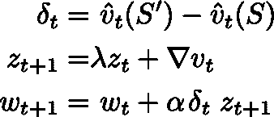

轨迹匹配组件的参数 *w* 组件。所以如果 *w* 是一个向量，那么 *z* 就是一个长度相同的向量。同样，用“张量”代替矢量，用“形状”代替长度。同样的还有“张量列表”和“相应的形状列表”

值得考虑一步步会发生什么。让我们从时间 t=0 开始进行更新。仔细理解我们的衍生品是基于当前状态评估的

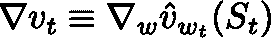

在我们的第一步中，我们得到以下更新(z 被初始化为 0):

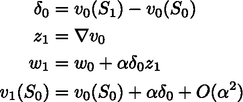

TD(λ)在时间 0 更新

与之前一样，更新 *v(S)* 以匹配 *v(Sʹ)* 。差异出现在下一步:

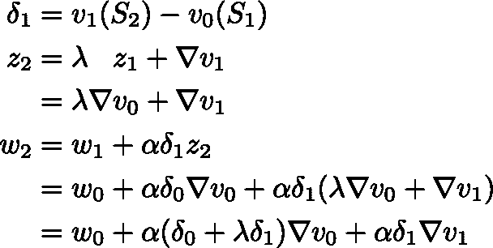

时间 1 的 TD(λ)更新

这就好像我们回到过去，在时间 0 更新未来，还不知道， *v(Sʹ)* 和 *v(Sʹʹ)* 的区别！适当地用因子λ折现。

请注意，这两个导数是在不同的时间用不同的参数和输入进行评估的。这意味着我们无法为由此产生的 *v(Sₒ).写下任何有启发性的表达*

我们算法的最后一点是，如果我们做出一个关闭策略动作，我们应该将跟踪清零。未来头寸的价值不再能为我们过去的行动提供信息。

## 概述

我们引入了更多新的符号。通过对标准内容的简单重复，我们得到了以下总结:

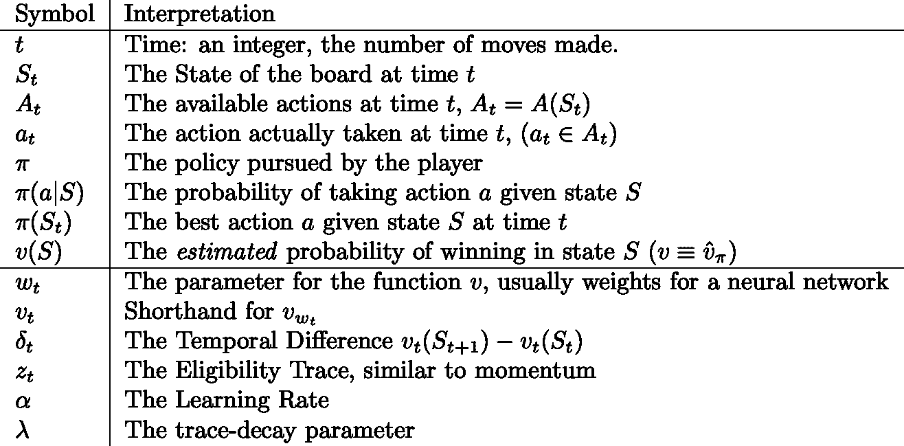

# 交替 TD(λ)

这篇文章的要点是需要对 TD(λ)稍加修改，以说明这个游戏是一个双人游戏。有各种各样的方法来处理这个问题，但哲学家足球的对称性使它非常干净。

具体来说，让我们将状态 S 解释为代表棋子的排列，并假设 X 将要出牌。然后 *v* 评估 X 获胜的概率。使用 a 表示电路板已经翻转。现在忽略参数更新，当 AI 玩家移动时，我们有以下的转换

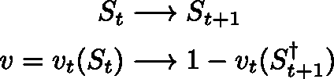

状态和获胜概率的变化

特别是，在游戏之后，如果我们将棋盘转过来，那么获胜的概率就变成了 1- *v.* 这就需要对算法进行一些修改。

另一个变化是必须考虑到，在评估完成的同时计算导数是可取的。在教科书 TD(λ)算法中，我们隐含地首先对状态进行正向评估以选择一个移动，然后计算相对于旧状态的导数。这显然是浪费。我们一个步骤的完整算法现在变成了:

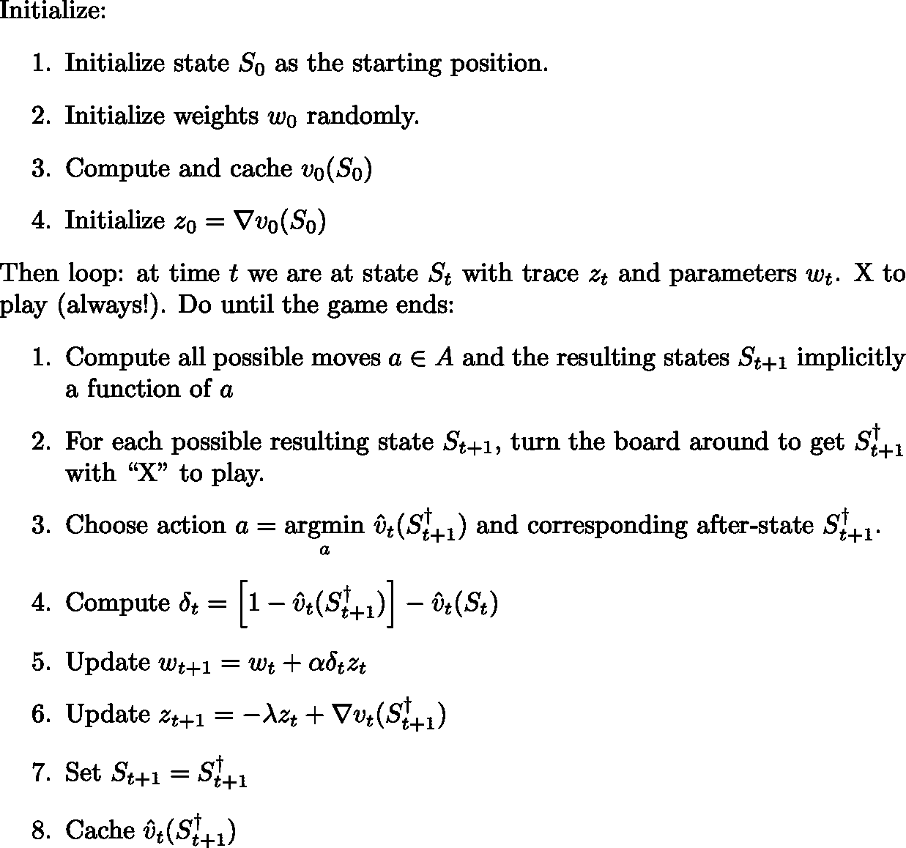

棘手的部分是第 6 步中的减号！这就是我称之为交替 TD(λ)的原因。我们基于时间 t+1 和 t 之间的值差在时间 t 进行更新。如果在时间 t+2，我们意识到我们的 t+1 值被低估(因此δ为负)，我们需要*增加*我们在时间 t 对状态 S 的值估计。因此梯度的交替符号说明交替的参与者。

# 结论

希望你已经很好地了解了强化学习以及双人游戏的额外复杂性。如果你还没有，在[哲学家.足球](http://philosophers.football)玩这个游戏。人工智能玩家仍在训练，但你可以和另一个人类对战。

[1]我不确定算法是否原创。我根据教科书上的描述在[萨顿和](http://incompleteideas.net/book/the-book-2nd.html)巴尔托。

[2]爱因斯坦的释义。

[3]首先，因为不可能有足够多的游戏来达到所有这些状态。第二，因为任何一个稍有能力的玩家早在达到这些状态之前就已经赢了。

[4]从技术上来说，要很好地定义这个策略，我们应该在状态变量中包含人类所必需的所有信息:一天中的时间，他们是否饥饿，水星是否逆行，房间里有多少只猫，他们的对手是否戴着黑帽子，他们是否相信此刻的选择公理，等等。但这种技术性不会影响主要论点。