# 强化学习变得简单(第 1 部分):基本概念和术语介绍

> 原文：<https://towardsdatascience.com/reinforcement-learning-made-simple-part-1-intro-to-basic-concepts-and-terminology-1d2a87aa060?source=collection_archive---------1----------------------->

## [入门](https://towardsdatascience.com/tagged/getting-started)，直观强化学习系列

## 简明易懂的马尔可夫决策过程应用指南

由 [Philippe Murray-Pietsch](https://unsplash.com/@pmpietsch?utm_source=medium&utm_medium=referral) 在 [Unsplash](https://unsplash.com?utm_source=medium&utm_medium=referral) 上拍摄的照片

在过去的几年里，你可能已经开始听到更多关于强化学习的事情，自从 AlphaGo 模型在复杂的围棋比赛中击败当时的世界冠军，震惊世界以来，alpha Go 模型就是使用强化学习训练的。

在一系列文章中，我将回顾强化学习(RL)的基础知识以及一些用于解决 RL 问题的最流行的算法和深度学习架构。我们将努力以尽可能直观的方式来理解这些原理，而不要过多地探究数学理论。

以下是本系列文章的简要总结。我的目标是不仅要理解事物是如何工作的，还要理解它为什么会这样工作。

1.  **基本概念和术语介绍—本文** *(什么是 RL 问题，以及如何使用马尔可夫决策过程和概念(如回报、价值和政策)中的技术将 RL 问题解决框架应用于该问题)*
2.  [解决方案方法](/reinforcement-learning-made-simple-part-2-solution-approaches-7e37cbf2334e) *(热门 RL 解决方案概述，并根据这些解决方案之间的关系进行分类。贝尔曼方程的重要提示，它是所有 RL 算法的基础。)*
3.  [无模型算法](/reinforcement-learning-explained-visually-part-3-model-free-solutions-step-by-step-c4bbb2b72dcf) *(基于价值和基于政策的解决方案的异同，使用迭代算法逐步提高预测。剥削、探索和贪婪的政策。)*
4.  [Q-Learning](/reinforcement-learning-explained-visually-part-4-q-learning-step-by-step-b65efb731d3e)**(深入分析这个算法，这是后续深度学习方法的基础。发展直觉，了解为什么这个算法会收敛到最优值。)**
5.  *[深度 Q 网络](/reinforcement-learning-explained-visually-part-5-deep-q-networks-step-by-step-5a5317197f4b) *(我们的第一个深度学习算法。一步一步地演示它是如何工作的，以及为什么做出那些架构选择。)**
6.  *[策略梯度](/reinforcement-learning-explained-visually-part-6-policy-gradients-step-by-step-f9f448e73754) *(我们第一个基于策略的深度学习算法。)**
7.  *演员评论家*(复杂的深度学习算法，结合了 Deep Q 网络和策略梯度的优点。)**
8.  *惊喜话题😄*(敬请期待！)**

# *RL 概述*

## *RL 在机器学习的世界中处于什么位置？*

*通常，当人们提供 ML 的概述时，他们首先解释的是它可以分为两类，监督学习和非监督学习。然而，还有第三类，即。虽然它不像它的两个更迷人的兄弟姐妹那样经常被提及。*

*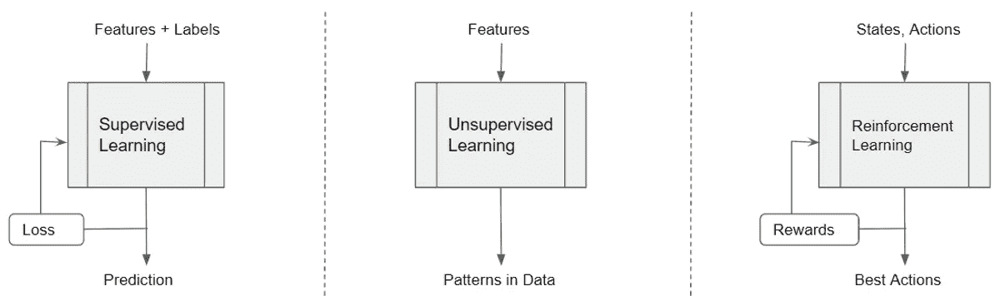*

*机器学习可以分为监督学习、非监督学习和强化学习(图片由作者提供)*

*监督学习使用标记的数据作为输入，并预测结果。它接收来自作为“监督者”的损失函数的反馈。*

*无监督学习使用未标记的数据作为输入，并检测数据中的隐藏模式，如聚类或异常。它不接受来自主管的反馈。*

*强化学习通过与外部世界互动来收集输入和接收反馈。它输出与世界互动时需要采取的最佳行动。*

## *RL 与监督(或无监督)学习有什么不同？*

*   *没有监督人指导训练*
*   *你不用一个大的(有标签的或无标签的)预先收集的数据集来训练。相反，你的“数据”是通过你与之互动的真实世界环境的反馈动态提供给你的。*
*   *你在一系列的时间步骤上迭代地做出决策，例如，在一个分类问题中，你在数据输入上运行一次推理来产生一个输出预测。通过强化学习，你可以反复进行推理，在真实世界的环境中导航。*

## *RL 是用来解决什么问题的？*

*RL 不是典型的 ML 问题，如分类、回归、聚类等，而是最常用于解决不同类别的现实世界问题，如控制任务或决策任务，其中您操作与现实世界交互的系统。*

*   *例如，机器人或无人驾驶飞机必须学会从一个盒子中取出一个设备并将其放入一个容器中*

*它适用于各种应用，例如:*

*   *操作无人驾驶飞机或自动驾驶车辆*
*   *操纵机器人在环境中导航并执行各种任务*
*   *管理投资组合并做出交易决策*
*   *玩游戏，如围棋、象棋、视频游戏*

## *强化学习是通过反复试验实现的*

*在 RL 中，学习是通过反复试验从经验中进行的，就像人类一样。例如，婴儿可以触摸火或牛奶，然后从消极或积极的强化中学习。*

*   *婴儿采取一些行动*
*   *接收来自环境的关于该动作结果的反馈*
*   *重复这个过程，直到它知道哪些行动产生有利的结果，哪些行动产生不利的结果。*

*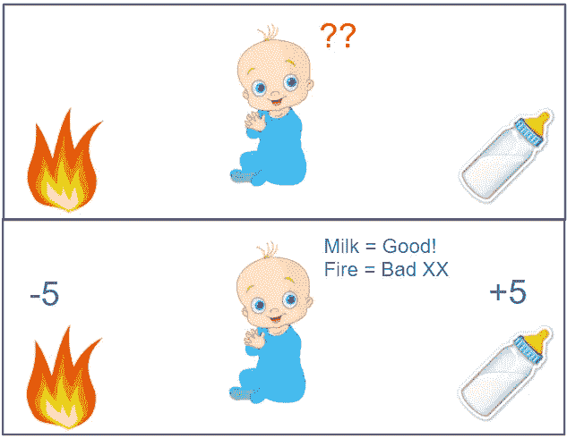*

*婴儿从正负强化中学习(图片由作者提供)*

# *要使用 RL，请将您的问题构建为马尔可夫决策过程*

*假设你想训练一个机器人。你会如何使用 RL 来解决这样的问题？*

*要应用 RL，第一步是将问题构建成一个叫做马尔可夫决策过程(MDP)的东西。如果你以前没有和 RL 合作过，很可能你对 MDP 的唯一了解就是它听起来很吓人😄。*

*所以让我们试着理解什么是 MDP。MDP 有五个组件，它们以明确的方式协同工作。*

*代理人:这是你操作的系统，比如机器人。这是您希望使用 RL 构建和训练的模型。*

***环境:**作为操作的一部分，代理与之交互的真实世界环境。例如，机器人必须导航的地形、其周围环境、诸如风、摩擦、照明、温度等因素。*

*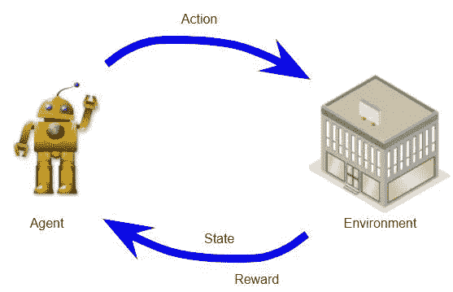*

*一个 MDP 有一个代理人，环境，状态，行动和奖励(图片由作者提供)*

***状态:**这代表当前任何一点的‘世界状态’。它可以捕捉机器人相对于其地形的位置，周围物体的位置，也许还有风向和风速。*

*可能有一组有限或无限的状态。*

***动作:**这些是代理在与环境交互时采取的动作。机器人可以右转、左转、前进、后退、弯腰、举手等等。*

*可能有一组有限或无限的可能动作。*

***奖励:**是行动者因其行动而从环境中获得的正面或负面强化。这是一种评估特定行为“好”或“坏”的方式。*

*如果向一个特定的方向移动导致机器人撞到墙上，那将会有负面的回报。另一方面，如果向左转使机器人找到了它需要捡起的物体，它会得到积极的回报。*

## *在定义您的 MDP 时，您应该记住什么？*

***代理和环境**:显然，第一步是决定您的代理的角色和范围，以及您试图解决的问题的环境。*

***状态**:接下来，您必须定义状态包含哪些数据点，以及它们是如何表示的。*

*重要的是，它捕获了解决您的问题所需的一切，以表示当前的世界形势，以便代理可以在不需要关于过去的信息或任何其他知识的情况下对未来进行推理。*

*换句话说，国家的定义应该是独立的。因此，举例来说，如果您需要了解一些关于您如何到达这个状态的信息，那么这个历史应该封装在您的状态定义本身中。*

***行动**:您的代理可以采取的一系列潜在行动是什么？*

***奖励**:这是代理人从经验中学习的方式。因此，这是您需要认真考虑的事情，因为以一种真正反映您希望代理学习的行为的方式来定义奖励是至关重要的。*

# *MDP 是如何工作的？*

*现在我们已经看到了什么是 MDP，我们将进入它是如何工作的。让我们用井字游戏作为一个简单的例子。两个玩家通过将他们的代币放在一个 3x3 的格子上来玩这个游戏。一个玩家放置零(甜甜圈形状)，而其他玩家放置十字。目标是通过将三个代币排成一行来赢得游戏。*

*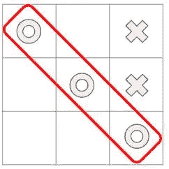*

*(图片由作者提供)*

## *您可以按如下方式定义 MDP:*

*   *代理人与环境对抗，所以环境充当它的对手。*
*   *任何一点的状态都是棋盘上所有标记的当前位置，包括代理和环境的标记。*
*   *有 9 种可能的操作，代理可以将令牌放在网格中 9 个可用方格的每一个上。*
*   *如果代理赢了，它会得到+10 点的正奖励，如果它输了，它会得到-10 点的负奖励。每一个中招给中性奖励 0 分。*

## *现在让我们来看看 MDP 在玩游戏时的操作。*

*代理在一系列时间步骤内与其环境进行交互。在每个时间步骤中出现一组操作流程，然后在每个时间步骤中重复该流程。*

*该序列从初始状态开始，该初始状态成为当前状态。例如，你的对手，环境已经把他们的令牌放在一个特定的位置，这就是游戏的开始状态。*

*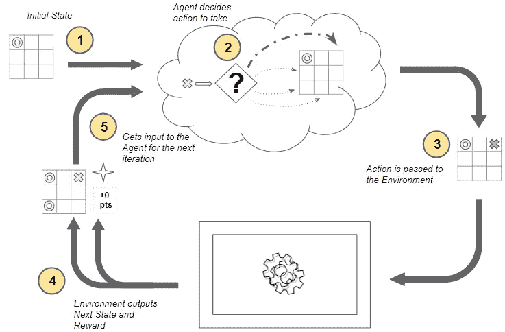*

*MDP 是如何工作的(图片由作者提供)*

*现在，从第一个时间步开始，每个时间步发生以下步骤:*

1.  *环境的当前状态被输入到代理。*
2.  *代理使用该当前状态来决定它应该采取什么动作。它不需要记住在它之前的国家和行动的全部历史。代理决定将其令牌放在某个位置。有许多可能的动作可供选择，那么它是如何决定采取什么动作的呢？这是一个非常重要的问题，但我们以后会谈到这个问题。*
3.  *该动作作为输入传递给环境。*
4.  *环境使用当前状态和选择的动作，并输出两件事——它将世界转换到下一个状态，并提供一些奖励。例如，它通过将令牌放在某个位置来采取下一步行动，并为我们提供奖励。在这种情况下，由于还没有人赢得游戏，它提供了 0 点的中性奖励。环境如何做到这一点对代理来说是不透明的，并且不在我们的控制之下。*
5.  *这种来自环境的奖励随后作为先前行动的结果被提供给代理人。*

*这完成了一个时间步骤，并使我们进入下一个时间步骤。这个下一个状态现在变成当前状态，然后作为输入提供给代理，并且循环重复。*

*在整个过程中，代理人的目标是最大化在给定状态下采取行动所获得的总回报。它不仅想最大化眼前的回报，还想最大化长期累积的回报。我们将很快回到这个话题。*

# *MDP 在一系列时间步长上迭代*

*这是 MDP 操作的另一个视图，显示了时间步骤的进展。*

*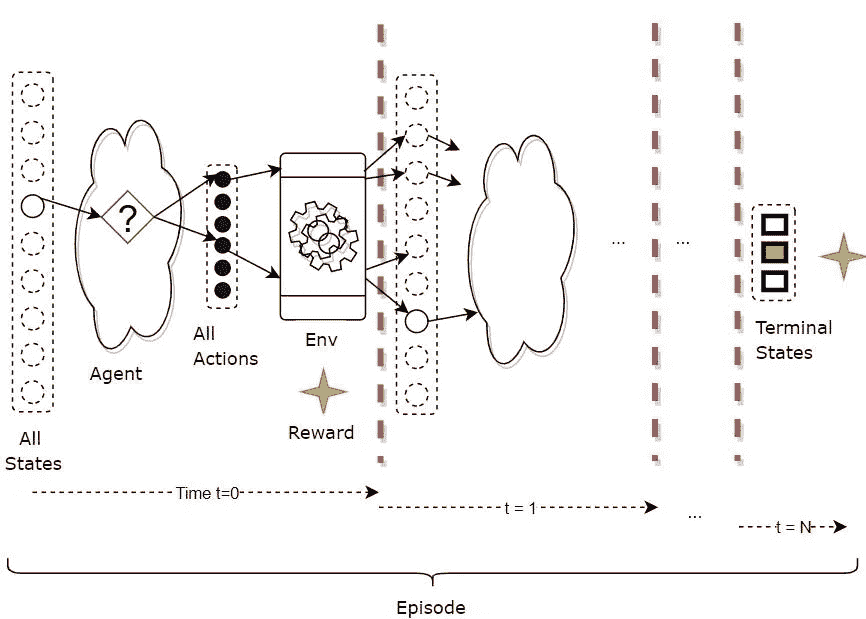*

*MDP 迭代一系列时间步骤(图片由作者提供)*

*在每个时间步骤中，会发生三件事——状态、行动和奖励，它们充分描述了在该时间步骤中发生的事情。*

## *轨迹描述了多个时间步的执行情况*

*因此，MDP 的执行可以描述为在一系列时间步骤上发生的轨迹(根据状态、动作、奖励)，如下所示。*

*(s3、a3、r4、s4、a4、r5、s5、a5、r6、s6)*

## *偶发任务以终止状态结束*

*对于具有明确定义的结束或终止状态的 RL 任务，从开始状态到结束状态的完整序列被称为情节。游戏的每一轮都是一集。*

*   *因此，在一集结束时，您可以重置到一个开始状态(或从一组开始状态中随机选择一个)并播放另一个完整的集，并重复。*
*   *每一集都独立于下一集。*

*因此，RL 系统的操作在多个事件中重复。在每一集里，它会重复多个时间点。*

*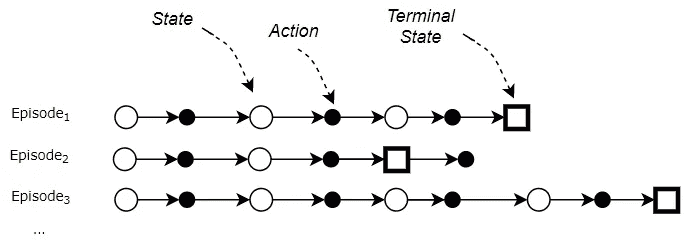*

*每集都以终结状态结束(图片由作者提供)*

## *持续的任务永远继续下去*

*另一方面，没有结束的 RL 任务被称为持续任务，可以永远继续下去(或者直到你停止系统)。持续管理生产或仓库自动化的机器人。*

# *主体和环境控制状态-动作转换*

*正如我们刚刚看到的，在每个时间步中，MDP 通过在代理做某事和环境做某事之间交替来运行:*

*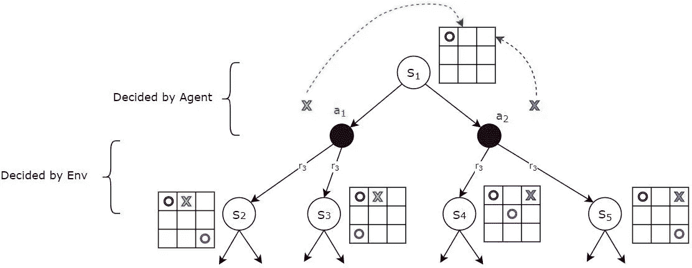*

*给定一个状态，代理决定动作。给定一个动作(和状态)，环境决定下一个状态。(图片由作者提供)*

*   *给定当前状态，下一个动作由代理决定。事实上，那是代理的唯一工作。例如，从当前状态，代理可以选择动作 *a₁* 或 *a₂* 来放置其令牌。*
*   *给定当前状态和代理选择的下一个动作，到下一个状态的转换和奖励由环境控制。例如，如果代理人选择了动作 *a₁* ，环境可以通过玩不同的移动转换到状态 *S₂* 或 *S₃* 。另一个视频游戏的例子可能是，从一个给定的状态(例如，角色站在屋顶上)开始，同一个代理动作(角色跳跃)可能以某种概率在一个以上的下一个状态中结束(例如，落在相邻的屋顶上，或掉到地上)，这是由环境控制的。*

## *环境如何过渡到下一个状态？*

*给定一个当前状态，以及代理选择的动作，环境如何计算出结果。下一个状态和奖励？*

*对于我们将要处理的大多数现实的 RL 问题，答案通常是“它就是这样”。大多数环境都有复杂的内部动态，当从特定状态采取行动时，这些动态控制着环境的行为。*

*例如，在股票交易 RL 应用程序中，股票市场环境有一系列看不见的因素决定股票价格如何变动。或者无人机导航 RL 应用中的环境取决于物理定律，这些定律控制各种地形和微天气条件下的气流、运动、热力学、能见度等。*

*我们的重点是培训代理，我们通常可以将环境视为外部黑盒。*

*注意，这个外部黑匣子可能是环境的模拟器。在许多情况下，建立一个模拟器可能是不实际的，我们将直接与真实环境进行交互。*

*然而，为了完整起见，让我简单地提一下，如果我们确实建立了这样一个环境模型，MDP 将把它表示为一个大的转移概率矩阵或函数。*

*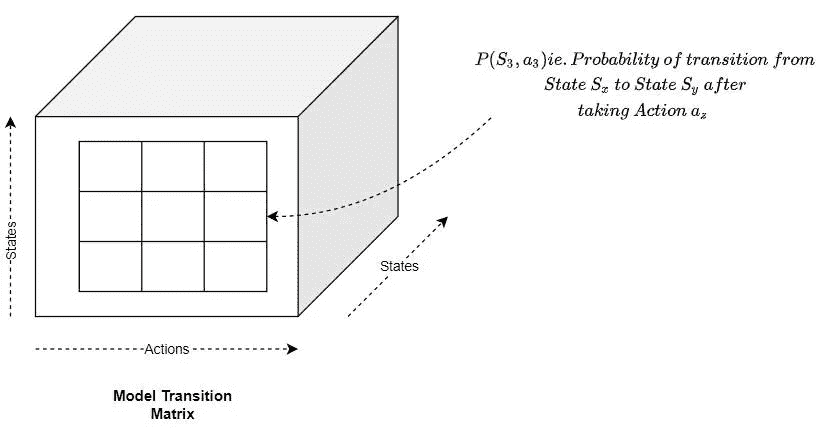*

*(图片由作者提供)*

*该矩阵将给定的状态和动作对映射到:*

*   *下一个状态，有一定的概率，因为我们可能以不同的概率结束。这就是所谓的转移概率。*
*   *奖励。*

## *代理如何选择动作？*

*另一方面，我们对代理如何决定在给定状态下选择什么动作非常感兴趣。事实上，这正是我们想要解决的 RL 问题。*

*为此，它使用了三个概念，我们将在下面探讨:*

*   *返回*
*   *政策*
*   *价值*

# *回报是所有时间步的总回报*

*当代理执行时间步长时，它会在每个时间步长累积奖励。*

*然而，我们真正关心的不是任何个人奖励，而是累积奖励。*

*我们称之为回归。它是代理在任务持续时间内累积的总奖励。*

*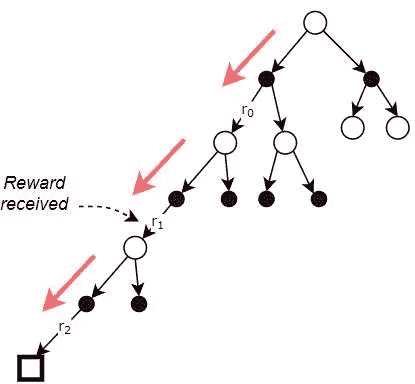*

*回报是在每个时间点收到的奖励的总和(图片由作者提供)*

## *使用折扣奖励计算回报*

*当我们计算回报时，我们不是简单地将所有的奖励相加，而是应用一个折扣因子γ来加权随时间推移的后续奖励。这些被称为折扣奖励。*

****返回= r₀ +γ r₁ + γ r₂****

*更一般地说:*

****Return = r₀ +γ r₁ + γ r₂ + …+ γ* ⁿ *r* ₙ***

*这样，当时间步数变得很大时，累积奖励不会无限增长(比如连续的任务，或者很长的情节)。*

*这也鼓励代理人更关心眼前的回报，而不是以后的回报，因为以后的回报会大打折扣。*

*代理人的最终目标是获得最大的回报，不仅仅是超过一集，而是超过很多很多集。*

*基于这个折扣，我们可以看到代理在评估奖励时考虑了两个因素。*

## *眼前的奖励比以后的奖励更有价值*

*第一点是，如果代理人必须在现在和以后获得一定数量的奖励之间做出选择，即时奖励更有价值。由于折扣系数γ小于 1，我们将对以后的奖励给予比直接奖励更多的折扣。*

*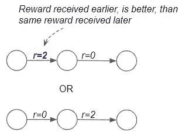*

*即时奖励比后期奖励更有价值(图片由作者提供)*

## *给我们最高总回报的奖励更好*

*第二点是，如果代理人必须在现在获得一些奖励和以后获得更大的奖励之间做出选择，更大的奖励很可能是更可取的。这是因为我们希望代理人关注总回报，而不是个人回报。在一盘棋中，代理人必须从两条路径中选择较好的一条。在第一个游戏中，它可以通过激进的打法在早期杀死一些棋子。这给了它一些直接的回报。然而，从长远来看，这使它处于不利地位，并失去了游戏。因此它最终会得到一大笔负回报。或者，它可以玩一套不同的走法，一开始回报较低，但最终赢得游戏。从而获得大量的积极回报。显然，第二种方法更好，因为它给出了更高的总回报，而不是更大的直接回报。*

*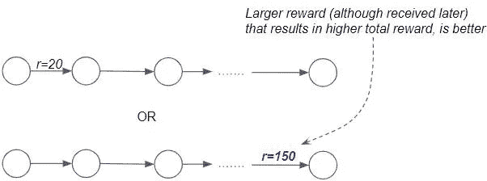*

*我们想获得更高的总奖励(图片由作者提供)*

# *策略是选择行动所遵循的策略*

*我们要讨论的第二个概念是政策。早些时候，我们推迟了一个非常重要的问题，那就是，在给定的状态下，代理如何决定选择哪个动作。代理可能会使用许多不同的策略:*

*   *总是随机选择下一步行动*
*   *总是选择已知奖励最高的下一个州*
*   *抓住机会，探索新的状态，希望找到一条更好的道路。*
*   *总是谨慎行事，避免负面回报的机会。*

*代理为决定在给定状态下选择哪个动作而遵循的任何策略都称为策略。虽然这听起来很抽象，但策略只是将给定的状态映射到要采取的操作。*

*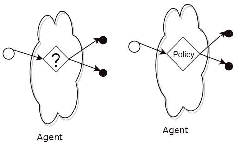*

*策略告诉代理从任何状态中选择哪个动作(图片由作者提供)*

## *政策就像一个(巨大的)查找表*

*您可以将策略视为一个(巨大的)查找表，它将状态映射到操作。*

*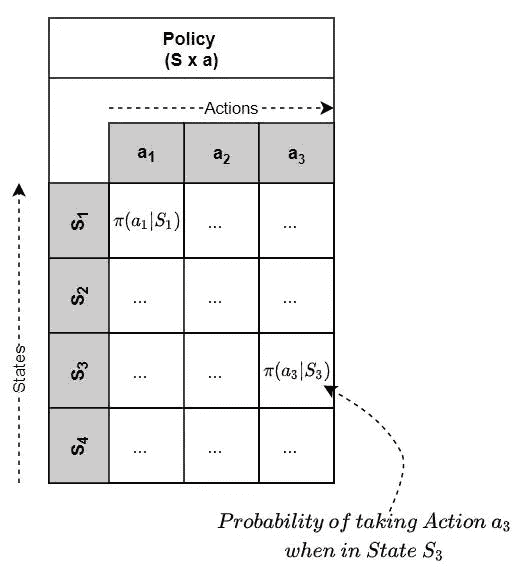*

*(图片由作者提供)*

*因此，给定当前状态，代理在表中查找该状态，以找到它应该选择的动作。*

*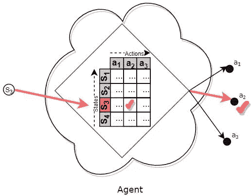*

*该政策就像一个(巨大的)查找表(图片由作者提供)*

*在实践中，对于真实世界的问题，有如此多的状态和如此多的动作，以至于使用一个函数，而不是一个查找表，来将状态映射到动作。*

*然而，直觉是一样的——把一个函数想象成一个“巨大的查找表”。*

## *确定性和随机性策略*

*策略可以是确定性的，也可以是随机的。*

*确定性策略是代理在达到特定状态时总是选择相同的固定动作的策略。*

*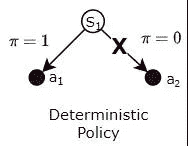*

*(图片由作者提供)*

*或者，随机策略是一种策略，其中代理人根据每个动作的某种概率，改变它为一个状态选择的动作。*

*例如，它可能会在玩游戏时这样做，这样它就不会变得完全可预测。在玩石头剪子布的时候，如果它总是玩同一个动作，对手可以发现这一点并轻松击败它。*

*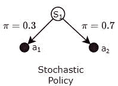*

*(图片由作者提供)*

## *代理如何获得保单？*

*我们一直在讨论这个策略，就好像代理已经有一个现成的策略可供使用一样。但事实并非如此。*

*就像人类婴儿一样，代理在开始时并没有真正有用的策略，也不知道在任何给定的状态下应该采取什么行动。然后，通过使用强化学习算法，它会慢慢地学习一个有用的策略。*

## *有这么多可能的策略，代理应该使用哪一个？*

*代理人从给定状态采取的行动决定了它获得的回报，因此随着时间的推移，最终的总回报。因此，代理人的目标是选择最大化其回报的行动。*

*换句话说，代理人的目标是遵循一个使其回报最大化的政策(这是它选择行动的方式)。*

*因此，在代理可以遵循的所有策略中，它想要选择最好的一个。回报最高的那个。*

*为了做到这一点，代理需要比较两个策略来决定哪一个更好。为此，我们需要理解价值的概念。*

# *这个值告诉你遵循一些政策的预期回报*

*假设代理处于特定状态。此外，假设代理不知何故得到了一个策略，π。现在，如果它从那个状态开始，并且总是根据那个策略选择行动，它能期望得到什么回报？*

*这就好比说，如果代理人从那个状态开始，并且总是根据那个政策选择行动，那么在很多很多集里，它的平均回报会是多少？*

*这种平均长期回报，或预期回报，被称为特定国家的价值，在政策π下。*

*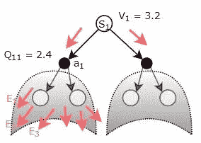*

*状态值(V)或状态-行动值(Q)是通过在许多情节中遵循给定的策略，分别从特定的状态或状态-行动获得的预期回报(图片由作者提供)*

*或者，代理可以从状态-动作对开始。它已经从一个特定的州采取了一个特定的行动。如果从那个状态-动作开始，它总是根据给定的策略π选择动作，那么它期望得到的回报是什么？*

*正如前面针对策略表所讨论的，我们可以将 Value 视为一个(巨大的)查找表，它将一个状态或状态-动作对映射到一个值。*

*因此，我们有两种价值:*

*   *状态值—通过执行基于给定策略π的操作，从给定状态开始的预期回报。换句话说，状态值函数将状态映射到它的值。*

*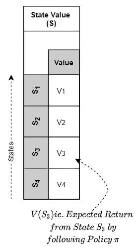*

*状态值函数将状态映射到其值(图片由作者提供)*

*   *状态-行动值(也称为 Q 值)—从给定状态采取给定行动，然后根据给定策略π执行行动的预期回报。换句话说，状态-动作值函数将状态-动作对映射到它的值。*

*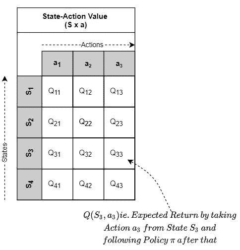*

*状态-动作值函数将状态-动作对映射到它的值(图片由作者提供)*

## *报酬、回报和价值之间的关系*

*   *奖励是单个行动获得的直接奖励。*
*   *Return 是该集结束前获得的所有折扣奖励的总和。*
*   *价值是许多集的平均回报(又名预期回报)。*

*把奖励看作是即时的快乐，把价值看作是长久的幸福😃。*

*人们可以直观地认为价值如下。像人类一样，代理从经验中学习。当它与环境互动并完成剧集时，它会获得每集的回报。*

*随着它积累更多的经验(即获得越来越多的剧集的回报)，它了解哪些状态以及这些状态中的哪些动作产生最多的回报。*

*它将这种“体验”存储为“价值”。*

## *为什么价值取决于我们遵循的政策？*

*显然，我们得到的回报(以及回报和价值)取决于我们在特定状态下采取的行动。由于操作取决于所选择的策略，因此值也取决于策略。*

*如果我们的政策是选择完全随机的行动(例如，从均匀分布中抽取行动样本)，那么一个状态的价值(预期回报)可能会很低，因为我们肯定没有选择最好的行动。*

*相反，如果我们的政策是从抽样时产生最大回报的概率分布中选择行动，那么一个状态的价值(预期回报)会高得多。*

# *使用值函数来比较策略*

*既然我们已经理解了价值，那么让我们回到我们之前关于比较两种策略来看看哪种更好的讨论。我们如何评价“更好”的含义？*

*给定两个策略，通过遵循策略并评估回报，我们可以为每个策略确定相应的状态值或状态动作值函数。*

*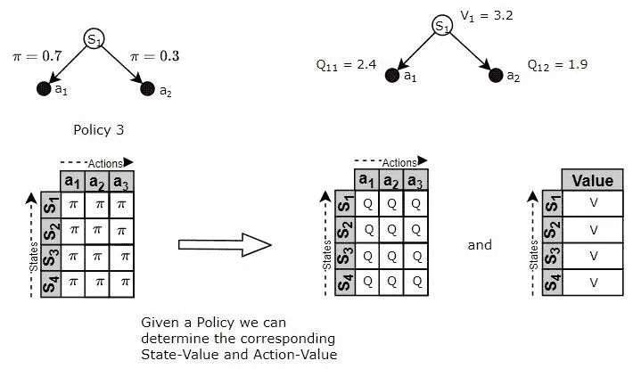*

*(图片由作者提供)*

*一旦我们有了各自的价值函数，我们就可以使用这些价值函数来比较策略。价值函数更高的政策更好，因为这意味着它将产生更高的回报。*

# *“最佳”策略被称为最优策略*

*因为我们现在可以比较策略来找出哪些是“好”的，哪些是“坏”的，所以我们也可以使用它来找到“最佳”策略。这就是所谓的最优策略。*

*最优策略是能给代理人带来比其他策略更多回报的策略。*

*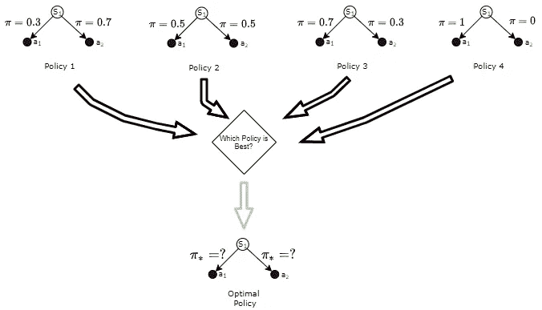*

*最优策略是优于所有其他策略的策略(图片由作者提供)*

# *通过寻找最优策略来解决 RL 问题*

*现在我们有了解决 RL 问题的方法。*

*我们把我们的问题构造成一个 MDP，然后我们可以通过构建一个代理来解决这个问题。MDP 的大脑，这样它就能决定采取什么行动。它应该以回报最大化的方式来做这件事。*

*换句话说，我们需要为代理人找到最优策略。一旦有了最佳策略，它就简单地使用该策略从任何状态中选择动作。*

*我们将应用强化学习算法来建立一个代理模型，并训练它找到最佳策略。找到最优策略实质上解决了 RL 问题。*

*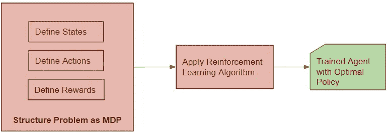*

*(图片由作者提供)*

*在本系列的下一篇文章中，我们将研究这些 RL 算法使用的解决方案。*

*最后，如果你喜欢这篇文章，你可能也会喜欢我关于变形金刚和音频深度学习的其他系列。*

* [## 直观解释的变压器(第 1 部分):功能概述

### NLP 变形金刚的简明指南，以及为什么它们比 rnn 更好，用简单的英语。注意力如何帮助…

towardsdatascience.com](/transformers-explained-visually-part-1-overview-of-functionality-95a6dd460452)  [## 音频深度学习变得简单(第一部分):最新技术

### 颠覆性深度学习音频应用和架构世界的温和指南。以及为什么我们都需要…

towardsdatascience.com](/audio-deep-learning-made-simple-part-1-state-of-the-art-techniques-da1d3dff2504) 

让我们继续学习吧！*