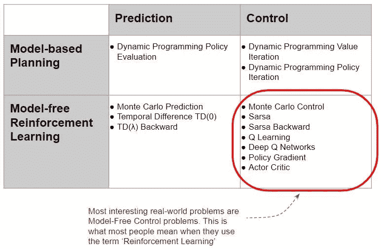
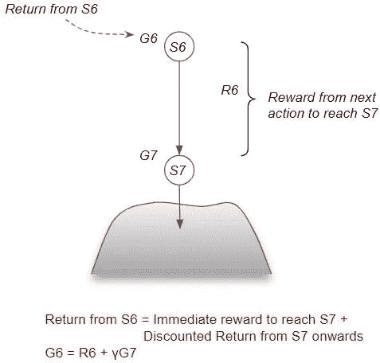

# 强化学习变得简单(第 2 部分):解决方法

> 原文：<https://towardsdatascience.com/reinforcement-learning-made-simple-part-2-solution-approaches-7e37cbf2334e?source=collection_archive---------4----------------------->

## 直观强化学习系列

## RL 解决方案的概述，以及如何对它们进行分类。用简单的英语从贝尔曼方程式中得出的重要结论

照片由[张秀坤镰刀](https://unsplash.com/@drscythe?utm_source=medium&utm_medium=referral)在 [Unsplash](https://unsplash.com?utm_source=medium&utm_medium=referral) 上拍摄

这是我关于强化学习系列的第二篇文章。既然我们已经了解了什么是 RL 问题，那么让我们来看看用来解决它的方法。

这里是对本系列之前和之后文章的一个快速总结。我的目标是不仅要理解事物是如何工作的，还要理解它为什么会这样工作。

1.  [基本概念和术语介绍](/reinforcement-learning-made-simple-part-1-intro-to-basic-concepts-and-terminology-1d2a87aa060) *(什么是 RL 问题，以及如何使用马尔可夫决策过程和概念(如回报、价值和政策)中的技术将 RL 问题解决框架应用于该问题)*
2.  **解决方案方法 *—本文*** *(概述流行的 RL 解决方案，并根据这些解决方案之间的关系进行分类。贝尔曼方程的重要提示，它是所有 RL 算法的基础。)*
3.  [无模型算法](/reinforcement-learning-explained-visually-part-3-model-free-solutions-step-by-step-c4bbb2b72dcf) *(基于价值和基于策略的解决方案的异同，使用迭代算法逐步提高预测。剥削、探索和贪婪的政策。)*
4.  [Q-Learning](/reinforcement-learning-explained-visually-part-4-q-learning-step-by-step-b65efb731d3e) 发展直觉，了解为什么这个算法会收敛到最优值。)
5.  [深度 Q 网络](/reinforcement-learning-explained-visually-part-5-deep-q-networks-step-by-step-5a5317197f4b) *(我们的第一个深度学习算法。一步一步地演示它是如何工作的，以及为什么做出那些架构选择。)*
6.  [策略梯度](/reinforcement-learning-explained-visually-part-6-policy-gradients-step-by-step-f9f448e73754) *(我们第一个基于策略的深度学习算法。)*
7.  演员评论家*(复杂的深度学习算法，结合了 Deep Q 网络和策略梯度的最佳技术。)*
8.  惊喜话题😄*(敬请期待！)*

# RL 解决方案类别

解决强化学习问题基本上等于找到最优策略(或最优值)。有许多算法，我们可以把它们分成不同的类别。

## 基于模型与无模型

非常宽泛地说，解决方案是:

1.  基于模型(又名计划)
2.  无模型(又名强化学习)

当环境的内部操作已知时，使用基于模型的方法。换句话说，当从某个当前状态执行某个动作时，我们可以可靠地说出环境将输出什么下一个状态和奖励。

基于模型:环境的内部操作是已知的(图片由作者提供)

当环境非常复杂并且其内部动态未知时，使用无模型方法。他们将环境视为黑箱。

无模型:环境是一个黑匣子(图片由作者提供)

## 预测与控制

另一个高层次的区别是预测和控制。

对于一个预测问题，给我们一个策略作为输入，目标是输出相应的值函数。这可以是任何策略，不一定是最优策略。

预测与控制问题(图片由作者提供)

对于控制问题，不提供输入，目标是探索策略空间并找到最优策略。

大多数实际问题都是控制问题，因为我们的目标是找到最优策略。

## 流行 RL 算法分类

最常见的 RL 算法可分类如下:

知名 RL 解决方案分类(图片由作者提供)

最有趣的真实世界 RL 问题是无模型控制问题。因此，在本系列中，我们不会进一步探讨基于模型的解决方案，只是在下面简单地介绍一下。从现在开始，我们讨论的一切都只与无模型控制解决方案有关。

# 基于模型的方法

因为基于模型的方法可以产生每个状态和动作交互的精确结果，所以它们可以在不与环境实际交互的情况下通过分析找到解决方案。

举个例子，用基于模型的方法下国际象棋，你可以在国际象棋的所有规则和策略中编程。另一方面，无模型算法对象棋游戏本身一无所知。它唯一的知识是一般性的信息，例如状态是如何表示的以及可能采取什么行动。它只是在抽象的意义上通过观察当它尝试一些动作时获得的奖励来学习象棋。

大多数现实世界的问题都是无模型的，因为环境通常太复杂而无法建立模型。

# 无模型方法

相比之下，无模型解决方案只能通过与环境的实际交互来观察环境的行为。

## 与环境互动

既然环境的内部运行是我们看不到的，那么无模型算法是如何观察环境的行为的呢？

我们通过与它互动，一次一个动作，来了解它的行为。算法充当代理，采取一个动作，观察下一个状态和奖励，重复。

无模型算法通过与环境交互来了解环境，一次一个动作。(图片由作者提供)

代理人通过反复试验获得经验。它尝试步骤并接收正面或负面的反馈。这与人类学习的方式非常相似。

## 互动轨迹

当代理走每一步时，它遵循一条路径(即轨迹)。

互动轨迹(作者图片)

代理的轨迹成为算法的“训练数据”。

# 贝尔曼方程是所有 RL 算法的基础

在我们进入用于解决 RL 问题的算法之前，我们需要一点数学知识来使这些概念更加精确。

数学实际上非常直观——它完全基于一个简单的关系，即贝尔曼方程。

这种关系是所有 RL 算法的基础。这个方程有几种形式，但它们都是基于相同的基本思想。让我们一步一步来建立对它的直觉。

## 从终端状态往回工作(这样更容易理解)

通过从一个状态采取行动达到一个终端状态来考虑奖励。

达到终极状态时的奖励(图片由作者提供)

从那种状态得到的回报和采取那种行动得到的回报是一样的。请记住，奖励是为单个行动获得的，而回报是从该状态向前(直到该集结束)获得的累积折扣奖励。

(图片由作者提供)

现在考虑先前的状态 S6。来自 S6 的回报是通过采取行动到达 S7 获得的奖励加上我们将从 S7 获得的任何贴现回报。重要的是，我们不再需要知道 S7 之后的各个步骤的细节。

(图片由作者提供)

## 回报的贝尔曼方程

一般来说，任何状态的回报都可以分解为两部分——达到下一个状态的行动的直接回报，加上通过对所有后续步骤遵循相同的政策从下一个状态获得的贴现回报。这种递归关系被称为贝尔曼方程。

(图片由作者提供)

## 状态值的贝尔曼方程

回报是单个路径的贴现回报。状态值是通过对多条路径(即回报的预期)。

因此，状态值可以类似地分解为两部分——达到下一个状态的下一个行动的直接回报，加上通过遵循所有后续步骤的策略而得到的下一个状态的贴现值。

(图片由作者提供)

## 状态-动作值的贝尔曼方程

类似地，状态-行动值可以分解为两个部分——达到下一个状态的行动的直接回报，加上通过遵循所有后续步骤的策略得到的下一个状态的贴现值。

(图片由作者提供)

# 为什么贝尔曼方程有用？

从贝尔曼方程中我们可以得出两个关键的观察结果。

## Return 可以递归计算，而不需要转到剧集的结尾

第一点是，为了计算回报，我们不必一直走到这一集的结尾。剧集可能会很长(穿越成本也很高)，也可能永无止境。相反，我们可以使用这种递归关系。

如果我们知道下一步的回报，那么我们就可以利用它。我们可以只走一步，观察回报，然后重复使用随后的回报，而不用遍历整个事件。

## 我们可以使用估计值，而不是精确值

第二点是有两种方法来计算同一件事:

*   一个是从当前状态的返回。
*   其次是一步的回报加上下一步的回报。

为什么这很重要？

由于衡量某个州(到本集结束)的实际回报非常昂贵，我们将使用估计回报。然后，我们用两种方法计算这些估计值，并通过比较两个结果来检查我们的估计值有多正确。

由于这些是估计值，而不是精确的测量值，所以这两种计算的结果可能不相等。这种差异告诉我们，我们在估算中犯了多少“错误”。这有助于我们通过修正估计值来减少误差，从而提高我们的估计值。

坚持这两个想法，因为所有的 RL 算法都会用到它们。

# 结论

现在我们对 RL 问题有了一个总体的概念，以及用来解决它们的方法的广阔前景，我们准备更深入地研究用来解决它们的技术。由于现实世界中的问题通常是用无模型方法解决的，这就是我们要关注的。它们将是下一篇文章的主题。

最后，如果你喜欢这篇文章，你可能也会喜欢我关于变形金刚和音频深度学习的其他系列。

 [## 直观解释的变压器(第 1 部分):功能概述

### NLP 变形金刚的简明指南，以及为什么它们比 rnn 更好，用简单的英语。注意力如何帮助…

towardsdatascience.com](/transformers-explained-visually-part-1-overview-of-functionality-95a6dd460452)  [## 音频深度学习变得简单(第一部分):最新技术

### 颠覆性深度学习音频应用和架构世界的温和指南。以及为什么我们都需要…

towardsdatascience.com](/audio-deep-learning-made-simple-part-1-state-of-the-art-techniques-da1d3dff2504) 

让我们继续学习吧！