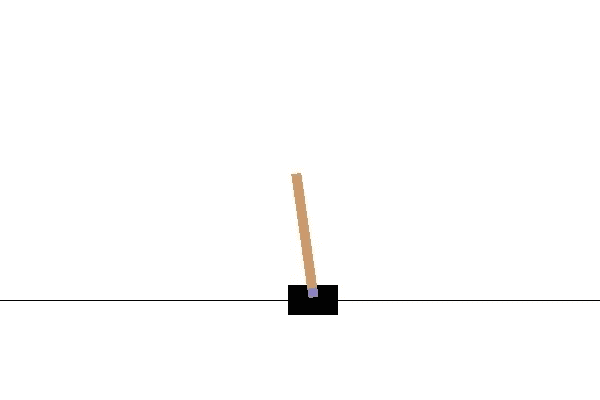
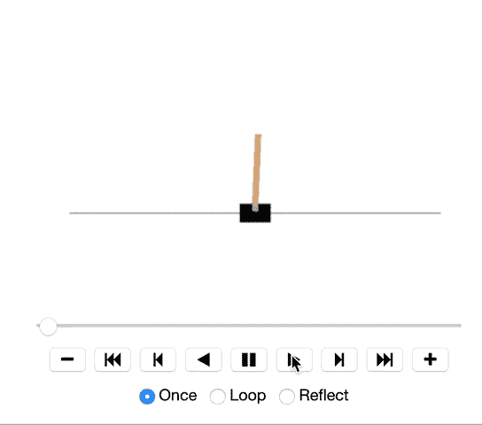
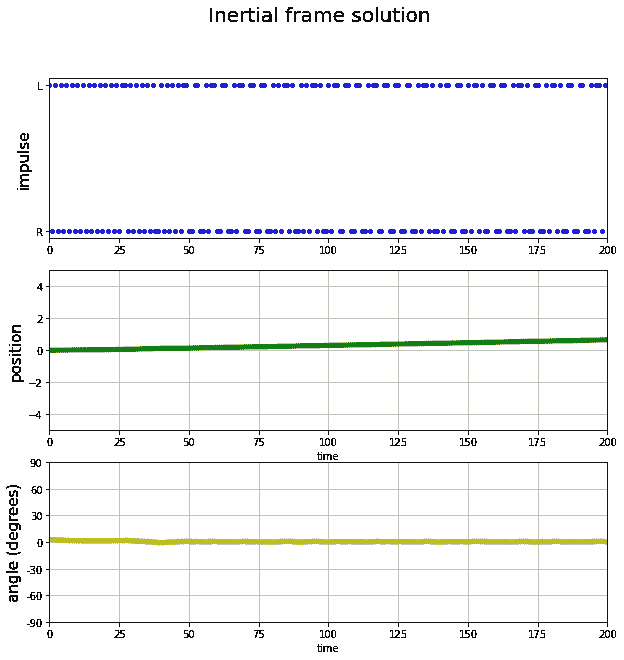
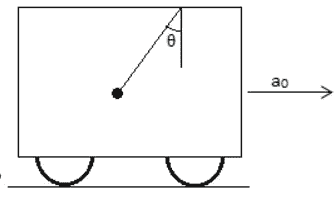
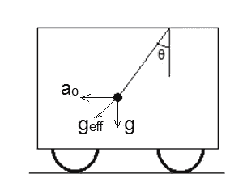
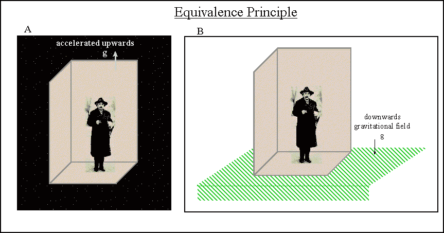
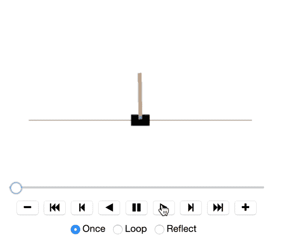
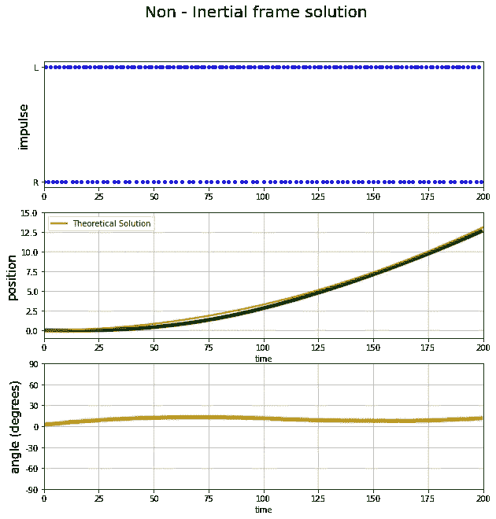

# (强化)学习非惯性系、伪力和爱因斯坦等效原理

> 原文：<https://towardsdatascience.com/reinforcement-learning-non-inertial-frames-pseudo-force-and-einsteins-equivalence-principle-7d9e94b8297c?source=collection_archive---------65----------------------->

## 对一个经典控制问题的强化学习学到了一类不明显且不平凡的解决方案。

几周前，我在解决[强化学习](https://en.wikipedia.org/wiki/Reinforcement_learning)中的[翻跟斗问题](https://gym.openai.com/envs/CartPole-v1/)时，发现了一些非常有趣的事情。实际上这是一种保守的说法。我真的很惊讶，AI algo 在我想到它之前就找到了我要描述的解决方案(我是 Lore AI 的高级机器学习工程师，也是量子信息和黑洞专业知识的弦理论学家，所以我不知道以上是对 AI 的赞美还是我只是变得生疏了。读者可以自己判断。)

[OpenAI Gym](https://gym.openai.com/) 为人们提供了几个环境来训练他们的强化学习算法，而 cartpole 由于其简单性而成为一个非常受欢迎的选择。

问题陈述:如上图所示，在一个无摩擦的表面上有一个物体，物体上有一根绕无摩擦铰链旋转的杆。**“环境”因此由 4 个数字表征:质心的水平位置和速度以及杆的角位置和速度**。代理采取的**“动作”只能是左推或右推**。学习任务的**目标是保持系统运行 200 步**(系统保持运行的每个时间步有+1 的奖励)。跑步本身定义为质心保持在(-2.4，2.4)以内，角度在(-12，12)度之间。

正如你所看到的，这是一个非常简单的经典力学问题，但是当然，这个模型对经典力学一无所知，必须学会完成这个任务。一些人已经写了一般的强化学习，特别是这个问题，所以我不会深入研究它，只是说我将使用策略梯度。

我想讲的是问题的物理学，以及机器如何学习一类有趣的解。

# 惯性框架解决方案

思考一下*和*的解决方案应该是什么。如果你对物理学不是很感兴趣，你会认为质心应该是静止的，而极点应该是垂直的。这确实是人工智能算法找到的解决方案，我们可以看到该解决方案的视频

最直观的解决方案是重心几乎不动，杆子保持垂直。

以及脉冲、位置和角度位置的曲线图

惯性坐标系解中的冲量(左右推力)、质心位置和杆的角位置。

现在，你们中稍微懂点物理的人会发现，这是一系列解中的一部分，在这个解中，质心的速度是均匀的，在这个例子中是零速度。通过将参考系转换到另一个惯性系，其他解决方案与这个解决方案简单相关。从一辆匀速行驶的汽车来看，想象与上述相同的解决方案。

如果你们不记得什么是惯性系，在牛顿第一定律中，惯性系被定义为没有外力的情况下，物体以恒定速度运动。

人工智能算法也可以找到这样的解决方案，但这不是本文的重点。

# 非惯性系解

在这一节中，我描述了人工智能发现的让我惊讶的有趣的解决方案，但在我到达那里之前，我需要给读者一个物理入门，以欣赏人工智能系统发现的解决方案。

## 物理学入门——非惯性系、赝力和爱因斯坦等效原理

牛顿第一定律将惯性系定义为物体在没有力的情况下保持其速度的坐标系。另外两个定律告诉我们在这种框架下的动力学定律。但是不遵守第一定律的框架，也就是非惯性系呢？加速中的汽车就是这样一个例子，尽管没有外力作用在你身上，但你“感觉”到自己正在加速。物理学家已经找到了一种方法来简化非惯性系中的计算，并且通过发明[赝力](https://en.wikipedia.org/wiki/Fictitious_force)的概念，甚至可以在非惯性系中使用另外两个定律。

简而言之，这个想法是假设非惯性系是惯性的，并且该惯性系中的所有物体都受到一个(伪)力的作用，该力等于质量乘以加速度的负值(回想一下，加速度是一个矢量，因此负值意味着方向相反的矢量)。

汽车中的钟摆向右加速时会向左倾斜。这个解是相同的，就好像重力在θ= arctan(A0/g)旋转的方向上作用。图片来源:[https://www . toppr . com/ask/question/a-单摆悬吊汽车加速匀加速 a/](https://www.toppr.com/ask/question/a-simple-pendulum-is-suspended-from-the-ceiling-of-a-car-accelerating-uniformly-on-a/)

伪力可以用来解释为什么当悬挂在天花板上的汽车向前加速时，钟摆会向后摆动。有一个伪力向后作用在钟摆上。那么作用在摆锤上的总“力”是向下的重力和以角度θ= arctan(a/g)向后作用的伪力之和。

我们甚至可以说，有一个“有效引力”作用在上述方向，大小为 Sqrt(a +g)。

与上述相同的系统，其中加速框架被视为添加了适当伪力的惯性系。如图所示，伪力和重力一起作为有效重力。图片来源:[https://www . toppr . com/ask/question/a-单摆悬于车顶-匀加速-上/](https://www.toppr.com/ask/question/a-simple-pendulum-is-suspended-from-the-ceiling-of-a-car-accelerating-uniformly-on-a/)

事实上，**爱因斯坦的** [**广义相对论**](https://en.wikipedia.org/wiki/General_relativity) **正是基于这样一种想法，即没有*局域*方式来区分真实重力和赝力，这种东西被称为** [**等效原理**](https://en.wikipedia.org/wiki/Equivalence_principle) **。**

[爱因斯坦的等效原理指出，在重力开启的情况下，加速框架和非加速框架之间的差异无法仅通过局部实验来确定。图片来源:https://claesjohnsonmathscience . WordPress . com/2012/01/17/questioning-relativity-3-the-equivalence-principle/](https://claesjohnsonmathscience.wordpress.com/2012/01/17/questioning-relativity-3-the-equivalence-principle/)

## 强化学习伪力解

那么这一切和强化学习以及我们的横竿问题有什么关系呢？我看到的是，人工智能在非惯性系中学习解！也就是说，它学会了一种解决方案，其中杆保持倾斜一个角度，代理不断将系统推向该方向，以保持恒定的加速度，使杆不会进一步下落。

非显而易见的非平凡解，其中小车以恒定加速度加速，而杆子保持恒定角度倾斜。

该系统学习让杆倾斜到一个角度，然后不断地加速它(这不像只在一个方向上给予脉冲那么简单，这会导致杆很快倒下)。

在上面的视频中可能很难看到加速度，但我们可以看到质心位置非常接近地遵循恒定加速度轨迹(使用 MSE 在轨迹上拟合 a 的 1/2 处)。

冲量(左右推动)，质心位置，非惯性系解的杆的角位置。

## 技术细节

使用标准的体育馆环境来解决横拉杆问题并不容易。当我第一次看到上面的解决方案时，我很惊讶 AI 系统学会了这一点，但它不是这么干净，因为标准问题要求杆保持在 12 度倾斜和中心的 2.4 个单位内，这与 200 步的恒定加速度不兼容。因此，我用自己的代码包装了标准环境，还必须修改渲染函数，以便购物车在 200 步的持续时间内保持在可见区域。这一切的代码都可以在 [my github repo](https://github.com/borundev/ReinforcementLearning) 中找到。