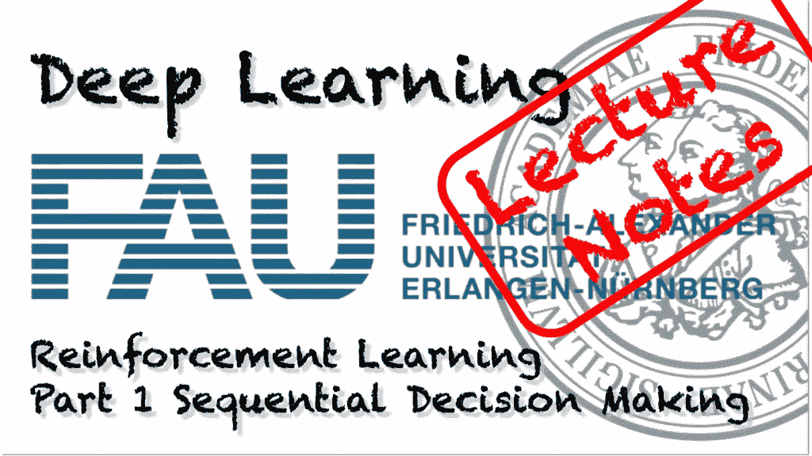
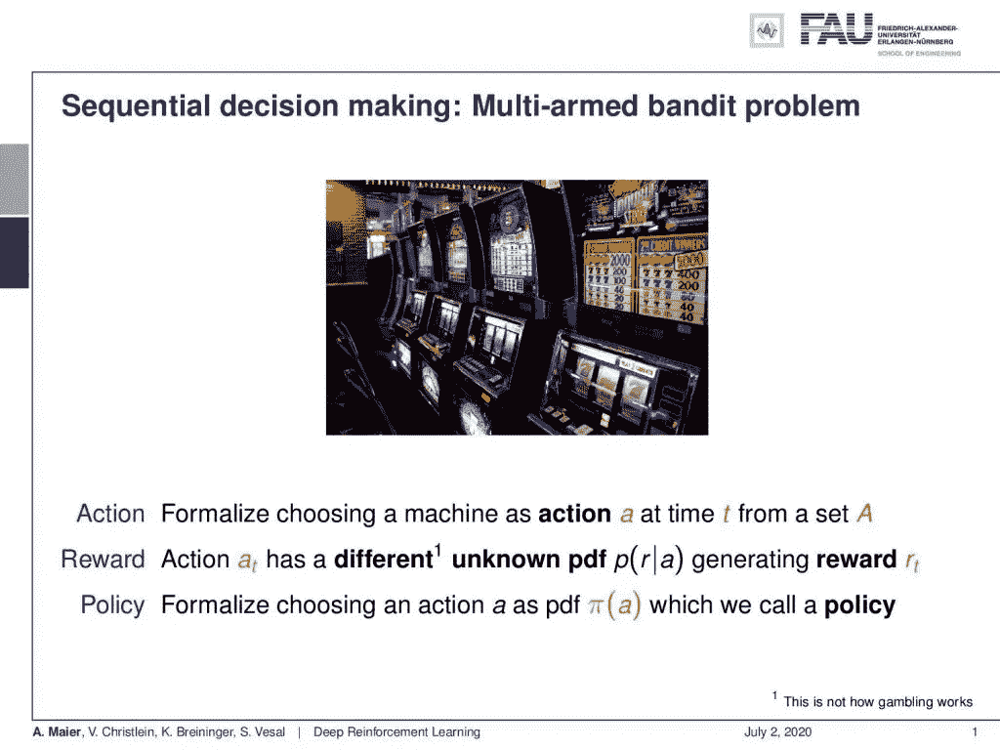
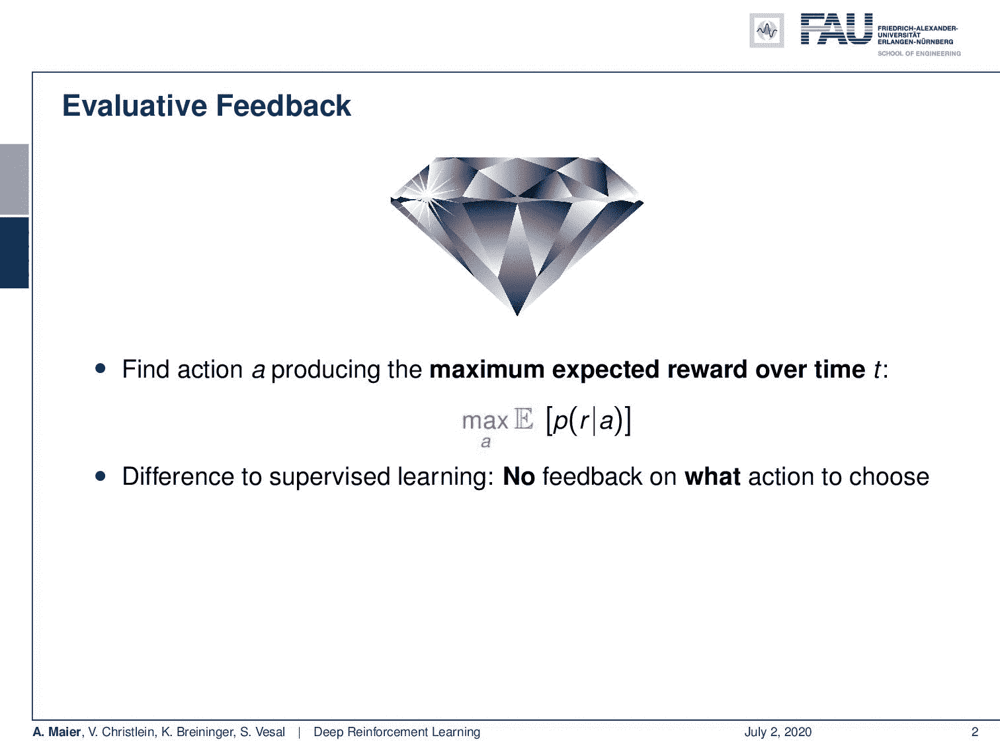
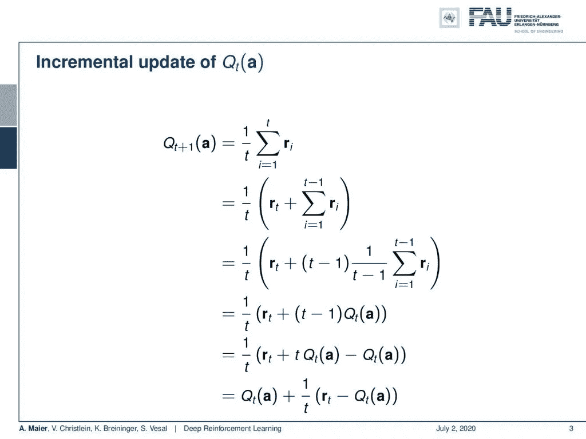
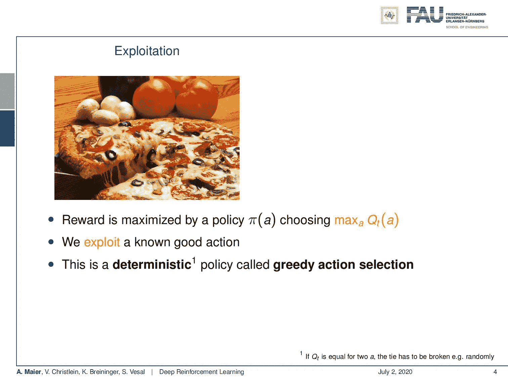
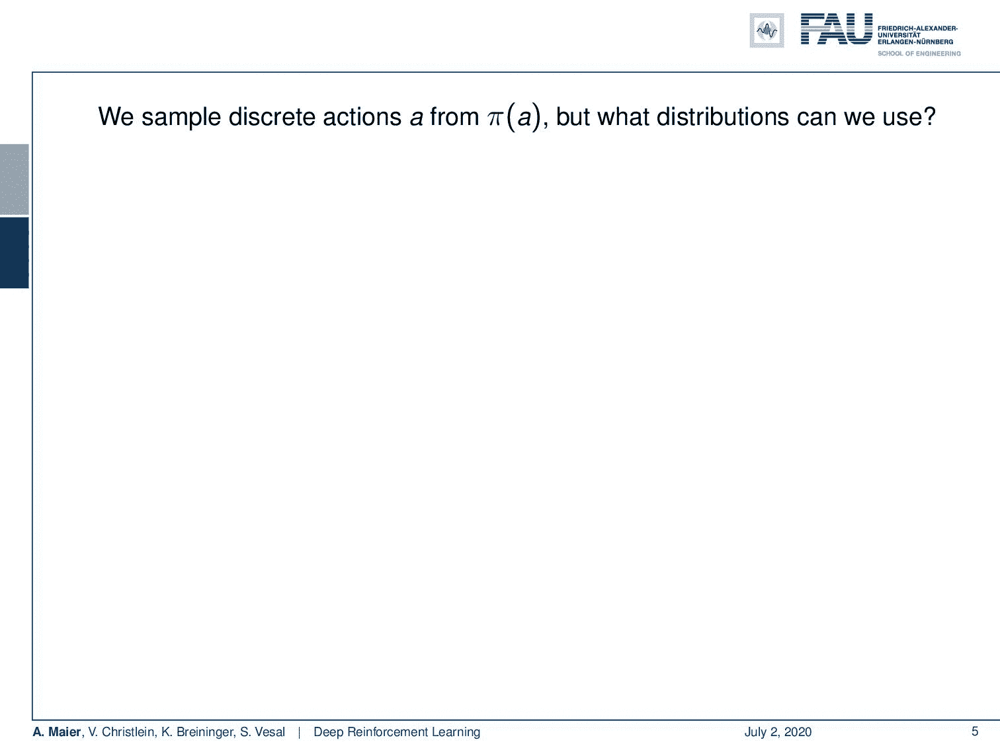
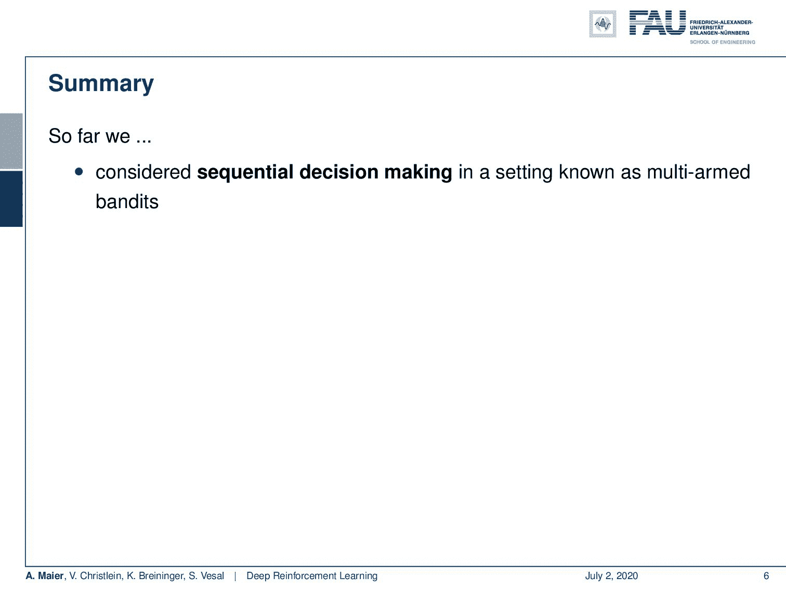
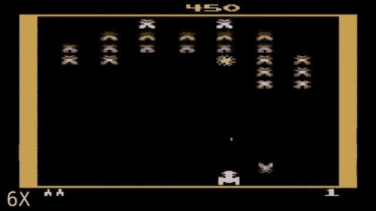

# 强化学习—第 1 部分

> 原文：<https://towardsdatascience.com/reinforcement-learning-part-1-a5518a7a0bed?source=collection_archive---------27----------------------->

## [FAU 讲座笔记](https://towardsdatascience.com/tagged/fau-lecture-notes)关于深度学习

## 顺序决策

FAU 大学的深度学习。下图 [CC BY 4.0](https://creativecommons.org/licenses/by/4.0/) 来自[深度学习讲座](https://www.youtube.com/watch?v=p-_Stl0t3kU&list=PLpOGQvPCDQzvgpD3S0vTy7bJe2pf_yJFj&index=1)

**这些是 FAU 的 YouTube 讲座** [**深度学习**](https://www.youtube.com/watch?v=p-_Stl0t3kU&list=PLpOGQvPCDQzvgpD3S0vTy7bJe2pf_yJFj&index=1) **的讲义。这是与幻灯片匹配的讲座视频&的完整抄本。我们希望，你喜欢这个视频一样多。当然，这份抄本是用深度学习技术在很大程度上自动创建的，只进行了少量的手动修改。** [**自己试试吧！如果您发现错误，请告诉我们！**](http://autoblog.tf.fau.de/)

# 航行

[**上一讲**](/visualization-attention-part-5-2c3c14e60548) **/** [**观看本视频**](https://youtu.be/yU0Axu0E0mA) **/** [**顶级**](/all-you-want-to-know-about-deep-learning-8d68dcffc258) **/** [**下一讲**](/reinforcement-learning-part-2-d38cffee992d)

欢迎回到深度学习！所以今天，我们想讨论强化学习的基础。我们将研究如何教会一个系统玩不同的游戏，我们将从顺序决策的第一次介绍开始。

只有几次强化学习的迭代，训练出来的智能体还处于初级水平。使用 [gifify](https://github.com/vvo/gifify) 创建的图像。来源: [YouTube](https://youtu.be/AVg_YIp09ps) 。

这里，我有几张幻灯片给你们看。你看，我们的主题是强化学习，我们想继续讨论顺序决策。在本课程的后面，我们还将讨论强化学习及其所有细节。我们还将研究深度强化学习，但今天我们只研究了顺序决策。

比较容易的游戏之一:多臂大盗。 [CC 下的图片来自](https://creativecommons.org/licenses/by/4.0/)[深度学习讲座](https://www.youtube.com/watch?v=p-_Stl0t3kU&list=PLpOGQvPCDQzvgpD3S0vTy7bJe2pf_yJFj&index=1)的 4.0 。

好吧。顺序决策！嗯，我们想玩几个游戏。你能想到的最简单的游戏就是拉几个杠杆。如果你试图形式化这一点，那么你最终会陷入所谓的多臂土匪问题。所以，让我们做几个定义:我们需要一些动作，我们将其形式化为在时间 *t* 从一组动作 *A* 中选择一个动作 *a* 。所以，这是我们可以采取的一系列可能的行动。如果我们选择一个动作，那么这就有一些含义。如果你选择了一个特定的行动，那么你将会产生一些奖励。行动和奖励之间的关系是概率性的，这意味着有一个可能不同的、未知的概率密度函数来描述行动和奖励之间的实际关系。所以，如果你想到你的多臂强盗，你有几个吃角子老虎机，你拉其中一个杠杆，这产生一些奖励。但也许，所有这些老虎机都是一样的。或许他们不是。所以，你可能拉的每一只手都有不同的概率产生某种回报。现在，您希望能够选择一个动作。为了做到这一点，我们定义了一个所谓的政策。策略是一种形式化如何选择动作的方法。它本质上也是一个概率密度函数，描述了选择某种行为的可能性。政策本质上是我们想要影响游戏的方式。所以，政策是掌握在我们手中的。我们可以定义这个策略，当然，我们希望这个策略在游戏中是最优的。

玩这个游戏完全是为了预期的回报。来自[深度学习讲座](https://www.youtube.com/watch?v=p-_Stl0t3kU&list=PLpOGQvPCDQzvgpD3S0vTy7bJe2pf_yJFj&index=1)的 4.0CC 下的图片。

那么，关键要素是什么呢？那么，我们想要实现什么呢？我们希望获得最大的回报，特别是，我们不仅仅希望在游戏的每一个时间点都有最大的价值。相反，我们想计算一段时间内的最大预期回报。因此，我们对将要产生的回报进行了估计。我们计算了一个平均值，因为这让我们可以估计如果我们玩这个游戏很长时间，哪些行为会产生什么样的回报。这和监督学习是不同的，因为在这里，我们不是说做这个动作或者做那个动作。相反，我们必须通过我们的训练算法来决定选择哪些动作。显然，我们可能会犯错误，我们的目标是选择能够随着时间的推移产生最大预期回报的行动。所以，如果我们在一步中输了，如果平均来说，我们仍然可以获得高平均回报，这并不重要。所以，这里的问题是，当然，我们对回报的期望值是不知道的。所以，这就是强化学习的实际问题。我们想尝试估计这个预期回报和相关的概率。所以，我们能做的是，我们可以把我们的 **r** 下标 *t* 公式化为一个热编码向量，它反映了 *a* 的哪个动作实际上导致了奖励。

行动价值函数 Q(a)描述了该行动的平均预期回报。来自[深度学习讲座](https://www.youtube.com/watch?v=p-_Stl0t3kU&list=PLpOGQvPCDQzvgpD3S0vTy7bJe2pf_yJFj&index=1)的 4.0CC 下的图片。

如果我们这样做了，我们就可以使用奖励的平均值在线估计概率密度函数。我们把它称为函数 Q(a ),这就是所谓的作用值函数，它基本上随着我们观察到的每一个新信息而变化。那么，我们如何做到这一点呢？有一种增量的方法来计算 a 的 Q 下标 t，我们可以很容易地展示出来。我们定义 Q 下标 t 为所有时间步长的和。所以，Q 下标 t+1 等于所有时间步 t 和所得报酬的总和。当然，你除以 t，现在，我们可以证明这是可以分开的。所以，我们可以取出总和的最后一个元素，也就是 t，然后让总和从 1 运行到 t-1。如果我们这样做，那么我们也可以引入 t-1 项，因为如果你在这里引入它，除以 1/(t-1)，这将抵消。所以，这是一个完美的陈述。然后，我们看到在右边部分，除了 Q 下标 t，我们基本上没有别的了，所以，前面的 Q 下标 t，这是我们已经确定的。然后，我们可以稍微重新排列一下，在最后一行，你可以看到，我们可以将 Q 下标 t+1 更新为旧的 Q 下标 t+1/t 乘以 **r** 下标 t 减去 Q 下标 t，因此，我们可以得到一个增量式的动作值函数更新公式。这非常有用，因为我们不必存储所有的奖励，但我们可以通过迭代的方式来实现。

探索与开发的困境。来自[深度学习讲座](https://www.youtube.com/watch?v=p-_Stl0t3kU&list=PLpOGQvPCDQzvgpD3S0vTy7bJe2pf_yJFj&index=1)的 [CC BY 4.0](https://creativecommons.org/licenses/by/4.0/) 下的图片。

现在，如果我们继续，那么我们可以考虑为了训练这样一个系统，我们必须做的所有不同的步骤。你最终会遇到所谓的探索-开发困境。所以，当然，我们想最大化我们的回报。我们试图以一种方式选择我们的政策，使我们能够从我们的行动价值函数中获得最大的回报。如果你已经有了一个好的计划，这将会起作用。所以，如果你已经知道事情是怎样的。所以，让我们说你正在寻找一个比萨饼的配方，你已经看到了一些。你已经喜欢的披萨。然后，你可以再次生产同样的比萨饼，你知道这个食谱是好的。所以，我会得到我的奖励，这将是决定性的，如果你使用所谓的贪婪行动选择，你总是选择最大值。你总是产生同样的动作，给出同样的输入。这导致了一个问题，我们也需要对我们的回报进行抽样，因为我们不知道最佳配置是什么，因为我们只是在剥削。所以，如果我们只遵循贪婪的行动选择，那么我们将永远不会做出任何新的观察。我们将永远生产同样的比萨饼。也许有更好的披萨。也许有我们更喜欢的披萨。所以，只有探索才能发现。所以时不时地，我们必须尝试新的食谱，因为否则，我们不知道应该如何混合配料。或许，我们会找到一个比我们已经吃过的更好的披萨。这意味着有时，我们不得不做一些不会产生最大回报的举动。从没有产生一个好的回报，我们至少可以知道，这个特殊的举动不是一个非常好的。所以，如果你训练这样一个系统，那么，在开始的时候，你要更多地关注探索，找出哪些动作是好的，哪些动作不是那么好。然后，你可以越来越多地利用它，以便专注于在某些情况下有效的策略。

不同的行动选择策略。 [CC 下的图片来自](https://creativecommons.org/licenses/by/4.0/)[深度学习讲座](https://www.youtube.com/watch?v=p-_Stl0t3kU&list=PLpOGQvPCDQzvgpD3S0vTy7bJe2pf_yJFj&index=1)的 4.0 。

那么，我们如何做到这一点呢？一种非常简单的行为抽样形式是均匀随机分布。所以，在均匀随机分布中，你不需要任何关于系统的知识。你只是随机选择行动，并且以相等的概率选择它们。所以，你只需选择一些行动，所有的行动都是同样可能的。每个动作的可能性是一个可能动作集的基数。嗯，这可能有利于探索，但你可能会犯很多错误。所以，有一点好一点的。这被称为ε-贪婪方法。所以在这里，你选择行动给定这个概率密度函数。你可以看到我们选择 1 — ε。假设ε是 0.1。然后，我们以 90%的概率选择使我们的行动价值函数最大化的行动，即产生最大预期回报的行动。在 10%以上 *n* — 1，其中 *n* 是行动的数量，即对于所有其他行动，我们以此概率选择它们。所以，你可以看到，在大多数情况下，我们会选择，当然，产生最大预期回报的行动，但我们仍然可以切换到其他行动，以便也做一些探索。当然，你选择的ε越高，你就越有可能探索你的行动空间。然后，还有其他的变种。例如，您也可以使用 softmax 并引入一些温度参数τ。这里，τ的用法与我们刚才使用ε的方法相似。所以在这里，我们找到了一个不同的公式，我们可以使用这个温度，然后慢慢降低温度，这样我们就开始主要关注产生最大预期回报的行动。那么，这本质上是一个更柔和的版本吗，因为这里我们也考虑到了其他行为也可能引入不同的奖励。所以，如果你有两个奖励几乎相同的行动，最大奖励版本当然只会选择真正产生最大奖励的那一个。如果你的奖励是 10 和 9，那么 softmax 函数也会相应地拆分这个分布。

我们当前观察的总结。来自[深度学习讲座](https://www.youtube.com/watch?v=p-_Stl0t3kU&list=PLpOGQvPCDQzvgpD3S0vTy7bJe2pf_yJFj&index=1)的 [CC BY 4.0](https://creativecommons.org/licenses/by/4.0/) 下的图片。

到目前为止我们看到了什么？到目前为止，我们已经看到，我们可以在一个被称为多臂土匪问题的环境中进行顺序决策。我们可以看到，我们找到了一个函数 Q——所谓的行动价值函数——它能够描述我们的行动有哪些预期回报。然后，我们可以用它来选择我们的行动。例如，对于贪婪行为选择，这将总是选择产生最大预期回报的行为。所以，我们也看到，如果你只做贪婪的选择，那么我们会有点卡住，因为我们永远不会观察某些星座。如果我们错过了星座，我们可能会错过赢得游戏或在游戏中产生大量奖励的非常好的食谱或非常好的策略。所以，我们也需要探索。否则，我们就无法找出最佳策略。到目前为止，我们还没有看到的是，我们的奖励实际上取决于世界的状态。因此，在我们的场景中，我们的一切都只与动作相关。行动是决定性因素。但这是一种简化。当然，一个世界有一个状态。这是我们在讨论强化学习和马尔可夫决策过程时要考虑的。此外，我们的时间没有影响奖励。所以，在当前的星座中，先前的动作完全独立于随后的动作。这也是一种广泛的简化，在实际应用中可能并不如此。

在这个深度学习讲座中，更多令人兴奋的事情即将到来。 [CC 下的图片来自](https://creativecommons.org/licenses/by/4.0/)[深度学习讲座](https://www.youtube.com/watch?v=p-_Stl0t3kU&list=PLpOGQvPCDQzvgpD3S0vTy7bJe2pf_yJFj&index=1)的 4.0 。

这就是我们下次真正讨论强化学习的原因。在接下来的视频中，我们将介绍所谓的马尔可夫决策过程。我们将研究强化学习到底是什么。所以，这只是一个关于我们在玩游戏时可以期待什么的小玩笑。但在下一个视频中，我们将真正了解 constellation，其中世界确实有一个状态，然后我们还对不同动作之间的依赖关系进行建模。所以，会稍微复杂一点。但是你应该已经在这个视频中学到了，重要的是，你找到了一个描述特定动作值的函数。这是一个会再来的概念。您还应该记住的概念是，您可以使用不同的策略。所以，你可以有贪婪行动选择，ε-贪婪行动选择，或者均匀随机策略。所以，请记住这些。在未来的视频中，当我们谈到强化学习时，它们也很重要。非常感谢您的收听，希望在下一段视频中见到您。再见！

在接下来的讲座中，我们将看到如何训练深度强化学习系统。使用 [gifify](https://github.com/vvo/gifify) 创建的图像。来源: [YouTube](https://youtu.be/AVg_YIp09ps) 。

如果你喜欢这篇文章，你可以在这里找到[更多的文章](https://medium.com/@akmaier)，在这里找到更多关于机器学习的教育材料[，或者看看我们的](https://lme.tf.fau.de/teaching/free-deep-learning-resources/)[深度](https://www.youtube.com/watch?v=p-_Stl0t3kU&list=PLpOGQvPCDQzvgpD3S0vTy7bJe2pf_yJFj) [学习](https://www.youtube.com/watch?v=p-_Stl0t3kU&list=PLpOGQvPCDQzvgpD3S0vTy7bJe2pf_yJFj&index=1) [讲座](https://www.youtube.com/watch?v=p-_Stl0t3kU&list=PLpOGQvPCDQzvgpD3S0vTy7bJe2pf_yJFj)。如果你想在未来了解更多的文章、视频和研究，我也会很感激关注 YouTube、Twitter、脸书、LinkedIn 或 T21。本文以 [Creative Commons 4.0 归属许可](https://creativecommons.org/licenses/by/4.0/deed.de)发布，如果引用，可以转载和修改。如果你有兴趣从视频讲座中生成文字记录，试试[自动博客](http://autoblog.tf.fau.de/)。

# 链接

[链接](http://incompleteideas.net/book/bookdraft2018jan1.pdf)到萨顿 2018 年草案中的强化学习，包括深度 Q 学习和 Alpha Go 细节

# 参考

[1]大卫·西尔弗、阿贾·黄、克里斯·J·马迪森等，“用深度神经网络和树搜索掌握围棋”。载于:自然 529.7587 (2016)，第 484–489 页。
【2】大卫·西尔弗、朱利安·施利特维泽、卡伦·西蒙扬等人《在没有人类知识的情况下掌握围棋游戏》。载于:自然 550.7676 (2017)，第 354 页。
【3】David Silver，Thomas Hubert，Julian Schrittwieser，等《用通用强化学习算法通过自玩掌握国际象棋和松木》。载于:arXiv 预印本 arXiv:1712.01815 (2017)。
[4] Volodymyr Mnih，Koray Kavukcuoglu，David Silver 等，“通过深度强化学习实现人类水平的控制”。载于:自然杂志 518.7540 (2015)，第 529-533 页。
【5】马丁·穆勒。《电脑围棋》。摘自:人工智能 134.1 (2002)，第 145-179 页。
[6]理查德·萨顿和安德鲁·g·巴尔托。强化学习导论。第一名。美国麻省剑桥:麻省理工学院出版社，1998 年。