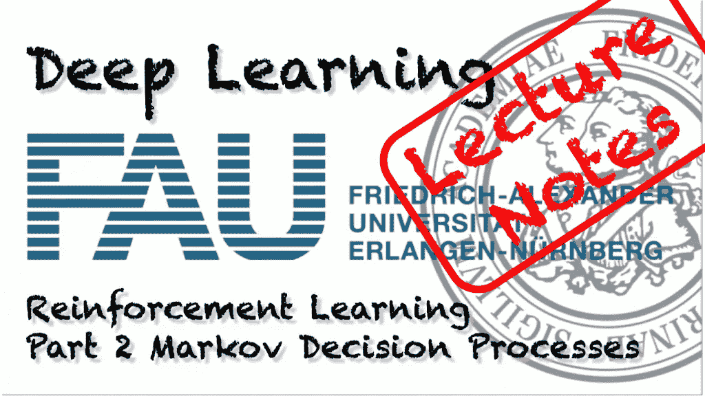
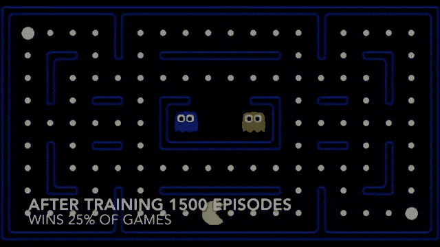
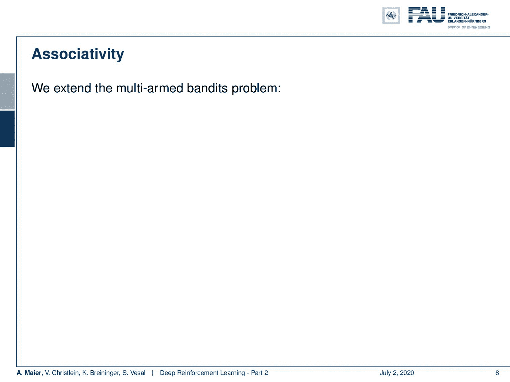
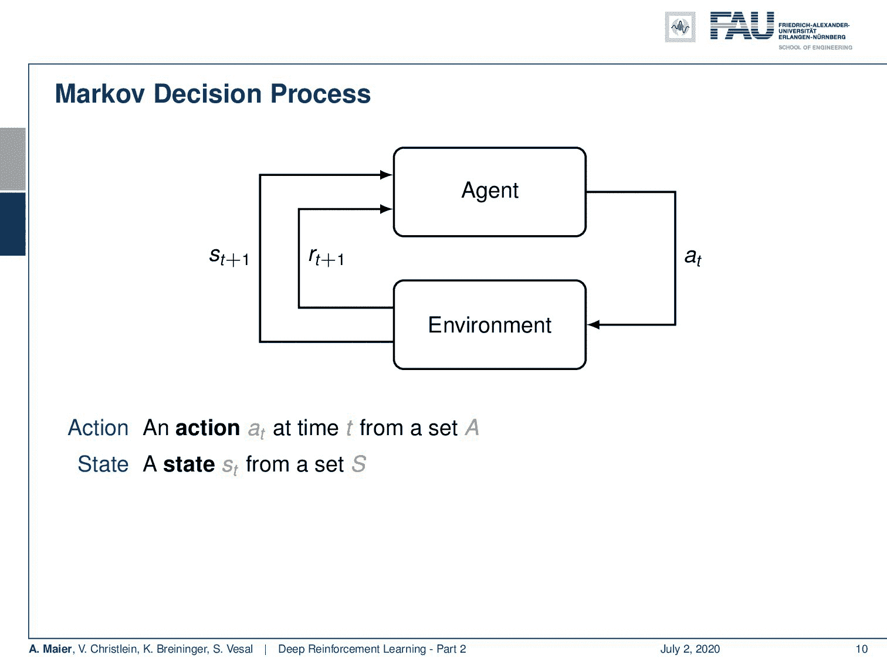
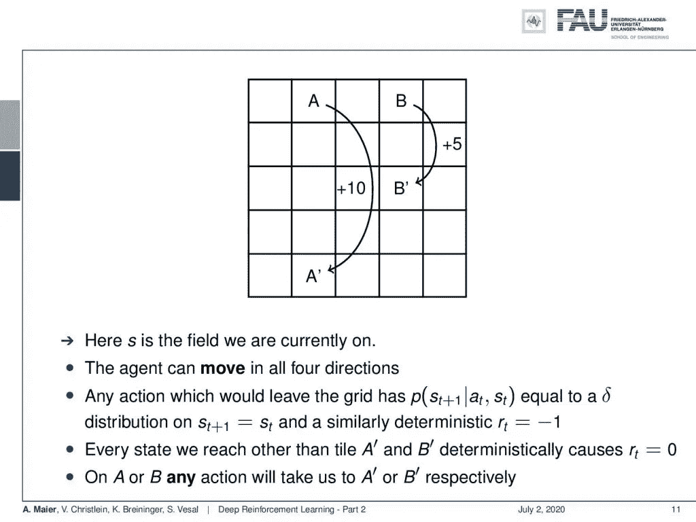
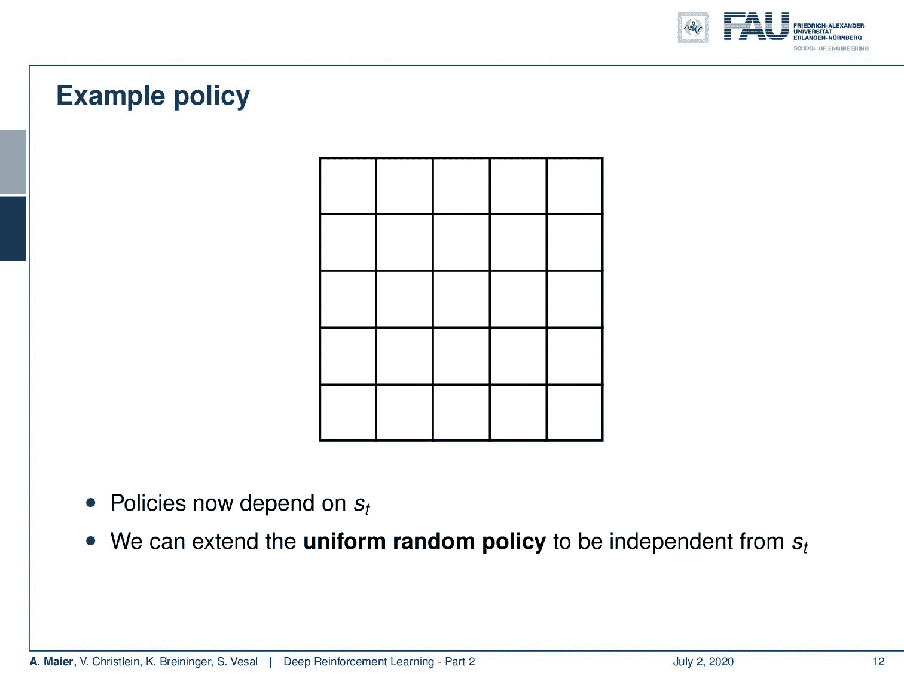
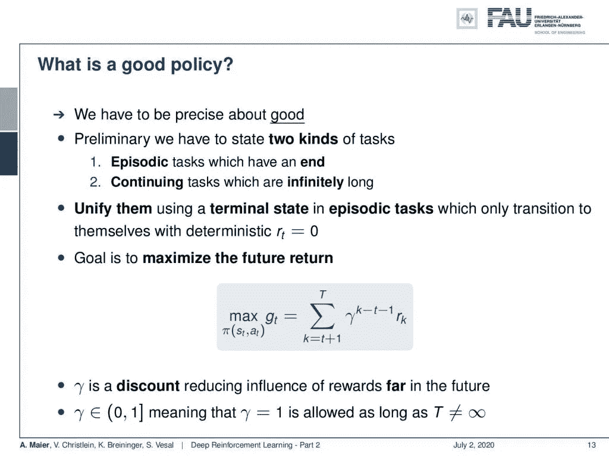
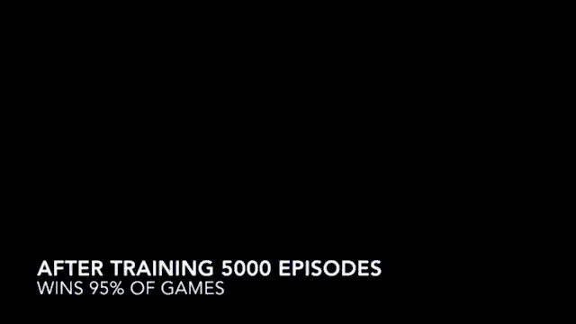

# 强化学习—第二部分

> 原文：<https://towardsdatascience.com/reinforcement-learning-part-2-d38cffee992d?source=collection_archive---------53----------------------->

## [FAU 讲座笔记](https://towardsdatascience.com/tagged/fau-lecture-notes)关于深度学习

## 马尔可夫决策过程

FAU 大学的深度学习。下图 [CC BY 4.0](https://creativecommons.org/licenses/by/4.0/) 来自[深度学习讲座](https://www.youtube.com/watch?v=p-_Stl0t3kU&list=PLpOGQvPCDQzvgpD3S0vTy7bJe2pf_yJFj&index=1)

**这些是 FAU 的 YouTube 讲座** [**深度学习**](https://www.youtube.com/watch?v=p-_Stl0t3kU&list=PLpOGQvPCDQzvgpD3S0vTy7bJe2pf_yJFj&index=1) **的讲义。这是讲座视频&配套幻灯片的完整抄本。我们希望，你喜欢这个视频一样多。当然，这份抄本是用深度学习技术在很大程度上自动创建的，只进行了少量的手动修改。** [**自己试试吧！如果您发现错误，请告诉我们！**](http://autoblog.tf.fau.de/)

# 航行

[**上一讲**](/reinforcement-learning-part-1-a5518a7a0bed) **/** [**观看本视频**](https://youtu.be/D49smMgiTBY) **/** [**顶级**](/all-you-want-to-know-about-deep-learning-8d68dcffc258) **/** [**下一讲**](/reinforcement-learning-part-3-711e31967398)

强化学习 PacMac。使用 [gifify](https://github.com/vvo/gifify) 创建的图像。来源: [YouTube](https://youtu.be/QilHGSYbjDQ) 。

欢迎回到深度学习！所以，今天我们想讨论一下这个所谓的马尔可夫决策过程，它是强化学习的基础。

多臂土匪的局限性。 [CC 下的图片来自](https://creativecommons.org/licenses/by/4.0/)[深度学习讲座](https://www.youtube.com/watch?v=p-_Stl0t3kU&list=PLpOGQvPCDQzvgpD3S0vTy7bJe2pf_yJFj&index=1)的 4.0 。

我给你带了几张幻灯片。我们可以在这里看到我们实际上在谈论什么。现在的主题是强化学习。真的，我们想学习如何玩游戏。关键要素将是马尔可夫决策过程。因此，我们必须扩展我们在前面的视频中谈到的多臂土匪问题。我们必须引入一个状态世界。所以，世界现在有了一个状态。奖励也取决于行动和单词的状态。因此，根据世界的状况，行动可能会产生非常不同的回报。我们可以用概率密度函数对其进行编码，就像你在这张幻灯片上看到的那样。还有什么？这个场景现在被称为语境强盗。在完全强化学习问题中，行为也会影响状态。所以，我们会看到无论我采取什么行动，它都会对状态产生影响，这也可能是概率性的。

马尔可夫决策过程。来自[深度学习讲座](https://www.youtube.com/watch?v=p-_Stl0t3kU&list=PLpOGQvPCDQzvgpD3S0vTy7bJe2pf_yJFj&index=1)的 [CC BY 4.0](https://creativecommons.org/licenses/by/4.0/) 下的图片。

所以，我们可以用另一个概率密度函数来描述。这就把我们引向了所谓的马尔可夫决策过程。马尔可夫决策过程，它们采取以下形式:你有一个代理，在上面的代理正在做动作 a 下标 t。这些动作对环境有影响，然后产生奖励，就像在多臂强盗问题中一样。它也改变了状态。所以现在，我们的行为和国家是相互关联的，它们当然是相互依赖的。因此，我们有一个状态转移概率密度函数，它将导致状态根据先前的状态和采取的行动而改变。这种转变也产生了一种回报，这种回报现在取决于国家和行动。否则，它与我们已经在多臂土匪问题中看到的非常相似。当然，我们需要策略，而策略现在也依赖于状态，因为你想了解状态以选择你的行动，而不仅仅是依赖于先验知识来选择独立于状态的行动。所以，都是相应展开的。现在，如果所有这些集合都是有限的，这就是有限马尔可夫决策过程。如果你看这个图，你会发现这是一个非常抽象的描述整个情况的方式。代理本质上是选择动作和设计动作的系统。环境就是一切。因此，举例来说，如果你要控制一个机器人，机器人本身可能是环境的一部分，因为机器人的位置也编码在状态中。代理所能做的一切仅仅是设计动作。关于当前情况的知识被编码在状态中。

网格世界中一个简单游戏的例子。 [CC 下的图片来自](https://creativecommons.org/licenses/by/4.0/)[深度学习讲座](https://www.youtube.com/watch?v=p-_Stl0t3kU&list=PLpOGQvPCDQzvgpD3S0vTy7bJe2pf_yJFj&index=1)的 4.0 。

让我们看一个更简单的例子，而不是马上控制机器人。我们将研究一个简单的游戏。你看这是一个伟大的游戏。一个网格世界，我们有几个方块，然后我们的代理人可以在这些方块之间移动。当然，代理人的职位也是国家的一部分。你可以这样表述: *s* 是我们当前所在的字段。现在，我们的特工可以向四个方向移动。所以，我们可以上下左右移动。任何引导网格的动作都有一个概率等于狄拉克δ函数，这个函数总是产生先前的状态。所以，你不能离开网格。每当你试图离开棋盘的时候，你就会回到你试图离开棋盘的原始位置。此外，你会得到-1 的确定性奖励。所以，试图离开董事会将会受到负回报的惩罚。还有什么？好吧，每当我们到达一个不同于 A '和 B '的牌，这必然导致奖励为 0。所以，所有的瓷砖都没有奖励。全面行动对你没有任何好处。唯一能产生奖励的牌是当你到达 A '或 B '时。为了产生奖励，你必须移动到位置 A 或 B。在这些位置上，你可以选择任何动作不管你做什么，但你会被传送到 B '或 A '，这取决于你是在 A 还是 B 上。你在那里神秘地为 A 产生+10 的奖励，为 B 产生+5 的奖励。所以，这是我们的游戏，游戏非常简单。

我们网格世界例子的统一随机策略。来自[深度学习讲座](https://www.youtube.com/watch?v=p-_Stl0t3kU&list=PLpOGQvPCDQzvgpD3S0vTy7bJe2pf_yJFj&index=1)的 [CC BY 4.0](https://creativecommons.org/licenses/by/4.0/) 下的图片。

当然，如果你想玩这个游戏或关卡，你想产生大量的奖励。策略应该引导你到方块 A 和 B，然后在 A '和 A 或 B '和 B 之间来回循环，所以这可能是玩这个游戏的好策略，对吗？好吧。所以现在，我们必须以某种方式编码我们的状态和位置。因为我们可以在 25 个潜在的不同位置上，我们的行动也必须乘以这个棋盘游戏中潜在位置的数量。那么，让我们来看一个示例策略。该策略现在依赖于动作和状态。状态或多或少是这个网格中的位置，动作当然是，正如我们所说的上、下、左、右。那么现在，我们来看看统一随机政策。它可以用这里显示的方式来可视化。所以，不管我们在棋盘的哪个位置，我们总是以相等的概率选择四个行动中的一个。在这个网格世界的例子中，我们可以在这个简单的图形中可视化我们的整个状态动作空间。所以，这对于可视化非常有用，你可以很好地理解这个例子。所以在这个统一随机政策下。当然，没有理由认为这是一个非常好的策略，因为我们会尝试走出棋盘，当然，我们偶尔也会碰到 A 和 B，但这不是一个非常好的策略。

怎样才能得到更好的政策？ [CC 下的图片来自](https://creativecommons.org/licenses/by/4.0/)[深度学习讲座](https://www.youtube.com/watch?v=p-_Stl0t3kU&list=PLpOGQvPCDQzvgpD3S0vTy7bJe2pf_yJFj&index=1)的 4.0 。

所以现在的问题是“我们如何才能制定更好的政策？”或者“我们如何评估好的政策？”。这里你要问的关键问题是你要问“什么是好政策？”。所以，我们必须非常精确地定义什么是好的。本质上，我们必须区分两种不同的任务。有些偶发的任务是有结束的。所以它们像一集一样有开头和结尾。有无限长的连续任务。所以，如果你有一个无限长的任务，那么这是一个不同的情况。实际上，您可以通过在情节任务中选择一个终端状态来统一这两者，该状态只转换到它们自己，并产生确定性的零回报。所以，你可以通过到达一个最终状态，将你的阶段性任务变成一个无限的任务，而这个最终状态继续产生零回报。这样，我们就不用再区分两者了。我们如何衡量什么是好政策？我们希望未来的回报最大化。因此，这是非常重要的，与我们的多臂强盗问题相反，我们只是简单地平均或计算我们的回报的期望值，我们现在感兴趣的是最大化未来回报。所以，如果你看这个值 **g** 下标 t，你可以看到，这当然取决于政策。因此，我们寻求最大化我们对政策的预期未来回报。

在 80 年代的玩具中，通过范例进行训练已经成为可能。使用 [gifify](https://github.com/vvo/gifify) 创建的图像。来源: [YouTube](https://youtu.be/D49smMgiTBY) 。

我们用下面的方法来计算它:所以，我们从 t + 1 开始，遍历整个序列，直到 T 是最后一个元素。所以，T 也可以是无穷大，如果你去做一个无限长的任务。我们要计算在游戏结束前的所有未来时间步骤中产生的奖励。现在，如果我们不考虑离下一次奖励还有多远，这就有点不公平了。例如，在前面的游戏中，我们可能会试图找到到达 A 和 B 的最短路径，以获得奖励。如果我们不忽略这一点，那么如果我们有一个很高但在未来很遥远的奖励，它对我们来说可能没有我们能很快产生的奖励重要。这就是为什么我们在这里引入了这个贴现因子γ。γ的(k — t — 1)次方用于贴现遥远未来的报酬。如果我们这样做，我们就会含蓄地倾向于短的解决方案，而不是长的。所以，我们想摆脱随机移动的解决方案，因为我们想选择最短的路径直接获得回报。这可以通过引入这个贴现因子来实现。我们看到我们现在能够描述一项政策的优点或价值。现在的问题是，当然，我们想要优化这个政策的预期未来回报。在这个等式中，你甚至看不到政策，因为政策是产生我们奖励的决定性因素。你必须记住的一点是，你要在 0 和 1 之间选择你的贴现因子。只要你的序列不是无限长，值 1 实际上是允许的。在这种情况下 T 不可能有无穷大。如果您有无限长的序列，那么您必须选择一个小于 1 的折扣因子。好吧。现在，我们讨论了最基本的内容，如何定义马尔可夫决策过程，以及如何评估保单的价值。

在这个深度学习讲座中，更多令人兴奋的事情即将到来。 [CC 下的图片来自](https://creativecommons.org/licenses/by/4.0/)[深度学习讲座](https://www.youtube.com/watch?v=p-_Stl0t3kU&list=PLpOGQvPCDQzvgpD3S0vTy7bJe2pf_yJFj&index=1)的 4.0 。

当然，我们仍然缺少的和我们下次在深度学习中讨论的，是这一点的实际含义。因此，我们希望能够确定好的政策，我们真的希望进入学习部分。因此，我们希望更新政策，以便在每一步都做得更好。这个概念被称为策略迭代。所以，我希望你喜欢这个视频，你学习了马尔可夫决策过程的基本概念，以及在这样一个马尔可夫决策过程中对政策的评估。这是对预期未来回报的评价。因此，这与我们的多臂强盗问题相比有很大的不同，在多臂强盗问题中，我们只考虑最大的预期回报。现在，我们要考虑到，我们要最大化未来的回报。到目前为止，我们所做的一切不仅仅是重要的，而是为未来的步骤奠定基础，以便找到赢得比赛的途径。非常感谢您的收听，希望在下一段视频中见到您！再见！

后来的强化迭代学会了吃豆人。使用 [gifify](https://github.com/vvo/gifify) 创建的图像。来源: [YouTube](https://youtu.be/QilHGSYbjDQ) 。

如果你喜欢这篇文章，你可以在这里找到更多的文章，或者看看我们的讲座。如果你想在未来了解更多的文章、视频和研究，我也会很感激关注 [YouTube](https://www.youtube.com/c/AndreasMaierTV) 、 [Twitter](https://twitter.com/maier_ak) 、[脸书](https://www.facebook.com/andreas.maier.31337)或 [LinkedIn](https://www.linkedin.com/in/andreas-maier-a6870b1a6/) 。本文以 [Creative Commons 4.0 归属许可](https://creativecommons.org/licenses/by/4.0/deed.de)发布，如果引用，可以转载和修改。如果你有兴趣从视频讲座中获得文字记录，试试[自动博客](http://autoblog.tf.fau.de/)。

# 链接

[链接](http://incompleteideas.net/book/bookdraft2018jan1.pdf)到萨顿 2018 年草案中的强化学习，包括深度 Q 学习和 Alpha Go 细节

# 参考

[1]大卫·西尔弗、阿贾·黄、克里斯·J·马迪森等，“用深度神经网络和树搜索掌握围棋”。载于:自然 529.7587 (2016)，第 484–489 页。
【2】大卫·西尔弗、朱利安·施利特维泽、卡伦·西蒙扬等人《在没有人类知识的情况下掌握围棋游戏》。载于:自然 550.7676 (2017)，第 354 页。
【3】David Silver，Thomas Hubert，Julian Schrittwieser，等《用通用强化学习算法通过自玩掌握国际象棋和松木》。载于:arXiv 预印本 arXiv:1712.01815 (2017)。
[4] Volodymyr Mnih，Koray Kavukcuoglu，David Silver 等，“通过深度强化学习实现人类水平的控制”。载于:自然杂志 518.7540 (2015)，第 529-533 页。
【5】马丁·穆勒。《电脑围棋》。摘自:人工智能 134.1 (2002)，第 145-179 页。
[6]理查德·萨顿和安德鲁·g·巴尔托。强化学习导论。第一名。美国麻省剑桥:麻省理工学院出版社，1998 年。