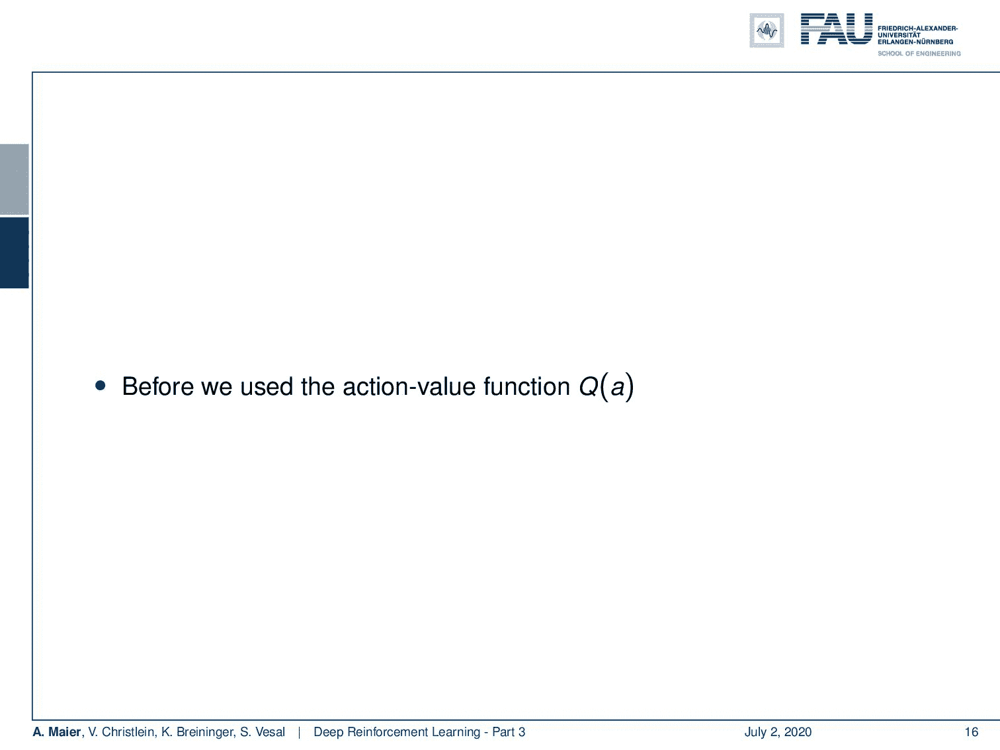
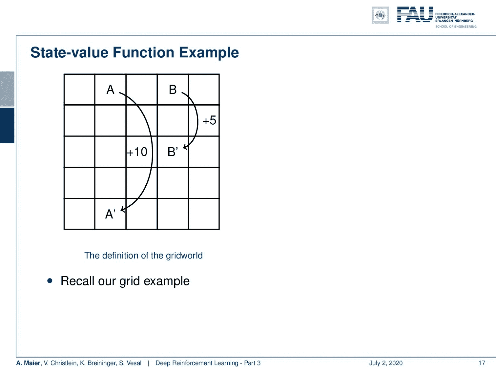
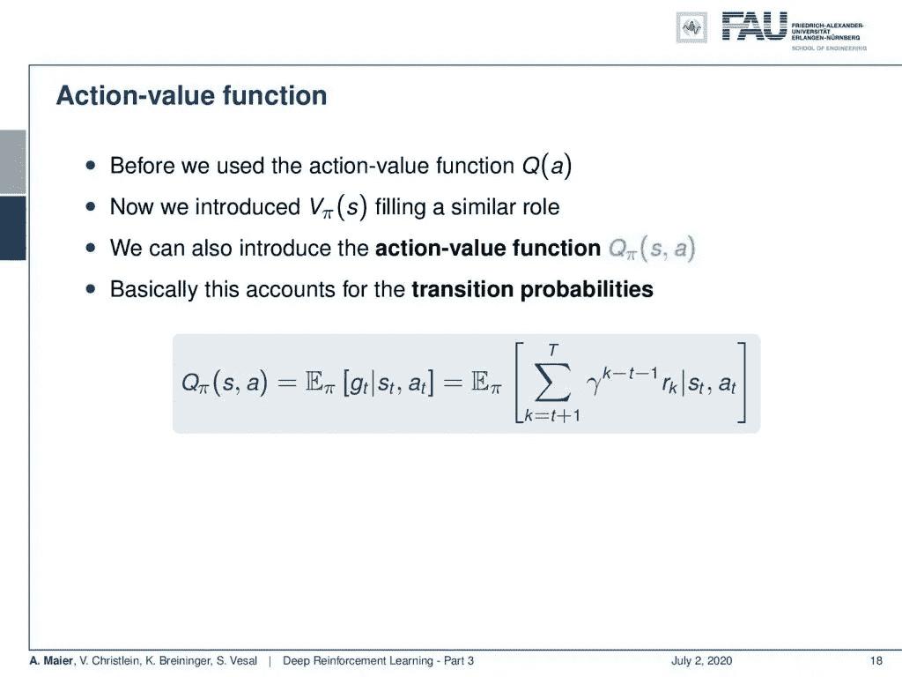
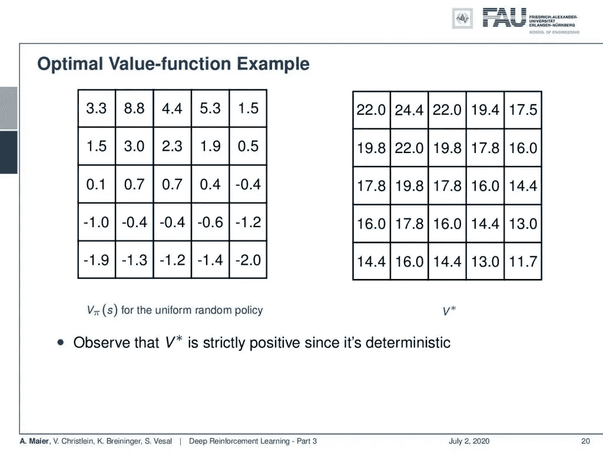
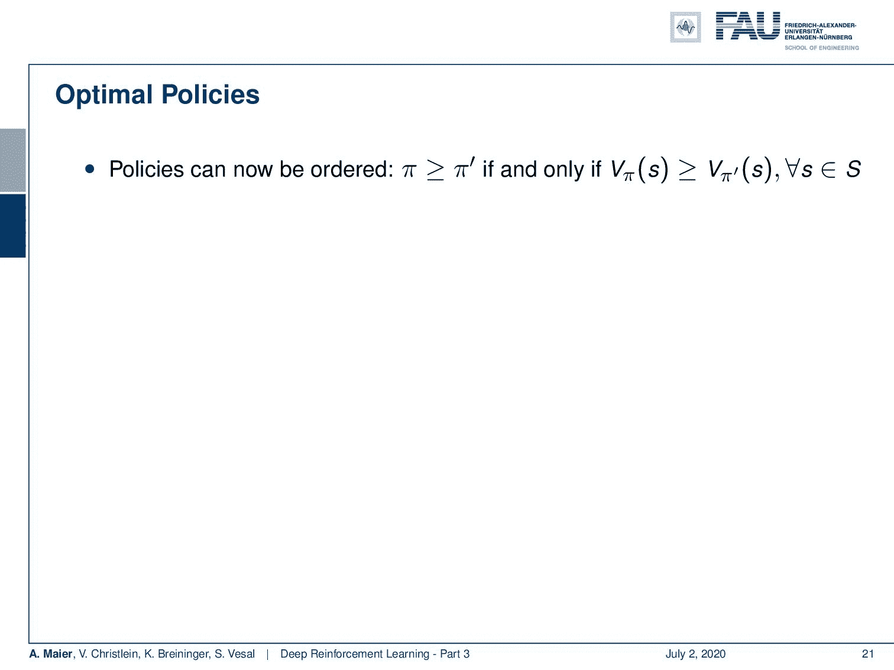
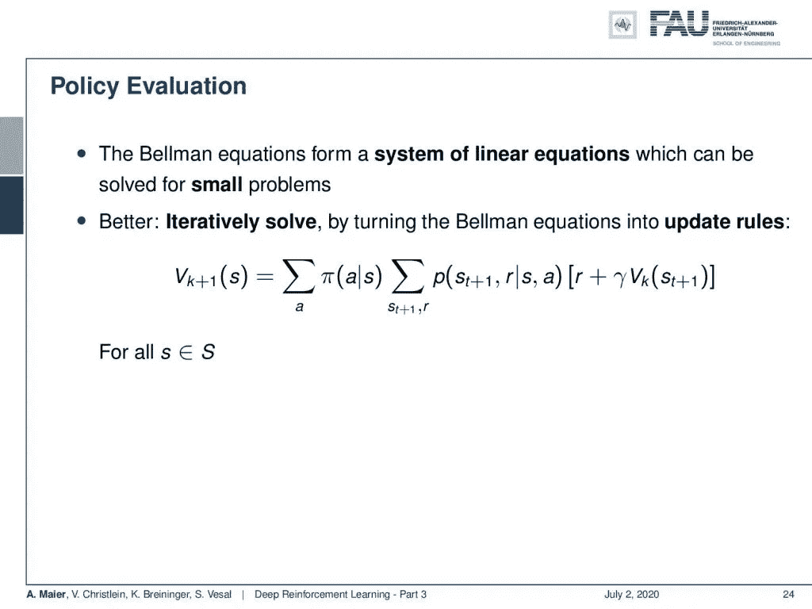
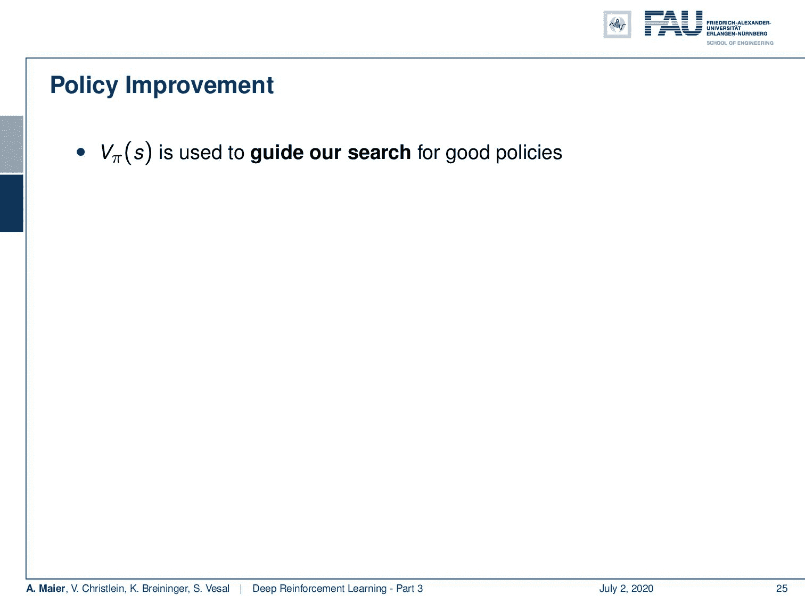
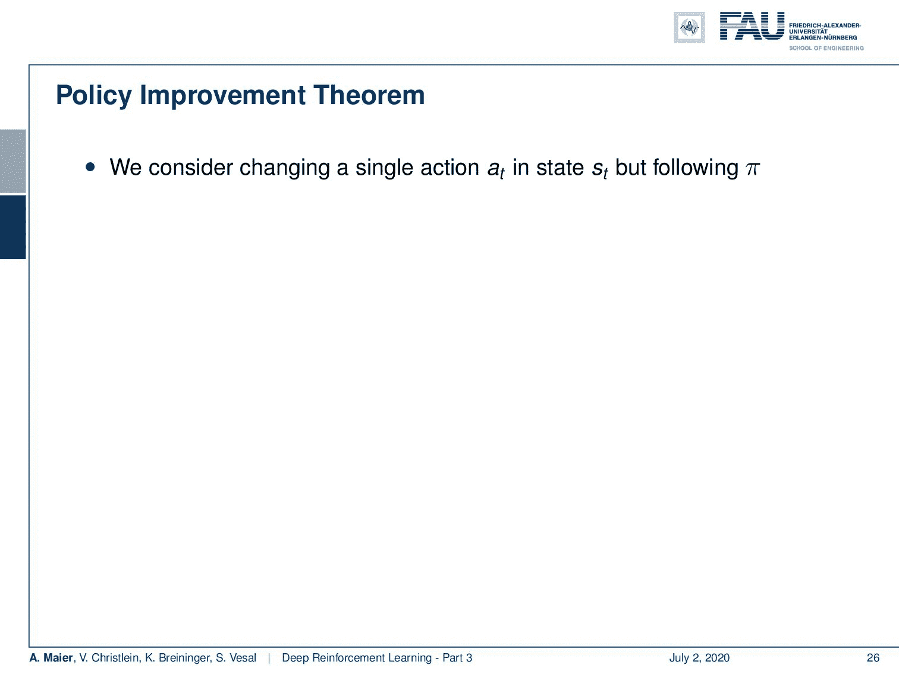

# 强化学习—第 3 部分

> 原文：<https://towardsdatascience.com/reinforcement-learning-part-3-711e31967398?source=collection_archive---------28----------------------->

## [FAU 讲座笔记](https://towardsdatascience.com/tagged/fau-lecture-notes)关于深度学习

## 策略迭代

FAU 大学的深度学习。下图 [CC BY 4.0](https://creativecommons.org/licenses/by/4.0/) 来自[深度学习讲座](https://www.youtube.com/watch?v=p-_Stl0t3kU&list=PLpOGQvPCDQzvgpD3S0vTy7bJe2pf_yJFj&index=1)

**这些是 FAU 的 YouTube 讲座** [**深度学习**](https://www.youtube.com/watch?v=p-_Stl0t3kU&list=PLpOGQvPCDQzvgpD3S0vTy7bJe2pf_yJFj&index=1) **的讲义。这是与幻灯片匹配的讲座视频&的完整抄本。我们希望，你喜欢这个视频一样多。当然，这份抄本是用深度学习技术在很大程度上自动创建的，只进行了少量的手动修改。** [**自己试试吧！如果您发现错误，请告诉我们！**](http://autoblog.tf.fau.de/)

# 航行

[**上一讲**](/reinforcement-learning-part-2-d38cffee992d) **/** [**观看本视频**](https://youtu.be/fx0xgXH3jW8) **/** [**顶级**](/all-you-want-to-know-about-deep-learning-8d68dcffc258) **/** [**下一讲**](/reinforcement-learning-part-4-3c51edd8c4bf)

此外，马里奥并没有从强化学习中解脱出来。使用 [gifify](https://github.com/vvo/gifify) 创建的图像。来源: [YouTube](https://youtu.be/qv6UVOQ0F44) 。

欢迎回到深度学习！所以今天，我们想深入探讨强化学习。我们今天要解释的概念是政策迭代。它告诉我们如何制定更好的策略来设计赢得比赛的策略。

价值函数模拟了我们的水晶球。 [CC 下的图片来自](https://creativecommons.org/licenses/by/4.0/)[深度学习讲座](https://www.youtube.com/watch?v=p-_Stl0t3kU&list=PLpOGQvPCDQzvgpD3S0vTy7bJe2pf_yJFj&index=1)的 4.0 。

那么，让我们来看看我给你们准备的幻灯片。这是我们讲座的第三部分，我们想谈谈政策迭代。现在，在我们有这个行为价值函数之前，这个函数可以评估一个行为的价值。当然，这现在还取决于状态 t。这本质上是我们的——你可以说是甲骨文——试图预测未来的回报 **g** 下标 t。它取决于遵循特定的政策，该政策描述了如何选择行动和结果状态。现在，我们也可以在这里找到一个替代的公式。我们引入了状态值函数。所以，以前我们有行动价值函数，它告诉我们某个行动有多有价值。现在，我们想引入状态值函数，它告诉我们某个状态有多有价值。在这里，你可以看到它以非常相似的方式被形式化。同样，我们对未来的回报有一些期望值。当然，这现在取决于国家。所以，我们有点抛开了对动作的依赖，我们只关注状态。你现在可以看到，这是相对于国家的未来回报的期望值。所以，我们想边缘化的行动。我们不关心行动的影响是什么。我们只想弄清楚某个状态的值是多少。

记住网格世界。现在，我们可以计算每个状态的状态值函数。来自[深度学习讲座](https://www.youtube.com/watch?v=p-_Stl0t3kU&list=PLpOGQvPCDQzvgpD3S0vTy7bJe2pf_yJFj&index=1)的 4.0CC 下的图片。

我们实际上可以计算这个。因此，我们也可以在网格示例中这样做。如果你还记得这一个，你会记得我们有一个简单的游戏，你有一个 A 和 B，基本上是网格上的位置，然后将你传送到 A '和 B '。一旦你到达 A 和 B，你会得到奖励。对 A 来说是+10，对 B 来说是+5。每当你试图离开董事会，你会得到一个负的奖励。现在，我们可以玩这个游戏，计算状态值函数。当然，我们可以在统一随机策略下这样做，因为我们不必了解游戏的任何内容。如果我们玩随机统一策略，我们可以简单地选择行动，玩这个游戏一段时间，然后我们能够根据之前的定义计算这些状态值。你可以看到边缘的瓷砖，特别是在底部，它们甚至有一个负值。当然，他们可以有负值，因为如果你在边缘瓦片，我们发现-1.9 和-2.0 和底部。在角落瓷砖，有 50%的可能性，你会尝试离开网格。在这两个方向上，你当然会产生负回报。所以，你可以看到我们有更有价值的状态。你可以看到如果你看 A 和 B 所在的位置，它们有一个非常高的值。所以 A 的预期未来回报是 8.8，而 B 的预期未来回报是 5.3。所以，这些都是非常好的州。所以，你可以说，有了这个状态值，我们在某种程度上对我们的游戏有所了解。所以，你可以说“好吧，也许我们可以用这个。”我们现在可以对这个状态值使用贪婪操作选择。让我们定义一个策略，这个策略现在总是选择导致更高值状态的动作。如果你这样做，你有一个新的政策。如果你玩这个新政策，你会发现你有一个更好的政策。

行动价值函数估计每个状态下每个行动的预期未来回报。 [CC 下的图片来自](https://creativecommons.org/licenses/by/4.0/)[深度学习讲座](https://www.youtube.com/watch?v=p-_Stl0t3kU&list=PLpOGQvPCDQzvgpD3S0vTy7bJe2pf_yJFj&index=1)的 4.0 。

因此，我们现在可以将它与我们之前使用的动作值函数联系起来。我们以类似的方式引入了状态值函数。因此，我们现在可以看到，我们可以引入一个动作值函数，它是 s 和 a 的 Q 下标策略，即状态和动作的 Q 下标策略。这基本上说明了转移概率。所以，你现在可以计算你的状态和行为的 Q 政策，作为给定状态和行为的未来回报的期望值。你可以用类似的方法来计算。现在，你得到了每个状态和每个行为的预期未来回报。

只能有一个 V*。 [CC 下的图片来自](https://creativecommons.org/licenses/by/4.0/)[深度学习讲座](https://www.youtube.com/watch?v=p-_Stl0t3kU&list=PLpOGQvPCDQzvgpD3S0vTy7bJe2pf_yJFj&index=1)的 4.0 。

所有这些价值函数都是相等的吗？不能。只能有一个最优状态值函数。我们可以在不提及具体政策的情况下表明它的存在。因此，最优状态值函数就是具有最佳策略的所有状态值函数的最大值。因此，最佳政策总是会产生最优的状态-价值函数。现在，我们还可以定义最优行动值函数。这现在可以与我们的最优状态值函数联系起来。我们可以看到，最佳行动价值函数是下一步的预期回报加上我们的贴现因子乘以最佳状态价值函数。因此，如果我们知道最优状态值函数，那么我们也可以导出最优动作值函数。所以，他们是有关系的。

均匀随机 V 和 V*的状态值函数。来自[深度学习讲座](https://www.youtube.com/watch?v=p-_Stl0t3kU&list=PLpOGQvPCDQzvgpD3S0vTy7bJe2pf_yJFj&index=1)的 [CC BY 4.0](https://creativecommons.org/licenses/by/4.0/) 下的图片。

这就是均匀随机政策的状态值函数。我可以给你看最优 V*，也就是最优状态值函数。当然，您会看到它的价值要高得多，因为我们一直在为此进行优化。您还观察到最优状态值函数是严格正的，因为我们在这里处于确定性设置中。所以，非常重要的观察:在确定性设置中，最优状态值函数将严格为正。

如何才能订购保单？ [CC 下的图片来自](https://creativecommons.org/licenses/by/4.0/)[深度学习讲座](https://www.youtube.com/watch?v=p-_Stl0t3kU&list=PLpOGQvPCDQzvgpD3S0vTy7bJe2pf_yJFj&index=1)的 4.0 。

现在，我们还可以订购保单。我们必须确定什么是更好的政策。我们可以用下面的概念对它们进行排序:当且仅当π的状态值都高于用π'得到的状态值时，更好的策略π优于策略π'。如果这样做，那么任何返回最优状态值函数的策略都是最优策略。所以，你可以看到只有一个最优状态值函数，但是可能有不止一个最优策略。因此，可能有两个或三个不同的政策导致相同的最优状态值函数。因此，如果你知道最优状态值或最优动作值函数，那么你可以通过贪婪动作选择直接获得最优策略。所以，如果你知道最优状态值，如果你完全了解所有的行动等等，那么你总是可以通过贪婪的行动选择得到最优策略。

对状态值的贪婪行为选择。 [CC 下的图片来自](https://creativecommons.org/licenses/by/4.0/)[深度学习讲座](https://www.youtube.com/watch?v=p-_Stl0t3kU&list=PLpOGQvPCDQzvgpD3S0vTy7bJe2pf_yJFj&index=1)的 4.0 。

那么，让我们看看这在政策方面会产生什么样的结果。现在，对最优状态值函数或最优行为值函数的贪婪行为选择将导致最优策略。你在左边看到的是在均匀随机状态值函数上的贪婪行为选择。我们之前在视频中计算的。当然，你可以选择你的行动，你的下一个状态是一个更高价值的状态，你最终得到这种策略。现在，如果你对最优状态值函数做同样的事情，你可以看到我们基本上出现了一个非常相似的政策。你会看到一些不同之处。事实上，你不必总是像左边显示的那样向上移动。所以，在很多情况下，你也可以向左或向上移动。实际上，你可以在这些方块中的每一个上选择行动，这些方块用多个箭头以相等的概率表示。所以，如果有一个向上和向左的箭头，你可以选择任何一个行动，你仍然会有一个最优的政策。因此，这将是由最优状态值函数上的贪婪动作选择创建的最优策略。

贝尔曼方程。来自[深度学习讲座](https://www.youtube.com/watch?v=p-_Stl0t3kU&list=PLpOGQvPCDQzvgpD3S0vTy7bJe2pf_yJFj&index=1)的 [CC BY 4.0](https://creativecommons.org/licenses/by/4.0/) 下的图片。

现在，最大的问题是:“我们如何计算最优价值函数？”我们还必须确定这个最佳状态值函数和最佳动作值函数。为了做到这一点，有贝尔曼方程。它们本质上是值函数的一致性条件。这是状态值函数的例子。您可以看到，您必须总结由您的策略决定的所有不同的操作。所以，我们想边缘化实际行动的影响。当然，根据你选择的行动，你会产生不同的状态和不同的回报。所以，你也可以对不同的状态和相应的奖励进行求和，然后将这些状态的概率乘以实际奖励加上下一个状态的贴现状态值函数。这样，你就可以确定状态值函数。你可以看到，在这个计算中，当前状态和下一个状态之间存在这种依赖性。

贝尔曼方程也可以解释为更新规则。 [CC 下的图片来自](https://creativecommons.org/licenses/by/4.0/)[深度学习讲座](https://www.youtube.com/watch?v=p-_Stl0t3kU&list=PLpOGQvPCDQzvgpD3S0vTy7bJe2pf_yJFj&index=1)的 4.0 。

这意味着你可以把它写成一个线性方程组，然后用小问题来解决它。但更好的是，您可以通过将贝尔曼方程转化为更新规则来迭代解决这个问题。所以，你现在可以看到，如果我们简单地应用贝尔曼方程，我们可以为当前状态生成一个新的值函数 k+1。所以，我们必须计算所有不同的行动。我们必须实际评估给定状态下的所有不同行为。然后，我们确定所有下一个未来状态和下一个未来奖励，并根据我们之前的状态-值函数更新它。当然，我们对所有的状态都这样做，然后，我们有一个更新的状态值函数。好吧。所以，这是一个有趣的观察。如果我们有一些策略，我们实际上可以运行这些更新。

政策是可以改进的。来自[深度学习讲座](https://www.youtube.com/watch?v=p-_Stl0t3kU&list=PLpOGQvPCDQzvgpD3S0vTy7bJe2pf_yJFj&index=1)的 [CC BY 4.0](https://creativecommons.org/licenses/by/4.0/) 下的图片。

这就引出了政策改进的概念。这个政策迭代是我们在这个视频中真正想要谈论的。所以，我们现在可以用我们的国家价值函数来指导我们寻找好的政策。然后，我们更新策略。因此，如果我们使用贪婪动作选择来更新状态值函数，那么这也意味着我们同时更新我们的策略，因为如果我们改变状态值，对我们的状态值的贪婪动作选择将总是导致不同的动作。因此，在贪婪动作选择的情况下，状态值的任何改变或更新也将意味着更新的策略，因为我们将它们直接链接在一起。这意味着我们可以在我们的状态值函数上迭代评估一个贪婪策略。如果我们的策略停止改变，我们就停止迭代。这样，我们可以更新状态值，随着状态值的更新，我们也可以立即更新我们的策略。这真的能保证有效吗？

政策改进定理。 [CC 下的图片来自](https://creativecommons.org/licenses/by/4.0/)[深度学习讲座](https://www.youtube.com/watch?v=p-_Stl0t3kU&list=PLpOGQvPCDQzvgpD3S0vTy7bJe2pf_yJFj&index=1)的 4.0 。

这是政策改进定理。如果我们考虑改变一个单一的行动 a 下标 t 和状态 s 下标 t，遵循一个政策。那么，一般来说，如果我们有一个更高的动作值函数，所有状态的状态值都会增加。这意味着我们有了更好的政策。因此，新政策是更好的政策。这也意味着我们也获得了更好的状态值，因为我们在所有的状态下都产生了更高的未来回报。这意味着状态值函数也必须增加。如果我们只贪婪选择，那么我们总会产生比收敛前状态值更高的动作值。因此，我们使用贪婪动作选择来迭代地更新状态值，这确实是一个有保证的概念，以便改进我们的状态值。如果政策不再改变，我们就终止。最后一句话:如果我们不为策略评估遍历状态空间中的所有状态，而是直接更新策略，这就叫做值迭代。好吧。你已经在这个视频中看到了，我们如何使用状态值函数，来描述一个特定状态的预期未来回报。我们已经看到，如果我们对状态-值函数进行贪婪的动作选择，我们可以用它来生成更好的策略。如果我们遵循更好的政策，那么我们的国家价值函数也会增加。所以如果我们遵循这个概念，我们最终会得到政策迭代的概念。因此，随着状态值函数的每次更新，当您找到更高的状态值时，您也会找到更好的策略。这意味着我们可以通过策略迭代的概念来逐步改进我们的策略。好吧。这是强化学习概念中的第一个学习算法。

在这个深度学习讲座中，更多令人兴奋的事情即将到来。 [CC 下的图片来自](https://creativecommons.org/licenses/by/4.0/)[深度学习讲座](https://www.youtube.com/watch?v=p-_Stl0t3kU&list=PLpOGQvPCDQzvgpD3S0vTy7bJe2pf_yJFj&index=1)的 4.0 。

但当然，这并不是一切。有几个缺点，我们将在下一个视频中讨论更多关于如何改善我们政策的概念。还有几个。因此，我们将介绍它们，并谈一谈不同版本的缺点。所以，我希望你喜欢这个视频，我们将在接下来的几个视频中更多地讨论强化学习。所以，敬请期待，希望在下一段视频中见到你。拜拜。

强化学习超级马里奥赛车 64。使用 [gifify](https://github.com/vvo/gifify) 创建的图像。来源: [YouTube](https://youtu.be/Eo07BAsyQ24) 。

如果你喜欢这篇文章，你可以在这里找到更多的文章，或者看看我们的讲座。如果你想在未来了解更多的文章、视频和研究，我也会很感激关注 [YouTube](https://www.youtube.com/c/AndreasMaierTV) 、 [Twitter](https://twitter.com/maier_ak) 、[脸书](https://www.facebook.com/andreas.maier.31337)或 [LinkedIn](https://www.linkedin.com/in/andreas-maier-a6870b1a6/) 。本文以 [Creative Commons 4.0 归属许可](https://creativecommons.org/licenses/by/4.0/deed.de)发布，如果引用，可以转载和修改。如果你有兴趣从视频讲座中获得文字记录，试试[自动博客](http://autoblog.tf.fau.de/)。

# 链接

[链接](http://incompleteideas.net/book/bookdraft2018jan1.pdf)到 Sutton 2018 年草案中的强化学习，包括深度 Q 学习和 Alpha Go 细节

# 参考

[1]大卫·西尔弗、阿贾·黄、克里斯·J·马迪森等，“用深度神经网络和树搜索掌握围棋”。载于:自然 529.7587 (2016)，第 484–489 页。
【2】大卫·西尔弗、朱利安·施利特维泽、卡伦·西蒙扬等人《在没有人类知识的情况下掌握围棋游戏》。载于:自然 550.7676 (2017)，第 354 页。
【3】David Silver，Thomas Hubert，Julian Schrittwieser，等《用通用强化学习算法通过自玩掌握国际象棋和松木》。载于:arXiv 预印本 arXiv:1712.01815 (2017)。
[4] Volodymyr Mnih，Koray Kavukcuoglu，David Silver 等，“通过深度强化学习实现人类水平的控制”。载于:自然杂志 518.7540 (2015)，第 529-533 页。
【5】马丁·穆勒。《电脑围棋》。摘自:人工智能 134.1 (2002)，第 145-179 页。
[6]理查德·萨顿和安德鲁·g·巴尔托。强化学习导论。第一名。美国麻省剑桥:麻省理工学院出版社，1998 年。