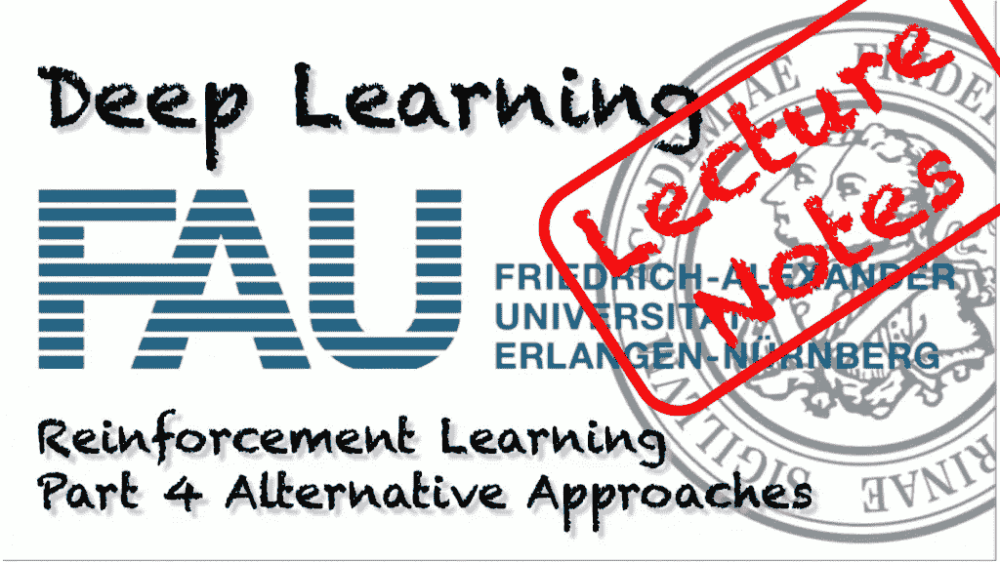
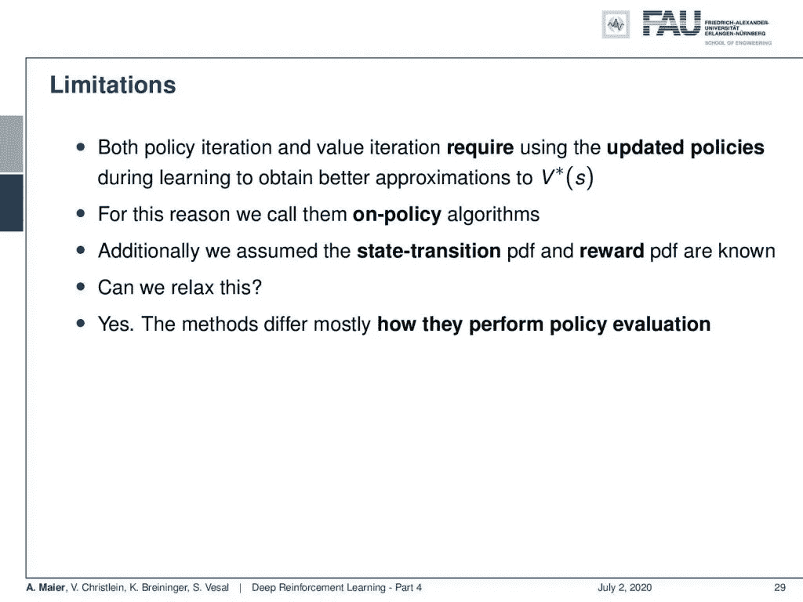
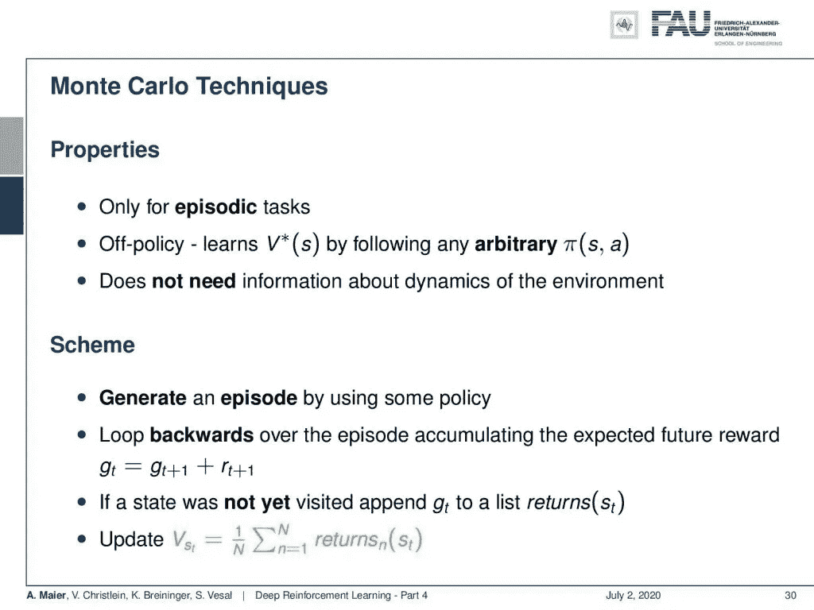
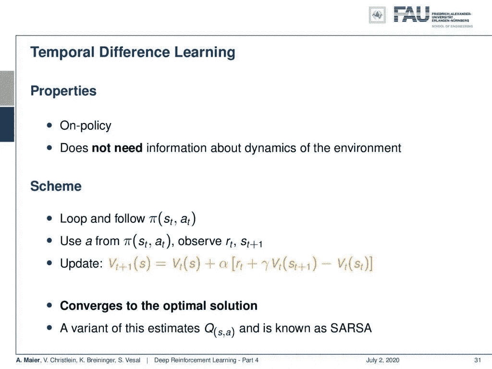
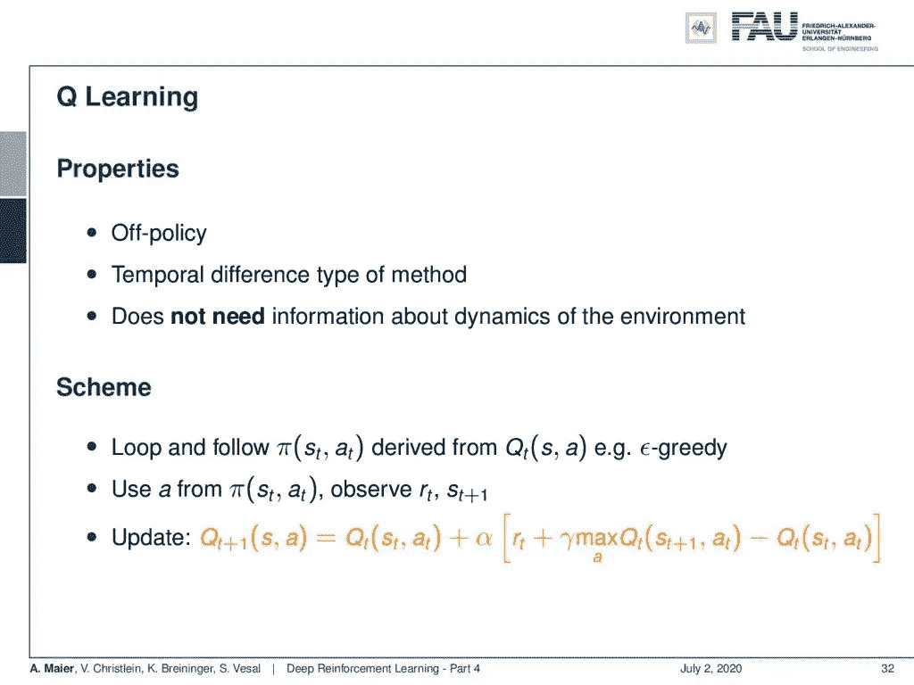
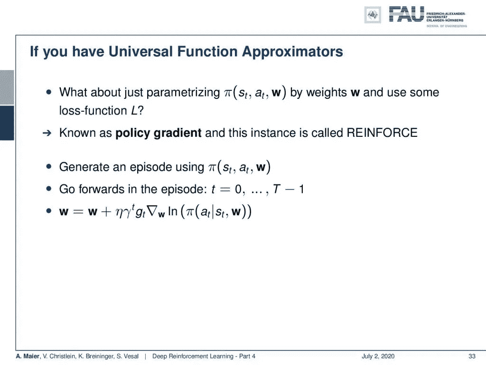
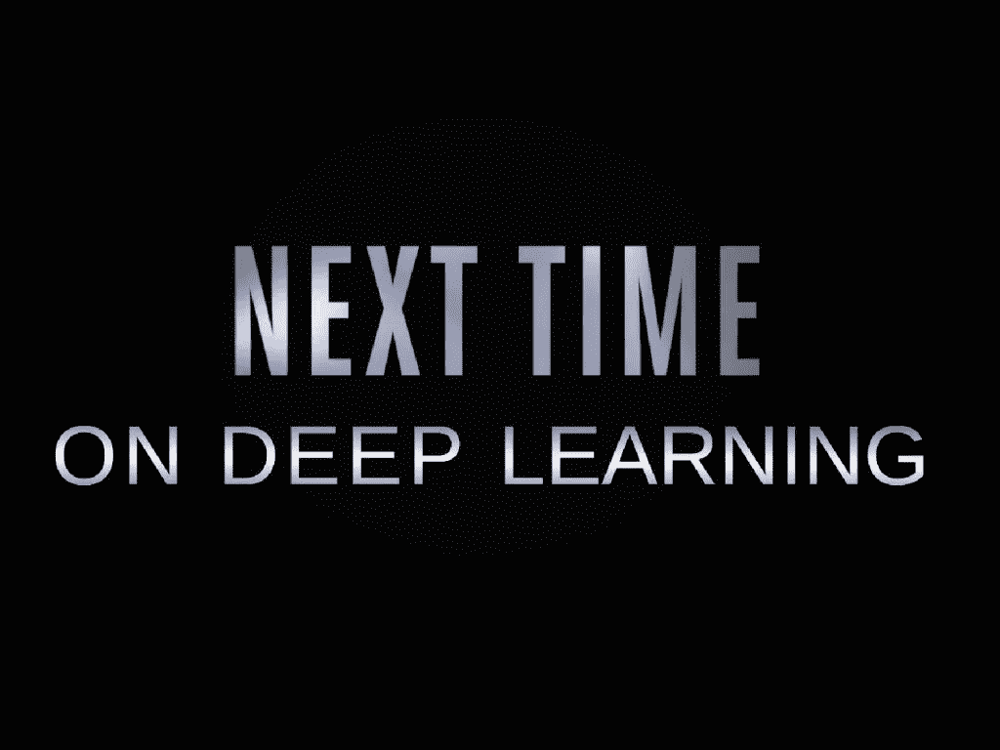

# 强化学习—第 4 部分

> 原文：<https://towardsdatascience.com/reinforcement-learning-part-4-3c51edd8c4bf?source=collection_archive---------52----------------------->

## [FAU 讲座笔记](https://towardsdatascience.com/tagged/fau-lecture-notes)关于深度学习

## 替代方法

FAU 大学的深度学习。下图 [CC BY 4.0](https://creativecommons.org/licenses/by/4.0/) 来自[深度学习讲座](https://www.youtube.com/watch?v=p-_Stl0t3kU&list=PLpOGQvPCDQzvgpD3S0vTy7bJe2pf_yJFj&index=1)

**这些是 FAU 的 YouTube 讲座** [**深度学习**](https://www.youtube.com/watch?v=p-_Stl0t3kU&list=PLpOGQvPCDQzvgpD3S0vTy7bJe2pf_yJFj&index=1) **的讲义。这是与幻灯片匹配的讲座视频&的完整抄本。我们希望，你喜欢这个视频一样多。当然，这份抄本是用深度学习技术在很大程度上自动创建的，只进行了少量的手动修改。** [**自己试试吧！如果您发现错误，请告诉我们！**](http://autoblog.tf.fau.de/)

# 航行

[**上一讲**](/reinforcement-learning-part-3-711e31967398) **/** [**观看本视频**](https://youtu.be/XbW-pUEs6PI) **/** [**顶级**](/all-you-want-to-know-about-deep-learning-8d68dcffc258)/[**下一讲**](/reinforcement-learning-part-5-70d10e0ca3d9)

刺猬索尼克也被看作是关于强化学习的。使用 [gifify](https://github.com/vvo/gifify) 创建的图像。来源: [YouTube](https://youtu.be/M0HTgnwPtmU) 。

欢迎回到深度学习！今天，除了您在之前的视频中看到的策略迭代概念，我们还想讨论一些其他的强化学习方法。让我们看看今天我为你们带来了什么。我们将研究其他解决方法。

政策迭代的局限性。 [CC 下的图片来自](https://creativecommons.org/licenses/by/4.0/)[深度学习讲座](https://www.youtube.com/watch?v=p-_Stl0t3kU&list=PLpOGQvPCDQzvgpD3S0vTy7bJe2pf_yJFj&index=1)的 4.0 。

您可以看到，在我们之前讨论的策略和值迭代中，它们需要在学习期间更新策略，以获得我们的最佳状态值函数的更好近似。这些被称为策略算法，因为你需要 n 个策略。该政策正在更新。此外，我们假设状态转换和奖励是已知的。因此，产生新状态和新奖励的概率密度函数是已知的。如果他们不是，那么你不能应用以前的概念。所以，这很重要，当然有方法可以让你放松。因此，这些方法的主要区别在于它们如何执行策略评估。那么，让我们来看几个替代方案。

蒙特卡洛技术。来自[深度学习讲座](https://www.youtube.com/watch?v=p-_Stl0t3kU&list=PLpOGQvPCDQzvgpD3S0vTy7bJe2pf_yJFj&index=1)的 [CC BY 4.0](https://creativecommons.org/licenses/by/4.0/) 下的图片。

我想给你们看的第一个是基于蒙特卡罗技术的。这仅适用于偶发任务。在这里，这个想法是不符合政策的。因此，您可以通过遵循任意策略来了解最佳状态值。你用什么策略并不重要。所以这是一个武断的政策。可能是多份保单。当然，你仍然有探索/开发的困境。所以你要选择真正覆盖所有州的政策。您不需要关于环境动态的信息，因为您可以简单地运行许多临时任务。你试图到达所有可能的状态。如果您这样做，那么您可以使用一些策略来生成这些剧集。然后，你反向循环一集，积累预期的未来回报。因为你一直玩游戏到最后，所以你可以在这一集的时间上倒退，累积已经获得的不同奖励。如果一个州还没有被访问过，你可以把它添加到一个列表中，然后使用这个列表来计算状态值函数的更新。所以，你可以看到这只是特定状态下这些列表的总和。这将允许您更新您的状态值，这样您就可以迭代，以实现最佳的状态值函数。

时间差异学习。 [CC 下的图片来自](https://creativecommons.org/licenses/by/4.0/)[深度学习讲座](https://www.youtube.com/watch?v=p-_Stl0t3kU&list=PLpOGQvPCDQzvgpD3S0vTy7bJe2pf_yJFj&index=1)的 4.0 。

现在，另一个概念是时间差异学习。这是一种符合政策的方法。同样，它不需要关于环境动态的信息。这里的方案是，你循环并遵循一定的策略。然后，您使用策略中的一个动作来观察奖励和新状态。您可以使用先前的状态值函数加上α来更新您的状态值函数，α用于加权新观察的影响乘以新奖励加上新状态的旧状态值函数的折扣版本，然后减去旧状态的值。这样，你可以生成更新，这实际上会收敛到最优解。这种方法的一个变体实际上估计了动作值函数，然后被称为 SARSA。

q 学习。来自[深度学习讲座](https://www.youtube.com/watch?v=p-_Stl0t3kU&list=PLpOGQvPCDQzvgpD3S0vTy7bJe2pf_yJFj&index=1)的 [CC BY 4.0](https://creativecommons.org/licenses/by/4.0/) 下的图片。

q 学习是一种脱离政策的方法。这是一种时间差分类型的方法，但它不需要关于环境动态的信息。这里的想法是，你循环并遵循从你的动作值函数中导出的策略。例如，您可以使用ε-贪婪型方法。然后，你使用策略中的动作来观察你的奖励和你的新状态。接下来，您使用前一个行动值加上某个加权因子，再乘以观察到的奖励，更新您的行动值函数，再乘以贴现行动，该贴现行动将从生成的状态减去前一个状态的行动值函数，得出您已经知道的最大行动值。所以这又是一种时间差异，你在这里用它来更新你的行动值函数。

使用通用函数逼近器的 q 学习。 [CC 下的图片来自](https://creativecommons.org/licenses/by/4.0/)[深度学习讲座](https://www.youtube.com/watch?v=p-_Stl0t3kU&list=PLpOGQvPCDQzvgpD3S0vTy7bJe2pf_yJFj&index=1)的 4.0 。

好吧，如果你有通用函数逼近器，那么用权重和一些损失函数来参数化你的策略怎么样？这就是所谓的政策梯度。这种情况称为加强。所以，你用你的策略和权重生成一集。然后，你在你的剧集中从时间 0 前进到时间 t-1。如果你这样做，你实际上可以计算相对于重量的梯度。您使用这个渐变来更新您的权重。与我们之前在学习方法中看到的非常相似。你可以看到，这个在策略上使用梯度的想法，给了你一个如何更新权重的想法，也是一个学习率。我们现在离我们早期的机器学习想法已经很近了。

在这个深度学习讲座中，更多令人兴奋的事情即将到来。来自[深度学习讲座](https://www.youtube.com/watch?v=p-_Stl0t3kU&list=PLpOGQvPCDQzvgpD3S0vTy7bJe2pf_yJFj&index=1)的 [CC BY 4.0](https://creativecommons.org/licenses/by/4.0/) 下的图片。

这就是为什么我们在下一个视频中谈论深度 Q 学习，这是一种强化学习的深度学习版本。所以，希望你喜欢这个视频。现在，您已经看到了如何实际确定最佳状态值和动作值函数的其他选项。这样，我们已经看到，有许多不同的想法不再需要关于如何产生未来状态和如何产生未来回报的确切知识。有了这些想法，你也可以进行强化学习，尤其是政策梯度的想法。我们已经看到，这与我们在这门课早些时候看到的机器学习和深度学习方法非常一致。我们将在下一个视频中讨论这个想法。非常感谢大家的收听，下期视频再见。拜拜。

对于今天的强化学习方法来说，Sonic 仍然是一个挑战。使用 [gifify](https://github.com/vvo/gifify) 创建的图像。来源: [YouTube](https://youtu.be/M0HTgnwPtmU)

如果你喜欢这篇文章，你可以在这里找到更多的文章，或者看看我们的讲座。如果你想在未来了解更多的文章、视频和研究，我也会很感激关注 [YouTube](https://www.youtube.com/c/AndreasMaierTV) 、 [Twitter](https://twitter.com/maier_ak) 、[脸书](https://www.facebook.com/andreas.maier.31337)或 [LinkedIn](https://www.linkedin.com/in/andreas-maier-a6870b1a6/) 。本文以 [Creative Commons 4.0 归属许可](https://creativecommons.org/licenses/by/4.0/deed.de)发布，如果引用，可以转载和修改。如果你有兴趣从视频讲座中获得文字记录，试试[自动博客](http://autoblog.tf.fau.de/)。

# 链接

[链接](http://incompleteideas.net/book/bookdraft2018jan1.pdf)到萨顿 2018 年草案中的强化学习，包括深度 Q 学习和 Alpha Go 细节

# 参考

[1]大卫·西尔弗、阿贾·黄、克里斯·J·马迪森等，“用深度神经网络和树搜索掌握围棋”。载于:自然 529.7587 (2016)，第 484–489 页。
【2】大卫·西尔弗、朱利安·施利特维泽、卡伦·西蒙扬等人《在没有人类知识的情况下掌握围棋游戏》。载于:自然 550.7676 (2017)，第 354 页。
【3】David Silver，Thomas Hubert，Julian Schrittwieser，等《用通用强化学习算法通过自玩掌握国际象棋和松木》。载于:arXiv 预印本 arXiv:1712.01815 (2017)。
[4] Volodymyr Mnih，Koray Kavukcuoglu，David Silver 等，“通过深度强化学习实现人类水平的控制”。载于:自然杂志 518.7540 (2015)，第 529-533 页。
【5】马丁·穆勒。《电脑围棋》。摘自:人工智能 134.1 (2002)，第 145-179 页。
[6]理查德·萨顿和安德鲁·g·巴尔托。强化学习导论。第一名。美国麻省剑桥:麻省理工学院出版社，1998 年。