# 强化学习—第 5 部分

> 原文：<https://towardsdatascience.com/reinforcement-learning-part-5-70d10e0ca3d9?source=collection_archive---------49----------------------->

## [FAU 讲座笔记](https://towardsdatascience.com/tagged/fau-lecture-notes)关于深度学习

## 深度 Q 学习

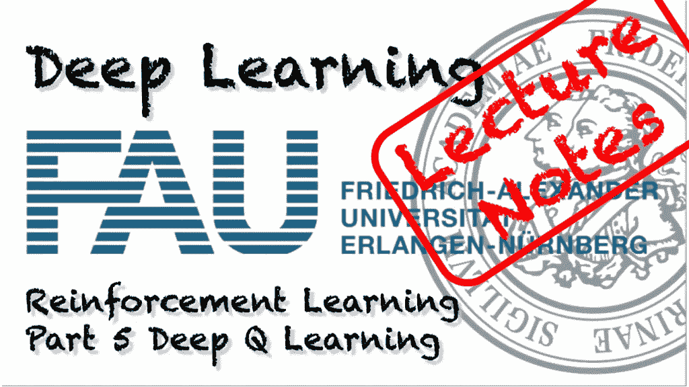

FAU 大学的深度学习。下图 [CC BY 4.0](https://creativecommons.org/licenses/by/4.0/) 来自[深度学习讲座](https://www.youtube.com/watch?v=p-_Stl0t3kU&list=PLpOGQvPCDQzvgpD3S0vTy7bJe2pf_yJFj&index=1)

**这些是 FAU 的 YouTube 讲座** [**深度学习**](https://www.youtube.com/watch?v=p-_Stl0t3kU&list=PLpOGQvPCDQzvgpD3S0vTy7bJe2pf_yJFj&index=1) **的讲义。这是讲座视频&配套幻灯片的完整抄本。我们希望，你喜欢这个视频一样多。当然，这份抄本是用深度学习技术在很大程度上自动创建的，只进行了少量的手动修改。** [**自己试试吧！如果您发现错误，请告诉我们！**](http://autoblog.tf.fau.de/)

# 航行

[**上一讲**](/reinforcement-learning-part-4-3c51edd8c4bf) **/** [**观看本视频**](https://youtu.be/ENVGSYX9itA) **/** [**顶级**](/all-you-want-to-know-about-deep-learning-8d68dcffc258)/[**下一讲**](/unsupervised-learning-part-1-c007f0c35669)

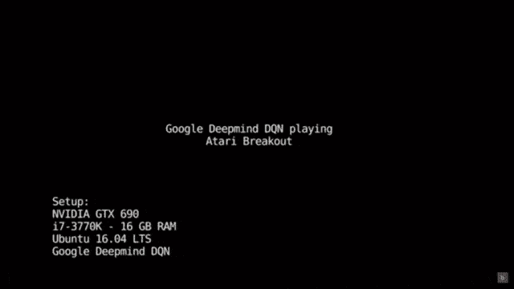

突破很难学。使用 [gifify](https://github.com/vvo/gifify) 创建的图像。来源: [YouTube](https://youtu.be/eG1Ed8PTJ18)

欢迎回到深度学习！今天，我们想谈谈深度强化学习。我有几张幻灯片给你们看。当然，我们希望建立在我们在强化学习中看到的概念之上，但我们今天谈论的是深度 Q 学习。

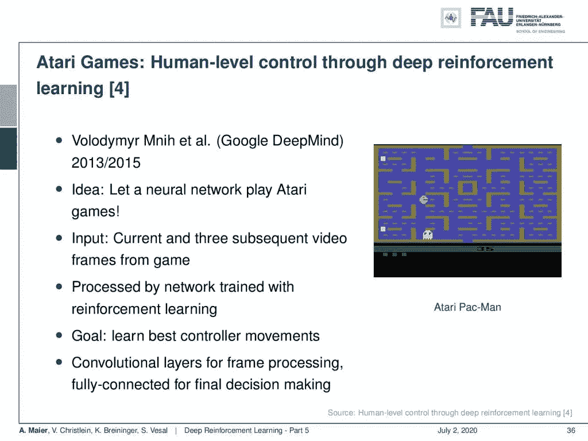

怎样才能学会玩雅达利游戏？ [CC 下的图片来自](https://creativecommons.org/licenses/by/4.0/)[深度学习讲座](https://www.youtube.com/watch?v=p-_Stl0t3kU&list=PLpOGQvPCDQzvgpD3S0vTy7bJe2pf_yJFj&index=1)的 4.0 。

一个非常著名的例子是通过深度强化学习的人类水平的控制。在[4]中，这是由 Google Deepmind 完成的。他们展示了一个能够玩雅达利游戏的神经网络。因此，这里的想法是使用深度网络直接学习动作值函数。输入基本上是来自游戏的三个连续的视频帧，这由深度网络处理。它会产生最佳的下一步行动。因此，现在的想法是使用这个深度强化框架来学习最佳的下一个控制器动作。他们在卷积层进行帧处理，然后在全连接层进行最终决策。

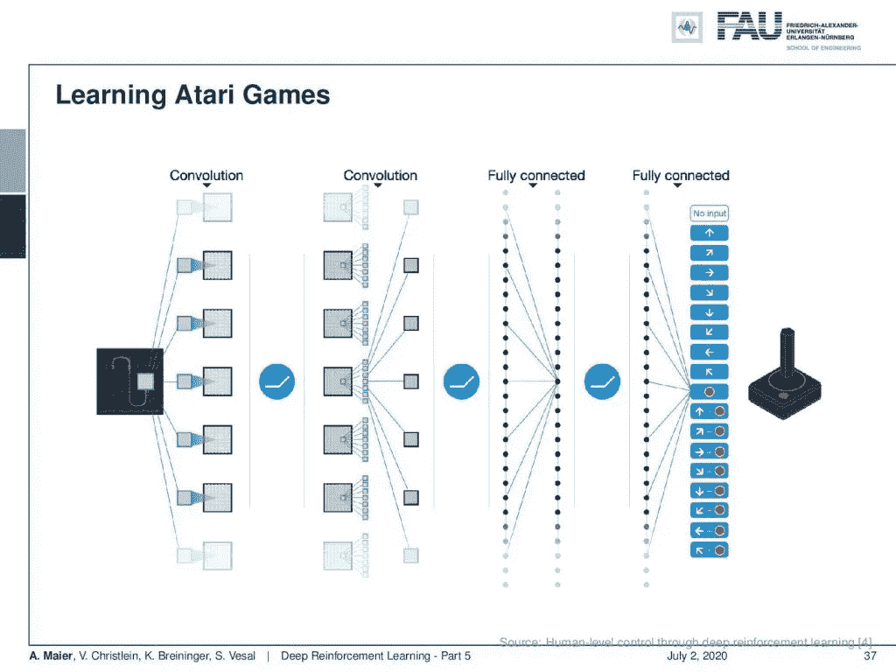

所用网络概述。 [CC 下的图片来自](https://creativecommons.org/licenses/by/4.0/)[深度学习讲座](https://www.youtube.com/watch?v=p-_Stl0t3kU&list=PLpOGQvPCDQzvgpD3S0vTy7bJe2pf_yJFj&index=1)的 4.0 。

在这里，你可以看到建筑的主要思想。所以有这些卷积层和 ReLUs。这些处理器处理输入帧。然后，你进入完全连接的层，再进入完全连接的层。最后，你直接产生输出，你可以看到在 Atari 游戏中，这是一个非常有限的集合。所以你可以什么都不做，然后本质上有八个方向，有一个发射按钮，有八个方向加上发射按钮。这就是你能做的所有不同的事情。所以，这是一个有限的领域，你可以用它来训练你的系统。

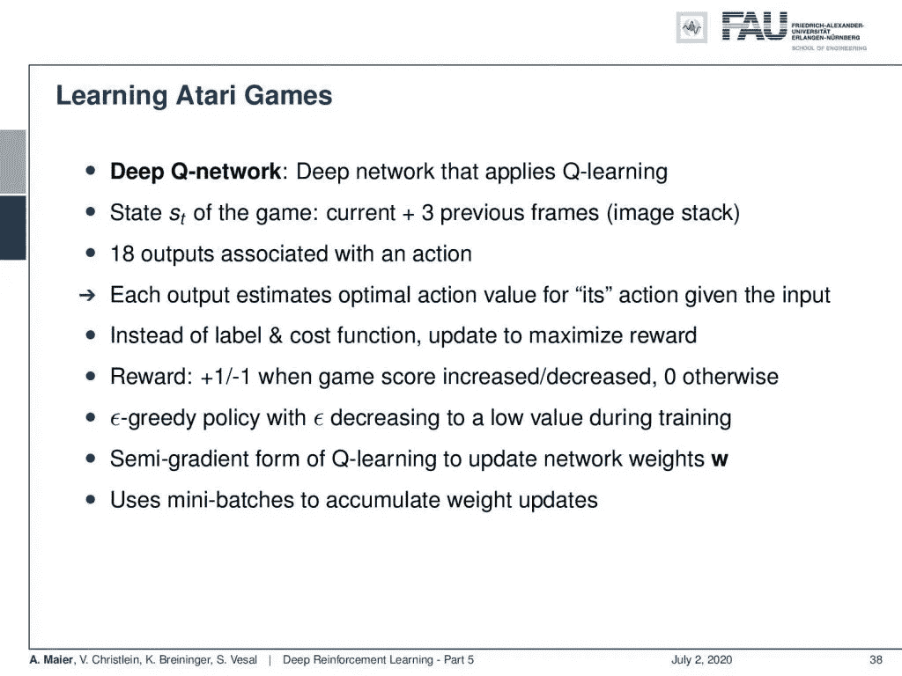

成功的学习实际上需要更多。来自[深度学习讲座](https://www.youtube.com/watch?v=p-_Stl0t3kU&list=PLpOGQvPCDQzvgpD3S0vTy7bJe2pf_yJFj&index=1)的 [CC BY 4.0](https://creativecommons.org/licenses/by/4.0/) 下的图片。

嗯，是直接应用 Q-learning 的深度网络。游戏的状态本质上是当前帧加上前三帧作为图像堆栈。所以，你有一个相当模糊的方法来整合记忆和状态。然后，您有 18 个与不同动作相关联的输出，每个输出估计给定输入的动作。你没有一个标签和一个成本函数，但是你可以根据未来回报的最大化来更新。游戏分数增加时奖励+1，游戏分数减少时奖励-1。否则就是零分。它们使用ε-贪婪策略，在训练期间ε减小到一个低值。他们使用 Q 学习的半梯度形式来更新网络权重 **w** ，并且再次使用小批量来累积权重更新。

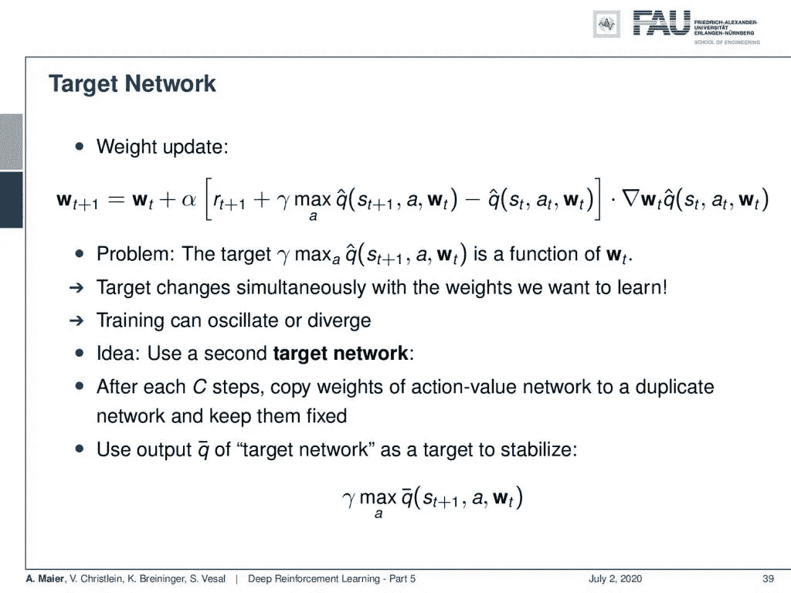

目标网络的权重更新。 [CC 下的图片来自](https://creativecommons.org/licenses/by/4.0/)[深度学习讲座](https://www.youtube.com/watch?v=p-_Stl0t3kU&list=PLpOGQvPCDQzvgpD3S0vTy7bJe2pf_yJFj&index=1)的 4.0 。

因此，他们有了这个目标网络，并使用以下规则对其进行更新(见幻灯片)。你可以看到，这与我们在之前的视频中看到的非常接近。同样，你有权重，你根据奖励更新它们。当然，现在的问题是，这个γ和最大 q 函数的选择又是权重的函数。所以，你现在有一个依赖于最大化的权重，你试图更新。所以，你的目标随着我们想要学习的重量同时改变。这实际上会导致你的体重摆动或分散。所以，这不是很好。为了解决这个问题，他们引入了第二个目标网络。在 C 步骤之后，他们通过将行动-价值网络的权重复制到一个复制网络中并保持固定来生成这一点。于是，你用目标网络的输出 q 条作为目标，稳定之前的最大化。你不使用 q hat，你正在尝试学习的函数，但是你使用 q bar，它是一种固定的版本，你用它来进行几次迭代。

经验回放有助于保持学习的正轨。来自[深度学习讲座](https://www.youtube.com/watch?v=p-_Stl0t3kU&list=PLpOGQvPCDQzvgpD3S0vTy7bJe2pf_yJFj&index=1)的 [CC BY 4.0](https://creativecommons.org/licenses/by/4.0/) 下的图片。

他们使用的另一个技巧是体验回放。这里的想法是减少更新之间的相关性。因此，在对图像堆栈执行了一个下标 t 的操作并收到奖励后，您将它添加到重放内存中。你在这个重放记忆中积累经验，然后用从这个记忆中随机抽取的样本而不是最近的样本来更新网络。这样，你可以稳定下来，同时不要太专注于游戏中的某个特定情况。你试着记住游戏中所有不同的情况，这消除了对当前重量的依赖，增加了稳定性。我给你举个小例子。

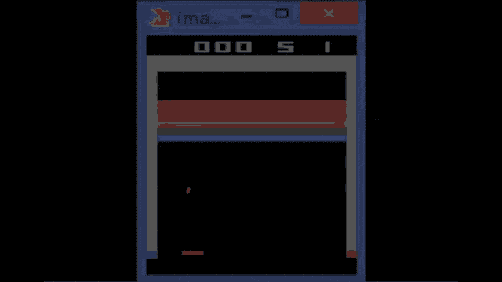

240 小时的训练很有帮助。使用 [gifify](https://github.com/vvo/gifify) 创建的图像。来源: [YouTube](https://youtu.be/V1eYniJ0Rnk)

所以，这是雅达利突破游戏，你可以看到，在开始时，代理人的表现不是很好。如果你反复训练它，你会发现这个游戏玩得更好。所以这个系统学习如何用球拍跟随球，然后它能够反映球。你可以看到，如果你一次又一次地迭代，你可以争辩说，在某些时候，强化学习系统也找出了游戏的弱点。特别是，如果你设法把球带到砖块后面，然后让他们在那里跳来跳去，你就可以得到很多分。它将被边界而不是球拍所反映，它将产生一个很大的分数。所以，这是一个声明，系统已经学会了一个好的策略，只踢左边的砖块。然后，它需要让球进入其他砖块后面的区域。

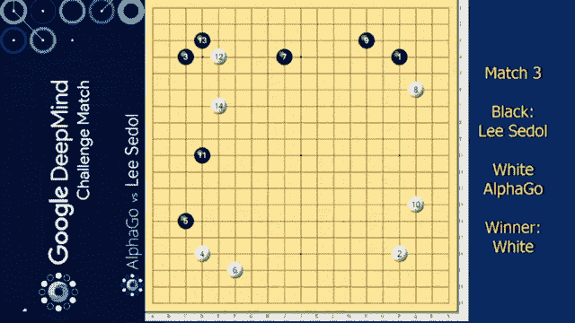

游戏快进 Lee Sedol vs. AlphaGo。使用 [gifify](https://github.com/vvo/gifify) 创建的图像。来源: [YouTube](https://youtu.be/qssMuKtorkk)

当然，我们需要在这个视频里说说 AlphaGo。我们想了解它实际上是如何实现的一些细节。你已经听说过这个了。所以是出自《用深度神经网络掌握围棋博弈》这篇论文。

围棋比国际象棋难多了。来自[深度学习讲座](https://www.youtube.com/watch?v=p-_Stl0t3kU&list=PLpOGQvPCDQzvgpD3S0vTy7bJe2pf_yJFj&index=1)的 [CC BY 4.0](https://creativecommons.org/licenses/by/4.0/) 下的图片。

所以，我们已经讨论过，围棋比国际象棋更难，因为它有很多可能的走法。由于可能会出现大量可能的状态，所以想法是黑方与白方争夺对棋盘的控制权。它有简单的规则，但有非常多的可能的移动和情况。由于这个问题在数值上的高度复杂性，要达到人类玩家的表现被认为是多年以后的事。因此，我们可以蛮力下棋，但人们认为这是不可能的，直到我们有更快的计算机——快几个数量级的计算机。他们可以证明他们真的可以用这个系统打败人类围棋专家。所以，围棋是一个完美的信息游戏。没有隐藏信息，也没有机会。因此，理论上，我们可以构建一个完整的博弈树，并用最小-最大遍历它，以找到最好的移动。问题在于大量的法律诉讼。所以在国际象棋中，你大约有 35 个。在围棋中，你可以在游戏的每一步中走 250 种不同的棋。

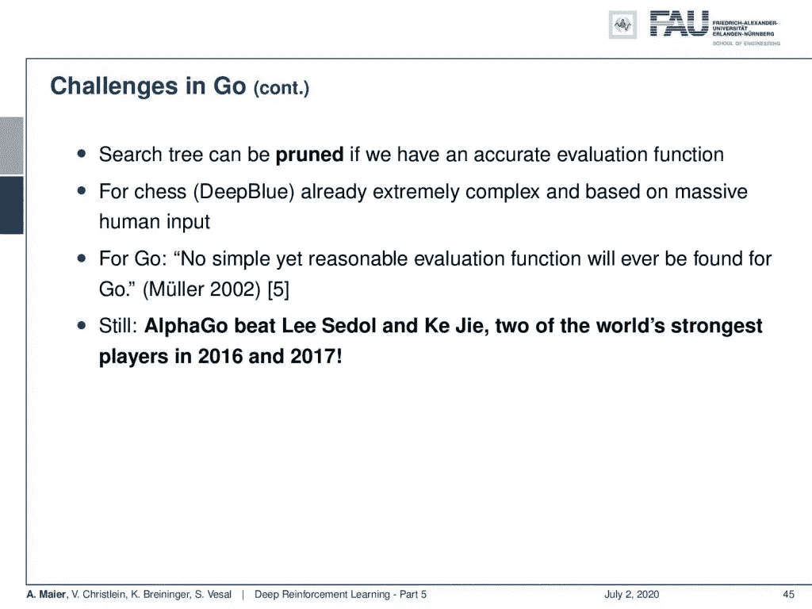

2002 年，解决围棋问题被认为是几十年后的事情。 [CC 下的图片来自](https://creativecommons.org/licenses/by/4.0/)[深度学习讲座](https://www.youtube.com/watch?v=p-_Stl0t3kU&list=PLpOGQvPCDQzvgpD3S0vTy7bJe2pf_yJFj&index=1)的 4.0 。

此外，游戏可能涉及许多步骤。所以大约有 150 人。这意味着穷举搜索是完全不可行的。当然，如果你有一个精确的评估函数，搜索树是可以被修剪的。对于国际象棋来说，如果你还记得深蓝，这已经非常复杂，并且是基于大量的人工输入。对于 2002 年的围棋，“永远找不到简单而合理的围棋评价。”是 2016 年和 2017 年最先进的油井；AlphaGo 击败了世界上最强的两名选手 Lee Sedol 和 Ke Kie。有一种方法可以解决这个博弈。

AlphaGo 使用了几种聪明的方法。来自[深度学习讲座](https://www.youtube.com/watch?v=p-_Stl0t3kU&list=PLpOGQvPCDQzvgpD3S0vTy7bJe2pf_yJFj&index=1)的 [CC BY 4.0](https://creativecommons.org/licenses/by/4.0/) 下的图片。

这篇论文中有几个非常好的想法。它是由 Silver 等人开发的。它也是 Deepmind，并且是多种方法的结合。当然，他们使用深度神经网络。然后，他们使用蒙特卡罗树搜索，并结合监督学习和强化学习。与全树搜索相比，第一个改进是蒙特卡罗树搜索。他们使用网络来支持通过树的有效搜索。

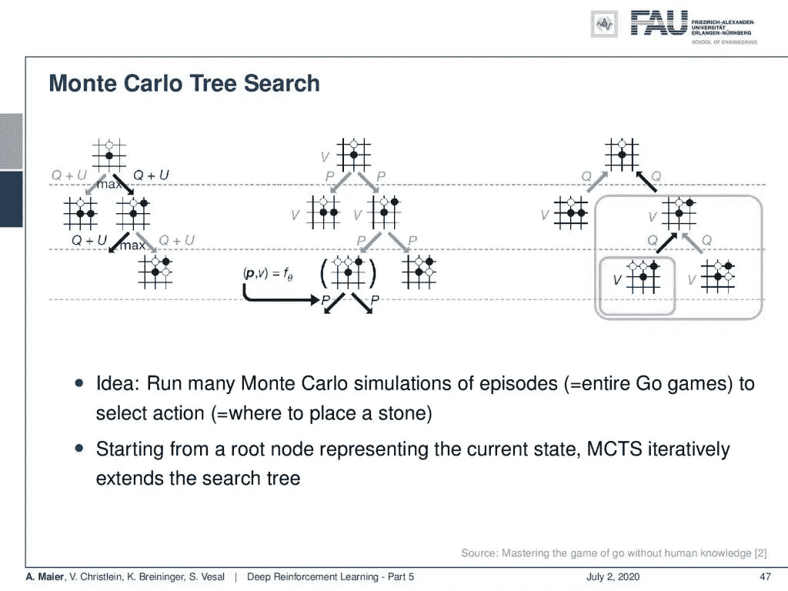

蒙特卡罗树搜索综述。 [CC 下的图片来自](https://creativecommons.org/licenses/by/4.0/)[深度学习讲座](https://www.youtube.com/watch?v=p-_Stl0t3kU&list=PLpOGQvPCDQzvgpD3S0vTy7bJe2pf_yJFj&index=1)的 4.0 。

那么，什么是蒙特卡罗树搜索？嗯，你通过寻找不同的未来可能的移动来扩展你的树，你寻找产生非常有价值的状态的移动。你将有价值的状态扩展到未来。然后，你还要看这些状态的值。所以你只查看几个有价值的状态，然后一遍又一遍地展开几个步骤。最后，您可以找到一种情况，其中您可能有一个更大的状态值。所以，你试着展望一下未来，跟随可能产生更高状态值的移动。

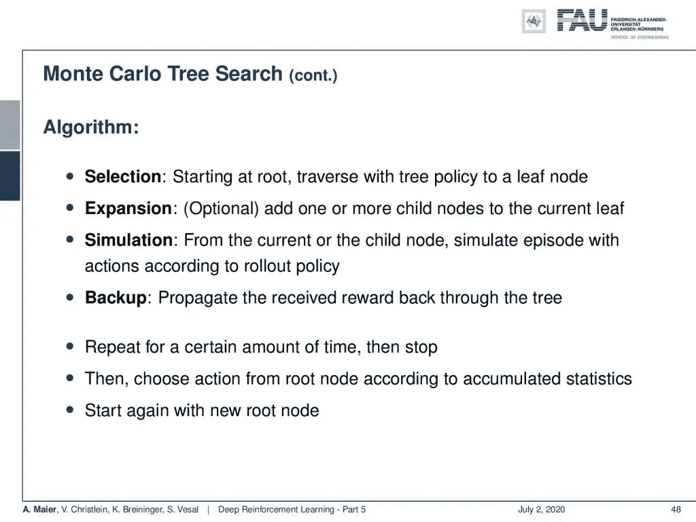

实际的蒙特卡罗树搜索算法。 [CC 下的图片来自](https://creativecommons.org/licenses/by/4.0/)[深度学习讲座](https://www.youtube.com/watch?v=p-_Stl0t3kU&list=PLpOGQvPCDQzvgpD3S0vTy7bJe2pf_yJFj&index=1)的 4.0 。

因此，您从当前状态的根节点开始。然后，您迭代地这样做，直到您扩展搜索树以找到最佳的未来状态。算法是这样的:从根节点开始，用树策略遍历到一个叶节点。然后，展开并向当前叶添加一个或多个子节点，这些子节点可能具有有价值的状态。接下来，根据您的展开策略，从当前或子节点模拟带有动作的剧集。所以，你也需要一个政策来扩展这里。然后，您可以备份并通过树向后传播收到的奖励。这允许您找到具有较大状态值的未来状态。所以，你重复这个动作一段时间。最后，你停下来，根据累积的统计数据从根音符中选择动作。下一步，你必须根据你的对手实际采取的行动，用一个新的根音重新开始。

让 AlphaGo 运行起来的更多技巧。来自[深度学习讲座](https://www.youtube.com/watch?v=p-_Stl0t3kU&list=PLpOGQvPCDQzvgpD3S0vTy7bJe2pf_yJFj&index=1)的 [CC BY 4.0](https://creativecommons.org/licenses/by/4.0/) 下的图片。

因此，树策略指导成功路径的使用程度和查看频率。这是一个典型的勘探/开采权衡。当然，这里的主要问题是，普通的蒙特卡罗树搜索对于围棋来说不够精确。AlphaGo 的想法是用神经网络来控制树的扩展，以找到有希望的动作，然后通过神经网络来改善值的估计。所以，在扩展和评估方面，这比搜索一棵树更有效，这意味着你最好放手。

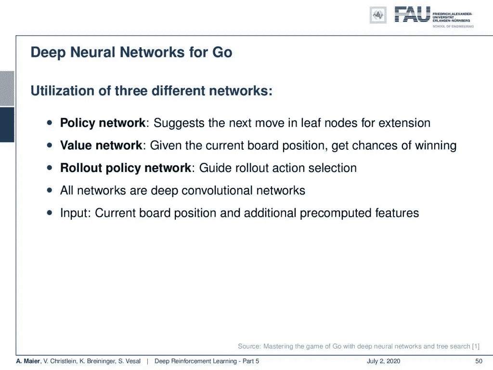

在 AlphaGo 中我们实际上需要三个网络。 [CC 下的图片来自](https://creativecommons.org/licenses/by/4.0/)[深度学习讲座](https://www.youtube.com/watch?v=p-_Stl0t3kU&list=PLpOGQvPCDQzvgpD3S0vTy7bJe2pf_yJFj&index=1)的 4.0 。

他们是如何使用这些深度神经网络的？他们有三个不同的网络。他们有一个策略网络，为扩展建议叶节点中的下一步移动。然后，他们有一个价值网络，查看当前的董事会情况，并计算基本上获胜的机会。最后，他们有一个部署策略网络来指导部署操作的选择。所有这些网络都是深度卷积网络，输入是当前棋盘位置和其他预先计算的特征。

政策网络。 [CC 下的图片来自](https://creativecommons.org/licenses/by/4.0/)[深度学习讲座](https://www.youtube.com/watch?v=p-_Stl0t3kU&list=PLpOGQvPCDQzvgpD3S0vTy7bJe2pf_yJFj&index=1)的 4.0 。

这是政策网络。它有 13 个卷积层，围棋棋盘上的每个点有一个输出。然后，一个巨大的人类专家动作数据库，有 3000 万个。他们从监督学习开始，训练网络来预测人类专家游戏的下一步。然后，他们通过与旧版本的自我比赛，用强化学习来训练这个网络，并且他们会因为赢得比赛而获得奖励。当然，所有的版本都避免了相关性不稳定性。如果你看看训练时间，有三个星期在 50 个 GPU 上用于监督部分，一天用于强化学习。所以，实际上这里涉及了相当多的监督学习，而不是强化学习。

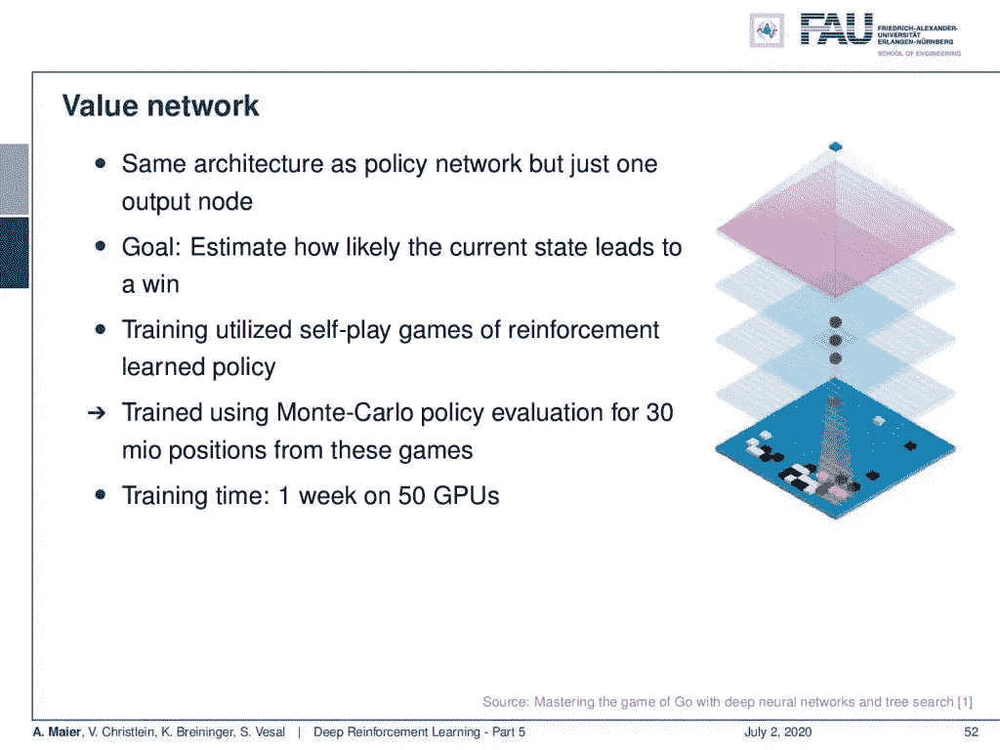

价值网络。来自[深度学习讲座](https://www.youtube.com/watch?v=p-_Stl0t3kU&list=PLpOGQvPCDQzvgpD3S0vTy7bJe2pf_yJFj&index=1)的 [CC BY 4.0](https://creativecommons.org/licenses/by/4.0/) 下的图片。

这是价值网络。这与策略网络具有相同的架构，但是只有一个输出节点。这里的目标是预测赢得比赛的概率。他们再次在强化学习的自我游戏上训练，并对来自这些游戏的 3000 万个位置使用蒙特卡罗策略评估。在 50 个 GPU 上训练时间为一周。

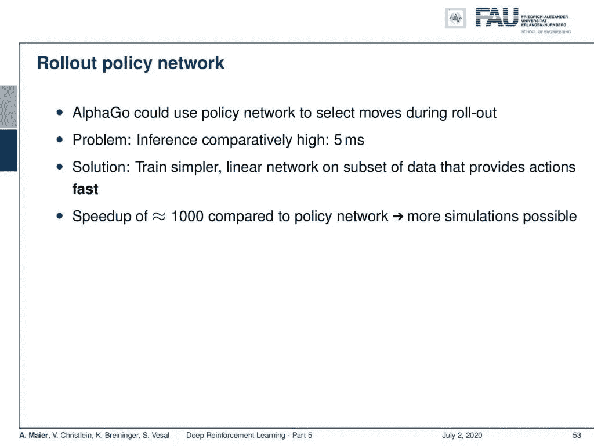

政策推广网络。 [CC 下的图片来自](https://creativecommons.org/licenses/by/4.0/)[深度学习讲座](https://www.youtube.com/watch?v=p-_Stl0t3kU&list=PLpOGQvPCDQzvgpD3S0vTy7bJe2pf_yJFj&index=1)的 4.0 。

然后，他们有了部署策略网络，可以在部署期间使用该网络来选择移动。当然，这里的问题是推理时间相对较长，解决方案是在数据子集上训练一个更简单的线性网络，以非常快速地提供动作。因此，与策略网络相比，这导致了大约 1000 倍的速度提升。因此，如果您使用这种推广政策网络，那么您的网络会更细，但速度会更快。所以，你可以多做模拟，多收集经验。所以，这就是为什么他们使用这个推广政策网络。

AlphaGo Zero 不再需要任何人类棋手。 [CC 下的图片来自](https://creativecommons.org/licenses/by/4.0/)[深度学习讲座](https://www.youtube.com/watch?v=p-_Stl0t3kU&list=PLpOGQvPCDQzvgpD3S0vTy7bJe2pf_yJFj&index=1)的 4.0 。

现在，这里涉及了相当多的监督学习。那么，我们来看看 AlphaGo zero。现在，AlphaGo zero 已经不需要人类下棋了。所以，这里的想法是，然后你只玩强化学习和自我游戏。它具有更简单的蒙特卡罗树搜索，并且在蒙特卡罗树搜索中没有部署策略网络。同样，在自我游戏中，他们也引入了多任务学习。因此，政策和价值网络共享初始层。这就导致了[3]和扩展也能够玩国际象棋和 shogi。所以，并不是只有代码才能解决围棋。有了这个，你也可以在专家的水平下象棋和松木。好吧。这总结了我们在强化学习中所做的。当然，我们可以在这里看很多其他的东西。然而，没有足够的时间。

在这个深度学习讲座中，更多令人兴奋的事情即将到来。来自[深度学习讲座](https://www.youtube.com/watch?v=p-_Stl0t3kU&list=PLpOGQvPCDQzvgpD3S0vTy7bJe2pf_yJFj&index=1)的 [CC BY 4.0](https://creativecommons.org/licenses/by/4.0/) 下的图片。

下一次深度学习，我们要讲的是连奖励都没有的算法。所以，完成无人监督的训练，我们也想学习如何从对手那里获益。我们会看到有一个非常酷的概念，叫做生成对抗网络，它能够生成各种不同的图像。另外，这是一个非常酷的概念，我们将在下一个视频中讨论，然后我们将研究执行图像处理任务的扩展。所以，我们越来越倾向于应用。

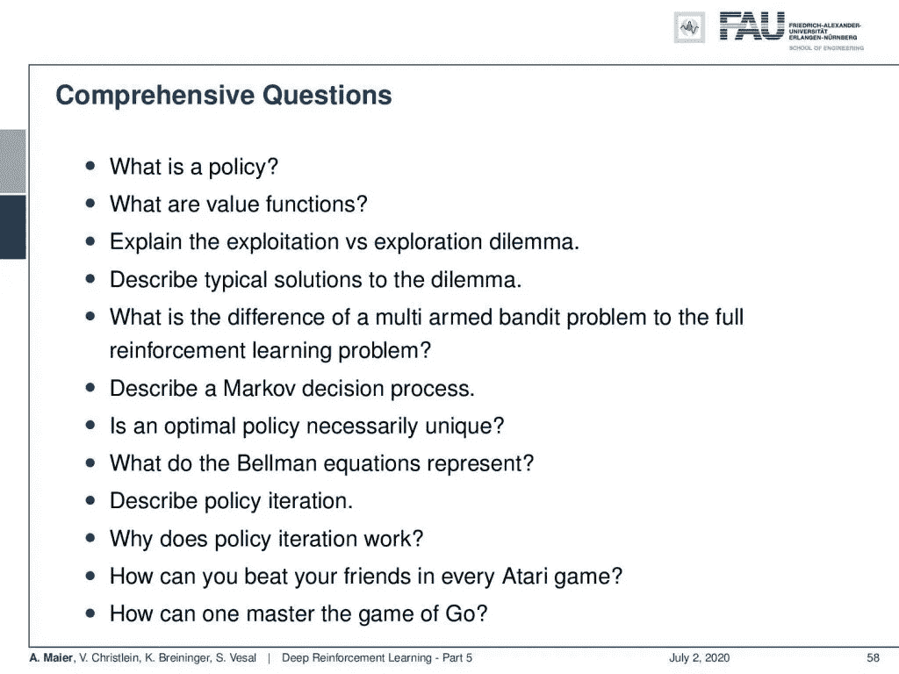

综合题。 [CC 下的图片来自](https://creativecommons.org/licenses/by/4.0/)[深度学习讲座](https://www.youtube.com/watch?v=p-_Stl0t3kU&list=PLpOGQvPCDQzvgpD3S0vTy7bJe2pf_yJFj&index=1)的 4.0 。

嗯，一些综合问题:什么是保单？什么是价值函数？解释开发与探索的困境，等等。如果你对强化学习感兴趣，我绝对推荐你看看理查德·萨顿的《强化学习》这本书。这真的是一本很棒的书，你会学到很多我们只能在这些视频中粗略了解的东西。所以，你可以更深入地了解强化学习的所有细节，以及深度强化学习。关于这一点，实际上还有很多要说的，但我们暂时只能停留在这个水平。嗯，我还给你带来了[链接](http://incompleteideas.net/book/bookdraft2018jan1.pdf)，我也把链接放到了视频描述中。所以请欣赏这本书，它非常好，当然，我们有很多进一步的参考。

非常感谢你们的聆听，我希望你们现在至少能理解一点强化学习和深度强化学习中发生的事情，以及执行游戏学习的主要思想。所以，非常感谢你观看这个视频，希望在下一个视频中见到你。拜拜。

如果你喜欢这篇文章，你可以在这里找到更多的文章，或者看看我们的讲座。如果你想在未来了解更多的文章、视频和研究，我也会很感激关注 [YouTube](https://www.youtube.com/c/AndreasMaierTV) 、 [Twitter](https://twitter.com/maier_ak) 、[脸书](https://www.facebook.com/andreas.maier.31337)或 [LinkedIn](https://www.linkedin.com/in/andreas-maier-a6870b1a6/) 。本文以 [Creative Commons 4.0 归属许可](https://creativecommons.org/licenses/by/4.0/deed.de)发布，如果引用，可以转载和修改。如果你有兴趣从视频讲座中获得文字记录，试试[自动博客](http://autoblog.tf.fau.de/)。

# 链接

[链接](http://incompleteideas.net/book/bookdraft2018jan1.pdf)到萨顿 2018 年草案中的强化学习，包括深度 Q 学习和 Alpha Go 细节

# 参考

[1]大卫·西尔弗、阿贾·黄、克里斯·J·马迪森等，“用深度神经网络和树搜索掌握围棋”。载于:自然 529.7587 (2016)，第 484–489 页。
【2】大卫·西尔弗、朱利安·施利特维泽、卡伦·西蒙扬等人《在没有人类知识的情况下掌握围棋游戏》。载于:自然 550.7676 (2017)，第 354 页。
【3】David Silver，Thomas Hubert，Julian Schrittwieser，等《用通用强化学习算法通过自玩掌握国际象棋和松木》。载于:arXiv 预印本 arXiv:1712.01815 (2017)。
[4] Volodymyr Mnih，Koray Kavukcuoglu，David Silver 等，“通过深度强化学习实现人类水平的控制”。载于:自然杂志 518.7540 (2015)，第 529-533 页。
【5】马丁·穆勒。《电脑围棋》。摘自:人工智能 134.1 (2002)，第 145-179 页。
[6]理查德·萨顿和安德鲁·g·巴尔托。强化学习导论。第一名。美国麻省剑桥:麻省理工学院出版社，1998 年。