# 强化学习:利用动态规划求解马尔可夫决策过程

> 原文：<https://towardsdatascience.com/reinforcement-learning-solving-mdps-using-dynamic-programming-part-3-b53d32341540?source=collection_archive---------0----------------------->

## #解决马尔可夫决策过程

> 前两个故事是关于理解 [**马尔可夫-决策过程**](/introduction-to-reinforcement-learning-markov-decision-process-44c533ebf8da?source=friends_link&sk=9ecb7b106959a3ae34396f7924bec50d) 和 [**定义最优政策的贝尔曼方程和价值函数**](/reinforcement-learning-markov-decision-process-part-2-96837c936ec3?source=friends_link&sk=dfe522742d343e00fb089b041266db18) 。**在这一篇**中，我们将讨论**这些马尔可夫决策过程是如何求解的**。但在此之前，我们将定义**解决**马尔可夫决策过程的概念，然后，看看**不同的**动态规划算法，帮助我们**解决它们**。所以，在我们开始之前，让我们看看这个故事中我们要和谈些什么:

*   什么是 ***动态编程？***
*   ****解决*** *马氏决策过程**
*   *什么是 ***政策评估？****
*   *动态编程 ***算法 1****:****策略迭代****
*   ****修改*** *策略迭代**
*   *动态编程 ***算法 2****:****数值迭代****

*所以，给自己冲杯咖啡，保持清新，因为普通和非凡的区别就在于那一点点额外的东西。🤙*

## *什么是动态编程？*

*动态编程很像分而治之的方法，将一个问题分解为子问题，但唯一的区别是，不是独立地解决它们(像在分而治之中)，子问题的结果用于类似的子问题。动态编程的思想是你不需要解决一个你已经解决的问题。如果一个问题满足两个性质，则可以使用动态规划来解决该问题:*

*   *最优子结构:这意味着一个问题可以被分成子问题，如果我们找到这些子问题的最优解，那么我们可以使用这个最优解来找到整个问题的最优解。*
*   *重叠子问题:前面说过，如果一个问题有相似的子问题，就用动态规划。一个子问题的解决方案被保存，然后用于解决类似的子问题。*

****但是等等，马尔可夫决策过程有这两个性质吗？****

*对于第一个性质，我们有一个贝尔曼方程。 ***但是，如何？****

*回想一下，贝尔曼方程定义如下:*

*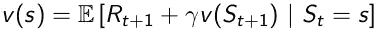*

*贝尔曼方程*

*记住贝尔曼方程所说的，一个状态的价值等于我们的代理人离开该状态得到的直接回报**加上下一个状态的价值**。所以，这个等式是**分解**的过程**通过把一个状态分成子问题来寻找这个状态的价值函数**。*

***其次**，对于**重叠子问题**，我们有价值函数。 ***如何？****

*看，值函数已经存储了一个特定状态有多好，所以我们不需要一次又一次地重新计算那个状态的值。 ***例如，假设有两个*** 状态(s[1]和 s[2])，我们处于状态 s[1]，并且我们已经计算了状态 s[2]的值，因此当计算状态 s[1]的值时，我们将不会重新计算状态 s[2]的值。(s[1]的值依赖于状态 s[2])*

## ***求解马尔可夫决策过程的概念***

> ****当我们说要解决一个马尔可夫决策过程时，我们的意思是什么？****

*这意味着我们要找到满足贝尔曼方程的值函数。一旦我们找到了最优值函数，那么我们就可以用它来寻找最优策略。*

*这个过程分为两个部分:*

1.  ****预测*** :假设我们有一个定义为(S，A，P，R，gamma)的马尔可夫决策过程，给定某个策略π。我们在预测中的工作是找到价值函数。我们通过使用贝尔曼期望方程评估一个策略来找到价值函数。*
2.  ****控制*** :这个过程涉及到优化值函数，我们在预测过程中计算。我们为我们的 ***马尔可夫决策过程*** 找到**最优值函数**和**最优策略**。*

*说到这里，我们来谈谈我们的第一个构建模块，即**政策评估**。*

## ****政策评估****

> ***同步备份:**这意味着我们将在计算状态值的马尔可夫决策过程中考虑每个状态。*

*政策评估意味着我们的代理人通过遵循特定的政策π将获得多少奖励。 ***但是我们如何评价一个政策π？****

*我们使用贝尔曼期望方程来评估给定的策略π。回想一下，贝尔曼期望方程告诉我们的代理人在遵循政策π的情况下将获得多少报酬，它被定义为:*

*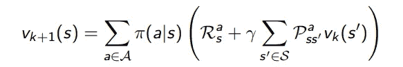*

*贝尔曼期望方程*

*现在，为了评估一个策略，我们要以迭代的方式使用这个等式。也就是说，我们将通过备份前一次迭代中当前状态的值来计算下一个状态的值。让我们通过一个例子来理解这一点:*

*请看下面的备份图:*

*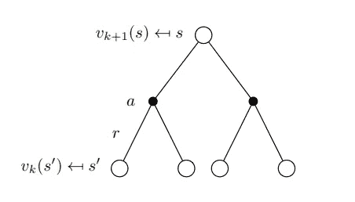*

*计算根节点值函数的备份图*

*我们知道，根节点[s]的值是由我们采取行动[a]得到的回报加上状态[s']的值给出的。现在，我们正在做的是，我们在动态规划中以迭代的方式使用贝尔曼期望方程。也就是说，当我们计算状态 s 的值时，我们将使用来自前一次迭代的树叶值(这里是状态[s'])来计算状态[s]的值。这在每次迭代中都会发生。现在，对于第二次迭代，我们将使用上一次迭代中计算的状态值 v [k+1]来计算下一个状态的值，即 v [k+2]。*

****注意:最初我们开始把我们每个状态的值函数初始化为零。****

**让我们借助网格世界来理解这一点:**

*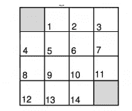*

*小网格世界*

*在这个网格世界中，我们每进行一次转换(我们采取的行动)都会得到-1 的奖励。我们可以采取的行动是上下左右。我们的代理遵循一些随机策略π，每个动作的权重-年龄为 0.25。*

*现在，让我们用这个网格世界来跟踪策略评估:*

*如前所述，我们从将每个状态的值初始化为零开始:*

*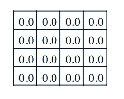*

*每个状态的起始值为零*

*然后在下一次迭代中:我们将使用如上所述的贝尔曼期望方程作为迭代方式，我们最终得到每个状态值函数 be -1(回想一下，-1 是我们采取每项行动得到的奖励):*

*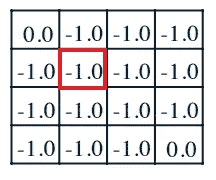*

*使用贝尔曼期望方程的首次迭代*

*让我们以用红色突出显示的状态为例:首先，从这个状态到另一个状态的回报是-1。现在，前一次迭代中的下一个状态的值，被我们初始化为 0。所以，应用贝尔曼期望方程，我们得到这个状态的值为-1。因为我们使用同步备份，所以我们要考虑代理可以进入的每个状态，也就是这里的四个状态。*

*让我们看看下一次迭代会发生什么:*

*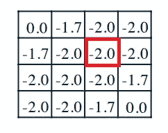*

*状态的第二次迭代值*

*再一次，让我们看看状态的值是-2(红色):所以，我们也在做同样的事情。首先，我们会因为离开状态而得到-1 的奖励，然后从上一次迭代中取下一个状态的值(也就是-1)，那么这个状态的值就变成了-2。因为它是同步备份，所以我们对代理可以到达的每个状态都进行同步备份，并对其进行规范化，这样我们就可以得到该状态的值为-2。*

****我们来说说终端状态旁边的状态:****

*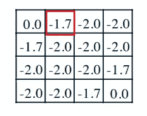*

*第二次迭代时的终端状态*

*让我们来看看红色的状态:因此，我们也可以采取四种行动，但唯一的区别是，终端状态的值始终为 0。因此，从此状态开始的每隔一步，都会产生-2 的值，但在终止状态，会产生-1 的值。将它们相加得到-7，然后用 4 归一化(因为这是同步备份)，得到该状态的值为-1.75。*

*现在，如果我们继续迭代过程，我们最终得到的状态值如下:*

*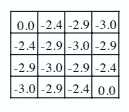*

*迭代次数**第三次***

*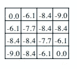*

*迭代次数**十次***

*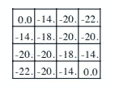*

***迭代直到收敛到最优值函数***

*在最后一次迭代中，我们得到了每个状态的最优值函数(我们稍后将讨论收敛)。*

*我们的迭代评估过程到此结束。现在， ***如果我们贪婪地对待这些国家的价值观会怎么样？****

***表现贪婪**意味着在我们的代理可以达到的所有状态中，它会选择一个比其他状态价值更高的状态。*

***事实证明，如果我们对国家的价值开始变得贪婪，我们最终会得到一个最优的政策。***

*现在，记住这两点，让我们看看我们的第一个动态编程算法，即策略迭代。*

## *策略迭代*

*该算法将前面描述的过程分为两个部分。*

*首先，我们将使用前一节中描述的贝尔曼期望方程来评估一个策略，比如说π，然后我们将对这个**评估值函数**执行贪婪操作，以找到一个**最优策略**。我们将重复这个过程，直到我们得到真正的价值函数。*

*策略迭代的思想分为两步:*

*   *政策评估(如前所述)*

*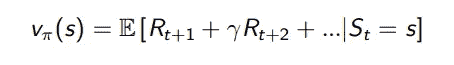*

*价值函数计算*

*   *对评估值函数表现出贪婪，从而产生优于前一个策略的策略*

*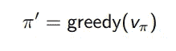*

*对这个功能表现出贪婪*

*我们迭代这两个过程，直到它**收敛到最优值函数**和**最优策略。***

*当评估一个策略后(使用贝尔曼期望方程以迭代的方式计算价值函数)，我们对该价值函数表现出贪婪，因为我们表现出贪婪，这使得我们的**策略具有确定性**。*

*让我们更深入地理解这一点:**(在该图中，向上的箭头表示政策评估，向下的箭头表示我们对价值函数贪婪)***

*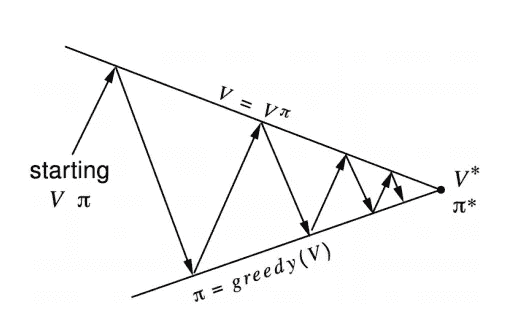*

*政策迭代思想*

*该图传达的意思是，我们从每个状态的随机值(带零)和一个随机策略开始，然后我们使用之前描述的贝尔曼期望方程来评估该策略，然后对值函数采取贪婪的行为，这为我们提供了一个新策略。然后我们再次评估这个新政策，然后再次对新的价值函数表现出贪婪。我们继续这个过程，直到我们找到最优值函数和我们的马尔可夫决策过程的最优策略。*

****现在，让我们更深入地探讨一下如何改进我们的政策..****

*行动贪婪意味着选择一个行动，比如说在一个特定的状态下能给我们带来最大价值的 a。我们可以这样定义:*

*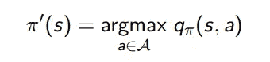*

*贪婪的政策*

*回想一下，qπ (s，a)告诉我们在状态 s 中采取行动 an 有多好，或者在状态 s 中采取行动 an 将获得多少价值，对 qπ (s，a)取 arg-max 意味着我们选择状态 s 中的行动，使 q 值[qπ (s，a)]最大化或产生最大 q 值[qπ (s，a)]。*

*那么，这是否使我们的政策更好呢？*

*所以，我们在问，采取贪婪的行动[π']是否比一直遵循我们的政策π更好。**是**，先迈出贪婪的第一步【π’(s)】,然后跟随政策π，比一直只跟随政策π要好或相等。*

*这可以表示为:*

*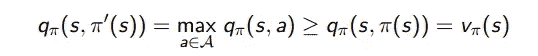*

*这里左边先走我们贪婪的一步[π'(s)]然后跟随我们的政策π。这相当于采取可能的最佳行动(具有最大 q 值)。右手边只是自始至终在遵循一个政策π，等于说一个国家的价值函数。现在， ***你可能在想为什么它比一直遵循π政策要好或者等于π？****

*看，当我们在下一步采取贪婪步骤(π’(s))时，我们选择了可以从状态 s 采取的最佳行动。现在，在右侧，我们没有采取任何贪婪步骤或确定性步骤，因此我们的代理可能会选择最佳行动，或者可能最终选择产生的价值低于贪婪行动的行动。*

*上述想法可以应用到每一步:*

*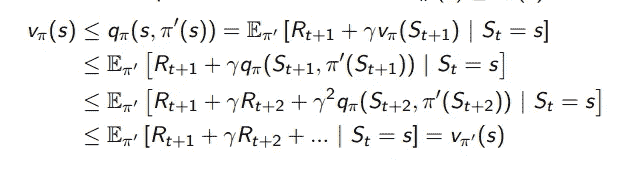*

*政策改进定理*

*所以，这个策略每走一步都会变得更好，唯一停止的时候是π成为我们的最优策略的时候。如果改进停止，则贪婪动作值等于状态的当前值:*

*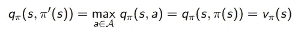*

*改进停止*

*因此，如果价值函数 Vπ (s)等于贪婪价值函数 qπ (s，π'(s))，则满足贝尔曼最优方程:*

*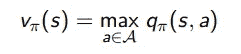*

*贝尔曼最优方程*

*我们已经在第 2 部分详细讨论了上面的等式。所以如果这个满足，那么我们的策略π就是最优策略。*

*所以，这都是关于政策迭代。首先，我们使用贝尔曼期望方程来评估我们的策略，然后对这个评估的值函数采取贪婪的行为，我们已经证明它在迭代上改进了我们的策略。*

****修改策略迭代****

*这是基于我们是否需要等到我们的政策评估需要收敛于 Vπ的想法。 ***我们是不是应该早点收手？****

*如果你记得在政策评估中，我们首先评估政策，然后表现出对它贪婪的尊重。事实证明，经过几次迭代之后，我们已经实现了我们的最优策略。我们不需要等待我们的价值函数收敛。因此，我们引入了提前停止条件。*

*知道何时停止的一个方法是，如果我们的价值函数在评估过程中更新了很少的值。所以，我们可以说，如果价值函数的更新量很小，比如说小于一个ε，那么我们可以停止这个过程。*

*另一种方法是我们可以在 k 次迭代后手动停止策略评估过程。*

*现在，我们来看另一种动态规划算法:值迭代。*

> ****最优性原理 *:*****
> 
> **在我们深入研究之前，让我们重新定义一下最优行为的定义。因此，最佳策略可以细分为两个部分:**
> 
> **最佳的第一步，比如说**
> 
> **然后遵循下一个状态的最优策略，比如说**
> 
> **如果在我们采取了一个最优的步骤，比如行动 a 之后，一个策略的行为是最优的，那么这个策略就是最优的。**

## **价值迭代**

**在策略迭代中，我们看到，首先，我们评估一个策略，即找到价值函数，然后对它表现出贪婪，以构造一个新的策略。但是，在值迭代中，我们并不为每个中间值函数计算策略。一旦我们找到了最优值函数，我们就可以从最终的最优值函数中计算出最优策略。**

**值迭代是策略迭代的特例。当策略评估过程在一个步骤后停止时。**

**数值迭代采用贝尔曼最优方程。我们从某个随机值函数(比如零)开始，然后使用贝尔曼最优方程迭代这个过程。也就是说，我们通过在贝尔曼最优方程中插入先前迭代的值来计算状态的新值函数。我们迭代这个过程，直到它收敛到最优值函数，然后从这个最优值函数计算最优策略。**

**我们以迭代的方式使用贝尔曼最优方程进行数值迭代。这可以表示为:**

**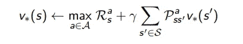**

**值迭代更新规则**

**我们用一个例子来理解一下:**

**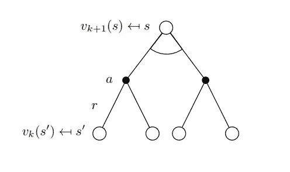**

**价值迭代的备份图**

**因为我们使用同步备份，所以我们的马尔可夫决策过程中的每个状态都是根。就像之前我们第一次使用贝尔曼最优方程计算根的值一样[在之前的博客中详细讨论过]。然后在迭代 k+1，通过插入来自前一次迭代 V [k (s')]的值来更新状态 s 的值。因此，我们以迭代的方式使用贝尔曼最优方程。这样做，我们的价值函数收敛到最优价值函数。**

**这可以表示为:**

**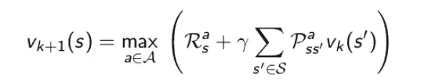**

**贝尔曼最优方程**

**所以，这都是关于价值迭代。**

*****同步动态规划算法*****

**所以，总结一下我们之前看到的，这是大卫·西尔弗讲座的摘要:**

**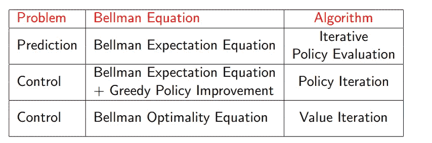**

**算法概述**

**太棒了！🤩**

**至此，我们结束了对马尔可夫决策过程的讨论。用了三篇长文总结。在下一篇文章中，我们将讨论无模型学习(独立于模型动力学)，如蒙特卡罗学习和我最喜欢的时间差异学习。**

**希望这个故事能增加你对马尔可夫决策过程的理解。如果你喜欢它，请鼓掌让我知道👏。我对评论区的任何讨论都持开放态度。我很乐意在# [Instagram](https://www.instagram.com/ayush07x/?hl=en) 上与你联系。**

## **关于马尔可夫决策过程的第 1 部分、第 2 部分和第 3 部分:**

*   **[强化学习:马尔可夫决策过程(第一部分)](/introduction-to-reinforcement-learning-markov-decision-process-44c533ebf8da)**
*   **[强化学习:贝尔曼方程与最优性(下)](/reinforcement-learning-markov-decision-process-part-2-96837c936ec3)**
*   **强化学习:用动态规划求解马尔可夫决策过程(第三部分)**
*   **[强化学习:蒙特卡罗学习](https://pub.towardsai.net/reinforcement-learning-monte-carlo-learning-dc9b49aa16bd)**

**参考资料:**

*   **[https://web . Stanford . edu/class/psych 209/Readings/suttonbartoiprlbook 2 nded . pdf](https://web.stanford.edu/class/psych209/Readings/SuttonBartoIPRLBook2ndEd.pdf)**
*   **[大卫·西尔弗讲座](https://www.youtube.com/watch?v=Nd1-UUMVfz4&t=1049s)**

*****待深*****