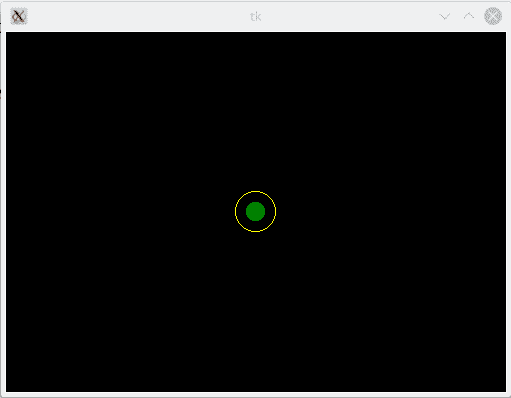
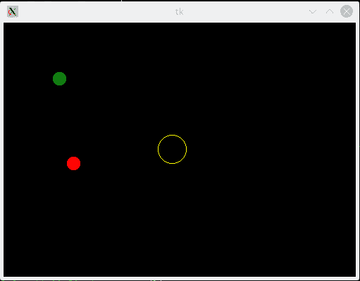

# 强化学习与捕食者猎物球游戏可视化

> 原文：<https://towardsdatascience.com/reinforcement-learning-visualised-with-a-predator-prey-ball-game-ab03518ac551?source=collection_archive---------35----------------------->


米卡·鲍梅斯特在 [Unsplash](https://unsplash.com/s/photos/reinforcement-learning?utm_source=unsplash&utm_medium=referral&utm_content=creditCopyText) 上的照片

这是[上一篇文章](/reinforcement-learning-and-visualisation-with-a-simple-game-a1fe725f0509)的后续，在这篇文章中，我们看了一个简单的强化学习(RL)游戏，其中一个绿色的球学会在 200 步内到达画布中心的一个小圆圈。我们编写了一个 Q-learning 算法，并使用基于 Tkinter 的 GUI 将其可视化。

我们现在给绿球一个稍微复杂一点的挑战。这一次的目标是学会在 200 步内到达中心，但现在有另一个球，一个红色的球，绿色的球必须避开。红球从圆圈附近开始，随机移动。如果绿色和红色的球相撞，游戏结束。



绿色球学会到达圆



红色的球就像一个喝醉了的掠食者，四处乱跑，希望抓住绿色的球。我当然意识到故事中喝醉的部分使我们的 RL 实现变得更容易些:)要记住的关键是绿球只是学习如何通过不碰到红球来避开它。然而，如果碰巧红球接住了绿球，绿球也无能为力，游戏就结束了。

所以现在绿球必须同时学习两件事。它必须明白到达中心是最有意义的事情，它必须明白如何远离红球。

正如你可能已经想到的，这个 RL 的状态空间比单个绿球场景增长了 2 倍(上图)。最佳行动的决定(可能采取的步骤)不仅取决于绿球本身的位置，还取决于红球的位置。动作空间保持不变，因为绿球可以走的步数没有改变。

好了，让我们看看如何修改上一篇文章中的[代码](https://github.com/bhattacharyya/reach_circle/blob/master/reach_circle_commandline.py)来实现这一点。

可能的步骤现在被声明为

```
mov_list = [-40,-20,20,40]
```

而不是我们之前用过的[-20，-10，10，20]。通过加倍步长，我们将单个球的搜索空间缩小了 4 倍。所以对于 2 球系统，我们的搜索空间小了 16 倍。即使在这之后，我们的搜索空间也是 202500，而不是之前的 1800。

然后我们介绍球碰撞的检查和碰撞的惩罚。

```
# Check if green ball hit the red ballif (pos_x1 == pos_x2) and (pos_y1 == pos_y2):
   collision = 1
   reward = -200
   print("green collision", pos_x1, pos_y1, pos_x2, pos_y2)
   green_collision_count += 1
```

到达圆圈的奖励是 100。我最初将冲突的惩罚设置为-25。没有任何学习，碰撞发生了 40%次。大约 20%是因为绿球踩到了红球(GBC，绿球碰撞)，而另外 20%是红球撞到了绿球(RBC)。对我们来说，绿色球击中红色球是重要的统计数据。即使在 100，000 场比赛后，gbc 仍约为 15%。为什么避免碰撞的学习如此缓慢？

我很快发现，绿色球的动机完全是因为它追求到达中心，这是因为与碰撞惩罚相比，奖励要高得多。啊哈！GBCs 从 20 下降到 15%的唯一原因是因为球快速到达中心，而不是随机移动，因此随机击中红球的机会较少。所以在下一步中，我们将冲突的惩罚设置为-200。

对于红细胞，没有处罚规定。**随着新的罚分，GBCs 在 20，000 场比赛内降至 0%** 。它可能会更快完成，但我只在 20k 步后检查。我很乐观，但没有这么乐观！

整个模拟代码在[这里](https://github.com/bhattacharyya/reach_circle/blob/master/strc_commandline.py)可用，可视化代码在同一个库[这里](https://github.com/bhattacharyya/reach_circle/blob/master/strc_commandline_test.py)可用。

我们看到了如何将简单的单球问题扩展到双球问题，从而大大增加了算法的复杂性。大多数真实生活场景要复杂得多，Q 表方法不再实用。

在另一篇文章中，我们将尝试使用 DQN 来实现这个游戏。