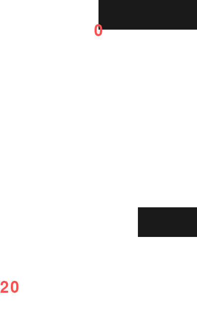
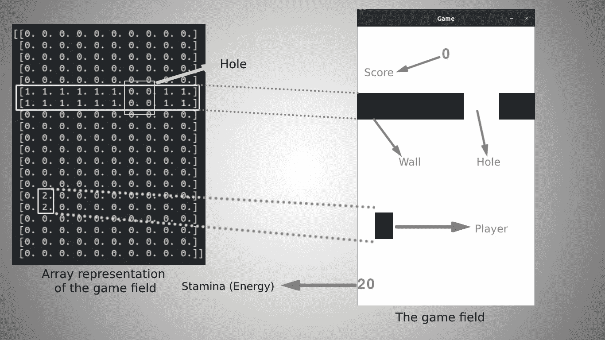

# 使用 Python 进行深度强化学习|第 1 部分|创建环境

> 原文：<https://towardsdatascience.com/reinforcement-learning-with-python-part-1-creating-the-environment-dad6e0237d2d?source=collection_archive---------3----------------------->

左 Gif:游戏规则说明| |右 Gif:一个人玩的游戏

在本系列教程中，我们将介绍构建一个能够玩游戏的专家强化学习(RL)代理的每一个步骤。

本系列分为三个部分:

*   **第一部分**:游戏环境的设计和搭建。在这一部分中，我们将构建一个游戏环境并对其进行定制，以使 RL 代理能够在其上进行训练。
*   [**第二部分**](/deep-reinforcement-learning-with-python-part-2-creating-training-the-rl-agent-using-deep-q-d8216e59cf31) :构建并训练深度 Q 神经网络(DQN)。在这一部分，我们定义和建立 DQN 的不同层次，并训练它。

 [## 使用 Python 的深度强化学习|第 2 部分|使用深度 Q 创建和训练 RL 代理…

### 在第一部分，我们经历了制作游戏环境，并逐行解释。在这一部分，我们是…

towardsdatascience.com](/deep-reinforcement-learning-with-python-part-2-creating-training-the-rl-agent-using-deep-q-d8216e59cf31) 

*   [**第三部分**](/deep-reinforcement-learning-with-python-part-3-using-tensorboard-to-analyse-trained-models-606c214c14c7) :测试，玩游戏。

我们也可以尝试制作另一个简单的游戏环境，并使用 Q-Learning 来创建一个可以玩这个简单游戏的代理。

# 动机:

激励我开始这个系列的视频

有一次我在 YouTube 的兔子洞里，这个视频被推荐给我，它是关于人类婴儿的**自我意识**，看完视频后，一个类似的问题出现在我的脑海里*“我能开发一个足够聪明的智能代理，它能感知自己的身体，并有能力改变它的特征来完成某项任务吗？”*

这个系列是我回答这个问题的方式。

# 设计环境:

对于这种环境，我们希望代理人发展对其身体的感觉，以及如何改变其身体特征以避免输掉游戏。

## 第一:环境的要素:

环境

**1-** **字段**包含所有其他元素。我们在代码中用名为“Field”的类来表示它，如下所示:

**字段**属性:

*   ***宽度***【int】**:**字段的宽度(不以像素为单位)
*   ***height*** (int:字段的高度(不以像素为单位)
*   ***体*** (np.array) **:** 保存游戏元素(玩家和墙壁)的数组表示。这个数组被传递给 **DQN** ，也用于使用 **pygame 绘制界面。**

**字段**方法:

*   ***update_field*** (自己、墙壁、玩家) :更新字段。

**2-墙壁:**

那堵墙

**墙壁**属性:

**穿墙**方法:

*   ***create _ hole***(self):在墙上创建一个宽度= self 的洞。**孔 _ 宽。**
*   ***move*** (self):垂直移动墙壁(每次调用时，墙壁向下移动 n 步(n = self.speed))

**3-玩家:**

**玩家**属性:

**玩家**方法:

*   ***移动*** (自身，领域，方向= 0):移动玩家:

> -方向= 0 ->不变
> 
> -方向= 1 ->向左
> 
> -方向= 2 ->向右

*   ***change _ width***(self，action = 0):

> - action = 0 ->无变化
> 
> - action = 3 ->缩小一个单位
> 
> - action = 4 ->加宽一个单位

# **环境**类:

这个类促进了环境和代理之间的通信，它被设计成与一个 RL 代理或一个人类玩家通信。

## RL 代理所需的主要组件:

1- **环境 _ 形状属性:由 DQN 用来设置输入层的形状。**

**2- ACTION_SPACE 属性:由 DQN 用来设置输出层的形状。**

3- **惩罚**和**奖励:设置惩罚和奖励的值，用来训练代理(我们用这些值来告诉代理它之前的行为是好是坏)。**

4- ***重置*** 方法:重置环境。

5- ***步骤*** 方法:以一个动作为自变量，返回 ***下一个状态*，*奖励*，**一个名为 **game_over** 的布尔变量，用来告诉我们游戏是否结束(玩家输了)。

很明显，这个环境并没有什么不同，它包含了所有需要的组件甚至更多。

**环境**属性:

**环境**方法:

*   ***_ _ init _ _***(self):通过初始化一些属性，调用 ***reset*** 方法来初始化环境。
*   ***重置*** (自身) :重置环境，重置后返回游戏场状态。
*   ***print_text*** (self，WINDOW = None，text_cords = (0，0)，center = False，text = "，color = (0，0，0)，size = 32):打印给定 pygame.display (WINDOW)中具有给定特征的文本。

## ***+步*** (自我，行动):

1-调用玩家的 move 方法来移动玩家。

2-调用播放器的 change_width 方法移动播放器。

3-将墙移动一步。

4-更新字段。

5-检查玩家是否成功通过了一堵墙。如果是这样，给予玩家奖励并增加其耐力。

6-检查三个失败的条件:如果这三个条件中至少有一个满足，玩家就会输掉游戏。

当玩家输了，返回的 ***奖励*** 的值将等于惩罚，游戏状态的指示器( ***game_over*** )由假变真。

7-检查当前墙是否触及场地底部，当发生这种情况时，超出范围的墙将被新墙取代。

8-返回 ***下 _ 状态*** 正常化， ***奖励*** ， ***游戏 _ 结束***

## + render(自身，窗口=无，人类=假):

**论据:**

*   ***窗口*** (pygame.display):游戏将要渲染的 pygame.display。

*****逐行渲染*** 方法解释:**

**1-检查玩家是否是人类。如果是，获取按下的键并将其转换为相应的动作(例如:如果按下了右箭头，则设置 action = 2，这意味着向右移动上一步的玩家)，然后调用 ***步骤*** 方法来执行选择的动作。**

**2-更新区域，然后开始将墙壁和玩家画成方块。**

**3-打印分数和球员的耐力。**

**4-最后，更新显示以显示渲染的屏幕。**

# **最后:把它们放在一起**

**现在我们将使用我们解释过的所有东西来玩这个游戏:**

**以下代码重复游戏，直到玩家通过获得高于或等于 ***winning_score、*** 的分数获胜或退出游戏。**

**你可以在这里得到完整的代码。**

** [## 使用 Python 的深度强化学习|第 2 部分|使用深度 Q 创建和训练 RL 代理…

### 在第一部分，我们经历了制作游戏环境，并逐行解释。在这一部分，我们是…

towardsdatascience.com](/deep-reinforcement-learning-with-python-part-2-creating-training-the-rl-agent-using-deep-q-d8216e59cf31)  [## 使用 Python 进行深度强化学习|第 3 部分|使用 Tensorboard 分析训练好的模型

### 在前面的部分中:

towardsdatascience.com](/deep-reinforcement-learning-with-python-part-3-using-tensorboard-to-analyse-trained-models-606c214c14c7) 

你可以在推特上关注我 [@ModMaamari](https://twitter.com/ModMaamari)

# 您可能还喜欢:

*   [**深度神经网络用于回归问题**](https://medium.com/@mamarih1/deep-neural-networks-for-regression-problems-81321897ca33)
*   [**AI 生成泰勒斯威夫特的歌词**](https://blog.goodaudience.com/ai-generates-taylor-swifts-song-lyrics-6fd92a03ef7e)
*   [**用 Python 介绍随机森林算法**](https://medium.com/datadriveninvestor/introduction-to-random-forest-algorithm-with-python-9efd1d8f0157)
*   [**带 TensorFlow APIs 的机器学习速成班汇总**](https://medium.com/@mamarih1/machine-learning-crash-course-with-tensorflow-apis-summary-524e0fa0a606)
*   [**如何用 Tensorflow 和 Keras**](https://medium.com/@mamarih1/how-to-make-a-cnn-using-tensorflow-and-keras-dd0aaaed8ab4) **制作一个 CNN？**
*   [**如何选择最好的机器学习模型？**](https://medium.com/@mamarih1/how-to-choose-the-best-machine-learning-model-e1dbb46bdd4d)**