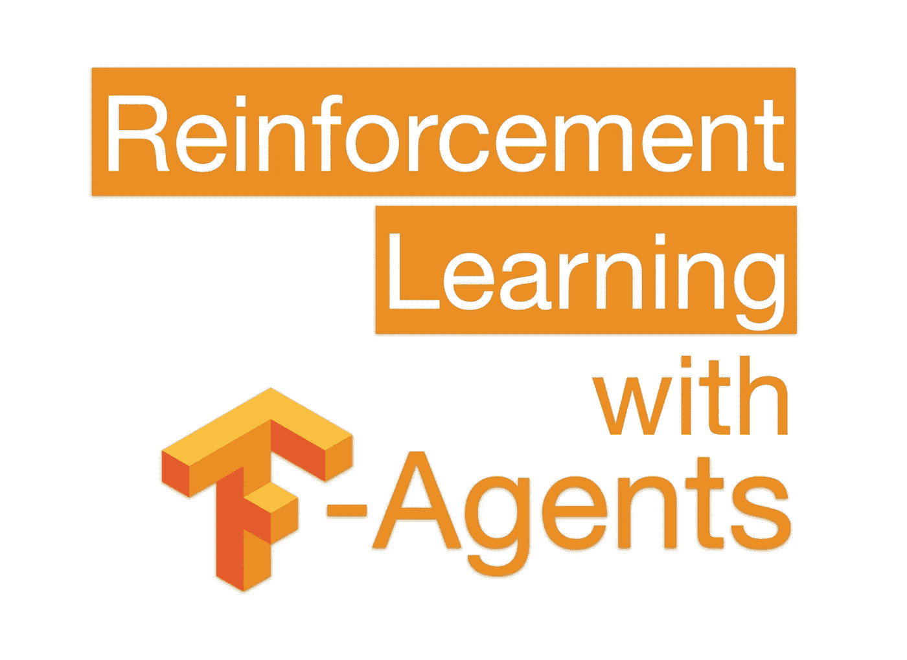
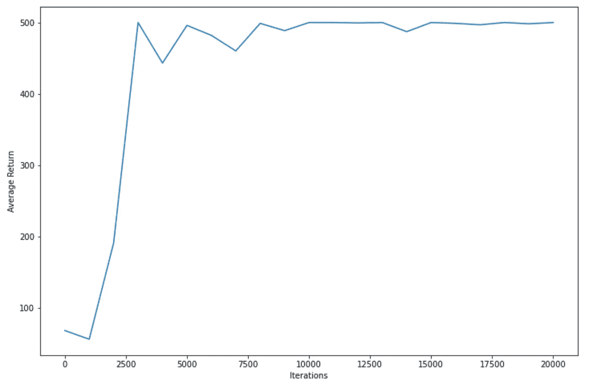

# 使用张量流代理的强化学习—教程

> 原文：<https://towardsdatascience.com/reinforcement-learning-with-tensorflow-agents-tutorial-4ac7fa858728?source=collection_archive---------13----------------------->

## 用这个简单的教程试试 TF-Agents for RL，它以 Google colab 笔记本的形式发布，所以你可以直接从你的浏览器上运行它。



几周前，我写了一篇文章，列举了可以用来在项目中实现强化学习(RL)的不同框架，展示了每个框架的盛衰，并想知道是否有任何一个框架会在某个时候统治所有框架。从那以后，我开始知道了 [TF Agents](https://github.com/tensorflow/agents) ，这是一个基于 TensorFlow 的 RL 库，并得到了其社区的全力支持(注意，TF Agents 不是 Google 的官方产品，但它是作为 Github 上的官方 TensorFlow 帐户的存储库发布的)。

我目前正在一个项目中使用 TF 代理，由于它的良好文档，包括[教程](https://github.com/tensorflow/agents/tree/master/docs/tutorials)，开始使用它很容易。它定期更新，有许多贡献者，这使我认为我们有可能在不久的将来看到 TF 代理作为实现 RL 的标准框架。正因为如此，我决定写这篇文章给你一个快速的介绍，这样你也可以从这个库受益。我已经[发布了这里使用的所有代码，作为一个 Google colab 笔记本](https://colab.research.google.com/drive/1Pd63OyiOnw4j401f3FN2tja4mH6EFMCc?usp=sharing)，所以你可以很容易地在线运行它。

你可以在这里找到 Github 的所有代码和文档。你不需要克隆他们的库，但是有官方的 Github 作为参考总是有用的。我实现了下面的例子，部分遵循他们的教程(1_dqn_tutorial ),但我进一步简化了它，并在本文中用它来玩 Atari 游戏。让我们动手吧。

# 安装 TF 代理和依赖项

如前所述，TF-Agents 运行在 TensorFlow 上，更具体地说是 TensorFlow 2.2.0。此外，如果您还没有以下软件包，您需要安装它们:

```
pip install tensorflow==2.2.0
pip install tf-agents
```

# 为 CartPole 实现 DQN 代理

我们将实现一个 DQN 代理( [Mnih et al. 2015](https://daiwk.github.io/assets/dqn.pdf) )，并将其用于经典控制问题 CartPole。如果你想解决一些更令人兴奋的事情，比如说，一个 Atari 游戏，你只需要从所有可用的 OpenAI 环境中选择一个你想要的环境名。

我们从所有必要的进口开始。正如你在下面看到的，我们从 TF-Agents 实现了相当多的对象。这些都是我们可以为我们的实现定制和切换的东西。

```
from __future__ import absolute_import, division, print_functionimport base64
import IPython
import matplotlib
import matplotlib.pyplot as plt
import numpy as np
import tensorflow as tffrom tf_agents.agents.dqn import dqn_agent
from tf_agents.drivers import dynamic_step_driver
from tf_agents.environments import suite_gym
from tf_agents.environments import tf_py_environment
from tf_agents.eval import metric_utils
from tf_agents.metrics import tf_metrics
from tf_agents.networks import q_network
from tf_agents.replay_buffers import tf_uniform_replay_buffer
from tf_agents.trajectories import trajectory
from tf_agents.utils import common
```

## 环境


OpenAI 健身房的翻筋斗环境[GIF from [积谷康](https://github.com/jaekookang)/[RL-翻筋斗](https://github.com/jaekookang/RL-cartpole)。]

现在，我们开始创造我们的环境。在 CartPole 中，我们有一个顶部有一根杆子的推车，代理的任务是学习保持杆子，左右移动推车。请注意，我们将使用已经包含在 TF-Agents 中的 suite_gym 中的 e 环境，这是 OpenAI Gym 环境的一个稍微定制(并针对其与 TF-Agents 的使用进行了改进)的版本(如果您感兴趣，可以查看与 OpenAI 的实现[这里](https://github.com/tensorflow/agents/blob/master/tf_agents/environments/suite_gym.py)的差异)。我们还将为我们的环境使用一个名为 TFPyEnvironment 的包装器，它将用于状态观察、操作和奖励的 numpy 数组转换为 TensorFlow 张量。在处理张量流模型(即神经网络)时，我们使用张量，因此通过使用这个包装器，我们可以节省一些转换这些数据所需的工作。

```
env = suite_gym.load('CartPole-v1')
env = tf_py_environment.TFPyEnvironment(env)
```

## 代理人

TF 中有不同的药剂——我们可以使用的药剂: [DQN](https://storage.googleapis.com/deepmind-media/dqn/DQNNaturePaper.pdf) 、[增援](http://www-anw.cs.umass.edu/~barto/courses/cs687/williams92simple.pdf)、 [DDPG](https://arxiv.org/pdf/1509.02971.pdf) 、 [TD3](https://arxiv.org/pdf/1802.09477.pdf) 、 [PPO](https://arxiv.org/abs/1707.06347) 和 [SAC](https://arxiv.org/abs/1801.01290) 。如上所述，我们将使用 DQN。代理的一个主要参数是它的 Q(神经)网络，它将用于计算每一步中动作的 Q 值。q_network 有两个强制参数:定义观察形状和动作形状的 input_tensor_spec 和 action_spec。我们可以从我们的环境中得到这一点，因此我们将我们的 q_network 定义如下:

```
q_net = q_network.QNetwork(env.observation_spec(), 
                           env.action_spec())
```

正如你在这里看到的，我们可以为我们的 q_network 定制更多的参数，但是现在，我们将使用默认的参数。代理还需要一个优化器来查找 q_network 参数的值。让我们保持经典，用亚当。

```
optimizer = tf.compat.v1.train.AdamOptimizer(learning_rate=0.001)
```

最后，我们用以下参数定义并初始化我们的代理:

*   time_step_spec，它是我们从环境中获得的，定义了我们的时间步长是如何定义的。
*   action_spec，与 q_network 相同。
*   我们之前创建的 Q 网。
*   我们之前创建的优化器。
*   TD 误差损失函数，类似于神经网络中的损失函数。
*   列车步数计数器，这只是一个 0 阶张量(也称为标量)，它将计算我们在环境中的步数。

```
train_step_counter = tf.Variable(0)agent = dqn_agent.DqnAgent(env.time_step_spec(),
                           env.action_spec(),
                           q_network=q_net,
                           optimizer=optimizer,
                           td_errors_loss_fn= 
                                  common.element_wise_squared_loss,
                           train_step_counter=train_step_counter)agent.initialize()
```

## 辅助方法:平均累积回报和收集数据

我们还需要一些辅助方法。第一个将在环境中迭代若干集，应用策略来选择要遵循的操作，并返回这些集中的平均累积奖励。这将有助于评估我们的代理了解到的策略。下面，我们也在我们的环境中尝试该方法 10 集。

```
def compute_avg_return(environment, policy, num_episodes=10):
    total_return = 0.0
    for _ in range(num_episodes):
        time_step = environment.reset()
        episode_return = 0.0 while not time_step.is_last():
            action_step = policy.action(time_step)
            time_step = environment.step(action_step.action)
            episode_return += time_step.reward
        total_return += episode_return avg_return = total_return / num_episodes
    return avg_return.numpy()[0]# Evaluate the agent's policy once before training.
avg_return = compute_avg_return(env, agent.policy, 5)
returns = [avg_return]
```

我们还将在培训我们的代理时实现一种收集数据的方法。DQN 的突破之一是经验回放，我们将代理人的经验(状态、动作、奖励)存储起来，用它在每一步批量训练 Q 网络。这通过使学习更快和更稳定来改进学习。为了做到这一点，TF-Agents 包含了 TFUniformReplayBuffer 对象，它存储了这些经验以便以后重用，所以我们首先创建这个我们以后会用到的对象。

在这种方法中，我们采用一个环境、一个策略和一个缓冲区，采用由它的状态观察和奖励形成的当前时间步长、策略选择的动作以及下一个时间步长。然后，我们将它存储在重放缓冲区中。注意，重放缓冲区存储了一个名为 Trajectory 的对象，所以我们用前面命名的元素创建了这个对象，然后使用 add_batch 方法将它保存到缓冲区。

```
replay_buffer = tf_uniform_replay_buffer.TFUniformReplayBuffer(
                                data_spec=agent.collect_data_spec,                                                                
                                batch_size=env.batch_size,                                                              
                                max_length=100000)def collect_step(environment, policy, buffer):
    time_step = environment.current_time_step()
    action_step = policy.action(time_step)
    next_time_step = environment.step(action_step.action)
    traj = trajectory.from_transition(time_step, 
                                      action_step, 
                                      next_time_step)# Add trajectory to the replay buffer
    buffer.add_batch(traj)
```

## 列车代理

我们终于可以训练我们的特工了。我们定义了我们在每一次迭代中的步数，在这个步数之后，我们将在每一次迭代中训练我们的代理，修改它的策略。现在让我们每次迭代只使用一步。我们还定义了我们的 Q 网络将被训练的批量大小和一个迭代器，以便我们迭代代理的经验。

然后，我们将为缓冲器收集一些经验，并从常见的 RL 环路开始。通过对环境采取行动、培训政策和重复来获得经验。我们另外打印损失，并分别每 200 和 1000 步评估代理的性能。

```
collect_steps_per_iteration = 1
batch_size = 64
dataset = replay_buffer.as_dataset(num_parallel_calls=3, 
                                   sample_batch_size=batch_size, 
                                   num_steps=2).prefetch(3)
iterator = iter(dataset)
num_iterations = 20000
env.reset()for _ in range(batch_size):
    collect_step(env, agent.policy, replay_buffer)for _ in range(num_iterations):
    # Collect a few steps using collect_policy and save to the replay buffer.
    for _ in range(collect_steps_per_iteration):
        collect_step(env, agent.collect_policy, replay_buffer) # Sample a batch of data from the buffer and update the agent's network.
    experience, unused_info = next(iterator)
    train_loss = agent.train(experience).loss step = agent.train_step_counter.numpy() # Print loss every 200 steps.
    if step % 200 == 0:
        print('step = {0}: loss = {1}'.format(step, train_loss)) # Evaluate agent's performance every 1000 steps.
    if step % 1000 == 0:
        avg_return = compute_avg_return(env, agent.policy, 5)
        print('step = {0}: Average Return = {1}'.format(step, avg_return))
        returns.append(avg_return)
```

## 情节

我们现在可以画出当我们训练代理人时，累积的平均回报是如何变化的。为此，我们将使用 matplotlib 制作一个非常简单的绘图。

```
iterations = range(0, num_iterations + 1, 1000)
plt.plot(iterations, returns)
plt.ylabel('Average Return')
plt.xlabel('Iterations')
```



《DQN 特工》5 集的平均回报率。随着代理变得更有经验，您可以看到性能是如何随着时间的推移而提高的。

# 完全码

我已经把本文中的[所有代码作为 Google Colab 笔记本](https://colab.research.google.com/drive/1Pd63OyiOnw4j401f3FN2tja4mH6EFMCc?usp=sharing)进行了分享。你可以直接运行所有代码，如果你想改变它，你必须把它保存在你自己的 Google drive 账户上，然后你可以做任何你想做的事情。如果你愿意，你也可以下载它在你的本地计算机上运行。

# 从这里去哪里

*   你可以跟随 Github 上 TF-Agents 库中的[教程](https://github.com/tensorflow/agents/tree/master/docs/tutorials)
*   如果你想查看 RL 的其他好框架，你可以在这里看到我以前的帖子:

[](/5-frameworks-for-reinforcement-learning-on-python-1447fede2f18) [## Python 强化学习的 5 个框架

### 从头开始编程你自己的强化学习实现可能会有很多工作，但是你不需要做…

towardsdatascience.com](/5-frameworks-for-reinforcement-learning-on-python-1447fede2f18) 

*   你也可以在我前段时间写的另一篇文章的[中查看其他可以尝试 TF-Agents(或者任何你选择的 RL 算法)的环境。](https://medium.com/@mauriciofadelargerich/reinforcement-learning-environments-cff767bc241f)

老规矩，感谢阅读！请在回复中告诉我你对 TF-Agents 的看法，如果你有任何问题或发现任何问题，也请告诉我🐛在代码中。