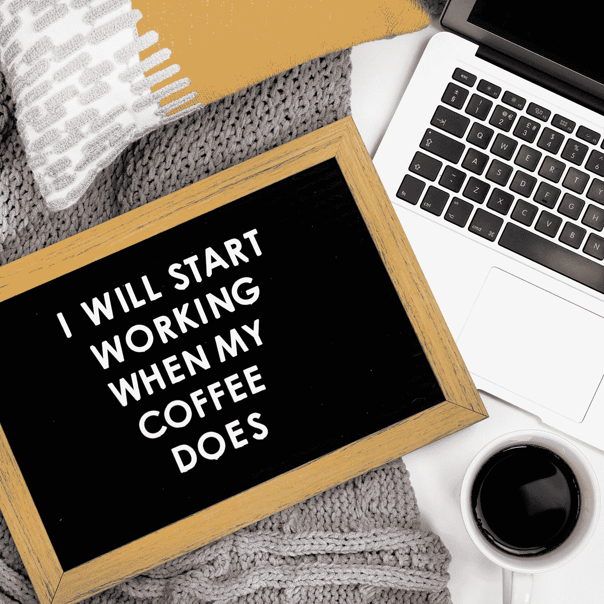

# 重塑办公室之外的工作场所

> 原文：<https://towardsdatascience.com/reinventing-the-workplace-beyond-the-office-3a41c42b426c?source=collection_archive---------64----------------------->

## 如何在家中舒适地高效工作

佩吉·科迪在 [Unsplash](https://unsplash.com?utm_source=medium&utm_medium=referral) 上拍摄的照片

在过去的几十年里，技术承诺将我们从工作场所中解放出来，并使我们能够在任何地方工作。然而，这从未成为现实，因为企业不愿放松对员工的控制。然而，疫情的崛起让雇主别无选择。这立即成为一个生死存亡的问题，不适应的公司面临倒闭的风险。

幸运的是，我们生活在一个科技发达的世界，将工作转移到网上相当容易。第一个也是最明显的要求是良好的互联网连接，因为这将成为我们所有数字服务的网关。考虑到西方国家平均有 85%的家庭宽带普及率，这一要求在西方国家不成问题。在其他国家，有各种技术提供了替代方案，如通过手机访问互联网，或通过谷歌的 Loon 气球动力互联网获得直播链接，为偏远地区提供服务。第二个基本要求是能够连接互联网的数字设备，如笔记本电脑或平板电脑。

一旦满足了这两个要求，现在就该转向必要的应用程序了。这些应用程序大多数都是免费的，可以通过浏览器访问，所以它们倾向于独立于硬件。一个人所要做的就是去他们的网站并使用该应用程序。以下是需要开始使用的应用程序列表。

*   一个**在线日历**对于安排和组织会议是必不可少的。它可以从位于任何地方的任何设备访问。
*   与同事或客户的快速聊天可以通过电子邮件或各种消息应用程序进行，如 WhatsApp、Messenger、Slack 和无数其他应用程序。
*   对于更长时间的会议，人们可能需要一个视频会议应用程序，如 Skype 或 Zoom。其中大多数是免费的，允许多人在一个虚拟的房间里会面。
*   为了执行**复杂的项目**，像 Trello 这样的应用程序通过将任务细分为子任务并分配给不同的团队成员来帮助人们管理任务。分配给特定任务的最后期限会让人们受到约束。
*   与不同地点和时区的人一起工作可能会很棘手。正因为如此，像谷歌的 G Suite 和微软的 Office 365 这样的工具帮助团队成员同时协作处理各种文档。这些套件支持最流行的生产力应用程序，如 Word、Excel、Powerpoint 或它们的变体(100%兼容)。他们还为用户提供云存储，从而确保文件安全地保存在远程位置。
*   在当今快速发展的世界中，跟上新的概念是非常重要的。像 Coursera、Udemy 和 edX 这样的网站提供**免费在线课程**，其中一些课程得到了顶尖大学的认证。他们允许员工在自己舒适的家里用自己的时间学习，从而让他们有更好的职业前景。
*   最后，由于**在家里可能仍然需要访问办公室电脑**，Chrome 远程桌面帮助用户从任何设备安全地访问他们的机器。

有了所有这些应用程序，您马上就可以开始工作了。经过几次尝试后，人们开始意识到，远程工作最终与在办公室工作没有太大区别。人们仍然可以组织一对一会议、小组会议、共享文档或寻求建议。

杰佛逊·桑托斯在 [Unsplash](https://unsplash.com?utm_source=medium&utm_medium=referral) 上的照片

然而，远程工作也带来了以下一些缺陷:

*   办公时间有了全新的含义。人们可以在白天和晚上的任何时间工作，因为办公室现在只有一米远。过度的自由当然是不健康的，因为人们下班后需要拔掉电源。因此，设定时间限制是至关重要的，这样可以避免过度工作并最终耗尽精力。
*   在家工作可能会感到孤独和无聊，因为在网上组织办公室笑话很有挑战性。尽管这些东西不会直接提高组织的生产率，但它们有助于员工团结、建立信任，并更好地合作。因此，通过聊天或虚拟活动保持一个开放的渠道是至关重要的，在虚拟活动中，员工可以分享有趣的东西，如他们的生活片段、模因、有趣的视频或其他社交内容。
*   中介沟通不一定是自然而然的。许多人在视频会议期间感到不舒服，因为它往往会淡化人与人之间的互动暗示。人们说话时通常会看着某人的眼睛，但在视频会议中不会发生这种情况，因为他们正在看着摄像机。其他人也倾向于打手势，但这在视频通话中减少了几次。所以有时候，视频通话对人们来说很尴尬，在这种情况下，如果让他们感到不舒服，人们应该可以选择关闭相机。
*   呆在办公室里也带来了偶然的交流，人们可以通过这种交流非正式地了解一个项目的更多细节。这种形式的交流通常发生在走廊或休息时间。尽管许多组织试图阻止这种情况，转而支持更结构化的沟通渠道，但事实是这种情况仍然存在，并有助于员工理解不同的观点。当然，在家工作时不会发生这种情况，员工可能不了解特定情况的整个背景。在这种情况下，公司应该推行透明的议程，让所有团队成员在有组织的聊天中分享关于特定项目的一切。
*   起床上班，从床上滚下来，发现自己在家庭办公室里，这是不健康的。早晨的习惯对于保持某种正常感是必不可少的(特别是当远程工作是一种强加而不是一种选择的时候)。最好的事情是从事一些身体活动，花时间冥想，吃一顿健康的早餐，打扮一下，开始工作。当然，每个人都有自己理想的完美早间作息模式，保持这种模式对保持动力至关重要。
*   最后，我们不要忘记家是所有干扰的中心。毛毛猫可能会在键盘上跳来跳去以引起注意，孩子们开始从另一个房间大喊大叫，大脑思考着神话般的网飞系列的结局，餐具室每 5 分钟就叫你拿一份点心。这么多事情可以浪费你的时间！不幸的是，分心在每个环境中都是现实；我们必须接受它们，学会与它们共处，并尽可能设定界限。

布鲁克·拉克在 [Unsplash](https://unsplash.com?utm_source=medium&utm_medium=referral) 拍摄的照片

但是即使在家工作有它的挑战，它也能提供各种各样的好处；

*   通勤变得不存在，从而节省了人们的旅行时间，交通相关的挫折和汽车费用。想想看，一个人每天多花一个小时，省下几百欧元，能做些什么！
*   每人每年可以减少至少 2.3 公吨二氧化碳的碳足迹。
*   在家也意味着一个人可以完全控制自己的饮食。因为同伴压力而做出的不健康选择将成为过去——再也没有借口吃快餐了，因为厨房里没有微波炉。选择完全取决于个人！
*   公司根据他们的品牌方针设计他们的办公室，同时优先考虑功能性和互动性。但是家庭办公室是不同的；它反映了员工的个人主义风格。这个人是一个风水怪胎，喜欢在北极的温度下工作，但被热带植物包围，还是一个被锁在黑暗房间里的地下地下城主，这完全取决于个人。这些选择使家庭办公室成为一个有趣的空间，帮助员工提高生产力。
*   最后，远程工作不一定要在家里进行。如果没有健康限制(就像疫情实施的那样)，员工可以在咖啡店、共同工作空间甚至大自然中舒适地工作。如果想更进一步，他也可以在一个或几个国家工作。这些人通常被称为数字游牧者，因为他们使用技术谋生，同时过着游牧生活。

艾玛·马修斯数字内容制作在 [Unsplash](https://unsplash.com?utm_source=medium&utm_medium=referral) 拍摄的照片

本文试图描绘一幅远程工作的真实画面。该系统远非完美，但它确实提供了各种优势，足以满足现代工作场所的需求。有一点是肯定的，当健康紧急情况消退时，我们不能回到我们的旧习惯，但我们必须进一步投资，改善远程工作实践。我们永远不知道下一次疫情什么时候会袭击我们，它可能比我们想象的要快。当它到来时，我们必须做好准备。从现在开始，远程办公不应该成为我们在需要时公开的秘密武器，而是我们当前工作实践的延伸。在家工作应该是我们的第二天性。只有这样，当下一次疫情袭击我们时，我们才能不受干扰地继续工作。

*本文原载于*[***【会计师】***](https://www.miamalta.org/page-18190/8962657)*。请在下面留下你的想法评论。如果你喜欢这篇文章，请跟我来🐦[推特](https://twitter.com/alexieidingli)，🔗 [LinkedIn](https://www.linkedin.com/in/alexieidingli/) ，📷 [Instagram](https://www.instagram.com/alexieidingli/) 或者😊[脸书](https://www.facebook.com/alexieidingli/)*

* [## 杀死汽车保险商

### 正如我们所知，人工智能正在如何改变汽车保险

towardsdatascience.com](/killing-the-motor-underwriter-cb11317cda98)  [## 依靠人工智能

### 利用人工智能在新的十年里重塑银行业

towardsdatascience.com](/banking-on-ai-27d4d39bda1c)  [## 在 2020 年推动您的小型企业

### 毫无疑问，2019 年是人工智能(AI)年。我们听说了很多，但很多人不确定…

towardsdatascience.com](/boosting-your-small-business-in-2020-6ae3529cbfb0) 

[**Alexei Dingli**](http://www.dingli.org/)**Prof 是马耳他[大学](https://www.um.edu.mt/)的 AI 教授。二十多年来，他一直在人工智能领域进行研究和工作，协助不同的公司实施人工智能解决方案。他的工作被国际专家评为世界级，并赢得了几个当地和国际奖项(如欧洲航天局、世界知识产权组织和联合国等)。他出版了几本同行评审的出版物，并且是马耳他的一员。由马耳他政府成立的人工智能工作组，旨在使马耳他成为世界上人工智能水平最高的国家之一。***