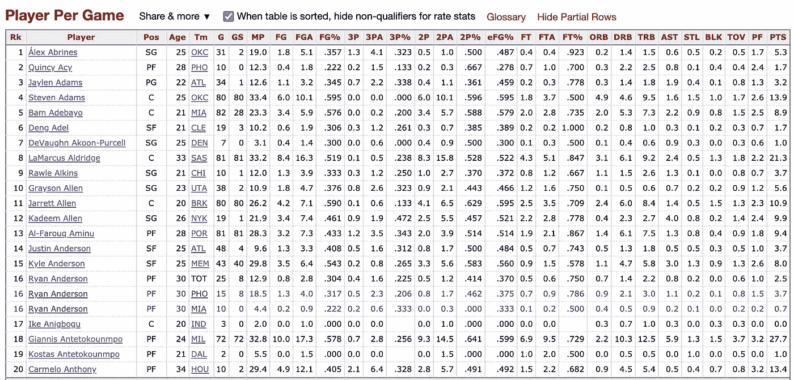
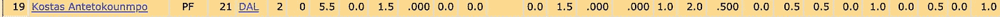
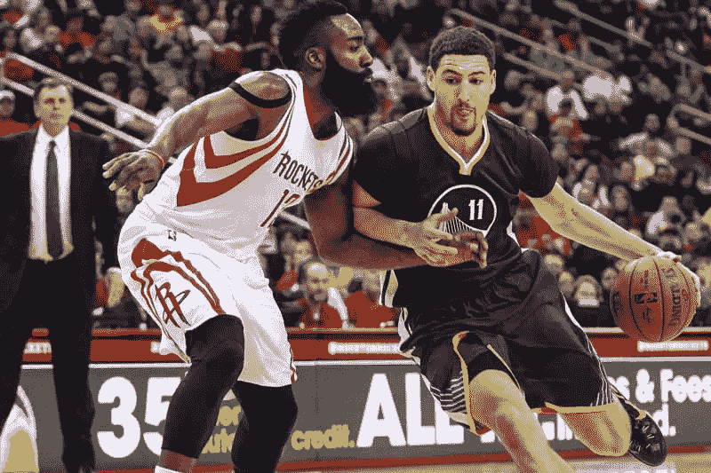

# 使用 SciPy 层次聚类重塑传统篮球位置

> 原文：<https://towardsdatascience.com/reinventing-traditional-basketball-positions-using-scipy-hierarchical-clustering-4fa7be67e882?source=collection_archive---------58----------------------->

## 使用 python 中的等级聚类分析查看五个位置的函数如何随时间变化

波士顿凯尔特人队教练布拉德·史蒂文斯说:“我再也没有这五个位置了。”。“现在可能只有三个位置，你要么是控球者，要么是边锋，要么是大个子。”在过去的 10 年里，我们已经看到了大前锋和中锋的功能的演变，从被期望去低位完成利用他们的身高和力量得分，他们被期望去伸展地板和击倒三分。我想调查截至 2018-19 赛季的位置变化。


雪莉·胡利

# 调查指南

我要做的第一件事是收集 NBA 所有现役球员的赛季平均数据。我用的代码如图 [**本文**](/web-scraping-nba-stats-4b4f8c525994) **。**这给了我关于 [**这一页**](https://www.basketball-reference.com/leagues/NBA_2019_per_game.html) 关于[**basketball-reference.com**](http://basketball-reference.com)**的所有统计数据。**



图片来自 Basketball-Reference.com

我将对这些数据进行的操作称为层次聚类。也被称为分层聚类分析，这是一种根据相似的统计数据对对象(在这种情况下是球员)进行聚类的算法。我使用了一个名为 [**SciPy**](https://docs.scipy.org/doc/scipy/reference/generated/scipy.cluster.hierarchy.dendrogram.html) 的模块来做这件事。我用的参数是 FG，FGA，FG%，3P，3PA，3P%，2P，2PA，2P%，eFG%，FT，FTA，FT%，ORB，DRB，TRB，AST，STL，BLK，TOV，PF，PTS。所有其他的数据都与调查无关，但是我确实使用了比赛次数，每场比赛的时间以及分数来过滤掉低价值的球员。我剔除了所有场均得分低于 10 分、每场比赛上场时间低于 20 分钟的球员(这大约是一场比赛的 42%)，以及那些在赛季中出场少于 50 场的球员(这是可用比赛的 61%)。

# 进行调查

我要做的第一件事就是收集数据。这是比较容易的部分，因为我只是使用了前面文章中的代码。返回熊猫数据框中的统计数据。这样做的第一个问题是，球员的数据是以字符串的形式存储的，而我需要它们以浮点数的形式存储，所以我在将它们放入数据框之前对它们进行了更改，它们是一个二维数组。

```
forbidden =[0,1,3]
for x in player_stats:
    i=0
    while i<len(x):
        if i in forbidden or x[i] == **''**:
            pass
        else:
            x[i] = float(x[i])
        i+=1
```

“禁止”是数据框中字符串的索引(姓名、位置和球队)，而“球员统计”是二维数组。

然后我需要过滤掉统计数据。一些球员丢失了数据，例如科斯塔斯·安特托昆波斯·3P %丢失了，所以我不得不删除所有数据为空的球员。这只发生在百分比上。



来自 basketball-reference.com

```
stats = pd.DataFrame(player_stats, columns = headers)
stats.head(10)

data = stats.drop(columns=**"Pos"**)
data = data.drop(columns=**"Tm"**)
nan_value = float(**"NaN"**)
data.replace(**""**, nan_value, inplace=True)
data.dropna(subset = [**"2P%"**], inplace=True)
data.dropna(subset = [**"FT%"**], inplace=True)
data.dropna(subset = [**"3P%"**], inplace=True)
data.dropna(subset = [**"FG%"**], inplace=True)
data.dropna(subset = [**"eFG%"**], inplace=True)
data = data.dropna()
```

这将创建数据框，移除职位和团队(与调查无关)并用“NaN”(一个常见的占位符)替换任何空值，然后从数据框中删除具有此占位符的任何行。然后，我需要删除不符合我之前指定的标准的行。

```
data = data[data[**'G'**] > 50]
data = data[data[**'PTS'**] > 10]
data = data[data[**'MP'**] > 10]
```

然后我需要做最后的准备。我需要删除球员的名字，游戏和游戏开始了。所有这三个字段对调查来说都是不必要的，所以我只是将它们放入一个新的*数据框中，因为我想保留 [**树状图**](https://www.displayr.com/what-is-dendrogram/#:~:text=A%20dendrogram%20is%20a%20diagram,to%20allocate%20objects%20to%20clusters.) (输出的图形)的名称。*

```
ds = data.drop(columns =**"Player"**)
ds = ds.drop(columns =**'G'**)
ds = ds.drop(columns = **'GS'**)
```

然后，我需要获得一个 [**NumPy N 维数组**](https://numpy.org/doc/stable/reference/arrays.ndarray.html) 中的名字，因为这是树状图标签需要传递到层次聚类函数中的格式。

```
namesarray = data[**'Player'**].to_numpy()
```

最后，我必须设置绘图大小和分辨率，给树状图一个标题，然后剩下要做的就是将这些参数传递给 SciPy 层次聚类函数，然后显示树状图

```
plt.figure(figsize=(10, 7), dpi = 300)
plt.title(**"Redefining positions"**)
dend = shc.dendrogram(shc.linkage(ds, method=**'ward'**), labels=namesarray)
plt.show()
```

# 得出的结论

从生成的树状图中，我设法推断出 5 个不同的位置。请记住，这些结果来自 2018-19 NBA 赛季，并不反映球员的整个职业生涯。

## 传统大人物


哈桑·怀特塞德和鲁迪·戈贝尔分别代表波特兰开拓者队和犹他爵士队。史蒂夫·米切尔-今日美国体育

传统的大男人是一个濒临灭绝的品种。他们被期望更多的伸展地板，而不是背对篮筐。他们的篮板和篮筐保护令人惊叹，但他们在现代比赛中投篮能力的缺乏限制了他们的得分量。这些球员有很高的 FG%但是低到没有 3PA。这些参与者包括:

1.  鲁迪·戈贝尔
2.  哈桑·怀特塞德
3.  贾维尔·麦基

## 双向全方位威胁


勒布朗詹姆斯和科怀·伦纳德分别为洛杉矶湖人队和洛杉矶快船。*林浩伟/美联社*

这些玩家在游戏的几乎所有领域都表现出色。篮板，抢断，得分，助攻，同时也有一个很好的(不是很好的)3 分投篮。这些类型的球员通常都是联盟中的佼佼者。这些参与者包括:

1.  科怀·伦纳德
2.  勒布朗·詹姆斯
3.  乔尔·恩比德

## 持球者


朱·霍勒迪和凯里·欧文分别代表新奥尔良鹈鹕队和布鲁克林篮网队。图片来自*美联社图片/Mary altafer*

控球手是…嗯，控球手。他们的得分量可以有很大的不同，但有一点是他们都有很高的助攻数。尽管没有在本次调查中进行测量，但它们的使用率都很高。这些参与者包括:

1.  朱·霍勒迪
2.  凯里·欧文
3.  卢卡·东契奇

## 伸展四肢(和四肢)


多伦多猛龙队的帕斯卡尔·西亚卡姆。*卡洛斯·奥索里奥/美联社*

伸展四人组是拥有 3 分投篮的大前锋。他们可以有效地冲向篮筐，但在接球投篮 3 种情况下也很有效。他们通常也有很高的篮板数和很低的助攻数，但也有例外。其中包括的一些玩家是:

1.  杰森·塔图姆
2.  帕斯卡尔·西亚卡姆
3.  卡尔-安东尼·唐斯

## 三点专家



詹姆斯·哈登和克莱·汤普森分别代表休斯顿火箭队和金州勇士队。*特洛伊·陶尔米纳/今日美国*

虽然这些球员可能不仅仅局限于三分球，但他们确实有尝试很多三分球的天赋，而且成功率很高。这些球员都是出色的得分手，他们既可以创造自己的投篮机会，也可以用接球投篮得分。这些参与者包括:

1.  克莱·汤普森
2.  詹姆斯·哈登
3.  布拉德利·比尔

## 结束语

首先，我想说调查结果是 ***而不是*** 100%正确，你不应该相信我的话。从这些数据中你只能推断出这么多。使用率、拍摄地点以及游戏风格等其他因素都没有考虑在内。虽然有很大的改进空间，但在我看来，这是有一定道理的。不过，随你怎么想吧。所有的代码和最终的树状图都在这里链接的一个 [**GitHub 库中。**](https://github.com/eyuael/NBApositions)