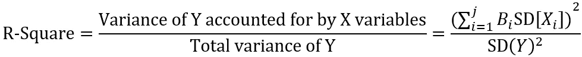
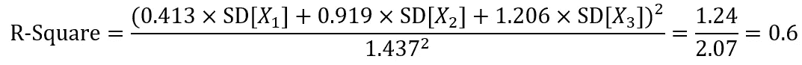
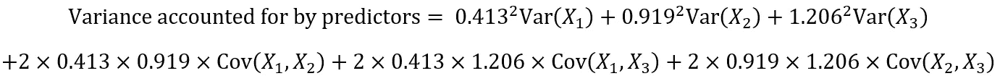
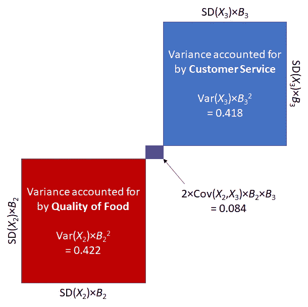
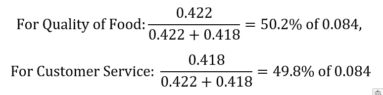
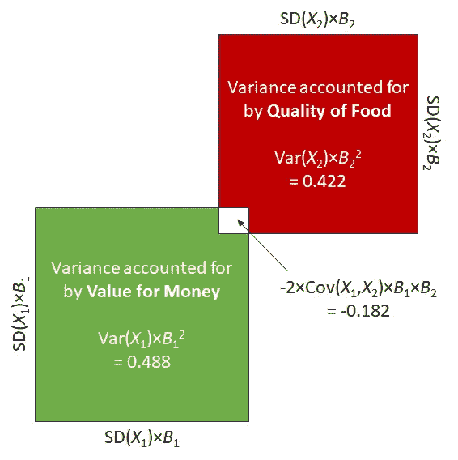

# 相对重要性分析:交流多元回归结果的更好方法

> 原文：<https://towardsdatascience.com/relative-importance-analysis-a-better-way-to-communicate-multiple-regression-results-d70a6fbbaf9c?source=collection_archive---------4----------------------->

任何行业客户都关心推动结果(Y)的因素(X 变量)的相对重要性。员工流动的最强预测因素是什么？哪些客户最有可能给我们带来回头客？服务体验的哪些方面与客户满意度联系最紧密？

回答这些问题的传统方法是回归分析。然而，没有统计背景，很难解释这种分析的结果。很难解释其中一个预测因子的单位变化与 y 的比例变化相关联。系数可能*有时*会产生关于 X 变量重要性的误导性结果。

另一种方法是将这种分析的结果解释为百分比，代表每个预测因子的相对重要性。这是一种更直接的方式来传达这样的发现。

已经有几种计算相对重要性的方法被提出来了(关于综述，请参见 [Johnson & LeBreton，2004](https://doi.org/10.1177/1094428104266510) 和 [Tonidandel & LeBreton，2011](https://doi.org/10.1007/s10869-010-9204-3) )，但是我将概述一种相对简单的方法。这种方法的优点是它可以很容易地从回归和协方差表的结果中计算出来，并且不需要任何进一步的计算。此外，它直接对应于多重 R-Square，并考虑了预测因子的共线性。它也不受任何预测因子的重新标度的影响。

# 一个例子

为了说明这种方法，假设您受一家餐馆老板的委托来确定客户满意度的最重要驱动因素，并且您在 500 名客户中进行了一项调查来回答这个问题。

你确定的三个潜在因素包括对以下方面的满意度:(1)物有所值，(2)食物质量，(3)客户服务。让我们假设物有所值是用 1(物有所值极差)到 10(物有所值极好)的尺度来衡量的，但另外两个是用 1(非常不满意)到 5(非常满意)的尺度来衡量的。

结果变量是一个[净促进者](https://en.wikipedia.org/wiki/Net_Promoter)分数。(在 0 到 10 分的范围内，您向朋友或同事推荐这家餐厅的可能性有多大？)

生成该数据集的 R 代码如下所示:

```
load.package <- function(x)
{
  if (!require(x,character.only = TRUE))
  {
    install.packages(x,dep=TRUE)
    if(!require(x,character.only = TRUE)) stop("Package not found")
  }
}# Load the MASS package
load.package("MASS")# Generate a dataset using MASS----
dimnames <- c("Value for money", "Quality of food", "Customer service", "Net Promoter")
covMat <- matrix(data = c(1,-0.2, 0.01, 0.4,
                          -0.2, 1, 0.10, 0.4,
                          0.01, 0.10, 1, 0.5,
                          0.4, 0.4, 0.5, 1), nrow = 4, ncol = 4, dimnames = list(dimnames, dimnames))
dataset.standardized <- mvrnorm(n = 500, mu = c(0,0,0,0), Sigma = covMat, empirical = TRUE)# Rescale the variables----
dataset <- dataset.standardized
for (a in 1:dim(dataset.standardized)[2]) {
  dataset_min <- min(dataset[,a])
  dataset[,a] <- dataset.standardized[,a] - dataset_min
  dataset_max <- max(dataset[,a])
  dataset[,a] <- dataset[,a] / dataset_max
}
dataset[,1] <- dataset[,1] * 9 + 1
dataset[,2] <- dataset[,2] * 4 + 1
dataset[,3] <- dataset[,3] * 4 + 1
dataset[,4] <- dataset[,4] * 10# Convert each matrix to a data frame
dataset.standardized <- as.data.frame(dataset.standardized)
dataset <- as.data.frame(dataset)
```

已经创建了两个数据集:一个数据集的变量是原始度量，另一个(标准化)数据集的每个变量都经过了重新调整，方差为 1。

描述性统计(平均值、标准偏差和变量间的相关性)如下所示:

表 1。描述统计学

回归分析的代码如下所示。我提出了非标准化和标准化(β)系数(并省略了标准误差、 *t* 统计和 *p* 值):

```
# Fit regression model----
regmodel <- lm(`Net Promoter` ~ `Value for money` + `Quality of food` + `Customer service`, data=dataset)
regmodel.std <- lm(`Net Promoter` ~ `Value for money` + `Quality of food` + `Customer service`, data=dataset.standardized)coefs <- data.frame("Unstandardized" = regmodel$coefficients[2:4],
                    "Beta" = regmodel.std$coefficients[2:4])coefs
```

回归的结果是:

表二。回归结果

估计相对重要性的一个简单而相当常用的方法是将每个回归系数表示为系数总和的百分比。对于非标准化系数和贝塔系数，我在下面介绍了这种方法:

```
# Relative importance: traditional method----
coefs$`RI Traditional` <- coefs$Unstandardized / sum(coefs$Unstandardized)
coefs$`RI Traditional (std)` <- coefs$Beta / sum(coefs$Beta)
coefs
```

表 3。相对重要性的传统衡量标准

查看结果，我们可以立即发现一些问题。首先，非标准化和标准化的解决方案给出了截然不同的结果。换句话说，该方法不考虑变量的缩放方式。

第二个(不太明显的)问题是，该方法没有考虑每个 X 变量之间的相关性。尽管在此分析中不存在问题，但也不清楚如何处理负回归系数，尤其是那些由预测值的高度共线性引起的系数。(实际上，一些研究人员会将此类变量报告为 0%，但这歪曲了他们的贡献。)

# 另一种(基于模型的)方法

用每个 X 变量在 Y 变量中所占的方差比例来表示相对重要性会更好。在回归分析中，这就是 R 平方统计向我们展示的。但是怎么才能把 R-Square 分解成各个预测器解释的比例呢？

首先，解释一下 R 平方是如何计算的是很有用的。r 平方由以下公式给出:



其中 *X* 代表每个预测值， *Y* 代表结果变量， *j* 是模型中 X 个变量的个数， *B* 是每个回归系数，SD 代表每个变量的标准差。如果变量是标准化的，我们可以简单地用 1 代替每个 SD。

将此公式应用于我们的示例，R 平方等于:



分子代表每个 *X* 变量的方差。扩展分子得到以下等式:



其中 Var 代表每个变量的方差(标准差的平方)，Cov 代表两个变量之间的协方差(两个变量的联合可变性)。如果这两个变量是标准化的，协方差就相当于一个相关性。

这个方程划分了 X 变量的方差，指出了哪些预测因子是最重要的。

前三项——0.413 Var(X1)、0.919 Var(X2)和 1.206 Var(X3)是明确的，因为它们是与 Y 变量直接相关的方差。然而，等式第二行的协方差项更难解释，因为它们代表共同的可变性。我们应该将这个共享方差分配给哪个变量？

从我们的例子中，让我们检查 X2(食品质量)和 X3(客户服务)。这些变量的协方差为 0.038(相关性为 0.100)。如果我们将每个预测值和共享区域所占的方差可视化，它看起来会是这样的:



红色区域代表食物质量的差异；蓝色区域代表由客户服务计算的差异。中间的紫色区域代表不能分摊给 X2 或 X3 的共同差异。在某些方面，这就像是国家之间的领土争端。

# 如何划分(并征服)共享区域

我的建议是，根据每个变量直接解释的方差大小，按比例划分共享方差。

因此，对于食品质量和客户服务，分配给双方的共享差异为:



在这种情况下，因为变量之间的相关性很小，所以两个变量所占的共享可变性也很小。因此，没有太多可以分割的。然而，对于高度相关的变量，这个区域要大得多。

该解决方案具有几个吸引人的特征:它考虑了每个变量的范围，它考虑了每个变量和结果之间的关系的强度，它不产生越界结果(例如，负方差解释)，它可以适应负系数，它可以使用分析的输出直接计算，并且它考虑了预测值之间的相关性。

在 R 中，实现这种方法的语法如下:

```
# First, we create a matrix depicting the variance accounted for by each variable. The diagonal shows the variance directly attributable to each variable. The off-diagonal shows the shared variance attributable to both variables.var.exp <- matrix(data = NA, nrow = dim(coefs)[1], ncol = dim(coefs)[1])
for (y in 1:dim(coefs)[1]) {
  for (x in 1:dim(coefs)[1]) {
    var.exp[y,x] = cov(dataset)[y,x] * coefs$Unstandardized[y] * coefs$Unstandardized[x]
  }
}coefs$`Var accounted for` <- 0
for (y in 1:dim(coefs)[1]) {
  for (x in 1:dim(coefs)[1]) {
    if (x == y) {
      coefs$`Var accounted for`[y] = coefs$`Var accounted for`[y] + var.exp[y,y]
      }
    else {
      coefs$`Var accounted for`[y] = coefs$`Var accounted for`[y] + var.exp[y,x] * (var.exp[y,y] / (var.exp[y,y] + var.exp[x,x]))
      coefs$`Var accounted for`[x] = coefs$`Var accounted for`[x] + var.exp[y,x] * (var.exp[x,x] / (var.exp[y,y] + var.exp[x,x]))
    }
  }
}coefs$`RI (new method)` <- coefs$`Var accounted for` / sum(coefs$`Var accounted for`)coefs
```

这种方法的结果如下所示:

表 3:相对重要性的新衡量标准(最后一栏)

相对重要性的新度量产生了与以前的方法相当不同的结果。尽管 beta 系数最大，但就相对重要性而言，性价比被认为是最低的。这个结果有一个有趣的原因，它与 X 变量之间的相关性有关。

# X 变量之间的相关性如何影响相对重要性？

这种方法似乎意味着高度相关的变量比不相关的变量更重要。相反，负相关的变量就不那么重要了。为什么会这样呢？

对预测因子之间正相关的一种解释是相互因果关系。例如，如果餐馆老板通过更多的员工培训来改善顾客服务，它也可以提高食物的质量(如果厨师的技能和能力提高的话)。或者，改善食物可能会导致顾客忽略糟糕的顾客服务。每个预测因素都更重要，因为改善其中一个因素会对另一个因素产生积极的影响。

相反，变量之间的负相关往往代表某种情境约束。在我们的例子中，如果餐馆老板决定提高他们饭菜的质量，很可能需要提高价格。同样，如果餐馆老板决定降低价格，这可能意味着在其他方面节省成本，例如使用低质量的原料。因此，每个预测因子都不那么重要，因为提高一个会以牺牲另一个为代价。换句话说，共享方差是从直接归因于其他变量的方差中减去。



# 一些事后的想法和警告

你可能会想:当谈到共享方差时，为什么不简单地在每个变量之间对半分呢？这似乎是一个吸引人的解决方案，但它会引起一些问题。特别是，如果两个变量负相关，并且由一个变量解释的方差非常低，那么它会导致负方差。

从因果关系的角度来看，推荐的解决方案假设 X 变量之间的相关性代表相互影响。事实上，X 变量之间存在关联还有其他可能性。X 变量中的一个可能是第二个的原因。可能有第三个(省略)变量负责相关。这些不同的情景可能会对每个变量的相对重要性产生影响。

# 参考

j . w . Johnson 和 j . m . LeBreton(2004 年)。组织研究中相对重要性指数的历史和使用。组织研究方法，7(3)，238–257。土井: [10.1177/1094428104266510](https://doi.org/10.1177/1094428104266510)

s .托尼丹德尔和 J. M .勒布雷顿(2011 年)。相对重要性分析:回归分析的有益补充。商业和心理学杂志，26(1)，1-9。doi:[10.1007/s 10869–010–9204–3](http://https//doi.org/10.1007/s10869-010-9204-3)