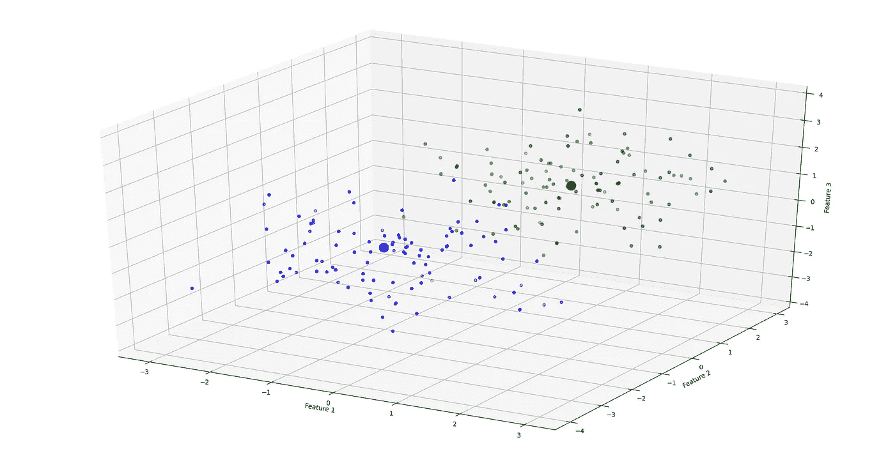
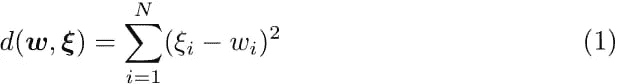
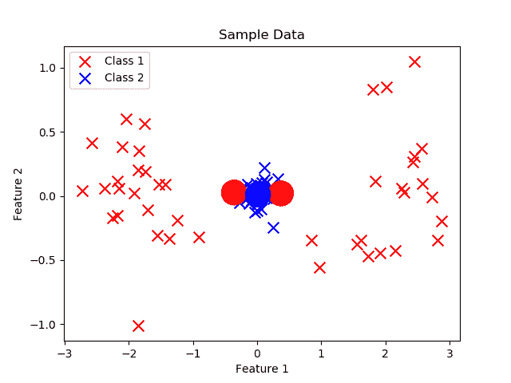
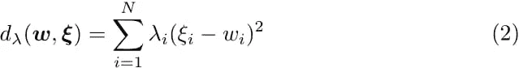
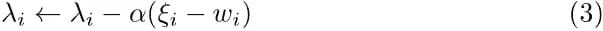
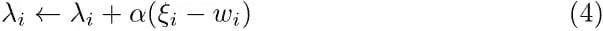
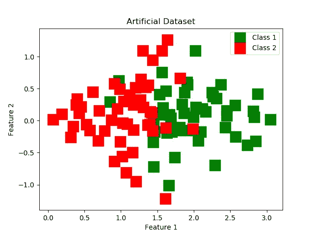

# LVQ 的相关更新

> 原文：<https://towardsdatascience.com/relevance-updates-in-lvq-e9b6660c52d9?source=collection_archive---------46----------------------->

学习矢量量化是一种简单而强大的分类算法。使用训练数据，该算法试图使原型适合每个类，使得每个原型最佳地代表它们各自的类。为了符合原型，必须使用一些相似性度量。最常见的是使用简单的老式欧几里德距离:

对于训练过程，为每个类初始化原型。每个类可以配置多个原型。然后，训练算法会尝试移动这些原型，使它们最好地代表它们各自的类。对于训练集中的每个数据点，训练算法使用给定的距离度量找到最接近的原型，如果类别标签不同，则推开该原型，如果类别标签匹配，则吸引该原型。它对训练数据集中的每个点都这样做，如果需要的话，多次扫过整个数据集以达到收敛。下面的动画演示了简单数据集的训练过程。类别 1 由 2 个原型(大圆圈)表示，因为它被分成两个集群。收敛后，通过计算新数据点到所有原型的距离并选择最近的原型的类别来进行新的预测。

然而，有一个问题:欧几里德距离度量对每个输入维度进行同等加权，这通常是不期望的。要素的缩放比例可能不同，或者一个要素可能非常嘈杂。这些特征提供很少的辨别能力，但是对计算的距离有同等的贡献。举个例子:假设我们正在尝试构建一个分类器，根据一个人头发的长度和一个人的身高来区分男人和女人。然而，我们正在处理一个数据集，其中每个人的头发长度都相似。在这种情况下，头发长度并不是一个非常有用的区分男女的特征。当然，我们可以使用基本的统计分析自己得出这个结论，但通常情况下，这些事情非常微妙。如果有什么能帮我们解决这个问题，那不是很好吗？原来是有的！我们可以改变欧几里德距离度量，使得每个输入维度根据某个因子进行加权:

加权欧几里德距离

向量λ也被称为相关性向量。它通过一些因素来衡量每一个输入，这样，如果我们正确地选择λ的值，它将帮助我们摆脱歧视性较小的维度。

然而，这并没有解决问题:我们如何量化每个特征的区分能力？好消息是我们根本不需要做任何特别的事情！我们所要做的就是调整算法，让它自己更新相关向量。是不是很棒！？然后在训练之后，相关向量λ代表每个特征的重要性。不太重要的特征对距离度量的权重降低，而具有良好辨别能力的特征被提供高值。

因为相关性(λ)向量在算法过程中改变，所以上述距离度量也可以被称为自适应距离度量。负责这一切的算法被称为相关性学习矢量量化(RLVQ)。

# 太酷了！我们如何做到这一点？

RLVQ 算法实际上非常类似于常规 LVQ，我们只需要用相关向量更新规则来扩充它。根据以下规则，关联向量与原型一起被更新:

如果当前特征向量与最近的原型具有相同的类别(下标 *i* 代表每个向量中的第 *i-* 个元素)。

如果当前特征向量与最近的原型不具有相同的类别。

上述更新规则适用于相关性向量λ中的所有元素 *i* 。 *α* 表示相关性学习率。在每次更新相关性向量之后，它必须被归一化，使得它的元素之和为 1。此外，相关性向量的任何元素都不允许为负。如果相关性向量的任何分量在训练期间变成负的，则它必须被设置为零。另一方面:相关性向量不必是全局的。您可以为每个原型或每个类使用不同的相关性向量。原型和 lambda 向量同时更新。

这些更新规则可能看起来有些随意，但是可以被激励如下:如果特征向量被错误地分类，那么如果特征向量的第 *l* 个分量接近原型的第 *l* 个分量，则相关性向量的那些分量 *l* 仅略微增加。越接近意味着它们对特征向量的不正确分类的贡献越大。另一方面，如果特征向量的第 *l* 分量远离第 *l* 分量，则相关性向量中的该分量 *l* 显著增加。如果特征向量被正确分类，可以使用类似的动机。底线:该算法减少了导致特征向量被错误分类的那些λ分量，并且增加了导致特征向量被正确分类的那些特征向量分量。

# 那是一大堆理论。你就不能给我看看代码吗？

我以为你不会问了！关于这个理论更精确的定义，我参考了这篇论文。让我们来看看 Python 中的一个实现:

没有一些实验，这些代码当然没有任何意义，所以让我们在一些样本数据上尝试一下。

我们尝试的第一个数据集是一个人工数据集。它包括 2 个类，每个类有 50 个训练样本和 2 个特征。第一个特征呈正态分布，第一类的均值等于 2，第二类的均值等于 1。在两种情况下，方差都等于 0.5。第二个特征也是正态分布，均值等于 0，方差等于 0.5，并且在类之间没有差异。下图显示了上述人工数据集的曲线图。

人工数据集

如果我们分开来看每一个特性，很容易看出，仅仅用特性 2 是不可能把这两个类分开的。我们可以很容易地删除这个特征，并获得相同的分类性能。然而，有趣的是，RLVQ 是否可以识别这一点，而无需通过显式编程来忽略该特性。

训练 RLVQ 系统最困难的任务是将参数设置为最佳值。通常，为了找到正确的值，建议使用某种验证程序，但是为了这次演示的目的，我只是尝试了几个值，并决定将原型学习率和相关向量学习率都设为 0.01。通常相关向量学习率应该小于原型学习率，但在这种情况下，它工作得很好。

在人工数据集上运行该算法之前，我将特征向量进行了洗牌，并留出 10 %的集合作为验证集。在几个训练时期之后，RLVQ 在验证集上实现了大约 0.2 的误差。相关性向量得出特征 1 的相关性为 0.9，特征 2 的相关性为 0.1。很明显，它认为特征 2 对成功区分这两个类别没有太大帮助。由于这个问题仍然很简单，LVQ 得到了相似的分数。

让我们看看 RLVQ 在一些真实数据上的表现！在这种情况下，我使用了来自 UCI 机器学习库的[钞票认证数据集](https://archive.ics.uci.edu/ml/datasets/banknote+authentication)。产生二元分类问题的这个数据集包含大约 1000 个具有 4 个特征的训练样本。和以前一样，数据集的 10 %被留出以验证模型。0.01 用于原型学习率，0.001 用于相关性向量学习率(可能不是最佳值)。RLVQ 产生约 14%的误差。这明显优于验证误差约为 30 %的常规 LVQ。

# 谢谢，还有别的吗？

与 LVQ 相比，RLVQ 的优势在于，它可以滤除非歧视性特征，同时仍然是易于理解的相当简单的算法。相关性向量还提供了对数据底层分布性质的一些洞察。因此，RLVQ 可以用作特征选择工具，为其他更复杂的算法预处理数据。