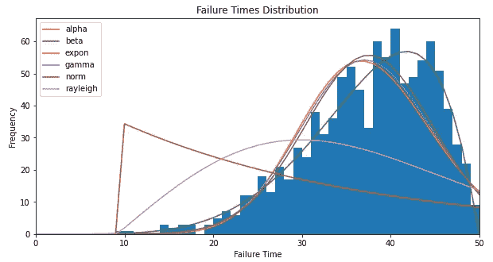

# 用 Python 进行可靠性分析

> 原文：<https://towardsdatascience.com/reliability-analysis-with-python-862c95e5c65a?source=collection_archive---------16----------------------->

## 面向工业工程师的 Python

## 全面生产维护

图片由 [Kilian](https://unsplash.com/@kilianfoto) 拍摄，可在 [Unsplash](https://unsplash.com/photos/PZLgTUAhxMM) 获得

# 可靠性

可靠性是一个项目在给定的一段时间内，在特定的操作条件**下，执行所需的**功能**的**概率**。换句话说，它是一段时间内无故障的概率。**

可靠性侧重于产品投入使用后继续发挥作用的时间(即产品的生命周期)。可靠性可以被视为进入时间域的质量。其公式表示为:

其中 *f* ( *t* )是给定分布的概率密度函数。

## 计算在时间 t 的产品/部件可靠性

计算特定时间的产品/部件可靠性需要多个步骤:

*   **步骤#1:获取故障时间** — 定义样本量，获取每个产品/部件故障前的工作时间。
*   **步骤#2:确定最符合数据的分布** —为收集的数据创建直方图，拟合多个概率分布，并确定最能描述数据的分布。
*   **步骤#3:获取分布参数**——获取所选分布的位置、尺度和附加参数，以确定其概率密度函数。
*   **步骤#4:获得概率** —使用累积密度函数获得时间 *t* 之前的故障概率，使用生存函数获得时间 *t* 之后的可靠性。

对于下面的例子，让我们考虑一个工程师对分析一个特定产品的可靠性感兴趣。工程师获得了 1000 个样本的故障时间(以周为单位),并预计该产品至少在 40 周内完全可用。让我们来看看 Python 代码！

**步骤#1:获取故障次数**

**第二步:确定最符合数据的分布**

数据拟合了六种不同的分布:α、β、指数、γ、正态和瑞利分布。从上图可以看出，beta 分布是最符合数据的分布(这是显而易见的，因为样本是根据已知的 beta 分布生成的)。

**步骤#3:获取分布参数**

贝塔分布参数:

*   *a =* 6.193
*   b =1.978
*   位置= -1.035
*   比例=50.908

**步骤#4:获得概率**

根据结果，更有可能的是，该产品不会如预期的那样持续至少 40 周，因为其在 40 周之前的故障概率为 57.32%(即，其在 40 周之后继续起作用的概率为 42.68%)。

# 总结想法

在时域中，可靠性是产品质量的一个重要组成部分。客户希望产品在发生故障后补货前能持续一段时间。如果产品的功能时间不能满足客户的要求，在制造过程中必须对其设计规格进行更改。

本指南涵盖了如何使用多个 Python 库分析可靠性的分步教程。考虑到 Python 在专业人士和学者中的高受欢迎程度，Python 代表了一个能够执行统计分析的伟大工具。虽然有其他程序和统计软件能够分析可靠性(如 Minitab、R、Microsoft Excel)，但质量和工业工程师应根据其编码和分析技能决定使用哪一种，同时遵守组织的目标和客户的规范。

*— —*

*如果你觉得这篇文章有用，欢迎在* [*GitHub*](https://github.com/rsalaza4/Python-for-Industrial-Engineering/blob/master/Total%20Productive%20Maintenance/Reliability%20Analysis%20-%20Single%20Component.py) *上下载我的个人代码。你也可以直接在 rsalaza4@binghamton.edu 给我发邮件，在*[*LinkedIn*](https://www.linkedin.com/in/roberto-salazar-reyna/)*上找到我。有兴趣了解工程领域的数据分析、数据科学和机器学习应用的更多信息吗？通过访问我的媒体* [*个人资料*](https://robertosalazarr.medium.com/) *来浏览我以前的文章。感谢阅读。*

*——罗伯特*