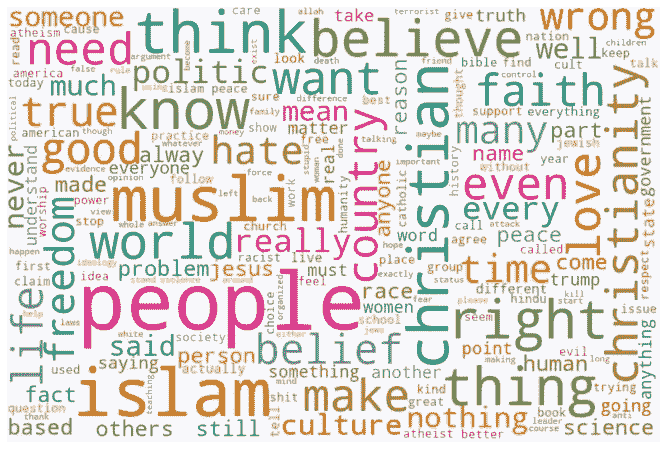

# 关于宗教的文本挖掘推文

> 原文：<https://towardsdatascience.com/religion-on-twitter-5f7b84062304?source=collection_archive---------25----------------------->

## 使用 Python 的主题建模、情感分析和仇恨言论检测模型

有人声称科技革命的光芒将会削弱宗教在人类生活中的存在。然而，现在是 2020 年，有一件事似乎是不可避免的，*宗教*仍然在这里，并且会一直存在下去！也就是说，值得研究一下现代公众对宗教的看法。

这篇文章全面介绍了如何使用 *Python* 来提取、预处理和分析关于宗教的推文。该分析是关于实现**主题建模**(LDA)**情感分析** (Gensim)和**仇恨言论检测** (HateSonar)模型。下面的分步教程与代码和结果一起展示。

> 感谢 Johannes Schneider 博士和 Joshua Handali 理学硕士在列支敦士登大学指导这项工作。完整的代码可以在 GitHub 的[这里](https://github.com/HurmetNoka/religion_on_twitter)找到。


列支敦士登瓦杜兹城堡

# **数据提取&预处理**

为了获取 tweets，我们使用了一个公共 python 脚本，该脚本能够捕获旧的 tweets，从而绕过 Twitter API 的 7 天期限限制。该脚本是免费的，可以在 GitHub 的[这里](https://github.com/Jefferson-Henrique/GetOldTweets-python)找到。你所需要做的就是调整搜索过滤器并运行程序。在我们的研究中，我们提取了包含短语*“宗教是”的推文*为了减少某些影响对宗教感受的孤立事件(如《查理周刊》袭击)的偏见，我们将时间范围延长至大约五年。我们从 2015 年 1 月开始到 2019 年 10 月，每月提取 1000 条推文。这产生了大约 57，351 条推文，然后被加载到数据帧中，准备进行预处理。

以下是整个分析过程的示意图


**分析步骤**

## **预处理**

这些是执行预处理阶段所必需的包。

```
**import** pandas **as** pd
**import** numpy **as** np
**import** re# Plotting
**import** seaborn **as** sns
**import** matplotlib.pyplot **as** plt# Gensim
**import** gensim
**from** gensim.utils **import** simple_preprocess# NLTK
**import** nltk
**from** nltk.corpus **import** stopwords**from** collections **import** Counter
**from** wordcloud **import** WordCloud**import** warnings 
warnings.filterwarnings("ignore", category=DeprecationWarning)%matplotlib inline
```

数据加载

```
df = pd.read_csv('full_data.csv', index_col=[0])
df.head()
```


数据概述

在任何进一步的步骤之前，我们删除重复的内容，因为在 twitter 上，人们复制粘贴不同的引用并转发某些内容是很常见的。删除重复后，我们总共得到 53，939 条独特的推文。

```
**# DROP DUPLICATES**
df.drop_duplicates(subset=['tweet_text'], keep='first',inplace=**True**)
df.shape
Out: (53939, 1)
```

接下来，我们生成一些一般的描述性统计数据:


描述统计学

Twitter 允许通过“@”符号在推文中包含用户名。这些对我们的分析没有任何价值；因此，使用函数将它们从数据集中移除。

```
**# REMOVE '@USER'
def** remove_users(tweet, pattern1, pattern2):
    r = re.findall(pattern1, tweet)
    **for** i **in** r:
        tweet = re.sub(i, '', tweet)

    r = re.findall(pattern2, tweet)
    **for** i **in** r:
        tweet = re.sub(i, '', tweet)
    **return** tweetdf['tidy_tweet'] = np.vectorize(remove_users)(df['tweet_text'],     "@ [\w]*", "@[\w]*")
```

规范化，一种将所有 tweets 转换成小写的方法，这样“token”和“Token”就不会被认为是两个不同的单词。

```
**# NORMALIZATION**
df['tidy_tweet'] = df['tidy_tweet'].str.lower()
```

与用户名一样，标签也被认为对主题建模分析没有重要价值，因此被移除。


以上是该数据集的前 25 个标签，我们注意到 **#islam** 是使用最多的标签，这表明它是讨论最多的宗教。使用以下函数移除标签:

```
**# REMOVE HASHTAGS**
**def** remove_hashtags(tweet, pattern1, pattern2):
    r = re.findall(pattern1, tweet)
    **for** i **in** r:
        tweet = re.sub(i, '', tweet)

    r = re.findall(pattern2, tweet)
    **for** i **in** r:
        tweet = re.sub(i, '', tweet)
    **return** tweetdf['tidy_tweet'] = np.vectorize(remove_hashtags)(df['tidy_tweet'], "# [\w]*", "#[\w]*")
```

接下来要删除的是 URL:

```
**# REMOVE LINKS**
**def** remove_links(tweet):
    tweet_no_link = re.sub(r"http\S+", "", tweet)
    **return** tweet_no_linkdf['tidy_tweet'] = np.vectorize(remove_links)(df['tidy_tweet'])
```

使用与链接相同的功能，我们还删除了*收集词，*那些首先用于过滤推文的词，在这种情况下:*宗教，“宗教”*

之后，需要去掉数字、标点符号(仅用于主题建模)，以及特殊字符(@、&、#、%).

```
**# REMOVE Punctuations, Numbers, and Special Characters**
df['tidy_tweet'] = df['tidy_tweet'].str.replace("[^a-zA-Z#]", " ")
```

然后，从数据集中移除少于三个字符的单词(短单词)，从而简化用于分析的特征提取。

```
**# REMOVE SHORT WORDS**
df['tidy_tweet'] = df['tidy_tweet'].apply(**lambda** x:' '.join([w **for** w **in** x.split() **if** len(w)>3]))
```

预处理的一个基本步骤被称为*标记化。*它是根据空格分割文本的过程，每个单词和标点都保存为单独的标记。我们使用来自 *Gensim 的 *simple_preprocess* 方法来执行这个步骤。*

```
**# TOKENIZATION**
**def** tokenize(tweet):
    **for** word **in** tweet:
        **yield**(gensim.utils.simple_preprocess(**str**(word), deacc=**True**)) df['tidy_tweet_tokens'] = **list**(tokenize(df['tidy_tweet']))
```

接下来，我们删除没有分析价值的*停用词*，通常是冠词、介词或代词，例如，“a”、“and”、“the”等。默认列表可以根据需要进行调整和扩展。我们向包含 179 个单词的自然语言工具包(NLTK)的预定义列表中添加了一些新单词。

```
**# Prepare Stop Words**
stop_words = stopwords.words('english')
stop_words.**extend**([*'from', 'https', 'twitter', 'religions',     'pic','twitt'*,])**# REMOVE STOPWORDS**
**def** remove_stopwords(tweets):
    **return** [[word **for** word **in** simple_preprocess(str(tweet)) **if** word    **not** **in** stop_words] **for** tweet **in** tweets]df['tokens_no_stop'] = remove_stopwords(df['tidy_tweet_tokens'])
```

在预处理的最后一步，我们删除少于三个令牌的 tweets 这导致总共有 **49，458 条推文**需要在分析阶段进一步考虑。对于主题建模和情感分析，具有少于三个标记的文档不适合生成足够的信息。

```
**# REMOVE TWEETS LESS THAN 3 TOKENS**
df['length'] = df['tokens_no_stop'].apply(**len**)
df = df.drop(df[df['length']<**3**].index)
df = df.drop(['length'], axis=**1**)
df.shapedf.reset_index(drop=True, inplace=**True**)
```

现在，出于识别和可视化数据集的最常用单词的说明性目的，我们生成 200 个最常用单词的单词云。



Wordcloud (250 字)

预处理阶段的效果如下图所示，清理后的 tweets 长度大大减少。如图所示，大多数推文在预处理后都不到 10 个单词，不像原始推文那样有大约 20 个单词。在第二组图表中，随着推文长度从大部分推文的大约 150 个字符变为清理阶段后的大约 50 个字符，效果更加明显。这一阶段至关重要，因为它减少了维度，并为模型产生了非常有价值的表征，这将在接下来的部分中解释。


**清洁效果**

最后，我们将预处理后的数据帧保存为 *pickle* ，然后用于**主题建模**阶段。

```
df.to_pickle('pre-processed.pkl')
```

# 主题建模

这些是实现 **LDA** (潜在狄利克雷分配)算法所需的包。

```
**# IMPORTS**
**import** pandas **as** pd
**import** numpy **as** np
**import** networkx **as** nx
**import** itertools
**import** collections
**import** spacy
**from** pprint **import** pprint# Plotting
**import** matplotlib.pyplot **as** plt
**import** seaborn **as** sns
**import** pyLDAvis
**import** pyLDAvis.gensim# Gensim
**import** gensim
**import** gensim.corpora **as** corpora
**from** gensim.utils **import** simple_preprocess
**from** gensim.models **import** CoherenceModel
**from** gensim.models.wrappers **import** LdaMallet# NLTK
**from** nltk **import** bigrams
**from** nltk.stem **import** PorterStemmersns.set(font_scale=**1.5**)
sns.set_style("whitegrid")**import** warnings 
warnings.filterwarnings("ignore", category=DeprecationWarning)**%**matplotlib inline
```

我们不打算深入解释 LDA 是如何工作的；详细内容可在[1]的原始论文中找到。LDA 算法的核心思想可以理解为一个生成过程，其中文档由一组主题 *T、*的概率分布定义，而离散单词的概率分布反过来建立每个主题。说到这里，我们加载预处理的数据:

```
df = pd.read_pickle('pre-processed.pkl')
df.head()
```


**预处理数据概述**

数据加载后，我们继续添加**二元模型**和**三元模型**。表达特定意思时经常一起出现的一系列单词。N 个单词的序列被称为 N 元语法，因为理论上 N 可以是任意长度；最常见的是成对的单词(二元单词)和一系列三个单词(三元单词)。首先，我们需要对 *no_stop_joined* 列进行标记化，并将其转换为一个包含每条 tweet 的标记的列表；我们将这个列表命名为 *data_words* ，如下所示:

```
**# TOKENIZE**
**def** sent_to_words(sentences):
    **for** sentence **in** sentences:
        yield(gensim.utils.simple_preprocess(str(sentence), deacc=**True**))  # deacc=True removes punctuationsdata_words = list(sent_to_words(data))
```

现在我们准备将二元模型和三元模型添加到我们的语料库中。

```
**# Build the bigram and trigram model**
bigram = gensim.models.Phrases(data_words, min_count=10, threshold=100)
trigram = gensim.models.Phrases(bigram[data_words], threshold=100)# Faster way to get a sentence clubbed as a bigram
bigram_mod = gensim.models.phrases.Phraser(bigram)
trigram_mod = gensim.models.phrases.Phraser(trigram)**def** make_bigrams(texts):
    **return** [bigram_mod[doc] **for** doc **in** texts]**def** make_trigrams(texts):
    **return** [trigram_mod[bigram_mod[doc]] **for** doc **in** texts]**# Form Bigrams**
data_words_bigrams = make_bigrams(data_words)
```

下图显示了我们数据集中的二元模型。我们可以注意到伊斯兰-和平-和平、耶稣-基督、科学-气候变化等的组合。


**二元模型可视化**

下一步是*词汇化*，这是许多文本挖掘应用的基本步骤。词汇化考虑了上下文，并将单词转换为其基本形式；例如，术语“*拥抱*”被转换为“*拥抱*”,*最好的*”被转换为“*好的*”对于词汇化任务，使用的包是 *spaCy，*一个开源库，其中有许多用于自然语言处理的预建模型。

```
**# LEMMATIZATION
def** lemmatization(tweets, allowed_postags=['NOUN', 'ADJ', 'VERB', 'ADV']):
    """[https://spacy.io/api/annotation](https://spacy.io/api/annotation)"""
    tweets_out = []
    **for** sent **in** tweets:
        doc = nlp(" ".join(sent)) 
        tweets_out.append([token.lemma_ **for** token **in** doc **if** token.pos_ in allowed_postags])
    **return** tweets_out**# Initialize spacy 'en' model, keeping only tagger component
# python3 -m spacy download en**
nlp = spacy.load('en', disable=['parser', 'ner'])# **Lemmatization keeping only noun, adj, vb, adv**
df['lemmatized'] = pd.Series(lemmatization(data_words_bigrams, allowed_postags=['*NOUN*', '*ADJ*', '*VERB*', '*ADV*']))
```

在这一步之后，我们再次删除了重复项，因为由很少几个标记组成的短 tweets 在被词条化后可能会导致重复行。在这一步之后，我们有 48'013 个唯一的行。

另一个有用的技术是*词干*，这是将一个单词转换成其词根形式的过程。与前面提到的词干化不同，词干化是一种更激进的方法，因为后缀剪切经常导致无意义的英语单词。例如，单词“*动物*”将被词条解释为“*动物*”，但是搬运工斯特梅尔给出了“*动画*”我们决定实现这两者来帮助降维。

```
**# STEMMING**
stemmer = PorterStemmer()
df['stemmed'] = df['lemmatized'].apply(**lambda** x : [stemmer.stem(y) **for** y **in** x])
```

在构建 LDA 模型之前，我们必须创建两个主要输入:字典和语料库，它们是使用 Gensim 包中的函数创建的。

```
**# Create Dictionary**
id2word_stemmed = corpora.Dictionary(df['stemmed'])
**IN:** print(id2word_stemmed)
**OUT:** Dictionary(26748 unique tokens: ['also', 'bless', 'blood', 'deed', 'fact']...)\**# Create Corpus**
tweets_stemmed = df['stemmed']
**IN:** df['stemmed'][1]
**OUT:** ['piti', 'antonym', 'disast', 'human', 'live', 'piti']
```

以下是语料库的样子，它的长度为 48'013:


*Gensim* 给每个单词分配一个唯一的 Id，然后将语料库表示为一个元组 *(word_id，word_frequency* )。

```
**# Term Document Frequency**
corpus_stemmed = [id2word_stemmed.doc2bow(tweet) for tweet in tweets_stemmed]
```

例如，下面这条未经处理的推文:

> @ wagner_claire 宗教和怜悯是反义词。一个是灾难，另一个是人性。我们可以没有宗教，但不能没有怜悯。然而我们拥抱着……”

在语料库中预处理之后，将呈现为元组列表:

> [(11, 1), (12, 1), (13, 1), (14, 1), (15, 2)]

## **建立 LDA 模型**

现在是我们初始化话题数量 *k=10，*的时候了，这些话题将会被调整。

```
**# Build LDA model**
lda_model_stemmed = gensim.models.ldamodel.LdaModel(corpus=**corpus_stemmed**,
                                           id2word=**id2word_stemmed**,
                                           num_topics=**10**, 
                                           random_state=**100**,
                                           update_every=**1**,
                                           chunksize=**100**,
                                           passes=**15**,
                                           alpha='**auto**',
                                           per_word_topics=**True**)
```

在此步骤之后，我们可以直接生成主题或搜索最佳模型，使用**一致性分数**作为具有不同主题数量的每个模型的度量。

```
**# OPTIMAL MODEL**
**def** compute_coherence_values(dictionary, corpus, texts, limit, start=2, step=3):

    coherence_values = []
    model_list = []
    **for** num_topics **in** **range**(start, limit, step):
        model = gensim.models.wrappers.LdaMallet(mallet_path, corpus=corpus_stemmed, num_topics=num_topics, id2word=id2word_stemmed)
        model_list.append(model)
        coherencemodel = CoherenceModel(model=model, texts=texts, dictionary=dictionary, coherence='c_v')
        coherence_values.append(coherencemodel.get_coherence())**return** model_list, coherence_valuesmodel_list, coherence_values = compute_coherence_values(dictionary=id2word_stemmed, corpus=corpus_stemmed, texts=df['stemmed'], start=**2**, limit=**26**, step=**3**)
```

下面是生成的每个模型的一致性分数，我们选择的最佳模型有 **k=8 个主题。**


建立模型并运行最佳模型后，我们将讨论以下主题:


解释:

**Topic [0] *宗教&政治*** 不言而喻是用政治、控制、政府、民族、川普等术语来表示的。，这说明了宗教是一个敏感的方面，它的作用与政治有关。

**主题【1】*基督教*** 由包含基督教作为讨论主题及其代表性关键词(如教会、天主教、基督教等)的推文组成。对于主要属于西方世界、以基督教为主要宗教的说英语的观众来说，这样的话题是意料之中的。

**话题【2】*宗教&科学*** 关注的是宗教与科学之间永无止境的争论，这场争论在由技术革命引领的现代世界愈演愈烈。

**话题【3】*宗教教义*，【6】*个人信仰*，【7】*众说纷纭*** 以关键词为基准，似乎彼此更接近。

**话题【5】*伊斯兰教*** 是以伊斯兰教为主要讨论主题的推文集合。从标签数量和词频统计可以看出，伊斯兰教因其不同方面在社交媒体上受到高度讨论，引发了人们的不同反应。

下面给出了推文在各主题中的分布，我们可以注意到前三个主题更占主导地位:


# 情感分析(VADER)

该零件所需的包装如下:

```
**# IMPORTS
import** pandas **as** pd
**import** numpy **as** np
**import** seaborn **as** sns
**import** matplotlib.pyplot **as** plt
**import** spacy
**import** re
**from** pprint **import** pprint**import** nltk
nltk.download('vader_lexicon')
**from** nltk.sentiment.vader **import** SentimentIntensityAnalyzer
**from** nltk.corpus **import** stopwords**from** collections **import** Counter
**from** wordcloud **import** WordCloud**import** warnings 
warnings.filterwarnings("ignore", category=DeprecationWarning)**%**matplotlib inline
```

**VADER** 代表用于情感推理的效价感知词典，由[2]开发为基于规则的情感分析模型。关于如何开发该模型及其特征的详细信息可在原始文件中找到(见参考文献)。它考虑到了标点符号，大写，程度修饰语，连词，在分配情感值时前面的三个字母:*消极，积极，中性*。这些特性使得 VADER 情感分析器在对推文等社交媒体文本进行分类时取得了显著的效果，并使其成为进行我们分析的合适工具。

由于 VADER 情感分析器的特性，预处理阶段与主题建模阶段略有不同，下面列出了所采取的步骤，而代码与预处理阶段相同。**也可以在这里** **访问所有代码** [**。**](https://github.com/HurmetNoka/religion_on_twitter)


**情感分析的预处理步骤**


**删除不必要的列后的数据概览**

**VADER 模式**

```
**# Create an object of Vader Sentiment Analyzer**
vader_analyzer = SentimentIntensityAnalyzer()negative = []
neutral = []
positive = []
compound = []**def** sentiment_scores(df, negative, neutral, positive, compound):
    **for** i **in** df['tweet_text_p']:
        sentiment_dict = vader_analyzer.polarity_scores(i)
        negative.append(sentiment_dict['neg'])
        neutral.append(sentiment_dict['neu'])
        positive.append(sentiment_dict['pos'])
        compound.append(sentiment_dict['compound'])**# Function calling** 
sentiment_scores(df, negative, neutral, positive, compound)**# Prepare columns to add the scores later**
df["negative"] = negative
df["neutral"] = neutral
df["positive"] = positive
df["compound"] = compound**# Fill the overall sentiment with encoding:
# (-1)Negative, (0)Neutral, (1)Positive**
sentiment = []
**for** i **in** df['compound']:
    **if** i >= 0.05 : 
        sentiment.append(1)

    **elif** i <= - 0.05 : 
        sentiment.append(-1) 

    **else** : 
        sentiment.append(0)
df['sentiment'] = sentiment
```

将模型应用于我们的数据后，我们为每条推文分配了以下情感分数。最后一列*表示最终分类( **1** -正， **0** -中性， **-1** -负)。*

**

*下图给出了推文对情感类别的总体分类结果，其中 42.2% (20'512)的推文被归类为*正面。* 41.1% (19'957)被归类为*负面，*，其余 16.7% (8'109)的推文被认为是*中性*(既不正面也不负面)。就社交媒体上关于宗教讨论的情绪而言，公众意见似乎是平衡的。*

**

***根据情感对推文进行分类***

*此外，我们可以使用词云来查看负面和正面的推文，以说明每个类别的主导词。*

**

***字云正面推文***

*最常见的词是与领域相关的词，如*伊斯兰教、穆斯林、基督教、基督教*，而一些与情感相关的词是:*爱、和平、支持、伟大、尊重、善良*等。，这自然意味着该推文的正面情绪得分。*

**

*词云负面推文*

*在负面推文的情况下，除了与领域相关的词之外，一些携带负面情绪的词有:*、杀戮、仇恨、攻击、愚蠢、暴力、问题、邪恶、操、狗屎、*等..*

*由于积极和消极情绪的观点几乎各半，积极的推文除了轻微的数字优势外，在复合得分方面也有微小的负差异，如下图所示。正面推文的平均值为 0.525122，而负面推文的平均值为-0.541433。*

**

***复合得分分布***

*当谈到具体的宗教时，大多数讨论都是针对伊斯兰教的，推文数量最高，经过预处理步骤后有 679 条推文，其次是基督教，有 127 条推文，然后是其他流行的宗教，如印度教、佛教和犹太教。*

**

***讨论最多的宗教***

***伊斯兰教**是社交媒体上讨论最多的宗教。因此，我们特别仔细地观察了对伊斯兰教的看法。对谈论伊斯兰的推文进行情感分析得出了以下结果:*

**

***对伊斯兰教的感悟***

*使用相同的方法(VADER)对推文进行分类，分析结果显示 44.2% (295 条)的推文是正面的，而 38.7% (258 条)的推文是负面的，而 17.0% (113 条)被认为是中性的。*

*下表列出了关于伊斯兰教正面和负面推文中最常见的词汇。*

**

***基于伊斯兰情感的词频***

*现在，我们呈现 10 条最积极的推文:*

******

***十大正面推文***

*上面显示的推文被高度评为正面，其中第 10 条推文的复合得分为 0.9810，第 1 条推文的复合得分为 0.989。分类器产生了正确的标签，因为推文显然是积极的，没有隐藏潜在的讽刺或讽刺模式，这些模式破坏了句子的意思。有趣的是，在 10 条推文中，只有 4 条提到了*上帝，*这个词，而*爱*这个词在 10 条最积极的推文中有 7 条被提到了 16 次。一条是关于伊斯兰教的，两条是关于基督教的。其余的是关于宗教的一般观点，集中在与他人的关系上，即彼此相爱是一个人应该遵循的核心宗教原则。大部分推文(6/10)的评分为负 0.000；其他推文的负分非常小，因为这些词:*教条、种族、不请自来的*等。个人正面得分最高的推文是第 4 条，得分为 0.683，因为它七次提到了*和平*这个词，在不包含否定词的同时增加了句子的正面度。*

*同样，以下是最负面的 10 条推文及其各自的得分:*

****

*上面显示的推文被评为非常负面(负面意义上)，其中第 10 条推文的复合得分为-0.982，第 1 条最负面的推文的复合得分为-0.988。很明显，分类器产生了正确的标签，因为推文是负面的，表达了对宗教或宗教团体(即穆斯林)的拒绝、厌恶和负面情绪。这张表上的一些主导词及其各自的频率是死亡(8)、伊斯兰教(6)、强奸(4)等。被提及最多的宗教是伊斯兰教，在表达负面情绪时，10 条推文中有 8 条关注伊斯兰教，而一条是关于基督教，另一条是关于印度的佛教/印度教。*

# *仇恨言论检测(声纳)*

*用于对讨论宗教的推文进行分类的模型是基于[3]工作的预训练模型。这个模型被认为对我们的任务有用，调查关于宗教的推特上仇恨言论的存在，并对其进行测量。这将有助于对在线环境中的宗教景观有一个总体的了解。*

*此任务所需的软件包有:*

```
***# IMPORTS**
**import** pandas **as** pd
**import** numpy **as** np
**import** seaborn **as** sns
**import** matplotlib.pyplot asplt**from** hatesonar **import** Sonar # This is the hate speech detection library**import** warnings
warnings.filterwarnings('ignore')*
```

*该过程从在笔记本上加载数据帧格式的数据开始。这些数据由大约 48，500 条推文组成，这些推文没有经过预处理，因为模型被训练来处理输入以提取必要的特征。模型中使用的一些预处理步骤有:移除标签、移除链接、移除提及、标记化和使用波特斯特梅尔的词干化。*

**

*数据概述*

***声纳型号***

*现在，我们将这个分类模型应用于我们的数据:*

```
***# Create an object of Sonar Hate Speech Detection**
sonar = Sonar()Class = []
hate = []
offensive = []
neither = []**def** hate_speech_classifier(df, Class, hate, offensive, neither):
 **for** i **in** df['tweet_text']:
        sonar_dict = sonar.ping(text=i)
        Class.append(list(sonar_dict.values())[1])
 hate.append(list(list(sonar_dict.values())[2][0].values())[1])
 offensive.append(list(list(sonar_dict.values())[2][1].values())[1])
 neither.append(list(list(sonar_dict.values())[2][2].values())[1])**# Function calling** 
hate_speech_classifier(df, Class, hate, offensive, neither)**# Prepare columns to add the scores later**
df["Class"] = Class
df["hate"] = hate
df["offensive"] = offensive
df["neither"] = neither*
```

*生成的数据帧如下所示:*

**

*结果概述*

*模型应用后，由 48'528 条推文组成的数据集被拆分为三类 ***仇恨言论、*攻击性语言、*既不*** (表示既不仇恨也不攻击)。下图中的第一个图表给出了推文在这些类别中分布的总体结果。仇恨和攻击性的推文加在一起总共产生了 3802 条推文，占数据集的 7.83%。因此，没有问题的推文总共有 44726 条，占数据集的 92.16%。第二张图表显示了所谓的有问题推文的分布情况，仇恨言论导致了总共 232 条推文(占有问题推文的 6.10%)，因为攻击性语言在这一类别中占主导地位，共有 3，570 条(93.89%)。*

**

***仇恨言论检测结果***

*有趣的是观察情感特征如何与仇恨言论分类结果相关联。下图显示了仇恨言论、攻击性语言、和*【非 *负面、正面、*或*中性*等分类的推文分布。正如预期的那样，仇恨言论更多地出现在负面推文中，从数字上讲，60%(232 条中的 145 条)包含仇恨言论的推文是负面的。在攻击性推文的情况下，比例类似于仇恨言论，正如习惯上预期的那样，大多数推文:58.8%(3570 条推文中的 2089 条)包含负面情绪。从其余部分来看，1106 条或 30.98%是正面的，375 条或 10.50%被归类为冒犯性的推文是情绪中性的。**

**

***通过情绪检测仇恨言论***

*下图显示了基于复合情绪得分的仇恨推文的分布。与负面推文相对应的左侧人口更多(60%的推文)，这使得使用仇恨言论的推文在情绪上是负面的。*

**

***仇恨言论按复合情绪评分***

*现在我们呈现十大最可恶的推文:*

****

***十大最可恶的推文***

*在被归类为仇恨言论的 232 条推文中，上述推文的仇恨得分最高，第 10 条推文的仇恨得分为 0.676，第 1 条推文的仇恨得分为 0.870。从一般的人工分析来看，我们看到这些推文被攻击性的词语占据，如推文编号[4]。该模型被训练为通过关注仇恨词汇来克服攻击性语言和仇恨言论之间的细微界限。仇恨最主要的方面是种族。10 条最可恶的推文中有 8 条提到了白人，使用了像*白人女权主义者、美国白人种族主义者、白人、白人民族主义、欧洲白人血统、白人男性和白人男孩俱乐部这样的词语。*第[2]条推文表达了对穆斯林的仇恨，称他们的宗教*过时、性别歧视、愚蠢、*而第[7]条和第[8]条推文提到了犹太人。第 6 条推特是带有种族主义动机的仇恨言论，指的是黑人使用俚语词 *niggas。**

*同样，我们也展示最具攻击性的推文:*

****

***十大最具攻击性的推文***

*冒犯性语言评分在榜单中占据主导地位，因为第一条推文的评分从 96.9%到 98.9%不等。只有第 10 条推文提到了伊斯兰教，第 5 条推文使用了希伯来语，但没有明确的证据表明提到了犹太教。攻击性的推文中充斥着大量攻击性的词语，如 *bitch，*出现在列表中 10 条推文中的 8 条。Tweets [3，5，6]包含强烈的性相关词汇，而只有 tweets [1，2]以比喻的方式使用短语“是我的宗教”。*

# *结论*

*在清理和预处理步骤之后，数据被提取到 LDA 算法以执行主题建模。这一阶段旨在调查公众关心的与宗教相关的话题，从而调查宗教的多维性是如何在网上讨论中体现的。然后使用 VADER 情绪分析工具对这些推文进行情绪分析，以揭示公众对宗教的情绪，无论是*负面、正面、*还是*中立*。最后，声纳是一种仇恨言论检测工具，用于调查和测量宗教讨论中是否存在仇恨言论和攻击性语言。*

*结果显示，与宗教相关的公共讨论最相关的话题是*宗教&政治*、*宗教&科学*、*基督教*和*伊斯兰教*。情绪分析显示，公众对宗教的情绪存在分歧，42.2% (20'512)的推文被归类为积极的。41.1%(19957 例)为阴性，其余为中性。这些结果可以用来论证现代社会已经接受的世俗化和宗教归属的水平。仇恨言论检测工具提供的证据表明，社交媒体上确实存在以宗教为动机的仇恨言论和攻击性语言。总共有 3802 条推文或 7.83%的数据集包含仇恨言论(232 条推文)或攻击性语言(3570 条推文)。这表明宗教是一个公众意见分歧的领域，可能会在他们的讨论中激发仇恨和攻击性语言。因此，社交媒体平台应该做出更多努力来防止他们的用户在他们的在线讨论中的这种滥用行为。*

> *谢谢你*

***参考文献***

*[1]布莱博士，Ng，A. Y .，&乔丹，M. I. (2003 年，第 1 期)。潜在狄利克雷分配。(拉弗蒂编辑。)*机器学习研究杂志*，993–1022。*

*[2]休顿，C. J .，&吉尔伯特，E. (2014 年)。VADER:基于规则的社交媒体文本情感分析的简约模型。*第八届 AAAI 网络日志和社交媒体国际会议。密歇根州:AAAI 出版社。**

*[3]t .戴维森、d .瓦姆斯利、m .梅西和 I .韦伯(2017 年)。自动仇恨言论检测和攻击性语言问题。第十一届 AAAI 国际网络和社交媒体会议。蒙特利尔:AAAI 出版社。*