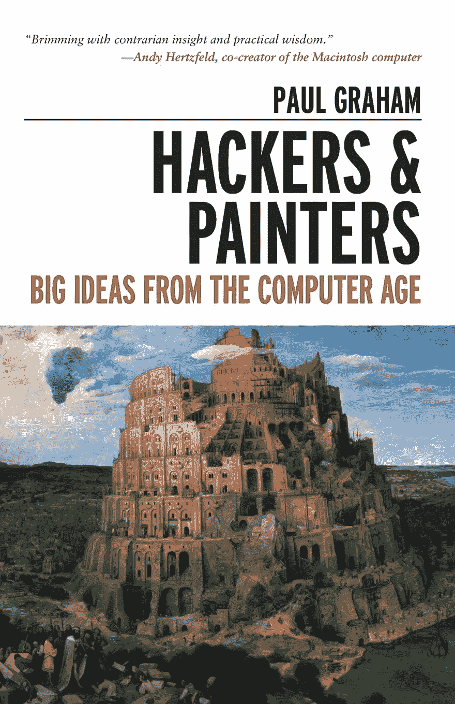
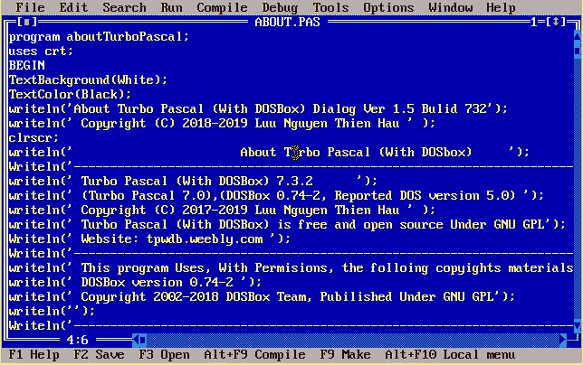
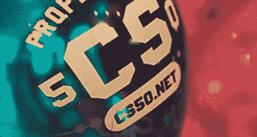
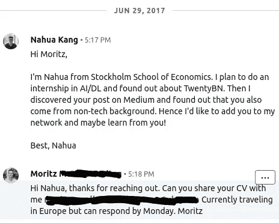
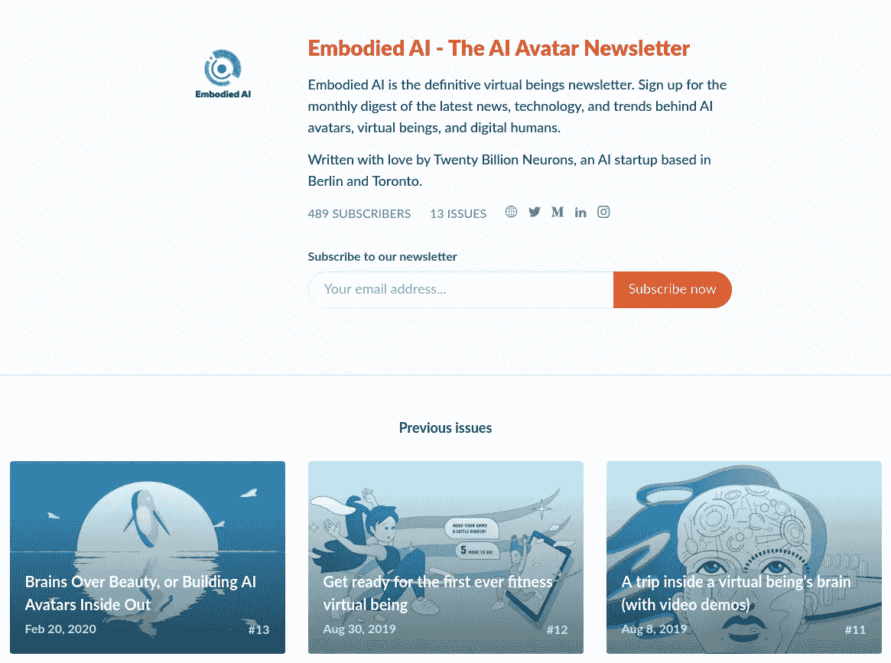
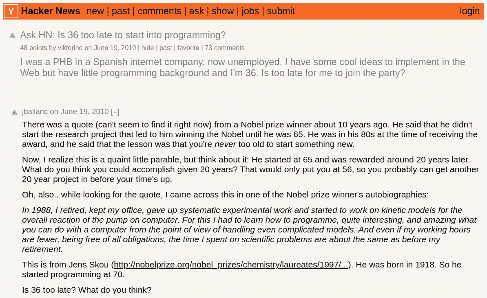
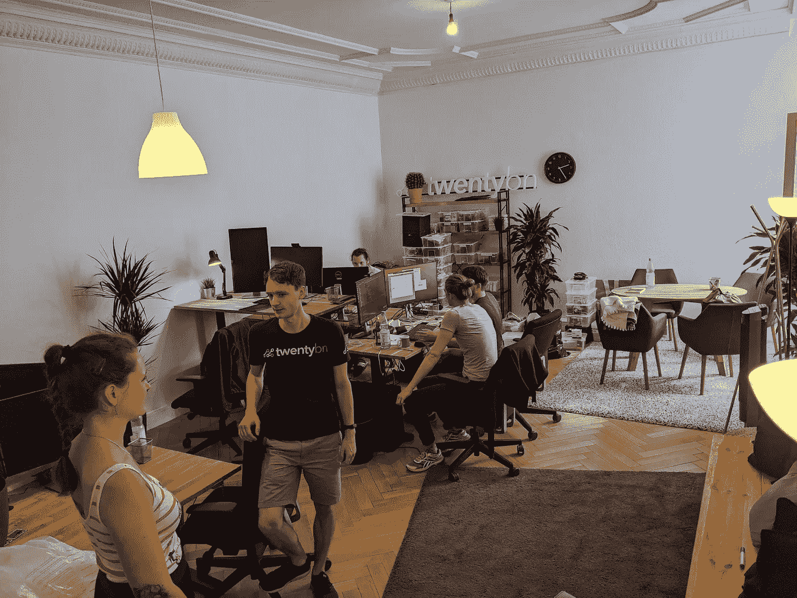

# 重塑我们自己

> 原文：<https://towardsdatascience.com/remake-our-self-f6ccb2226219?source=collection_archive---------36----------------------->

## 我从人文学科走向工程的道路


[Unsplash](https://unsplash.com/s/photos/programming?utm_source=unsplash&utm_medium=referral&utm_content=creditCopyText) 上 [AltumCode](https://unsplash.com/@altumcode?utm_source=unsplash&utm_medium=referral&utm_content=creditCopyText) 拍摄的照片

这是一篇长长的、详细的、非常诚实的文章，在这篇文章中，我讲述了挑战我的失败，以及我所做的正确选择，我对此心存感激。这是写给一小群朋友和熟人的自我反省和自我冥想。如果你，一个亲爱的陌生人，在我的作品中找到任何灵感或安慰，我会感到巨大的喜悦和成就感。

> *我写这封信不是为了让许多人看，而是只为了让你看:因为我们彼此都是对方的听众。*
> 
> *–伊壁鸠鲁*

# TL；速度三角形定位法(dead reckoning)

没有相关的大学学位背景，在软件工程领域开始职业生涯是具有挑战性的。这当然是一条有回报的道路，但正如我的故事所表明的那样，我们必须有信念，极其努力地工作，每天学习，设定正确的期望，并继续重塑自己，以便在幸运降临时抓住机会。无论我们想做什么样的职业支点，成功的关键是通过不断的学习和大量的试错，找到我们的激情和市场需求之间的甜蜜点。

感谢硅谷，软件工程是 21 世纪最(过分)荣耀的工作之一。每天越来越多的人对进入其他领域的软件感到好奇。

2016 年 4 月开始编程。2020 年 4 月开始软件实习。2020 年 7 月，我正式成为一名初级软件工程师，加入了终身学习者的行列，他们在一个最具活力、不断变化的领域中玩耍和劳作。

这篇博文主要是写给自己的。从我最亲密的朋友那里得到的反馈，我希望它代表了我所面临的所有失败、我所采取的正确行动，以及我在寻求职业成就的过程中所表现出的个性的真诚、坦率的陈述。

如果这篇文章有任何外部动机，那么它将分享我的信念，无论你对什么职业感兴趣，学习如何通过在不熟悉的领域获取知识和学习新技能来重塑我们自己是我们今天应该学习的最重要的技能之一。

换句话说，拥抱你感兴趣的知识，不管你是不是为了学位而学的。

# 回到原点

我的故事开始于 2006 年秋天，当时我以优异的成绩进入中国福建一所最负盛名的高中。在我所在城市的一年一度的高中入学考试中，我在我的中学排名第一，并且是前 30 名最好的学生之一。我的血液充满了自信，我觉得自己是一个聪明的饼干，注定会变得伟大。



黑客和画家:启发我编程的第一本书之一

大约在这个时候，我在阅读了 Eric S. Raymond 的博客文章的中文翻译,[如何成为一名黑客](http://www.catb.org/esr/faqs/hacker-howto.html)和保罗·格拉厄姆的[黑客和画家](http://www.paulgraham.com/hp.html)的几个翻译不好的章节后，对**黑客**产生了钦佩。Raymond 和 Graham 的作品揭示了黑客的个性和品质，以及黑客社区的精英性质，这与我当时尚未形成的价值观产生了深刻的共鸣。(*注:史蒂文·利维的《黑客:计算机革命英雄》是我十几年后才接触到的一本很棒的书。*)。

在我高中时已经懂编程的好朋友的鼓励下，我报名参加了高中提供的周末 Pascal 速成班。在一个灾难性的、潮湿的周六早晨，当我走进一个满是蓝色 DOS 屏幕的房间时，我吓坏了。

我生长在一个不允许我花太多时间玩电脑的家庭，那时候我甚至不能用五个手指正确地打字，更不用说使用 DOS 和用一种叫做 **Turbo Pascal** 的可怕语言写`if-else`语句或`for-loops`了！更糟糕的是，除了我之外的所有人似乎都能跟上速成班的节奏。



Turbo Pascal 的 DOS 和它的语法让我十年没有编程了(无意冒犯 Pascal！)

出于某种原因，盯着那个蓝色的屏幕，我无法理解计算机*是如何思考*的。我也不能写下任何一行代码来执行超过一个标准:

```
program Hello;
begin
  writeln ('Hello, world.');
end.
```

我感到紧张，头上冒汗。老师让我们解决一些更基本的问题，但我的大脑感觉像一锅煮过头的粥。我坐在那里，呆若木鸡，呆若木鸡，而其他所有的学生都在埋头苦读，互相分享他们的兴奋。

到了午休时间，我偷偷溜出教室，回家了。在我所在城市的一些最好的学生中，我觉得自己非常愚蠢。

在接下来的几周里，我尝试了`Java`、`C`和`C++`，这些语言是我表哥为了他在一所大学的计算机科学课程而学习的。然而，每次我都不知道如何在父亲的 Windows 电脑上安装这些语言的软件。我试着在纸上写代码，但即使是最简单的`#include <stdio.h>`对我来说也太复杂了，更不用说冗长的`Java`。

然后，迟早有一天，我放弃了，并得出结论，我不是编程的料。从那一刻起，编程成了那个尴尬、屈辱的早晨的痛苦回忆，我脆弱的自我不允许承认我没有自己想象的那么聪明。

# 我是如何开始学习 Python 的

时间快进到 10 年后的 2016 年，我已经获得了德克萨斯 A&M 大学的历史学士学位，并获得了久负盛名的*优等成绩*和 *Phi Beta Kappa* 荣誉社团的钥匙。我不知道该如何生活，也不喜欢准备法学院入学考试(LSAT)，于是在瑞士圣加仑一所著名的商学院攻读学士学位。

在那里，在那个美丽的瑞士小镇，我进入了一生中最艰难的两年。当我的同学在瑞士联合银行、高盛和麦肯锡等公司面试时，我在瑞士或德国都找不到商业实习机会。事实上，从我发出的众多申请中，我只得到一次面试机会，而公司录用了另一位候选人。

哪儿也不去。卡住了。我知道我错过了什么，但我不知道是什么。在德克萨斯 A&M 成为明星后，我觉得自己在瑞士是个彻头彻尾的失败者。

完全出于运气，我联系到了一位法兰克福的价值投资者，这位校友好心地给了我一些时间和我聊天。我们在 St. Gallen's Altstadt 喝咖啡时进行了愉快的交谈，然而，在此期间，他很快就认定我缺乏在他的基金中担任实习生所需的所有财务和会计知识。

感觉到他敏锐而准确的判断，我绝望地问道:

> "*我应该学习哪些对你的基金有价值的技能？"*

他回答道:

> *你可以考虑学习* **Python** *和* **编程** *进行机器学习。如今，技术也开始进入价值投资领域。”*

我觉得我的胃马上打结。当我走回家时，言语无法形容我的沮丧和失望。我当时含着眼泪打电话给我的女朋友，向她抱怨说，我在这个世界上最不想做的事情就是再次学习如何编程，这位投资者毫不夸张地告诉我，我应该学习编程的 *Python* 。我被打败了，那天很早就上床睡觉了，但却无法入睡。

第二天早上，我仍然心不在焉，我咬咬牙，在网上搜索可以教我`Python`的课程。我找到了一些免费资源，设法在我的 Windows 笔记本电脑上安装了`Python`，并开始编程。

立刻，我意识到事情有所不同:我没有像和`Pascal`、`C`或`C++`在一起时那样目瞪口呆。文本编辑器中没有神秘的、不可思议的脚本代码。很简单。我的 hello world 程序(用`Python2`语法)只有一行:

```
print "Hello, world."
```

我内心仍然充满不确定和恐惧，我告诉自己，这一次，我可能真的会带着`Python`到达某个地方。这就是我开始编程的真实故事。

# 多编码遇到深度学习

我想真诚地感谢吉多·范·罗苏姆和所有的核心开发人员，因为他们创造了一种美丽的语言，吸引了我们这些被 T8 吓到的人。

在通过在线书籍[艰难地学习 Python](https://learnpythonthehardway.org/python3/)和 Coursera 的 [Python for Everybody](https://www.coursera.org/specializations/python) 学习了基本的 Python 语法和一些编程概念后，我对编程有了一些信心。我把我的操作系统从 Windows 换成了 Ubuntu，这是一个流行的 Linux 发行版，作为一种将编码作为一种生活方式的姿态。

我还没有爱上编程。有时候，当我遇到一个我无法理解的新概念时，我从 2006 年开始对电脑的恐惧会再次出现，我必须给自己时间冷静下来，回到电脑屏幕前。

但是对于一个陷入自怜和停滞不前的职业道路的学生来说，编程是一种奇怪的解放。因此，即使是在终端制作一个无用的、错误的基于文本的游戏，对我来说也是一种很好的消遣，让我从枯燥的经济学考试中解脱出来，我必须记住这些考试。

没有任何刻意的目的，我学到了越来越多的东西，比如如何双启动 Ubuntu 和 Windows，如何使用终端和命令行，如何写一个小脚本来[从 YouTube 上报废搜索结果，下载 YouTube 视频](https://github.com/nahuakang/python-mini-projects/blob/master/youtube-downloader.py)。我写得越多，编程就变得越有趣。我知道没有人会使用我写的任何程序，但不管怎样，我为它们感到骄傲。

到 2016 年秋天，我经过深思熟虑，决定不在圣加仑完成学业，而是开始在斯德哥尔摩经济学院攻读硕士学位。一方面，我想结束异地恋，另一方面，我希望斯堪的纳维亚能为我停滞不前的职业发展提供机会。

作为我的项目中唯一能够用通用编程语言编写*脚本*的学生，我越来越深入其中。当我的同学在研究咨询案例时，我在学习如何模块化我的代码的同时，黑进了我的文本编辑器和终端来渲染一个 Hangman 游戏。当我的同学在晚上聚会和社交时，我坐在地下室继续学习在线数学和编程课程。作为一群商科学生中唯一对计算机的魔力有所了解的人，我感到很自豪。



在我的编程之路上，最有影响力的在线课程之一是哈佛的 CS50。(来源: [CS50x](http://cool-ar.com/harvard-cs50x/) 在维基媒体共享许可下)

大约在这个时候，我完成了[麻省理工的 6.00.1x 和 6.00.2x](https://courses.edx.org/courses/course-v1:MITx+6.00.1x+2T2017_2/course/) ，开始做[哈佛的 CS50 课程](https://cs50.harvard.edu/web/2020/)，最终完成了其中 70%的作业。我爱 CS50 和它的人民。直到今天，它仍然是所有在线课程中最好的，我把它推荐给我所有想学习编程的好朋友。

不久之后，我也发现了 Udacity 关于**深度学习**的新节目。由于不知道什么是深度学习，我报名参加了这个课程，因为它听起来很酷(现在你可以通过像 [fast.ai](https://www.fast.ai/) 这样的免费资源学习)。我学习了反向传播、卷积神经网络、图像分类、长短期记忆(LSTM)和生成对抗网络(GAN)。所有这些都不容易，我肯定无法独自完成所有的事情。哇哦！我可以训练一个“神经网络”来识别图像中的数字！

与我最早的编程经历非常相似，我经常对深度学习感到目瞪口呆，但我坚持了下来，因为这个主题很有趣，也因为我认为我没有其他竞争优势。

# 一次又一次的失败，直到幸运降临

为了更好地消化我的知识，我开始写博客。我很荣幸我写的两篇关于深度学习基础的文章([帖#1](/introducing-deep-learning-and-neural-networks-deep-learning-for-rookies-1-bd68f9cf5883) 和[帖#2](/multi-layer-neural-networks-with-sigmoid-function-deep-learning-for-rookies-2-bf464f09eb7f) )总共邀请了超过 **24 万的浏览量**。(*注:我从来没有找到时间和精力来完成关于反向传播的第三篇博客。这里有一篇来自 Christoph Olah* 的关于反向传播 *的惊人的* [*帖子。*](https://colah.github.io/posts/2015-08-Backprop/)

这些小小的成功增强了我的信心，我决定寻找有趣的人工智能初创公司，申请在柏林的产品、营销或 bizdev 实习。在读了林恩·鲁特向工程转型的故事后，我想过申请工程职位，但我退缩了。不管怎样，我联系了当时能找到的所有创业公司。

这个循环又重复了一遍。我不是被拒绝就是被忽视。

我记得我申请的一家初创公司回信说，他们没有适合我的职位，但一个月后我发现他们从圣加仑聘请了另一个我感兴趣的人。这在那一刻伤害了我的自尊心，但事后看来，我从来没有把这些决定放在心上。初创公司往往缺乏大型人力资源团队来消化所有的申请，有时，没有被错误的雇主聘用是一件好事。

在我沮丧的时候，福尔图娜夫人降临在我身上。我联系了莫里茨，一个完全陌生的人，他当时是一家深度学习初创公司 [TwentyBN](https://20bn.com/) 的产品所有者。那时，我几乎已经放弃了在柏林找实习的机会，只是因为莫里茨的情况与我相似，我想我可以为自己的职业道路寻求一些建议。我点击了他 LinkedIn 个人资料上的按钮，发了一条短信。



一条简单的 LinkedIn 信息改变了我的职业生涯

我不知道这条消息让我得到了一份实习和全职工作，最终允许并鼓励我转向软件开发。(*注:2017 年 10 月，在我开始在 TwentyBN 实习之前，我曾短暂地参与了一个开源项目*[*OpenMined*](https://www.openmined.org/)*，试图获得更多的软件经验。那次经历也让我害怕，因为我不理解 Git、Github、单元测试和 CI/CD。我以工作为借口暂停了它，直到 2020 年 4 月，我成为 TwentyBN 的一名软件实习生。*)

# 对职业道路不满意

我做了两年的产品营销人员，但没有一天我觉得这是我的使命。我接受这份工作是因为我完全相信 TwentyBN 的员工和我们的技术，但我不喜欢社交媒体。我想为公司的成功做出贡献，但从未改变对社交媒体营销的想法。在这个职位上，我没有什么长进，也从未感到满足。

在这段时间里，我经历了一次友好的分手，但还是伤了我的心。而且，我暗暗感到自己的位置在公司里被边缘化了。我的薪水增加了，但在我内心深处，我对自己不能扮演一个更有意义的角色感到沮丧。我在瑞士体验到的那种压抑的感觉似乎又在上升。

虽然我的一部分继续沉迷于一些偶尔晚上的编码会议和书呆子编程语言活动，但我不认为软件对我来说是可能的。我觉得我已经太老了，不能再回到初级职位重新开始。



在我对职业道路不满意的那段时间，我尝试了很多事情，包括为我的公司经营一份名为 Embodied AI 的时事通讯

在工作中，我开始撰写和编辑我们公司的简讯 [Embodied AI](http://www.embodiedai.co/) 。私下里，我开始在一份名为 [Plutarch](https://plutarch.substack.com/) 的时事通讯中把我的阅读清单变成关于领导力的书评和分析。

怀着为我的作品建立声誉的愿望，我开始尝试并试图吸引人们注册这两份时事通讯。我尝试了各种营销渠道，被多个 Reddit 子网站封杀，最终为 Embodied AI 管理了大约 500 名订户，为我的个人通讯管理了大约 100 名订户。

就我自己而言，我采纳了朋友克里斯的建议，克服了我对健身房的恐惧，开始尝试举重和健美操，这完全超出了我的舒适区。

健身给了我多巴胺和睾丸激素。但是我的通讯尝试没有给我带来满足感。在将近一年的时间里，我继续进行了各种各样的小型实验。然而，我对职业的不满仍在继续。

# 转行不嫌老

2019 年底，我对工作的长期不满表现为一场存在主义危机(2020 年的冠状病毒加剧了这一危机)。

我得出了一个严峻的结论:**如果我再继续做 10 年的产品营销，我会恨自己没有采取任何行动。**

我脑海中的这个声音再次暗示了软件。

早在 2018 年，我就想向 TwentyBN 申请深度学习工程实习生的实习机会，但我缺乏信心，无法晋级。到 2019 年底，我从熟人那里听到了足够多的成功故事，他们在训练营后找到了软件工作，这让我重新燃起了探索软件工程作为职业生涯的愿望。

在我回中国的圣诞节假期中，我花了整整 3 周的时间和哈佛的 CS50W 一起学习 web 开发，从早上 8 点一直编码到晚上 1 点或 2 点。我想用这种密集的体验来测试自己，看看我是否有能力成为一名程序员，或者这只是一个阶段。学习曲线很陡，防火长城阻止我轻松访问 Google 和 StackOverflow。但是我管理了两个 bug 项目，学到了一些`Flask`、`Django`、`Javascript`和`WebSocket`。



黑客新闻上的这个帖子让我相信，我仍然可以转行，而且我还不算太老

在这三周里，最具变革性的是，在将近 14 年的时间里，我第一次感觉到自己又回到了第九区。我全神贯注于编程。一整天我都在思考如何解决这些项目和问题。我甚至做了 2-3 个梦，在梦里我找到了代码的解决方案。

编程比产品营销更适合我。从本质上来说，市场营销是一项非常困难的工作。病毒营销和增长营销是研究得很透彻的话题，但没有人能 100%肯定地说，一个产品或一家公司的成功是否是由某个单一的策略或行动造成的。

然而，编程是致命的逻辑。我被它迷住了，因为我喜欢这种即时的满足感，因为有时，即使一行代码的改变也会导致巨大的视觉差异。当我最终调试了我的代码并巩固了我的学习成果时，虽然有时单调乏味和令人沮丧，但也给了我巨大的回报。这比我过去两年做的好多了！

最后，在那几周我工作非常努力，直到我从中国回到柏林才听说了 COVID19。

回到工作岗位后，我认为自己还不算太老，不适合尝试软件工程。我成功说服了我的老板 Moritz、我的 Python 团队领导以及我的 CTO Ingo 给了我三个月的带薪实习。又是一个不眠之夜，无数次的头痛。减薪是可以控制的，但是我对没有成功的紧张和我的冒名顶替综合症给我的心灵增加了很多压力。

然而，到现在为止，我的编程经验教会了我**什么是我的学习模式**，我对自己也变得更有耐心了。我稳步学习，解决门票，寻求帮助，最终，实习变成了一个新的全职职位。

# 重塑我们的“自我”

有一个无条件支持我的家人和好朋友帮助了我。有重视教育并在我最糟糕的时候慷慨支持我的父母帮助了我。接受一个陌生人的建议很有帮助。学过编程和深度学习有帮助。学过历史专业并有良好的写作技巧对此有所帮助。与我公司的管理层和同事们志趣相投，这帮助了我。所有这些帮助都是必要的。

但同样重要的是，我还必须感谢福尔图娜夫人，是她把我塑造成了**这样一个人，他有学习新的、看似令人畏惧的技能的动力，用自律和坚韧重塑自我。如果没有这种不断学习的习惯，我不可能取得我想要的成就。**

您可能已经知道，我作为软件学徒的学习之旅才刚刚开始。软件工程是一个充满活力的领域，有许多有才华的人和优秀的想法。我仍在学习如何编写好的软件，以及如何跨多个团队工作。



这是我日复一日工作的一群了不起的人

四月，我重新联系上了开源项目 [OpenMined](https://www.openmined.org/) 的创始人。我开始再次贡献我有限的能力，以便让自己更多地接触其他编程语言，磨练我作为开发人员的整体技能。这并不容易，但 OpenMined 社区是一个了不起的团体。

此外，我必须弥补一些知识缺口，比如架构设计、模式设计，以及众所周知的算法和数据结构。我很清楚这些差距，并将继续努力。毕竟我报了一个只有继续学习才有效果的职业。

# 拉芬

我们中的大多数人不会有像火箭一样一帆风顺的职业生涯。我们大多数人注定会在生活中的某个时刻遭遇职业僵局。我们大多数人都有能力做些什么。

对我来说，那包括了近十年的转专业和思考我会对哪一行工作充满热情。

在我穿越美国和欧洲的旅途中，每一站都要面对挫折和拒绝。这是我人生中第一次没有通过工商管理专业的考试和两门考试。这包括对我的职业道路不满两年。

但就像狄更斯写的那样，这是最坏的时代，但也是最好的时代。感谢所有现在或曾经在我生命中的人，我活了下来。失败挑战了我对自己优点和缺点的认识，但没有一次失败摧毁了我。

每次我被击倒，我都会哭一会儿，然后站起来，从学习新知识和获得新技能中寻找安慰。没有放弃。

今天我在这里。一个新的旅程刚刚开始，我对我将在旅程中学到的所有令人兴奋的事情感到兴奋。我非常有信心，各种各样的失败和拒绝将继续向我走来。我确信我会有弱点和挫败感的时候。但是我已经经历了很多，我知道我足够强大，足以承受所有这些，并继续重塑我自己和我的生活。

在过去的几年里，我对别人隐瞒了大部分的失败。我的一部分仍然为他们感到羞耻。但我决定把它们写下来，作为自我反省的一种形式。此外，我知道有人正在经历类似的经历。也许这些话会有帮助。

所以给你。这个故事是给你的，我希望，尽管它很长，我的历史能引起你的共鸣或启发你，这样你最终也能重塑你的生活。祝你好运，永不放弃。

欢迎联系我或在 Twitter 上关注我！