# 星球大战第四集(1977 年)重新制作

> 原文：<https://towardsdatascience.com/remastering-star-wars-using-deep-learning-b21713928a53?source=collection_archive---------38----------------------->

## 一个深度学习管道来重新制作被删除的场景


图片由[阿格尼耶斯卡·科瓦尔茨克](https://unsplash.com/@koalamoose)在 [Unsplash](https://unsplash.com/photos/c0VRNWVEjOA) 上拍摄

**TLDR**

这是模型的输出。左边是重制输出。右为原创视频。

用于训练和跑步推理的完整 Jupyter 笔记本可在 [Github](https://github.com/spiyer99/spiyer99.github.io/blob/master/nbs/star_wars_remastery.ipynb) 上获得

**被删除场景的新希望**

我是《星球大战》的超级粉丝。和许多星战迷一样，我也迷上了卡通频道和迪士尼+的《星球大战:克隆人战争》。这是一场非凡的演出。

但是当我看旧的东西时，我总是对视频质量的下降感到恼火。例如，这里是从《星球大战:第四集:新的希望》(1977)中删除的场景。这是第一部被创作出来的星球大战。

视频由[马塞洛·祖尼加](https://www.youtube.com/channel/UCSrRYklbl6GDioKfoQsjfeQ)

这些奇怪的黑色眼镜不断出现。难怪这些是被删除的场景。

显然那些奇怪的规格被称为[提示符号](https://en.wikipedia.org/wiki/Cue_mark)。它们是胶片上划痕留下的痕迹。《星球大战》是一部很棒的剧集，但它也很古老。

深度学习最近被用于视频恢复。结果非常有希望。例如，Deoldify 允许用户给旧视频和图像着色。 [NVIDIA 的 Noise2Noise model](https://www.youtube.com/watch?v=P0fMwA3X5KI) 可以让人们将旧图像恢复到曾经的辉煌。

但到目前为止，据我所知，还没有什么东西能专门去除旧胶片上的“记号”和粒状斑点。所以让我们来建造它吧！

# 创建数据集

创建数据集很棘手，但仍然可行。我是这么做的。我从 youtube 上下载了高质量的视频。然后我毁了他们。我添加了黑色眼镜，降低了视频的分辨率。Ffmpeg 在这方面非常有用。

首先，我们将下载视频。

```
youtube-dl --format best -o seinfeld.mp4 [https://www.youtube.com/watch?v=nEAO60ON7yo](https://www.youtube.com/watch?v=nEAO60ON7yo)
```

我在用这个视频。我用的是《T2》中宋飞的一个片段。为什么不呢？

视频由[系列制作](https://www.youtube.com/channel/UCFg3kyRzqAGpeEedLMPDZlA)

那我们就要毁了它。为了做到这一点，我从 youtube 上下载了一个颗粒状的电影叠加。然后我用 ffmpeg 叠加视频，混合设置为柔光。找到正确的混合设置需要大量的试验和错误。ffmpeg [文档](https://ffmpeg.org/documentation.html)没有很多例子。

现在我们有两个视频。一个质量很好，另一个质量很差。

作者提供的视频

作者提供的视频

现在我们将从每个视频中提取帧。最初，我采用了一种天真的方法来做这件事。我会在 python 中浏览视频并单独抓取每一帧。但这花了太长时间。我最终意识到，我们可以在这里使用多处理来真正加快速度。这是根据海登·福尔克的剧本改编的。

太好了。现在我们有两个数据集。一个劣质图像(取自受损视频)和一个优质图像(取自高质量视频)。为了让这些垃圾图片更垃圾，我会缩小它们(虽然这不是必要的步骤)。

```
def resize_one(img, size): targ_sz = resize_to(img, size, use_min = True)
   img = img.resize(targ_sz, resample =  PIL.Image.BILINEAR).convert('RGB')
   return img
```

这就是现在蹩脚的正常图像的样子。旁注:这是《宋飞正传》中一个很棒的场景。

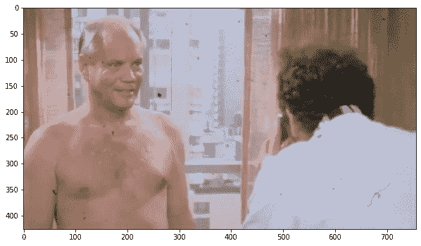

作者图片

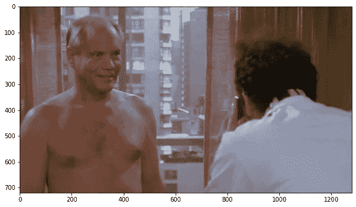

作者图片

快速检查显示，我们有大约`10014`个文件的数据集。非常好。

# 神经网络

让我们通过使用转换来充分利用这些`10014`文件。

我添加了水平和垂直翻转，缩放变化，灯光变化和旋转变化。使用 Fastai，这真的很容易做到。

以下是一些图像转换。

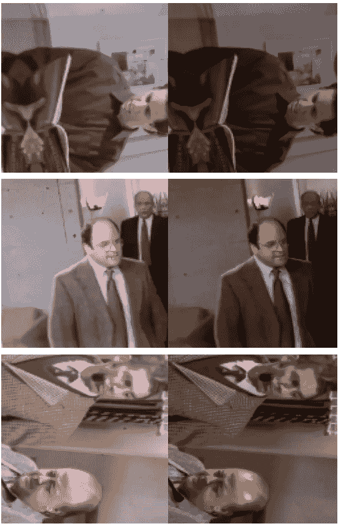

作者图片

还不错！

我们将在这些数据上使用 fastai 和 jason antic 首创的 [NoGAN 网络](https://www.fast.ai/2019/05/03/decrappify/)。这个代码的灵感来自 fastai 课程的第 7 课。

我在 google colab 的免费 GPU 上训练了这个模型。他们是一个伟大的资源，我不能相信他们是免费的。

# 培养

fastai [推荐](https://www.youtube.com/watch?v=9spwoDYwW_I)的有趣的事情是逐渐增加你的图片的尺寸。

因此，首先，你在小尺寸图像上训练，然后你升级你的图像，在大图像上再训练。这会节省你很多时间。相当聪明。

首先，我们将在大小为 128x128 的图像上进行训练。因为图像太小了，我可以把批量增加到 64 张。

我为此选择了一个`1e-2`的学习率。我想要一些有攻击性的东西，但仍然是安全的爆炸。这已经被[证明](https://sgugger.github.io/how-do-you-find-a-good-learning-rate.html)非常有用。

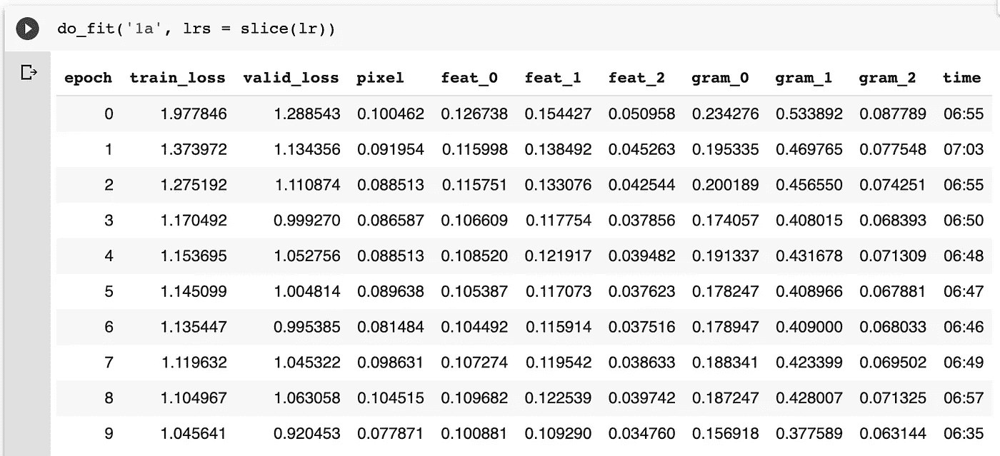

作者图片

网络将在训练期间打印结果。输入在左边，预测在中间，目标在右边。结果看起来很有希望！

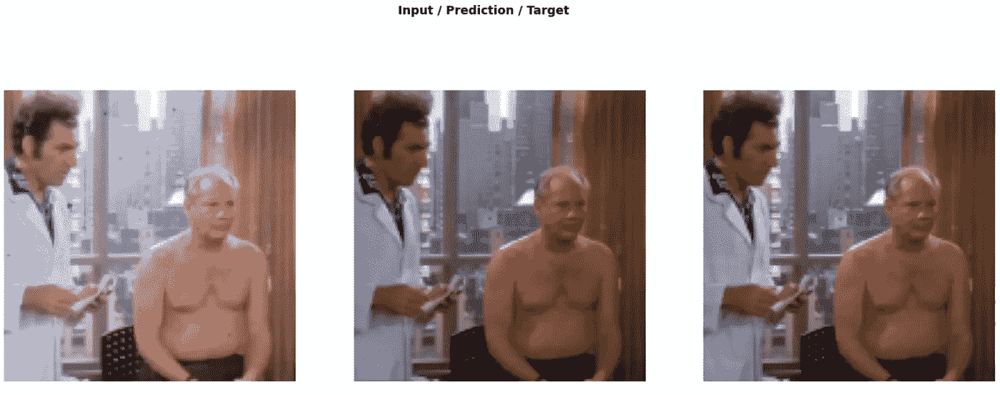

作者图片

我调整了尺寸，再次训练。再一次。每次我把尺寸调整得比以前稍微大一点。我将视频帧的尺寸从 128x128 改为 480x480。

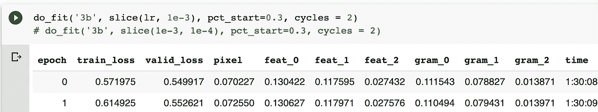

作者图片

这是最后一班火车。为此我使用了`pct_start = 0.3`。我想在培训期间减少 70%的学习时间。在微调模型时，我更喜欢较低的学习率。这次训练的结果看起来非常好。

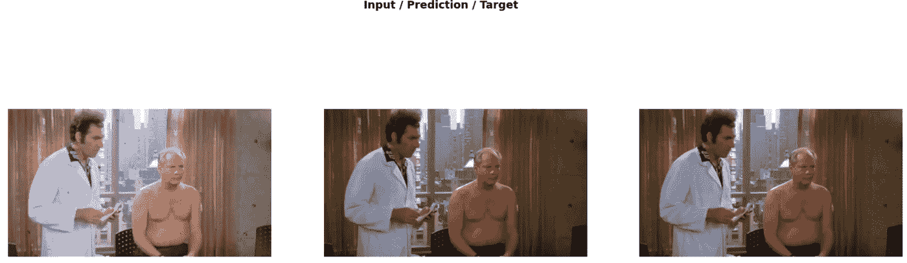

作者图片

# 推论:适用于星球大战

一旦这个网络训练完毕，我就进行推理。这比我原先想的要复杂得多。

我必须下载星球大战删除的场景(使用 [youtube-dl](https://github.com/ytdl-org/youtube-dl) )，然后提取这个视频中的所有帧。我提取帧使用相同的方法之前。

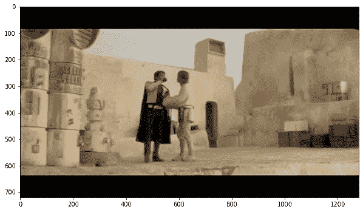

作者图片

然后我不得不在视频的每一个单独的帧上运行来自学习者的推断。那需要很长时间。

我在这里添加了一些黑客。

首先，我添加了渲染因子。这是从[解密](https://github.com/jantic/DeOldify)中截取的。这个想法是，我缩小图像，并将其转换为一个正方形。然后我对那张图片进行推理。该模型更容易接受正方形的图像。这已经被[显示为](https://github.com/jantic/DeOldify#stuff-that-should-probably-be-in-a-paper)大大减少了“故障”。

在正方形图像上运行推理后，我将它转换回原始形状。我发现这可以减少故障，通常会导致更平滑的视频输出。我将`render_factor`设置为`40`，虽然如果我们想要更高的分辨率输出，它可以更高。不过，我可能需要更大的内存。

第二，我调节亮度。这不是真正的黑客。似乎更像是一个错误，我是正确的手动。出于某种原因，模型推断导致图像亮度非常低。

我怀疑这与我们之前用于 ffmpeg 的`softlight`过滤器有关。但是我必须在这里手动更正。我需要进一步调查此事。

第三，我使用 matplotlib 的保存功能。我发现 fastai 的[保存图像](https://docs.fast.ai/vision.image.html#Image.save)功能给了我非常奇怪的结果(Luke 的衣服是荧光蓝色和红色)。但是奇怪的是，matplotlib 的保存功能给了我很好的结果。我需要调查这件事。我怀疑我可能会损失图像的质量，因为我正在使用 matplotlib 的`savefig`功能。

这是模型的一些输出。

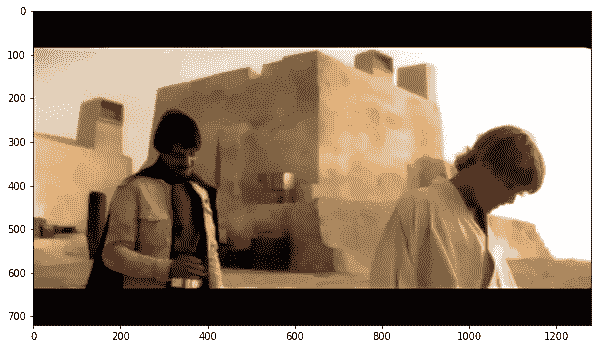

作者提供的图片

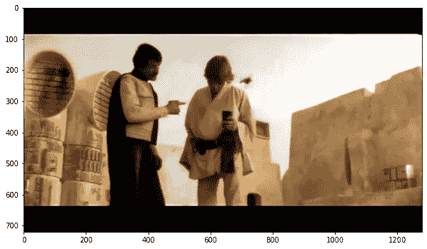

作者图片

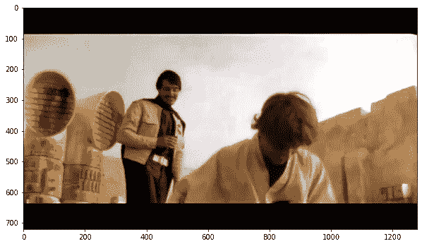

作者图片

然后我不得不把所有这些画面拼接在一起，制作一个视频。为了做到这一点，我最初使用 ffmpeg，但我结束了我的 RAM 超载。相反，我用了 opencv2 的`VideoWriter`。

这是最终的输出。

作者提供的视频

和原始视频

视频由[马塞洛·祖尼加](https://www.youtube.com/channel/UCSrRYklbl6GDioKfoQsjfeQ)

# 丰富

1.  天空需要更多的工作。但是我喜欢背景的活力。这是一个有趣的(完全没有计划的)效果。目标是从视频中删除“提示标记”(恼人的黑色规格)。我认为在这方面已经做得很好了——但是还有更多的事情要做。
    我喜欢网络是如何强化了阳光的。当比格斯说他要加入反抗军时，卢克和比格斯之间的场景完全改变了。

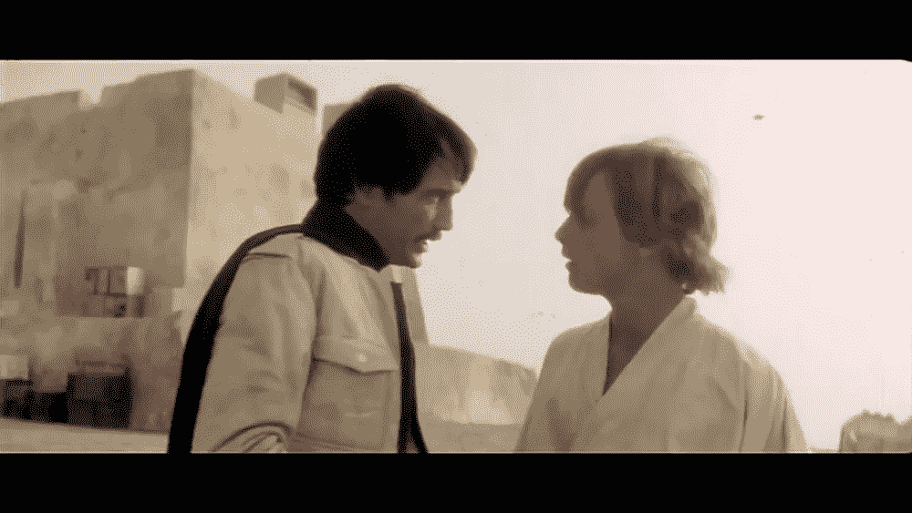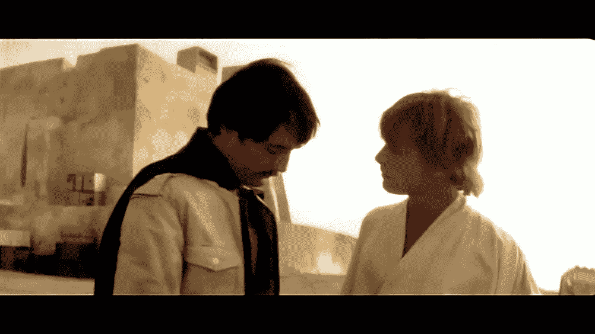

原始帧(左)。网络输出(右侧)

2.在`22`秒标记周围出现了一条奇怪的横条线。我没有在训练集中添加任何水平条，所以完全可以理解网络根本没有删除它。但是在未来，我需要在我的训练集中增加更多的单杠来解决这些问题。

3.我也在考虑对视频做更多的超分辨率处理。高质量地展示一个年轻的卢克·天行者会很不错。为了做到这一点，我可以在进一步训练之前调整图像的大小。我已经缩小了图像，但我还可以进一步缩小。
或者，为了实现 superres，我可能会使用现成的升级工具，比如 [VapourSynth](https://github.com/AlphaAtlas/VapourSynth-Super-Resolution-Helper) 。这可能是最好的选择，因为原始视频的质量已经很差。

4.推论也是一个问题。它会导致内存过载和崩溃。结果是，`42`秒是我在这个视频中能得到的最长时间。我不完全确定如何解决这个问题。但是如果我要进一步使用它，我需要解决它。

这么多事要做！

完整代码可从 [Github](https://github.com/spiyer99/spiyer99.github.io/blob/master/nbs/star_wars_remastery.ipynb) 获得

*原载于 2020 年 6 月 19 日*[*https://spiyer 99 . github . io*](https://spiyer99.github.io/Star-Wars-Remastery/)*。*