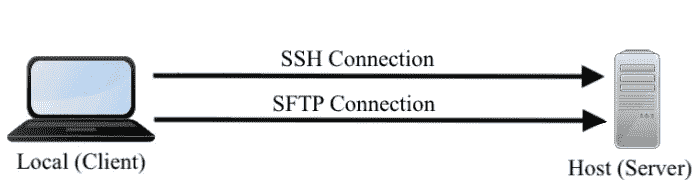

# 远程开发变得简单

> 原文：<https://towardsdatascience.com/remote-development-with-pycharm-d741287e07de?source=collection_archive---------5----------------------->

图片来自 [Unsplash](https://unsplash.com/photos/hGV2TfOh0ns) 上的 [@domenicoloia](https://unsplash.com/@domenicoloia) 。

## PyCharm 提示和技巧

## 对我来说，PyCharm 中的< 5 minutes!

Configure once, then connect each time! Image created by the author.

P [ycharm](https://www.jetbrains.com/pycharm/) 是一个很棒的 IDE——拥有促进[有效编程](https://www.jetbrains.com/pycharm/features/)的特性，一个致力于分享聪明的[插件](https://plugins.jetbrains.com/pycharm)的社区，以及我最喜欢的特点[专业许可证对学生免费](https://www.jetbrains.com/community/education/#students)。有了它， [JetBrains toolbox](https://www.jetbrains.com/toolbox-app/) 及其许多 ide(一种最现代的计算语言)可供学生免费使用(没有任何附加条件)。好样的，[脑残](https://www.jetbrains.com/)！对学生免费是更多产品应该拥抱的服务。

至此，让我们进入正题——通过 PyCharm 远程工作。

随着冠状病毒成为国际关注的焦点，很大一部分专业人士必须远程工作(包括我自己)。随着[我](https://www.jrobsvision.com/)设置一台 iMac(即本地机器)与运行 Ubuntu 的 PC(即远程主机)同步工作，下一步就是配置 PyCharm 在本地编辑，远程运行。这样做有很多原因——我的动机是用 GPU 将作业部署到远程主机。这不是我第一次经历这个过程，每次都要回忆。我认为这值得做笔记并在媒体上分享。尽情享受吧！

***注:*** *以下步骤描述了使用 JetBrain 的 PyCharm 进行远程设置。然而，对于所有 JetBrain 产品(例如，*[*【web storm】*](https://www.jetbrains.com/webstorm/)*、*[*【IntelliJ】*](https://intellij-support.jetbrains.com/hc/en-us#)*以及作为 JetBrains 一部分的其他产品)来说，这是相同的过程。*

# 设置远程主机

通过 PyCharm 的*部署*工具设置*远程主机*非常简单(也就是说，PyCharm 提供的大多数特性都是如此)。对此，几句话就够了。尽管如此，在本教程中准备了详细的步骤，以确保清晰。我们开始吧！

具体来说，我们的目标是建立一个 [SFTP](https://www.ssh.com/ssh/sftp) 连接，一个运行在 SSH 协议上的安全文件传输模式。为此，我们必须知道以下几点。

1.  通过[*ifconfig*](https://www.linuxtrainingacademy.com/determine-public-ip-address-command-line-curl/)bash 命令可以访问主机的 IP 地址。
2.  主机上的用户名(在(1)中相应的 IP 地址上)
3.  密码或一个 SSH 密钥(为了简单起见，这里将使用密码——未来的博客可能在 SSH 密钥上)。

现在，有了 1–3 的知识，我们在本地机器上配置 PyCharm。

从这里开始，gif 值 1000 个单词:

从菜单栏的 ***工具*** *中打开 ***配置…*** *。*作者创造的形象。*

随着*展开*窗口打开:

创建新的 **SFTP** 连接。作者创造的形象。

设置配置(即，参见上面的 1–3)。作者创造的形象。

将**映射**设置为主机上项目的根目录。注意**远程浏览器**(左)用绿色突出显示映射的文件(即，相同名称的文件，相对于映射根，被假定为映射)-由作者创建的图像。

通过最底部的工具面板查看**远程主机**，其中保存的更改被确认传输到主机—作者创建的图像。

N ow，修改可以自动上传，如下图所示。

设置 ***【自动上传(总是)*** *【开】* —图片由作者创作。

N 注意，现在*自动上传(总是)*选项被取消。

***自动上传截图(总是)*** *切换“开”* —图片由作者创作。

答或者，手动处理同步有多种方式。

**浏览远程主机**并右键单击要同步的文件(无论是与主机同步还是从主机同步)。请注意，上面截图中显示的复选标记不再显示——图片由作者创建。

瞧啊。就这样，我们都被设置为远程工作！

# 概括起来

*免责声明。* Pycharm 是 2016 年从 MATLAB 过渡时最有意义的偏好(即，相似的外观和感觉)。也就是说，还有其他有希望的替代方案，其他人可能会认为更好(例如， [Atom](https://atom.io/) 、 [Visual Studio](https://visualstudio.microsoft.com/) 、 [Spyder](https://www.spyder-ide.org/) 等等)。参见[2020 年 11 个最佳 Python ide](https://www.guru99.com/python-ide-code-editor.html)根据[guru 99](https://www.guru99.com/)——不，我没有选择这个列表仅仅是因为 Pycharm 被列为第一；)在下面的评论中分享你最喜欢的 IDE。

最后一点——我花了很多时间学习 PyCharm，因为它是我日常使用的工具。那么，了解一种提高生产率的新手段是否值得呢？它不仅值得，而且势在必行——vim、Emacs 等等。，非常适合快速访问远程文件；然而，现在是 2020 年，人们，让我们利用我们所掌握的技术；)

# 旁注

像 PyCharm 这样的工具隐藏了许多基本概念:初级研究人员不会为了节省几分钟的时间而损害深刻的理解。不要学习 PyCharm 的来龙去脉，除非知道 Python 的基础知识，并且正在并行理解一个中级知识。否则，总有一天，像 PyCharm 这样强大的图形界面不是一个选择。一个人必须能够执行 still(相信我，如果这对你来说不明显，那么这意味着你可能应该学习构建 python 项目和系统路径的基础)。这里列出了其他一些值得一读的博客:

1.  [如何构建一个 Python 项目](https://medium.com/swlh/how-to-structure-a-python-based-data-science-project-a-short-tutorial-for-beginners-7e00bff14f56)，作者[米沙·贝里恩](https://medium.com/u/2c1e058445b1?source=post_page-----d741287e07de--------------------------------)。
2.  [Jeff Hale](/10-steps-to-set-up-your-python-project-for-success-14ff88b5d13)撰写的《成功建立 Python 项目的 10 个步骤。
3.  [千篇一律的](https://drivendata.github.io/cookiecutter-data-science/)学习和发展——过去对我来说很有效。

有大量关于上述主题的信息。因此，如果你寻找的答案不在一个或多个参考文献中，那么评论和链接会被提供。如果没有链接，那么将创建一个博客——童子军的荣誉。

我希望这有所帮助。对这个或未来应该涉及的话题提出意见、建议或问题！如果有什么特别好的地方(例如，gif 相对于文本和图像的使用)或不好的地方(例如，细节太少)，请让我知道，以便更新它，并让我在构建未来的博客时考虑。

感谢您的阅读:)

在 [LinkedIn](https://www.linkedin.com/company/superannotate/) 、 [Twitter](https://twitter.com/jrobvision) 、[脸书](https://www.facebook.com/superannotate)上关注罗宾逊博士

 [## 乔·罗宾逊的主页

### Joseph P. Robinson 在 Vicarious Surgical 从事外科机器人研究……Robinson 博士获得了东北大学电气和计算机工程学士学位(2014 年)和计算机工程博士学位(2020 年)。

www.jrobsvision.com。](https://www.jrobsvision.com/) 

# 阅读更多由[约瑟夫·罗宾逊博士](https://medium.com/u/8049fa781539?source=post_page-----d741287e07de--------------------------------)在媒体上发表的文章

 [## 熊猫小贴士:需要速度

### 个人最喜欢的一句俏皮话

towardsdatascience.com](/pandas-tips-tricks-need-for-speed-54e217cc6aa0)  [## 对图像数据集进行重复数据删除的绝佳方式

### 生产中的命令行工具

towardsdatascience.com](/a-great-tool-for-image-datasets-cb249663ca45)  [## 减少杂乱，适应空间

### 变得有条理、高效甚至舒适的 3 个技巧

jvision.medium.com](https://jvision.medium.com/reduce-the-clutter-adapt-the-space-6daeef2e2ca9)