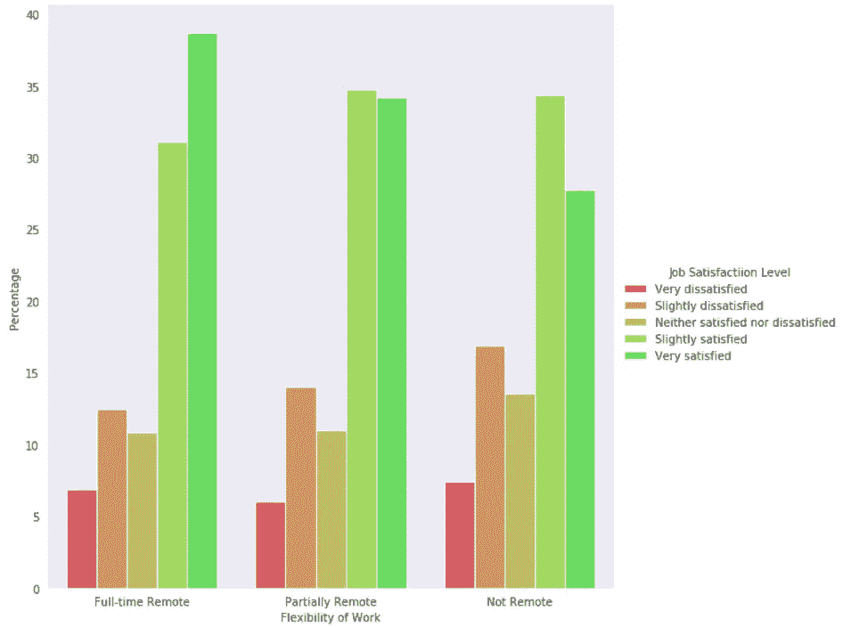
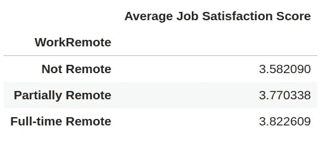
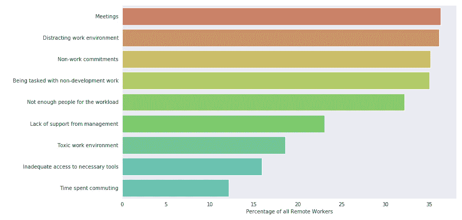
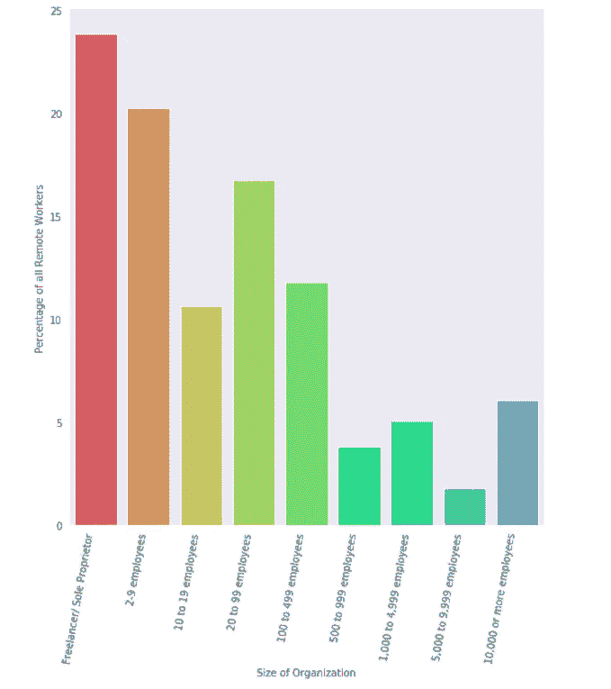
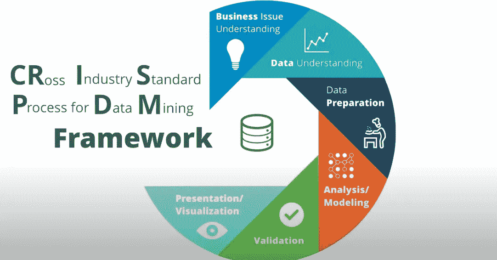

# 远程工作——新标准？

> 原文：<https://towardsdatascience.com/remote-work-the-new-norm-5d9beb956a85?source=collection_archive---------71----------------------->

## 数据驱动分析，更好地了解远程工作

我们真的需要去办公室吗？(照片由[阿维·理查兹](https://unsplash.com/@avirichards?utm_source=unsplash&utm_medium=referral&utm_content=creditCopyText)在 [Unsplash](https://unsplash.com/s/photos/remote-work?utm_source=unsplash&utm_medium=referral&utm_content=creditCopyText) 上拍摄)

我花了三个月远程工作。可能还会持续好几个月。我以为我会讨厌它。但是……*不一样！谷歌[宣布了 2020 年剩余时间的在家工作政策](https://www.theverge.com/2020/5/8/21252240/google-employees-essential-staff-remote-work-from-home-2021)。脸书采取了类似的政策。Twitter [告诉其员工](https://blog.twitter.com/en_us/topics/company/2020/keeping-our-employees-and-partners-safe-during-coronavirus.html)他们可以无限期地继续远程工作。在我们生活的时代，阻止病毒的唯一方法是在我们的生活中嵌入社交距离。大多数员工最近都开始在某种程度上远程工作。在家工作可以让员工更快乐，并为员工和雇主省钱。远程工作是新的标准吗？*

人们可能会有关于远程工作的紧迫问题，以及有什么比揭示数据告诉我们什么更好的方式来回答这些问题。所以我找到了 2019 年由 [Stack Overflow](https://stackoverflow.com/) 进行的[年度开发者调查](https://insights.stackoverflow.com/survey)的公开数据，其中包括大约 *88K* 开发者的回复。因此，这里的背景基本上与在软件/IT/数据科学行业工作的人相关。以下是我在数据中发现的一些有趣的事实。

## 远程工作的开发人员对工作更满意吗？

对我来说，这是最重要的问题，要了解远程工作的人对他们的工作有多满意。

工作满意度分布

事实上，大多数全职远程员工对他们的工作非常/稍微满意！从非远程员工到全职远程员工，非常满意的员工有明显增加的趋势。此外，我将这些回答转换为 5 分制的李克特量表，得出平均工作满意度分数。远程工作文化对工作满意度有很强的正相关性。

工作满意度得分上升趋势

因此，有了在任何地方工作的灵活性，开发人员似乎对他们的工作更满意了！我们真的需要去办公室吗？

## 远程工作者挣得多吗？

由于全球疫情，全球大部分地区的员工都被降薪，因此在做出任何决定之前了解收入情况非常重要。让我们比较一下远程工作的开发人员和其他人的工资水平。

开发人员的平均年薪

有趣的发现是，可以在去办公室和远程工作之间做出选择的员工平均收入最高。远程工作者的收入明显高于他们的同事。

## **远程工作面临的最常见挑战是什么？**

我们的发现告诉我们，远程工作实际上更好——但肯定会有一些相关的挑战。在我远程工作的几个月里，我确实遇到了一些问题，但是像往常一样，我们不要做任何假设，而是看看我们的数据告诉我们什么。

远程工作面临的挑战

远程工作面临的最常见的三大挑战是会议、分散注意力的工作环境和非工作任务。非工作承诺包括必须照看孩子和做家务。我当然更喜欢面对面的会议，在家里会感到心烦意乱。然而，随着各种视频会议工具及其功能的日益流行，分析下一年的年度调查将会很有意思。

## 远程工作在什么类型的组织中受欢迎？

到目前为止，如果你已经下定决心要找一份远程工作，让我们问一下数据，你应该寻找哪种类型的组织。

当我们分析数据时，我们意识到远程工作文化在小型组织中很普遍。相当比例(大约 70%)的远程工作者在员工少于 100 人的组织中工作。所以你远程工作的最佳选择是加入一个小组织或者自己创业！

这里的发现是观察性的，是我从数据中发现的，不是正式研究的结果。所以真正的问题仍然是:

> 远程工作——新标准？

如果你已经走了这么远，谢谢你的阅读。我上面所做的是巧妙地应用了 [CRISP-DM](https://www.youtube.com/watch?v=CRKn-9gVNBw) ，这是一种处理数据科学问题的流行方法。让我们来揭示这个简单的方法是如何应用到这个项目中的。结束时，你也可以开始应用它了！

[乌达城](https://www.youtube.com/watch?v=CRKn-9gVNBw)的描述性图片

1.  业务理解—当我开始远程工作时，我想了解与此相关的几个因素，这促使我提出这些问题。大多数数据科学问题源于一系列基本问题，首先识别这些问题至关重要。
2.  数据理解—查找或收集可以回答您的业务问题的数据。我怎么强调花足够的时间从里到外理解数据都不为过。这对以下所有步骤的帮助比你想象的要大。
3.  数据准备——从来没有现成的原始数据可供使用。虽然堆栈溢出为我们提供了基本的数据清理，处理异常值，丢失值，分类值是强制性的。
4.  分析/建模——探索性数据分析足以回答我们的问题。然而，一些复杂的问题可能需要进一步建模，以获得预测洞察力。
5.  评估—可以使用几种统计测试来评估和获得结果。在建模的情况下，评估指标通常用于评估所提议的解决方案的性能。
6.  部署——一些问题需要部署某种产品，而另一些问题需要将洞察力传达给利益相关者*(这正是这篇博客所做的！).从现在起，也许我会对全职远程角色更加开放？*

这篇博客有意省略了包括代码在内的复杂而详细的分析，把它们留给了 [GitHub 库](https://github.com/arunnthevapalan/remote-work)，如果你需要进一步理解的话。您是否从远程工作的数据中发现了其他有趣的见解？或者这已经说服你去尝试远程工作了？[我很乐意听到各种反馈！](http://www.linkedin.com/in/arunn-thevapalan)