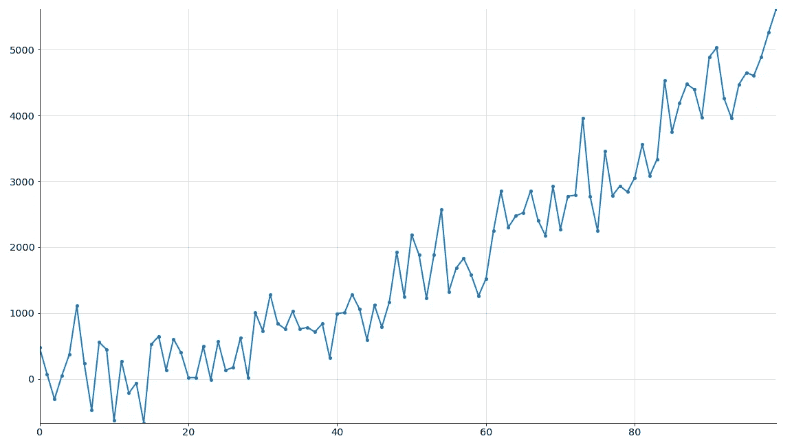
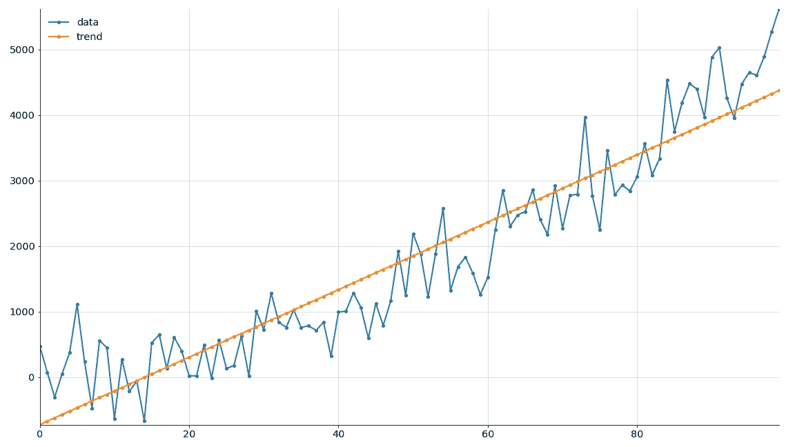
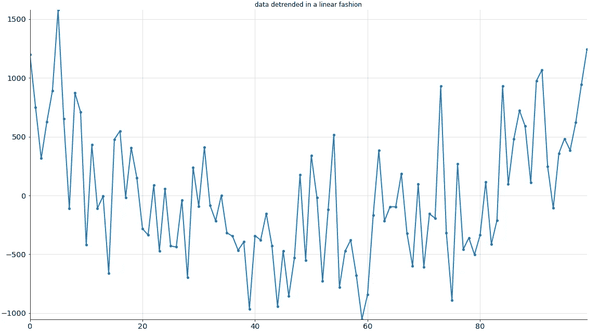
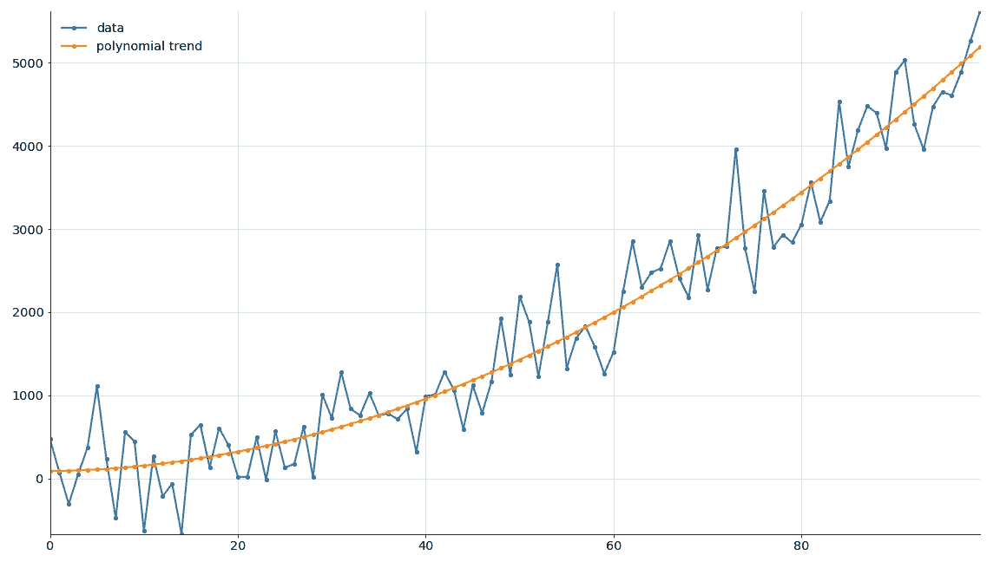
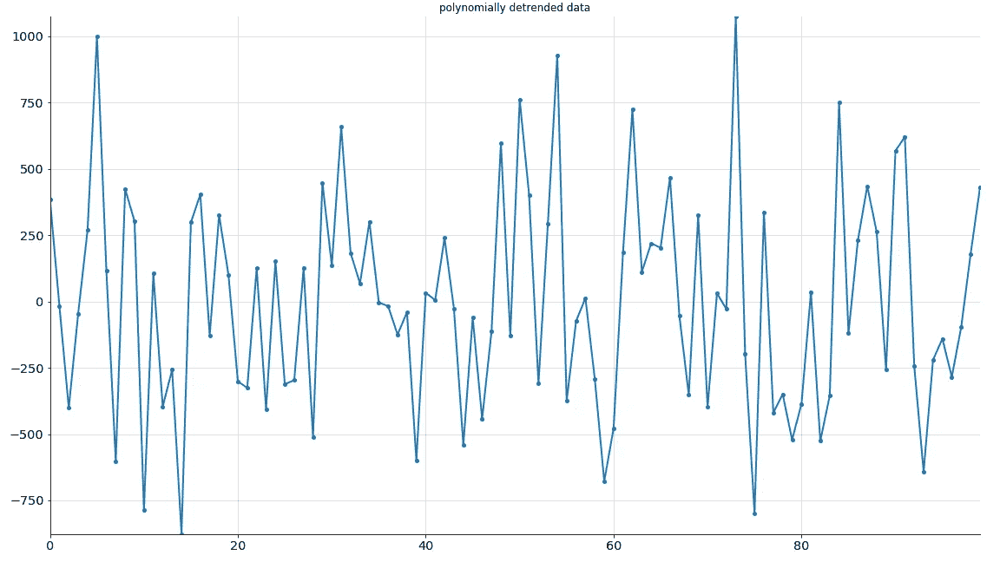

# 从时间序列数据中移除非线性趋势

> 原文：<https://towardsdatascience.com/removing-non-linear-trends-from-timeseries-data-b21f7567ed51?source=collection_archive---------15----------------------->

有时需要从时间序列数据中移除趋势，为后续步骤做准备，或者作为数据清理过程的一部分。如果你能确定一个趋势，然后简单地从数据中减去它，结果就是去趋势数据。

如果趋势是线性的，你可以通过线性回归找到它。但是如果趋势不是线性的呢？一会儿我们会看看对此我们能做些什么。

但是首先，简单的例子。

# 线性趋势

以下是有趋势的时间序列数据:

[https://raw . githubusercontent . com/FlorinAndrei/misc/master/qdata . CSV](https://raw.githubusercontent.com/FlorinAndrei/misc/master/qdata.csv)

让我们加载它，看看它看起来像什么:

```
import pandas as pd
import numpy as np
import matplotlib.pyplot as plt
from sklearn.linear_model import LinearRegression
from sklearn.preprocessing import PolynomialFeatures
from sklearn.metrics import mean_squared_error, r2_scoreser = pd.read_csv('qdata.csv', index_col=0, squeeze=True)
serx
0      473.917764
1       75.324825
2     -306.969479
3       53.271476
4      372.966686
         ...     
95    4650.550473
96    4604.573344
97    4891.704638
98    5265.948162
99    5618.909339
Name: y, Length: 100, dtype: float64plt.plot(ser)
plt.show()
```



好吧，这是一个趋势。让我们假设它是线性的——让我们进行线性回归并找出答案。这是线性回归的直接应用。上面导入的 sklearn 库有我们做回归所需的一切。

```
X = ser.index
X = np.reshape(X, (len(X), 1))
y = ser.valuesmodel = LinearRegression()
model.fit(X, y)
trend = model.predict(X)plt.plot(y)
plt.plot(trend)
plt.legend(['data', 'trend'])
plt.show()
```



似乎很合适，但可能不太合适。让我们从数据中减去趋势，看看去趋势后的数据是什么样的:

```
detr = [y[i] - trend[i] for i in range(0, len(y))]
plt.plot(detr)
plt.title('data detrended in a linear fashion')
plt.show()
```



不太有说服力。数据中仍有一个凹趋势。或许最初的趋势并不是线性的。

让我们计算数据和我们提取的趋势之间的 RMSE 和 R 值。我们稍后将回到这些数字。

```
r2 = r2_score(y, trend)
rmse = np.sqrt(mean_squared_error(y, trend))
print('r2:', r2)
print('rmse', rmse)
r2: 0.8782399672701933
rmse 553.6078593008505
```

# 多项式瞧

如果趋势不是线性的，我们可以尝试用多项式曲线来拟合。但是事情是这样的:即使我们拟合的曲线是一个高次多项式，它仍然是线性回归，将被用来找到它。怎么会这样

好吧，考虑这个二次表达式:

y = a + bx + cx

我们寻找的值是 a、b 和 c，它们都是线性的(1 的幂)。忘了 x 的幂，我们看的是 a，b，c 的幂，还记得为什么广义线性模型叫“线性”吗？因为系数是线性的，所以 x 值可以有不同的幂。

所以是线性回归——只是碰巧我们必须一次做多维的线性回归。

让我们假设我们的数据有一个二次趋势。然后我们需要将 X 转换成二次形式:

```
pf = PolynomialFeatures(degree=2)
Xp = pf.fit_transform(X)
Xp
```

看起来像这样:

```
array([[1.000e+00, 0.000e+00, 0.000e+00],
       [1.000e+00, 1.000e+00, 1.000e+00],
       [1.000e+00, 2.000e+00, 4.000e+00],
       [1.000e+00, 3.000e+00, 9.000e+00],
       [1.000e+00, 4.000e+00, 1.600e+01],
       [1.000e+00, 5.000e+00, 2.500e+01],
       [1.000e+00, 6.000e+00, 3.600e+01],
...
       [1.000e+00, 9.600e+01, 9.216e+03],
       [1.000e+00, 9.700e+01, 9.409e+03],
       [1.000e+00, 9.800e+01, 9.604e+03],
       [1.000e+00, 9.900e+01, 9.801e+03]])
```

第一列是 X 的 0 次幂。第二列是 X。第三列是 X 的 2 次方。这就好比上图所示的二次表达式(y = a + bx + cx)。

现在，我们将使用二次形式来拟合数据，并生成二次趋势。使用线性回归找到二次表达式的参数。

```
md2 = LinearRegression()
md2.fit(Xp, y)
trendp = md2.predict(Xp)
```

趋势是什么样的？

```
plt.plot(X, y)
plt.plot(X, trendp)
plt.legend(['data', 'polynomial trend'])
plt.show()
```



很合身，不是吗？现在让我们看看去趋势数据:

```
detrpoly = [y[i] - trendp[i] for i in range(0, len(y))]
plt.plot(X, detrpoly)
plt.title('polynomially detrended data')
plt.show()
```



这显然更好。那里没有留下任何可以视觉识别的趋势。但是让我们看看数字是怎么说的:

```
r2 = r2_score(y, trendp)
rmse = np.sqrt(mean_squared_error(y, trendp))
print('r2:', r2)
print('rmse', rmse)
r2: 0.9343217231542871
rmse 406.5937924291518
```

与线性趋势相比，多项式趋势 R 增加，RMSE 减少。两者都是好的改变。两个平均多项式比线性拟合更好。

# 高次多项式

您可以选择任意阶的多项式，只需在此处为 N 指定不同的值:

```
pf = PolynomialFeatures(degree=N)
```

一般来说，使用较低的 N 值。如果 N 值增加，但变化不大，则返回较小的值。

有一个弯曲的曲线可能可以用二次函数来描述。有两个弯曲的曲线可以用三次函数来描述。诸如此类。N-1 次弯曲需要一个 n 次幂的表达式。

如果你增加 N 很多，最终你的“最佳拟合”曲线将开始跟随数据中的噪声，而不是拟合趋势。你过度拟合了曲线，现在已经没有意义了。要么减少 N，要么增加更多的数据点。