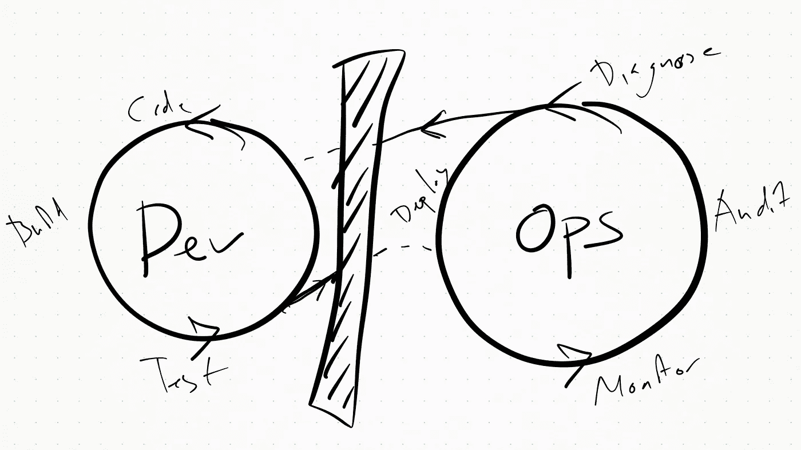
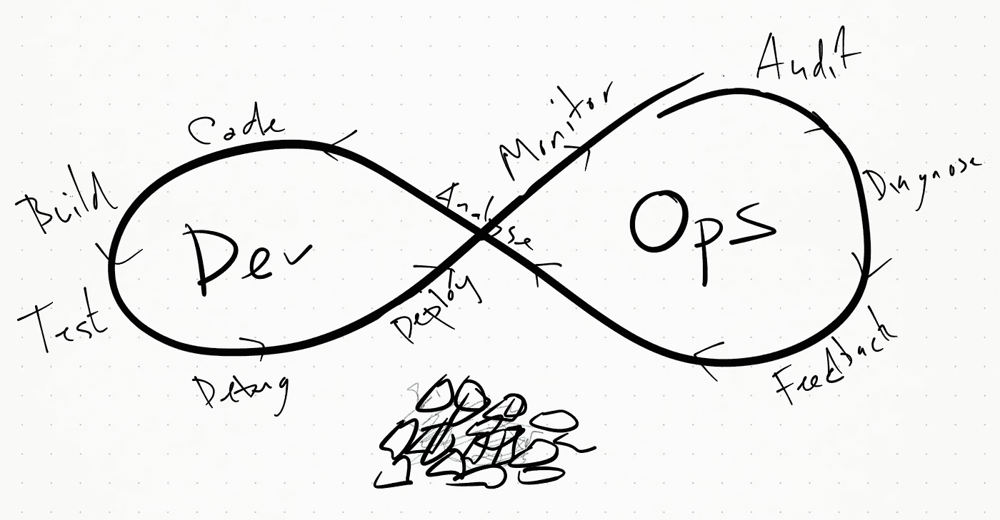
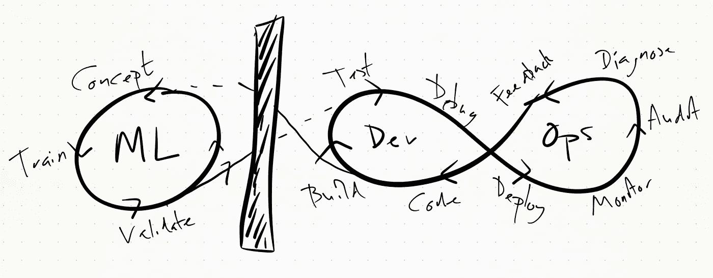
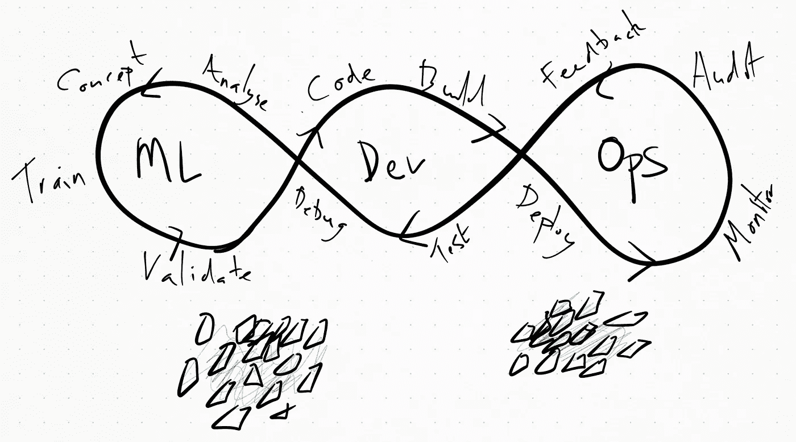

# 移除 ML 操作中的“墙”

> 原文：<https://towardsdatascience.com/removing-the-wall-in-ml-ops-44dac377b4c6?source=collection_archive---------51----------------------->

## ML Ops 试图为机器学习提供一个持续改进的过程

越来越多的团队正在寻求采用一种叫做 ML Ops 的方法。ML Ops 得名于十年前出现的 DevOps 运动，它试图为机器学习提供一个持续改进的过程。随着 Dev Ops 现在被早期采用者相当好地建立起来，并且它所提供的商业价值的证据变得越来越清晰，将 DevOps 的解决方案直接应用到机器学习团队是很有诱惑力的。

然而，为了成功实施这种方法，有必要了解开发运维服务早期的经验教训以及它试图解决的问题的性质。

# 在 DevOps 之前——“墙”

在 DevOps 运动之前，开发传统上由开发团队组成，在将大的包中的变更交付给运营团队进行测试和部署之前，开发团队独立地处理特性。

这两个团队是自我隔离的，拥有不同的目标和技能集；开发团队致力于开发新的特性，而运营团队致力于提高系统的整体性能。

将团队想象成具有不同目标和活动的独立实体，在他们之间建立了一堵隐喻墙，阻止每个人理解另一个团队的挫折和障碍。你看不到的，你无法理解或寻求补救。

# 是什么促成了 DevOps

为了转变这种方法，实现我们称为 DevOps 的更具凝聚力的运营方法，需要改变思维方式。墙的两边都有共同的参照点。尽管在工作实践和技能组合上存在差异，但是两个团队都希望更顺利的部署和发布过程，并希望通过改进的反馈与业务目标更紧密地联系在一起。

在两个团队之间建立这种共同点导致了实践中的变化，DevOps 就是这个变化的同义词。

团队之间的墙的拆除允许更好地理解系统的整体性，以及允许反馈和改进在团队之间容易地传播。用户也从这一变化中受益，因为两个团队的员工现在更能响应他们的需求。

例如，使数据库运行更慢的特性以前会被视为操作问题，但在 DevOps 的思维模式下，它变成了每个人的问题，并被协作解决。

来自 [2018](http://cloudplatformonline.com/rs/248-TPC-286/images/DORA-State%20of%20DevOps.pdf) 和 [2019](https://services.google.com/fh/files/misc/state-of-devops-2019.pdf) 的开发运营报告表明，开发运营思维的改变直接提供了可衡量的业务价值，因为它对内部和外部需求给予了同等的重视。这两个团队之间的技能集现在有大量的重叠，开发、测试和生产环境变得几乎相同。

# ML 操作的情况

在机器学习领域，目前只有大约 [10%的项目](https://venturebeat.com/2019/07/19/why-do-87-of-data-science-projects-never-make-it-into-production/)真正交付了商业价值，显然有必要进行类似的革命。术语 MLOps 自 2017 年以来才被广泛使用，因此没有像 DevOps 那样得到很好的记录或定义，但本质上，MLOps 的目的是为机器学习提供与 DevOps 对开发和运营同样的价值。

对于我们这些从事机器学习的人来说，我们可能渴望一个和谐的未来，在这个未来，我们将拥有一个全自动的机器学习 CI/CD 系统，拥有多技能的员工，能够理解彼此的需求和目标，并平等对待他们。

更重要的是，我们希望机器学习能够通过快速适应需求来推动业务价值，并快速发现问题。在我们的未来愿景中，一个装备精良的 MLOps 团队应该能够很容易地识别和解决数据/算法/模型中的问题，并通过一个易于使用的 ML 平台快速适应业务需求和数据偏差。

为了达到这个目标，团队需要欣赏 DevOps 所涉及的相互理解之旅，不要试图跳到上面列出的快乐结局。与此同时，还有更大的障碍需要克服，不花时间去理解“墙”的真正本质，直接跳到一个解决方案上，将无法解决根本问题。首先，我们需要识别现有的问题，这样我们就可以避免潜在的陷阱并交付。

通常，在机器学习项目中，需要许多团队和技能。我们可以大致将其分为两组，每组都有不同的需求和目标，就像我们之前将开发人员和运营专家分开一样。

研究人员和数据科学家希望利用企业收集的数据来解决复杂的问题。他们关心的是解决方案的性能，包括诸如精确度和召回率、模型大小或培训成本等指标。

开发人员和工程师更加传统，通常按照我们之前制定的 DevOps 原则工作。他们的主要关注点是吞吐量、减少延迟、降低成本、增强功能等目标。

上面的墙可以以多种不同的形式存在。任何阻碍研究兴趣和开发/运营兴趣之间融合的事情都会造成这堵墙。例如:

进入生产系统

面向工程师的代码分叉/存储库

数据访问/操作

团队之间缺乏信任

沟通障碍

# 寻找共同点

通常，这两个团队的业务目标是相同的。与 DevOps 一样，两个团队都希望在为业务开发和部署解决方案时减少挫折。也就是说，将更多的时间用于创造商业价值的项目，减少令人沮丧的管理费用。

机器学习的共同点一般归结为两点:数据和代码。

## 数据

数据是迄今为止最重要的资产，任何试图利用机器学习的公司都需要很好地处理它。整个公司可能会因为他们处理数据的方式而消失。使用数据作为公共基础是一个棘手的过程，通常需要难以理解的单一数据湖或复杂模式。

然而，没有这种统一会在研究团队和工程团队之间建立一堵墙。如果来自生产系统的数据不能容易地以相同的格式流入训练数据，那么完全实现 MLOps 将变得越来越复杂。

## 密码

类似地，代码库可能会成为一堵墙，威胁到 MLOps 解决方案的进展。将“实时”和“研究”的存储库分开，将存储库分成不同的分支，所有这些都会导致完全采用 MLOps 的问题比它们在短期内解决的问题更多。这在很大程度上归结于研究人员和工程师之间不同的标准。当研究人员需要快速迭代、测试假设和创建最小解时，工程师希望看到健壮的、可伸缩的、经过良好测试和组织的代码。

你必须找到一个公司所有成员都同意的中间立场，这样整个公司的标准才是一致的。这有一个额外的好处，可以减少团队之间的挫折感，因为他们无疑会认为自己的标准比交给他们的代码“更好”。这造成了团队之间的敌意，从而强化了这堵墙。

## 系统访问

我们经常听说不允许研究人员访问工程资源、参与讨论或访问完整的生产驱动数据。类似地，工程师不能参与概念讨论，也不能访问培训系统，因此在面对已决定的解决方案时，他们也不能接受。最终，这归结为信任。你相信你的员工和团队成员会做正确的事情吗？他们觉得能够在不被斥责或忽视的情况下提问吗？

# 第一步

我将在以后的文章中更详细地介绍其中的一些，但是现在，我们可以总结一下更容易过渡到 MLOps 所必需的重要步骤。

1.  采用开放、统一的元数据层，在整个管道中共享。
2.  创建一个普遍认可的标准，并确保团队按照这个标准一起工作。
3.  考虑将其他团队的资源嵌入到您的项目中。
4.  像信任自己的团队一样信任其他团队成员。
5.  利润！(或者，更准确地说，不断改进这一过程……)

