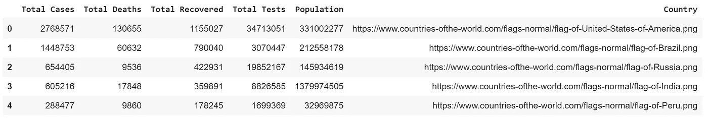
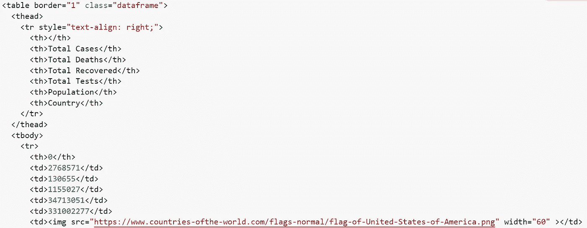
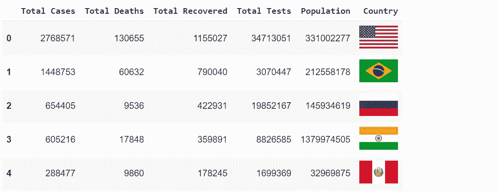
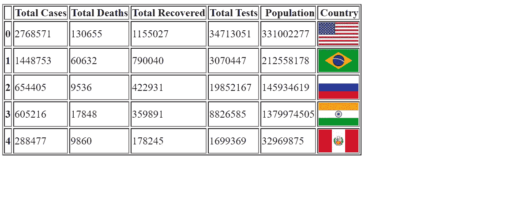

# 在熊猫数据帧中渲染图像

> 原文：<https://towardsdatascience.com/rendering-images-inside-a-pandas-dataframe-3631a4883f60?source=collection_archive---------6----------------------->

## 有没有想过在数据帧中渲染图像？我很高兴你这么做了！


**照片由** [**艾米莉·莫特**](https://unsplash.com/@emilymorter?utm_source=unsplash&utm_medium=referral&utm_content=creditCopyText)**[](/s/photos/confusion?utm_source=unsplash&utm_medium=referral&utm_content=creditCopyText)**

****我能看到 ***问号(？)*** 在你的大部分脸上。因为在发现我们也可以在数据帧中渲染图像之前，我也有一个。相信我，这很简单，你所需要知道的就是 ***创建一个数据框架，然后我会从那里*** 接你。****

# ****要遵循的步骤****

1.  ****导入`**pandas**`**`**HTML**`两个必要的库。******
2.  ******创建一个你选择的熊猫数据帧，并存储在变量`**df**`中。******
3.  ******创建一个名为`**country**`的列表，然后存储您想要渲染的图像的所有路径。******
4.  ******将`**country**` 列表分配给现有的数据帧`**df**`。这将作为一个新列附加到现有数据帧中。******
5.  ******写一个函数，把给定的图片路径转换成 HTML 标签。******
6.  ******将 dataframe 呈现为 HTML 表，然后调用 HTML 方法来显示呈现的图像。******

# ******奖金******

************

********Gif 由** [**迪士尼**](https://giphy.com/disneyzootopia/) **上** [**Giphy**](https://giphy.com/gifs/3NtY188QaxDdC)******

******此外，我将向你们展示“ ***”保存数据帧为 HTML 页面*** ”更像一个网页。******

# ******密码******

******按照上面的步骤 1-6 成功渲染数据帧中的图像。我也将在这里重复这些步骤。不必每次都向上滚动阅读。同样，完整的代码可以在我的 [***GitHub 资源库***](https://github.com/Tanu-N-Prabhu/Python/blob/master/Rendering_Images_inside_a_Pandas_DataFrame.ipynb) 下面找到:******

******[](https://github.com/Tanu-N-Prabhu/Python/blob/master/Rendering_Images_inside_a_Pandas_DataFrame.ipynb) [## 塔努-北帕布/Python

### permalink dissolve GitHub 是超过 5000 万开发人员的家园，他们一起工作来托管和审查代码，管理…

github.com](https://github.com/Tanu-N-Prabhu/Python/blob/master/Rendering_Images_inside_a_Pandas_DataFrame.ipynb) 

**导入**`**pandas**`**`**HTML**`**两个必要的库。****

**导入`**pandas**`库的原因是为了在数据帧中创建和存储数据。类似地，`**HTML**`库用于呈现 dataframe 中的图像(HTML 标签)。**

```
**# Importing the necessary libraries**import **pandas** as **pd**
from **IPython.core.display** import **HTML**
```

> ****不需要使用** `**pip**` **命令手动安装，只需导入即可********** 

********创建一个你选择的熊猫数据帧，并存储在变量** `**df**` **中。********

******这一步很简单，因为几乎每个人都知道如何创建数据帧。如果没有，那么别忘了在这里浏览一下这篇 [***文章***](https://pandas.pydata.org/pandas-docs/stable/reference/api/pandas.DataFrame.html) 。我将通过从[***world ometers . info***](https://www.worldometers.info/coronavirus/)***获取 COVID19 数据来创建 dataframe。请记住这个数据每小时都在变化。我将制作五个不同的列，如`**Total Cases**`**`**Total Deaths**`**`**Total Recovered**`**`**Total Tests**`**`**Population**`**。**对于行，我会选择**`**USA**`**`**Brazil**`**`**Russia**`**`**India**`**`**Peru**`**。*****************************

```
****# Create a dataframe using pandas library**df = pd.**DataFrame**([[2768571, 130655, 1155027, 34713051, 331002277],                           [1448753, 60632, 790040, 3070447, 212558178], [654405, 9536, 422931, 19852167, 145934619], [605216, 17848, 359891, 8826585, 1379974505], [288477, 9860, 178245, 1699369, 32969875]], **columns** = ['Total Cases', 'Total Deaths', 'Total         Recovered', 'Total Tests', 'Population'])**
```

******创建一个名为** `**country**` **的列表，然后存储你想要渲染的图像(标志)的所有路径。******

****这一步是显而易见的，为了保持一致，我们将创建一个列表，其中包含上面列出的所有国家的国旗路径。国旗来源可以在这里 找到 [**。**](https://www.countries-ofthe-world.com/)****

```
****# Create a list named country to store all the image paths**country= ['https://www.countries-ofthe-world.com/flags-normal/flag-of-United-States-of-America.png','https://www.countries-ofthe-world.com/flags-normal/flag-of-Brazil.png','https://www.countries-ofthe-world.com/flags-normal/flag-of-Russia.png','https://www.countries-ofthe-world.com/flags-normal/flag-of-India.png','https://www.countries-ofthe-world.com/flags-normal/flag-of-Peru.png']**
```

******将** `**country**` **列表分配给现有的** `**df**` **数据帧。这将作为一个新列附加到现有数据帧中。******

****这是最简单的步骤之一，因为您需要将名为`**country**` 的列表分配给 dataframe 名为`**Country**`的新列。****

```
****# Assigning the new list as a new column of the dataframe**df['Country'] = country**
```

****当你打印数据帧`**df**`时这样做。你会得到下面的结果。****

********

******塔努·南达·帕布拍摄的照片******

******编写一个函数，将图片(链接)的给定路径转换成 HTML 标签******

****这里你需要写一个将链接转换成标签的函数，正如你在前面的结果(Dataframe)中看到的，Country 列有所有的链接，所以这一步是必要的。****

```
****# Converting links to html tags**def **path_to_image_html**(path):
    return ''**
```

****该函数的返回类型是传统的`**img**` 标签，我们用它来呈现网页上的图像。如果你不知道我在说什么请看 [**这个**](https://www.w3schools.com/tags/tag_img.asp) 。这样做的原因是，如果所有的路径都被转换成图像标签，那么最后在一个内置的 HTML 方法的帮助下，所有这些都将被呈现为图像。****

******将数据帧渲染为 HTML 表格，然后调用 HTML 方法显示渲染后的图像******

****我们将使用`**to_html**`方法将数据帧转换成 HTML 表格。有一些参数我们需要处理，首先是`**escape = False**`，转义 HTML 标签，我们需要调用`**path_to_image_html**` 方法，将其转换成一个字典，并将其分配给 formatters 内置变量。欲知此法详情，请访问 [**此处**](https://pandas.pydata.org/pandas-docs/stable/reference/api/pandas.DataFrame.to_html.html) 。****

```
****# Rendering the dataframe as HTML table**df.to_html(escape=False, formatters=dict(Country=path_to_image_html))**
```

****通过执行这个操作，您将得到一个您熟悉的 HTML 表格。下面我将只提供第一个表行快照:****

********

******塔努·南达·帕布拍摄的照片******

****而最后要做的就是调用内置的`**HTML**` 方法，将整个 dataframe 作为参数传递。****

```
****# Rendering the images in the dataframe using the HTML method.****HTML**(df.to_html(escape=False,formatters=dict(Country=path_to_image_html)))**
```

****最后，当你执行这个，你会得到你想要的。****

********

******塔努·南达·帕布拍摄的照片******

# ****奖金****

****正如我所承诺的，我将向你们展示如何将数据帧保存为 HTML 页面。当你想给你的老板或任何人发送大量带有图像的数据帧时，这通常会很有帮助。****

```
****# Saving the dataframe as a webpage**df.**to_html**('webpage.html',escape=False, formatters=dict(Country=path_to_image_html))**
```

****如上所述，你只需要提供保存网页的路径，因为我用的是我的 [**Google Colab**](https://colab.research.google.com/) ，它会保存在我的笔记本环境中，打开它你会看到如下所示的结果。****

********

******塔努·南达·帕布拍摄的照片******

# ****完整代码****

****本教程的完整代码可以在下面找到:****

```
****# Importing the necessary libraries** import pandas as pd
from IPython.core.display import HTML**# Create a dataframe using pandas library** df = pd.DataFrame([[2768571, 130655, 1155027, 34713051, 331002277],
[1448753, 60632, 790040, 3070447, 212558178],[654405, 9536, 422931, 19852167, 145934619],[605216, 17848, 359891, 8826585, 1379974505],[288477, 9860, 178245, 1699369, 32969875]], columns = ['Total Cases', 'Total Deaths', 'Total Recovered', 'Total Tests', 'Population'])**# Create a list named country to store all the image paths** country = ['https://www.countries-ofthe-world.com/flags-normal/flag-of-United-States-of-America.png','https://www.countries-ofthe-world.com/flags-normal/flag-of-Brazil.png','https://www.countries-ofthe-world.com/flags-normal/flag-of-Russia.png','https://www.countries-ofthe-world.com/flags-normal/flag-of-India.png','https://www.countries-ofthe-world.com/flags-normal/flag-of-Peru.png']**# Assigning the new list as a new column of the dataframe** df['Country'] = country**# Converting links to html tags** def path_to_image_html(path):
    return ''**# Rendering the dataframe as HTML table** df.to_html(escape=False, formatters=dict(Country=path_to_image_html))**# Rendering the images in the dataframe using the HTML method.** HTML(df.to_html(escape=False,formatters=dict(Country=path_to_image_html)))**# Saving the dataframe as a webpage** df.to_html('webpage.html',escape=False, formatters=dict(Country=path_to_image_html))**
```

****写这篇文章的主要灵感来自于这个关于堆栈溢出的论坛。特别感谢[**chitown 88**](https://stackoverflow.com/users/7752296/chitown88)**。******

****[](https://stackoverflow.com/questions/53468558/adding-image-to-pandas-dataframe) [## 向熊猫数据帧添加图像

### 假设我有一个想要导出为 PDF 的数据帧。在数据框中，我有以下几列:代码，名称，价格…

stackoverflow.com](https://stackoverflow.com/questions/53468558/adding-image-to-pandas-dataframe) 

谢谢大家，这就是这个教程，我希望你们今天学到了一些新的东西。如果你们对代码有任何意见或担忧，请明智地使用评论部分。敬请关注更多更新，直到那时再见。保持安全和快乐的编码！****