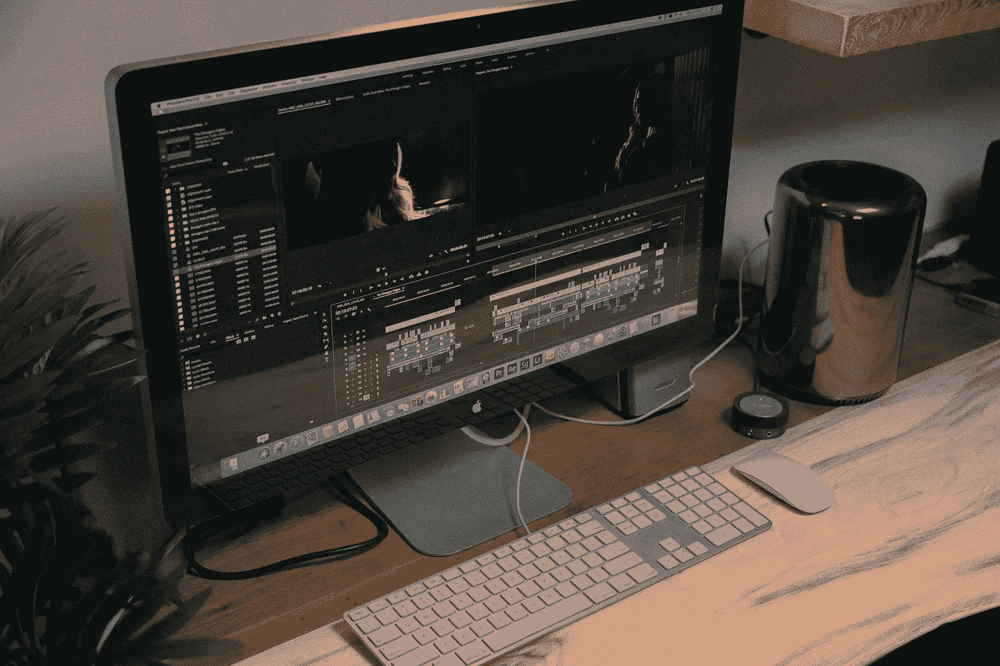

# 使用 Python 渲染视频文本

> 原文：<https://towardsdatascience.com/rendering-text-on-video-using-python-1c006519c0aa?source=collection_archive---------6----------------------->

## 使用 moviePy 库的动手机器学习项目



雅各布·欧文斯在 [Unsplash](https://unsplash.com/s/photos/video-editing?utm_source=unsplash&utm_medium=referral&utm_content=creditCopyText) 上的照片

在这篇文章中，我将向你展示如何使用 Python 向你的视频添加文本。乍一看，这听起来很难，但是相信我，这比你想象的要容易得多，而且很酷。这将是一个简单的练习，我们将能够看到机器学习如何在现实生活中使用。如果你看看我的其他文章，你会发现我喜欢动手做项目。我觉得这是练习我们编码技能，提升自己的最好方式。当你做一点研究时，你会在网上找到一些项目想法。但是我强烈建议你自己进行头脑风暴，写下你个人的项目想法，然后开始研究如何实现它们。让我们回到我们的项目。

## 目录

*   ***入门***
*   ***第一步:导入库***
*   ***第二步:定义你的视频***
*   ***第三步:创建你的文本***
*   ***最后一步:在视频上渲染文字***

# 入门指南

正如你可以理解的标题，这个项目，我们将需要一个视频记录文件。它甚至可以是你对着镜头说话的录音。使用名为 *MoviePy，*的库，我们将向视频记录中添加文本。

首先，我们将导入库，我将向您展示如何安装它们。在第二步中，我们将定义我们将用于项目的视频，它可以是一个短视频。在第三步中，我们将定义一个文本变量，它将是添加到视频中的文本。最后，我们将渲染视频记录上的文本。如果您准备好了，让我们从安装库开始吧！

## 图书馆

我们将为这个项目使用一个库，但要进行文本渲染，我们还需要安装另一个模块。该库名为 MoviePy，安装方法如下:

```
pip install moviepy
```

你可以从官方[文档](https://zulko.github.io/moviepy/)页面了解更多关于 *moviepy* 的信息。

我们需要安装的第二个模块叫做 ImageMagick。如果没有此模块，您可能会在将文本渲染到视频录制时出现错误。为了安装 ImageMagick，我使用了 Homebrew，这是一个用于 macOs 和 Linux 设备的软件包管理器。如果您使用不同的操作系统，可以在线搜索“如何安装 ImageMagick”。

```
brew install imagemagick
```

你可以从官方的[文档](https://imagemagick.org/script/download.php)页面了解更多关于 *imagemagick* 的信息。

**MoviePy** 是一个可以读写所有最常见的音频和视频格式的库，包括 GIF。如果您在安装 MoviePy 库时遇到问题，请尝试安装 ffmpeg。Ffmpeg 是一个领先的多媒体框架，能够解码、编码、转码、复用、解复用、流式传输、过滤和播放人类和机器创造的几乎任何东西。

现在，我们应该开始在代码编辑器中编写代码了。我们将从导入库开始。

# 步骤 1-导入库

```
import moviepy.editor as mp
```

是的，这就是我们完成任务所需要的。抓紧时间，让我们进入下一步。

# 第二步——定义你的视频

在这一步，我们将定义一个名为“my_video”的变量。然后使用 moviepy 库的特殊方法，我们将定义我们的视频文件。此外，我想保留视频的音频，这就是为什么视频的值为 True。

```
my_video = mp.VideoFileClip(“data/video_test.mov”, audio=True)
```

顺便说一下，有许多视频格式，其中一些可以被列为:

*   MP4 (mp4、m4a、m4v、f4v、f4a、m4b、m4r、f4b、mov)
*   3GP (3gp、3gpp2、3g2、3gpp、3gpp 2)
*   OGG (ogg、oga、ogv、ogx)
*   WMV (wmv、wma、asf*)

请确保您的路径正确，并且您的视频格式工作正常。如果您在此步骤中遇到问题，请尝试将您的视频转换为不同的格式。

在我们进入下一步之前，让我们定义视频的宽度和高度。我们将需要这些渲染成视频文本。别担心，这很容易。

```
w,h = moviesize = my_video.size
```

# 第三步——创建你的文本

在这一步，我们将为我们的文本定义一个新的变量。我把它叫做“我的文本”。使用 TextClip 方法，我们将能够创建文本。

```
my_text = mp.TextClip(“The Art of Adding Text on Video”, font=’Amiri-regular’, color=’white’, fontsize=34)
```

如你所见，我们甚至可以玩参数。我们可以自定义我们的文本，这真的很酷。文本字体、文本颜色和字体大小可以根据您的喜好进行更改。

现在，我们将定位视频中的文本。我们也可以为我们的文本设计一个背景。您可以试验参数，看看它是如何工作的。背景颜色、背景不透明度和文本位置是一些参数。

```
txt_col = my_text.on_color(size=(my_video.w + my_text.w, my_text.h+5), color=(0,0,0), pos=(6,’center’), col_opacity=0.6)
```

# 最后一步—在视频上渲染文本

太好了！你坚持到了最后一步。这一步就是奇迹发生的地方。

## 动画

首先，我们将定义一个名为“text_mov”的新变量，我们可以在其中添加一些动画。文本在视频上的移动。玩参数就能找到自己喜欢的结果。这是我们制作动画的代码行:

```
txt_mov = txt_col.set_pos( lambda t: (max(w/30,int(w-0.5*w*t)),max(5*h/6,int(100*t))) )
```

## 翻译

最后，是时候渲染我们视频上的文本了。多亏了 moviepy 库，我们将使用名为“CompositeVideoClip”的方法为我们进行渲染。如前所述，如果你在这一行遇到错误，我强烈推荐安装 **imageMagick** 和 **ffmpeg** 模块。这是让奇迹发生的台词:

```
final = mp.CompositeVideoClip([my_video,txt_mov])
```

## 导出您的结果

差不多了，看看最后的效果如何，我们导出视频吧。我们将把它保存为一个新的视频文件。导出真正酷的是你可以调整视频格式，甚至每秒帧数。下面是导出渲染视频的前 5 秒的代码:

```
final.subclip(0,17).write_videofile(“data/text_add_result.mov”,fps=24,codec=’libx264')
```

# 分享结果

恭喜你。你已经创建了一个程序，在不使用任何视频编辑软件的情况下，在视频上呈现自定义文本。看到机器学习如何应用在我们的日常生活中，这真的很酷。希望你喜欢阅读这篇文章并参与这个项目。如果你今天学到了新东西，我会很高兴。从事像这样的动手编程项目是提高编码技能的最好方式。

如果您在执行代码时有任何问题，请随时[联系我](https://sonsuzdesign.blog/contact/)。

> 关注我的[博客](https://medium.com/@lifexplorer)和[走向数据科学](https://towardsdatascience.com/)以获得灵感。谢谢你，

## 相关内容

[](/extracting-speech-from-video-using-python-f0ec7e312d38) [## 使用 Python 从视频中提取语音

### 使用 Google 语音识别 API 的简单实用项目

towardsdatascience.com](/extracting-speech-from-video-using-python-f0ec7e312d38) [](/simple-face-detection-in-python-1fcda0ea648e) [## Python 中的简单人脸检测

### 如何使用 OpenCV 库检测图像中的人脸

towardsdatascience.com](/simple-face-detection-in-python-1fcda0ea648e)