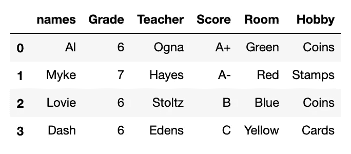
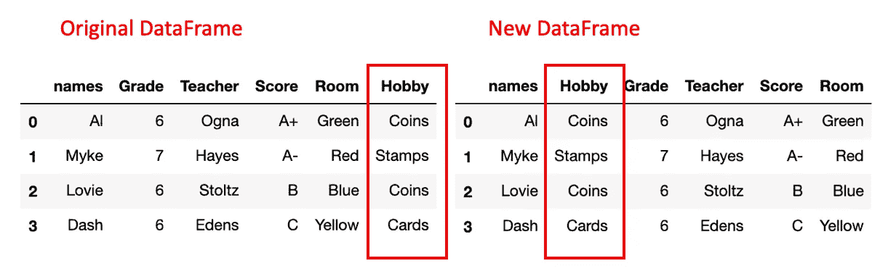
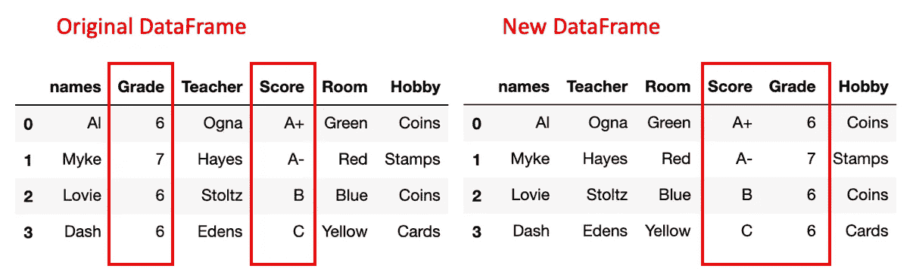

# 重新排序熊猫数据框列:否定标准解决方案

> 原文：<https://towardsdatascience.com/reordering-pandas-dataframe-columns-thumbs-down-on-standard-solutions-1ff0bc2941d5?source=collection_archive---------6----------------------->


图片来源:“Via Design Pickle”——[更多关于属性](https://adamrossnelson.medium.com/image-credit-attributions-a24efcc730ad)。

## 简化更改数据帧列顺序过程的解决方案

更新，2021 年 2 月，请看下面 YouTube 上的教程。

# 介绍

成千上万的博客文章、stackoverflow.com 线程、quora.com 文章或其他资源展示了在 Pandas 数据框架中移动列(改变它们的顺序)的类似标准方法。

本文首先提供了示例数据。根据示例数据，文章传达了两个*好的* *但不完美的*标准解决方案。本文讨论了这些好的但不完美的标准解决方案的局限性。最后，有一个修正的解决方案，它避免了标准解决方案中固有的一些限制。

# 示例数据

```
import pandas as pd# Write some example data
df = pd.DataFrame({'names':['Al','Myke','Lovie','Dash'], 
                   'Grade': [6,7,6,6],
                   'Teacher':['Ogna','Hayes','Stoltz','Edens'],
                   'Score':['A+','A-','B','C'],
                   'Room':['Green','Red','Blue','Yellow'],
                   'Hobby':['Coins','Stamps','Coins','Cards']})
```



示例数据帧

# 标准解决方案(好)

## 以新的所需顺序显式列出列

对最常发布的列进行重新排序的解决方案是将 DataFrame 设置为等于其自身，但以新的所需顺序显式命名列:

```
# Reset DataFrame with columns in desired order
df = df[['names','Score','Room','Grade','Teacher','Hobby']]
```

或者简单地评估具有以新的期望顺序明确命名的列的数据帧:

```
# Evaluate the DataFrame with columns in desired order
df[['names','Score','Room','Grade','Teacher','Hobby']]
```

除非有几十或几百列，否则这种标准解决方案工作得很好。假设您有一个包含数十或数百列的数据框架，而您只希望移动一列。为了移动一列而显式列出所有列是低效的。列出所有列也是有问题的，因为对相关代码库的其他方面的更改可能会导致错误。对其他列名的添加、删除或修改会破坏标准解决方案的早期实现。

## 利用简便的熊猫方法

的另一个标准解决方案是将`pd.drop()`和`pd.insert()`方法配对。此选项的主要限制是，它仅在一次将一列移动到特定位置时有效。

```
mid = df['Hobby']
df.drop(labels=['Hobby'], axis=1, inplace = True)
df.insert(1, 'Hobby', mid)
df
```



爱好从索引位置 5 移动到索引位置 1。

# 修订的解决方案(更好)

仍然不完美，但对于许多用例来说，可能是更好的选择。

如果您有许多列，它们彼此不相邻，并且您想要将它们全部移动到另一个特定列之后的新位置，该怎么办？也许您还想同时对列进行重新排序。以下是完成该任务的解决方案。

```
def movecol(df, cols_to_move=[], ref_col='', place='After'):

    cols = df.columns.tolist() if place == 'After':
        seg1 = cols[:list(cols).index(ref_col) + 1]
        seg2 = cols_to_move
    if place == 'Before':
        seg1 = cols[:list(cols).index(ref_col)]
        seg2 = cols_to_move + [ref_col]

    seg1 = [i for i in seg1 if i not in seg2]
    seg3 = [i for i in cols if i not in seg1 + seg2]

    return(df[seg1 + seg2 + seg3])
```

实施:

```
df = movecol(df, 
             cols_to_move=['Score','Grade'], 
             ref_col='Room',
             place='After')
df
```



“分数”和“等级”列都颠倒了它们的顺序，移到了“房间”后面的索引位置。

[](https://adamrossnelson.medium.com/membership) [## 加入我的介绍链接媒体-亚当罗斯纳尔逊

### 作为一个媒体会员，你的会员费的一部分会给你阅读的作家，你可以完全接触到每一个故事…

adamrossnelson.medium.com](https://adamrossnelson.medium.com/membership) 

# 结论

概括地说，数据管理很难。在合并多个数据源之后，拥有一个可以快速排序和重新排序列的方法是很方便的。

这样做是对未来审查你的工作的科学家的一种常见的礼貌。如果我们把最重要的栏目放在左边，其他人会花更少的时间寻找必要的信息来理解我们的工作。当我们知道我们将返回到我们的工作中以供将来参考时，这个额外的步骤对我们自己也是有帮助的。

# 感谢阅读

如果你喜欢我要说的话，可以在:[adamrossnelson.medium.com](https://twitter.com/adamrossnelson)找到更多。

感谢阅读。把你的想法和主意发给我。你可以写信只是为了说声嗨。如果你真的需要告诉我是怎么错的，我期待着尽快和你聊天。推特:[@ adamrossnelson](https://twitter.com/adamrossnelson)| LinkedIn:[亚当·罗斯·纳尔逊](http://www.linkedin.com/in/arnelson) |脸书:[亚当·罗斯·纳尔逊](http://www.facebook.com/adamrossnelson)。

# 视频教程

重新排序列，YouTube 上的教程。2021 年 2 月新增。