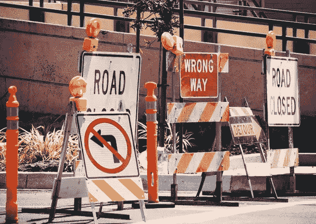
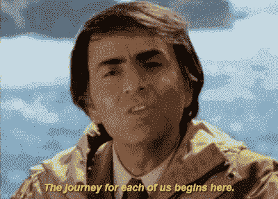

# 在疫情期间修复损坏的模型(或不修复)

> 原文：<https://towardsdatascience.com/repairing-broken-models-or-not-during-a-pandemic-63ec1ade6897?source=collection_archive---------62----------------------->

## 当你有一个基于多年工作的惊人模型，突然被全球疫情破坏了，你会怎么做？

在如此多的系统中出现如此巨大的中断，很难知道如何处理现有的模型。这里有一些适应的方法——以及一些你可能*而不是*尝试修复那些模型的原因。

照片由[杰米街](https://unsplash.com/@jamie452?utm_source=unsplash&utm_medium=referral&utm_content=creditCopyText)在 [Unsplash](https://unsplash.com/s/photos/road-detour?utm_source=unsplash&utm_medium=referral&utm_content=creditCopyText) 拍摄

当你有一个惊人的，甚至获奖的，基于多年工作的模型，突然被一个全球性的疫情破坏了，你会怎么做？

听起来熟悉吗？

好吧，如果你在卡内基梅隆大学的德尔菲研究小组，你会振作起来，继续创造性地思考下一个大问题。

2019 年，美国疾病控制和预防中心(CDC)将德尔福集团命名为国家流感预测卓越中心，此前三年，他们的预测系统在 CDC 创建的流感预测挑战中赢得了最高的准确性。但在 3 月份，鉴于流感模型将受到新冠肺炎疫情的显著影响，CDC 要求研究人员将注意力从流感上转移，转而尝试预测新冠肺炎的传播。德尔福小组已经以多种方式进行了调整，包括重新考虑他们模型中的“社交焦虑”信号，以及他们对未来几周的预测能力。(阅读更多关于他们的改编[这里](https://www.vox.com/future-perfect/2020/3/19/21185686/ai-predicting-coronavirus-spread-forecasting-covid-19)和[这里](https://www.ml.cmu.edu/news/news-archive/2020/march/using-machine-learning-cdc-forecasting-flu-covid19-illness.html)。)

传染病模型并不是现在唯一需要重新发明的。任何试图对零售、供应链、医疗保健、教育或几乎任何行业进行预测的人都面临着数据中突然出现的戏剧性行为。有时这是积极的方向:例如，视频游戏行业的人们可能会对他们现在看到的用户和游戏时间的创纪录数字感到非常满意。有时候，数据的变化并不那么积极。

那么，如何修复一个破碎的模型来应对这些戏剧性的转变呢？在我们的 Alteryx 社区和社交媒体的[上，已经有一些关于这个挑战的有趣讨论。在这里，我将讨论已经出现的几种可能的策略，每一种都有其自身的复杂性，再加上一种应该会让我们对人类的世界观感觉良好的策略。](https://www.reddit.com/r/MachineLearning/comments/fqzwbo/d_how_are_you_all_thinking_about_demand_modeling/)

# 添加新的模型特征并使用实时数据

尝试将当前情况整合到模型中的一种方法是添加尝试说明疫情现实情况的要素。也许这是一个捕捉一个城市在社交距离指令下的天数的特征，包括学校和企业关闭。也许这是一个已知感染新冠肺炎病毒的城市人口百分比的特征(承认这些数据是不完整的，因为测试和未知或无症状病例的不一致)。然而，这些可能很难选择、定义和保持更新，因此它们的价值可以忽略不计；随着这些变化的出现，现在也很难验证它们的有用性。

另一个策略是获取尽可能接近实时的数据。当然，这可能也是说起来容易做起来难。但是想象一下，很快有一天，一些不准确的社交媒体模因传播说一种受欢迎的食物治愈了新冠肺炎，并且对该产品产生了抢购。如果你不立即知道突然流行，你将无法维持供应。此时，拥有可重复的自动化工作流程对于帮助您跟上事件的发展速度非常重要。

# 调整预测方法

在许多领域，为 2019 年夏季生成的预测对于截然不同的 2020 年夏季不会非常有用。对于那些处理时间序列数据和预测的人来说，一种在预测中更重视最近数据的方法*目前可能是合适的。例如，如果对一种产品的需求突然上升，最近的增长不会立即消失，但随着消费者行为慢慢恢复正常，更有可能会随着时间的推移而逐渐减少。*

例如，Prophet 是一个针对 R 或 Python 的[免费公开的预测包](https://facebook.github.io/prophet/)。[这篇文章和 Alteryx 工作流程](https://community.alteryx.com/t5/Data-Science-Blog/Expand-Your-Predictive-Palette-III-I-Sales-Forecast-with-Prophet/ba-p/504651)展示了一个使用 [Prophet](https://facebook.github.io/prophet/) 预测工具和在 Alteryx 中配置趋势[变化点](https://facebook.github.io/prophet/docs/trend_changepoints.html)的例子。变点被定义为时间序列值突然改变的时刻。确定这些对数据有重大影响的时刻，并将它们合并到您的模型中是至关重要的。(请注意，根据 Prophet 文档，“默认情况下，仅为时间序列的前 80%推断变点，以便有足够的跑道来预测未来趋势，并避免在时间序列结束时过度拟合波动。”这种行为可以用最初的 Prophet 参数中的`changepoint_range`来改变，但是如果你使用上面提供的宏，不需要进一步定制，你必须确保你的改变点在你的时间序列的前 80%之内。)

另一种可能性是尝试用卡尔曼滤波器平滑时间序列数据，这也许可以更好地处理由这一重大经济事件的[“外源冲击”](https://en.wikipedia.org/wiki/Shock_(economics))引起的波峰和波谷。R 中的`[KFAS](https://cran.r-project.org/web/packages/KFAS/index.html)`包可用于该目的，如本例所示。然而，即使是这种方法也不足以适应如此戏剧性的转变。

# **使用模拟**

经济建模者有时使用衰退和复苏的 V-U-L 曲线来考察未来的可能性。《哈佛商业评论》最近的一篇文章展示了这些模型在过去的大流行中是如何应用于经济的，并可能在今天发生。这是想象可能未来的一种方式，尽管思考悲观的“L”情景是困难的。

从左到右，可视化 V、U 和 L 衰退和复苏。图片来自 [*维基媒体*](https://en.wikipedia.org/wiki/Recession_shapes)

这些情景可以为开发模拟不同可能性的模型提供一个框架。虽然多年来模拟在计算上是昂贵和令人生畏的，但现在不再是这样了。正如这些研究人员所指出的:

…我们现在拥有(并且可以轻松执行)有效的统计程序，实际上消除了我们的结果精度的任何令人苦恼的不确定性；毕竟，由于真实系统本身大多是随机的，所以模拟可以以现实的方式捕捉系统的变化，同时仍然可以产生所需的精确结果。

疫情可能比这些作者考虑的大多数情况更加极端，但是模拟可能仍然有一些用处，即使它们不能“消除”不确定性。

模拟可以包含关于疫情对您的情况的影响的不同假设，然后比较评估它们的不同结果。Alteryx Designer 中的[模拟采样工具](https://help.alteryx.com/current/designer/simulation-sampling-tool)可用于以多种方法采样或模拟数据。[引导一个时间序列](https://otexts.com/fpp2/bootstrap.html)——模拟多个与原始数据相似的时间序列——可以帮助解释更大的不确定性。对这些序列中的每一个拟合一个模型将产生不同的估计参数和随机误差项。结合这些模型的预测将创建更大的预测区间，并显示更大范围的可能结果。

蒙特卡洛模拟在这一时刻的效用也是[最近 Reddit 帖子](https://www.reddit.com/r/datascience/comments/ftnuqe/using_monte_carlo_simulation_to_estimate/)讨论的主题，讨论如何应对疫情对预测的挑战，受访者对其潜在价值有分歧，特别是因为蒙特卡洛方法假设数据均匀分布。这个`[PyMC3](https://github.com/pymc-devs/pymc3)`包提供了一个 Python 工具包([这里有一个教程](https://docs.pymc.io/notebooks/getting_started.html))。r 也有许多模拟工具，包括包`[MonteCarlo](https://cran.r-project.org/web/packages/MonteCarlo/index.html)`，它有[一个有用的插图](https://cran.r-project.org/web/packages/MonteCarlo/vignettes/MonteCarlo-Vignette.html)。

无论你尝试什么方法，预测都不会像通常那样有用。围绕你的预测传达大量的不确定性是个好主意。你的听众需要意识到这些置信区间比平常更加重要。

# 选择你前进的道路

唉，在这样一个不确定的时期，没有单一的解决方案来修复一个曾经被珍视、现在已经破碎的模型，或者产生完美的预测。但这一时刻证明了人类的智慧和敏感性——以及领域专业知识——在数据分析中的重要性。

现在，精心设计一个新模型的每一个参数可能不是对你的时间和精力的最好利用。现在有如此多的未知，依靠有根据的、深思熟虑的人类预测可能更有效。

这一时刻使人的投入在开发分析策略中的重要性变得更加明显。如果工具只是被输入相同的数据，并按照正常情况下的相同方式设计，它们将会失灵。正如麦吉尔大学组织行为学助理教授 Matissa Hollister 最近在世界经济论坛博客上写的:

> 人类可以辨别算法可能失败的地方和历史训练数据可能仍然与解决关键和及时的问题相关的情况，至少在更多的当前数据可用之前。…尽管新冠肺炎的特殊性质是独特的，并且劳动力市场的许多基本规则不运行，但仍然有可能确定应用人工智能工具的有价值的途径，尽管可能受到小心限制。

正如霍利斯特所建议的，我们仍然可以谨慎地使用我们的建模技能。即使是最好的模型也不知道这个奇怪的新时代的许多微妙之处。例如，毫无疑问，现在不仅人们购买的食物种类发生了变化，而且他们购买食物的具体地点也发生了变化。在一个小的，不太繁忙的社区杂货店购物可能比在高速公路上的巨型超市与大众混在一起更有吸引力。这两种环境对害怕疾病的顾客的相对吸引力很难量化并整合到一个模型中。

我们可能经常觉得人类不太擅长相互理解，但在这次疫情中，我们可以识别模型可能忽略的数据中的情感和生活方式的细微差别。因此，虽然我们可以调整我们的数据选择和模型设计，但也是时候利用人类的同情心和专业知识来指导决策和创造解决方案。

*这篇文章名为* [*，最初发表于 Alteryx 社区数据科学博客*](https://community.alteryx.com/t5/Data-Science-Blog/Repairing-Broken-Models-or-Not-During-a-Pandemic/ba-p/558570) *。在* [*Alteryx 数据科学门户*](http://alteryx.com/data-science) *找到更多资源。*