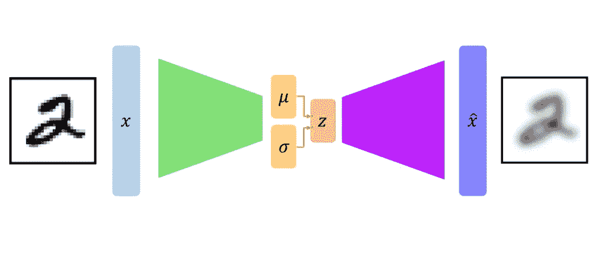
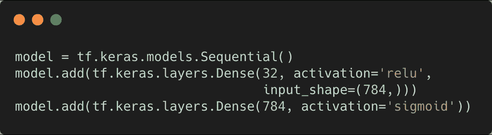
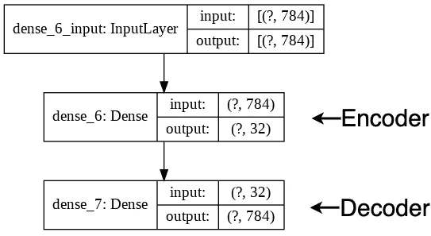
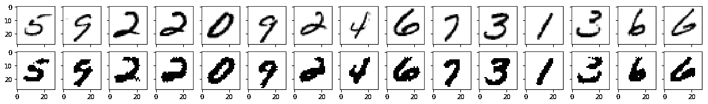
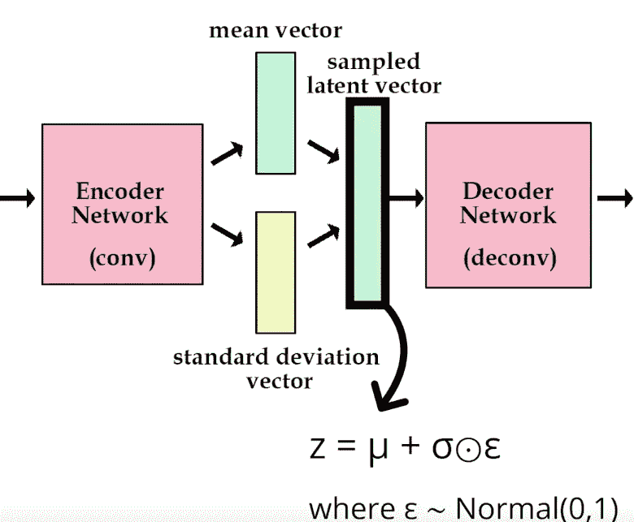
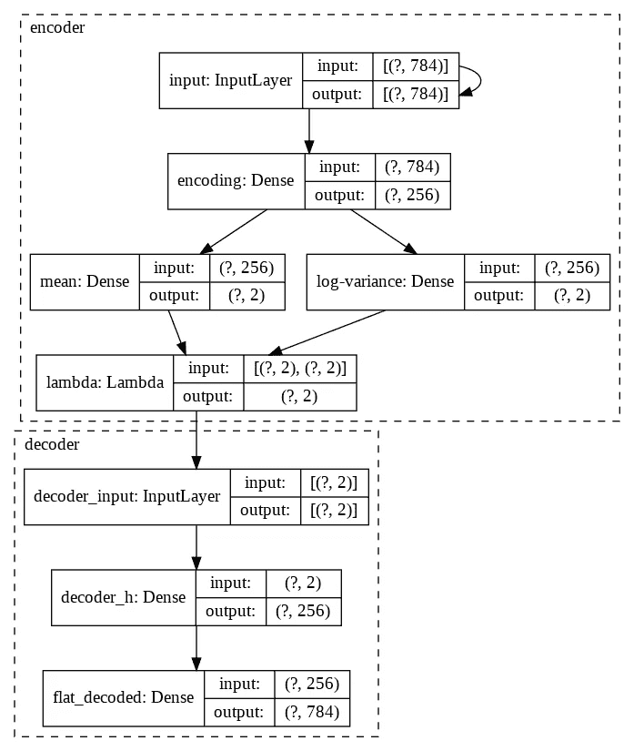
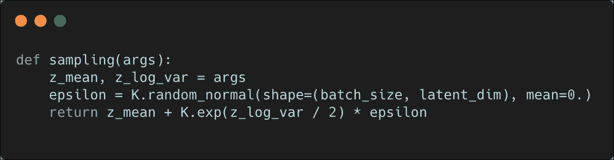
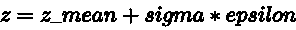
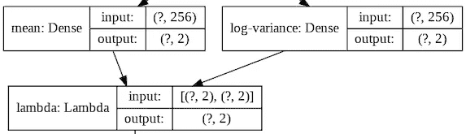
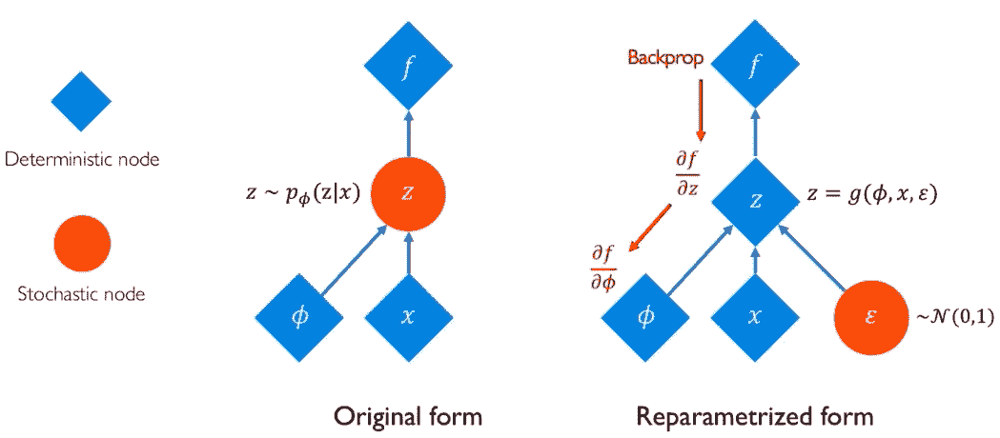

# 变分自动编码器中的“重新参数化”技巧

> 原文：<https://towardsdatascience.com/reparameterization-trick-126062cfd3c3?source=collection_archive---------6----------------------->

在本文中，我们将学习“重新参数化”技巧，它使*变分自动编码器(VAE)* 成为反向传播的合格候选。首先，我们将简要讨论自动编码器及其普通变体带来的问题。然后，我们将直接跳到文章的核心——“重新参数化”技巧。

> ***注意*** *:这篇文章是* **而不是** *一个教你关于自动编码器的指南，所以我会在需要的时候简单介绍一下。如果你想了解更多关于 Autoencoders 的知识，那么你可以查看这些文章***。**

**

***一个变分自动编码器(** [**来源**](https://www.youtube.com/watch?v=rZufA635dq4) **)***

# *自动编码器:它们做什么？*

*自动编码器是一类*生成模型*。它们允许我们 ***压缩*** 一个大的输入特征空间到一个小得多的空间，这个空间以后可以被重建。一般来说，压缩对学习质量有很大的影响。*

*我们人类有惊人的压缩能力——我们能够学习简洁的东西，以后我们可以在需要时轻松地扩展它们。例如，通常情况下，你不需要记住一个特定概念的所有细节；你只需要记住关于它的特定点，然后你试着在这些特定点的帮助下重建它。*

*因此，如果我们能够在一个低得多的维度空间中表示高维数据，并在以后重建它，这对于许多不同的场景都非常有用，如数据压缩、低维特征提取等。*

## *普通自动编码器*

*用一些代码来解释更容易—*

**

***浅层自动编码器网络***

*我们有一个非常基本的网络:*

*   *将一个 784-d 向量输入网络。*
*   **将*矢量压缩成 32 维矢量(**编码器**)。*
*   **从 32-d 矢量重建*原始的 784-d 矢量(**解码器**)。*

*下图可能会让这个想法更加清晰——*

**

***浅层自动编码器网络示意图***

*就结果而言，这个网络在良好的旧 MNIST 数据集上训练时，可以产生以下结果(笔记本可在此处[获得](https://github.com/sayakpaul/TF-2.0-Hacks/blob/master/Basic_AutoEncoder.ipynb)):*

**

***当在 MNIST 图像上训练时来自上述网络的预测***

*输出看起来没那么糟糕，但是这个网络容易出现一些问题*

*   *网络的编码器无法知道它应该如何将输入数据点编码成*潜变量*(读取压缩)。这迫使潜在变量的表示以 ***不在乎*** 关于输入数据点的结构多。当然，在网络的末端有一个损失函数(典型地， **L2** )告诉它预测与原始数据点有多远。但是它仍然没有考虑输入数据点应该被压缩的方式。因此，*潜在变量中非常小的变化都可能导致解码器产生非常不同的输出*。*
*   *确定潜在变量的维数是另一个考虑因素。在这种情况下，我们使用 32-d。用一个更高维的向量来表示潜在变量，我们可以提高生成的图像的质量，但只能提高到一定程度。第一个问题仍然存在。*

*第一个问题似乎比第二个问题更有问题，因为我们可以用不同的维度进行实验，并观察预测的质量。那么，如何解决这个问题呢？*

# ***可变自动编码器:编码、采样、解码和重复***

**

***VAE 的语义学(** [**来源**](https://www.youtube.com/watch?v=9zKuYvjFFS8) **)***

*为了缓解普通自动编码器中存在的问题，我们转向变型编码器。它引入网络的第一个变化是，输入数据点被映射到 ***多元正态分布，而不是直接将输入数据点映射到潜在变量。*** 这种分布限制了编码器在将输入数据点编码成潜在变量时的自由裁量权。同时，它在网络中引入了*，因为我们现在是从一个概率分布中的*个采样点。***

**正态分布由均值(𝜇)和方差(𝜎)参数化，这与变分自动编码器的情况完全相同(有一些“变化”)。所以，一步一步——**

*   **VAE 中的每个数据点将被映射到均值和 **log_variance** 向量，这些向量将定义该输入数据点周围的多元正态分布。**
*   **从这个分布中抽取一个点作为潜在变量返回。**
*   **这个潜在变量被馈送到解码器以产生输出。**

**这使得网络被迫学习更平滑的表示。*它* *还确保潜在变量的微小变化不会导致解码器产生大不相同的输出，因为现在我们是从连续分布中采样*。另一方面，由于这种采样过程本质上是随机的，解码器输出开始变得更加多样。**

**下面是一个浅 VAE 的示意图**

****

****浅 VAE 示意图****

**如图所示，我们在网络中引入了另一个中间密集层。穿着 VAE。`mean`和`log-variance`是*可学习的参数。*上图中的`Lambda`层代表采样操作，定义如下:**

****

****在 TensorFlow 中编码 VAE 的采样操作****

**因此，如果输入数据点要通过采样(在通过神经网络后)映射到潜在变量𝑧，它必须遵循以下等式:**

****

**哪里，𝑠𝑖𝑔𝑚𝑎=𝑒𝑥𝑝(𝑧_𝑙𝑜𝑔_𝑣𝑎𝑟/2).**

**通过对方差取对数，我们迫使网络具有自然数的输出范围，而不仅仅是正值(方差只有正值)。这使得潜在空间的表现更加平滑。**

**你一定在质疑这个小术语`epsilon`，它在这里有什么意义？我们一会儿会处理这件事。**

**现在，在我们最终讨论“重新参数化”技巧之前，我们需要回顾一下用于训练 VAE 的损失函数。这是因为我们最终反向传播损失函数的梯度，并且当在 VAE 中发生时,“重新参数化”技巧实际上有助于反向传播过程。**

## **VAE 损失**

**回想一下上一节，VAE 试图了解潜在空间的分布。因此，除了考虑解码器产生的重构输出，我们还需要确保潜在空间的分布是良构的。摘自[用 Python 进行深度学习](https://www.manning.com/books/deep-learning-with-python)(作者 Franç ois Chollet)(第一版，300 页)—**

> **通过两个损失函数训练 VAE 的参数:迫使解码样本匹配初始输入的*重建损失*，以及帮助学习良好形成的潜在空间并减少对训练数据的过拟合的**正则化损失** 。**

**正则化损失通过 **Kullback-Liebler 发散来处理。**在 [GANs in Action](https://www.manning.com/books/gans-in-action) (作者 Jakub Langr 和 Vladimir Bok)(第一版，第 29 页)中可以找到对 KL 背离的出色解释**

> **[……]kull back–lei bler 散度(KL divergence)，又名**相对熵**，是两个分布的交叉熵与其自身熵之差**。对于其他人，想象画出两个分布，它们不重叠的地方将是与 KL 散度成比例的区域。****

**对于 KL 散度的选择，这里有一个更精确的数学处理，你可能会发现这个讲座是有用的**

**对于重建损失，我主要看到了以下两种选择—**

*   **L2 损失**
*   **二进制交叉熵(用于将数据点的每个特征与重构输出中的值进行比较)**

**现在，我们可以继续讨论我们一直期待讨论的“重新参数化”技巧。**

# **用反向传播训练 VAE**

**能够更新的参数。使用反向传播的 VAE，我们需要考虑到里面的*采样*节点本质上是随机的。我们可以计算采样节点相对于`mean`和`log-variance`矢量的梯度(采样层中使用了`mean`和`log-variance`矢量)。**

****

****一小部分来自我们的 VAE 网****

**还记得取样层的小家伙`epsilon`吗？*那实际上* ***重新命名了*** *我们的 VAE 网。*这允许`mean`和`log-variance`向量仍然作为网络的*可学习参数，同时仍然通过`epsilon`保持整个系统的随机性。***

****

****VAE 网络有无“重新参数化”的伎俩(** [**来源**](https://www.youtube.com/watch?v=rZufA635dq4) **)****

**其中，𝜙代表了网络试图了解的分布。**

**`epsilon`仍然是一个具有非常低值的随机变量(从标准正态分布中采样),从而不会导致网络从真实分布中偏离*太多*。*这里可以肯定地重申，网络*仍在学习分布𝜙(由 `*mean*` *和* `*log-variance*` *向量参数化)。这种想法实际上允许 VAE 以端到端的方式进行训练，是由金玛等人在他们名为[自动编码变分贝叶斯](https://arxiv.org/abs/1312.6114)的论文中提出的。***

# **结论**

**所以，文章到此结束，感谢你的阅读！自动编码器是生成模型的第一等成员，甚至在开发 GANs 中找到它们的应用([开始](https://arxiv.org/abs/1703.10717))。[解开 VAEs](https://arxiv.org/abs/1606.05579) 在强化学习领域也非常相关( [DARLA:改善强化学习中的零投迁移](https://arxiv.org/abs/1707.08475))。VAEs 是一种将贝叶斯推理与深度学习结合起来的发现，鼓励不同的研究方向。**

**以下是我用来写这篇文章的参考资料，如果你有兴趣了解更多关于自动编码器的知识，你一定要去看看**

*   **[生成性深度学习](http://shop.oreilly.com/product/0636920189817.do)作者大卫·福斯特**
*   **雅各布·朗格和弗拉迪米尔·博克**
*   **[用 Python 进行深度学习](https://www.manning.com/books/deep-learning-with-python-second-edition)Fran ois Chollet**
*   **[深度生成建模| MIT 6。S191](https://www.youtube.com/watch?v=rZufA635dq4)**
*   **Arxiv Insights 的[变型自动编码器](https://www.youtube.com/watch?v=9zKuYvjFFS8)**

**你可以通过推特( [@RisingSayak](https://twitter.com/RisingSayak) )和我联系。**