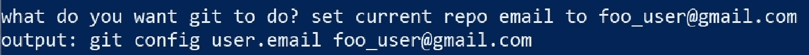

# 用 GPT-3 取代我的 git 备忘单

> 原文：<https://towardsdatascience.com/replacing-my-git-cheat-sheet-with-gpt-3-69223e58626f?source=collection_archive---------35----------------------->

像 git 一样，学习驾驶手动变速器会很困难(图片 shutterstock.com)

## 使用 GPT-3 从我想做的事情的英文描述中生成 git 命令

有些基本技能，如果你年轻时就学会了，会很容易，但如果你不得不在以后的生活中掌握它们，就会变得莫名其妙。例如，对于一个学习驾驶自动档汽车的人来说，驾驶手动档汽车似乎异常困难。然而，如果您不是伴随着 git 成长起来的，那么与掌握 git 命令行界面相比,“驾驶操纵杆”的挑战就相形见绌了。在本文中，我将描述如何利用 OpenAI 的 GPT-3 从英语语言描述中生成 git 命令。

## git 的伟大之处(和不那么伟大之处)是什么

Git 是一项基础技术，也是对现代软件开发的杰出贡献。它还有一组命令，这些命令看起来似乎是故意随意和不一致的。

“尽管 Git 有很多优点，但我一直对命令行中除了最简单的操作之外的任何操作都缺乏清晰度感到沮丧。见鬼，即使是最简单的动作也比实际需要的要难。”出自丹尼尔·埃克伦德的**。**

*我到了晚年才明白。在我在 IBM 的职业生涯中，我使用过各种代码控制/版本控制系统，包括古老的 CMVC 和 Clearcase，它们相当容易使用，但仍然是那个时代 IBM 软件中的神秘事物。这两个系统都没有让我为 git 的精彩世界做好准备。*

*面对 git 语法的挑战，我做了 21 世纪任何有自尊的软件开发人员都会做的事情。我将我最常用的 git 命令保存在一个 Word 文档中，并描述了这些命令的作用。当我需要重复一个特定的 git 咒语时，我可以查看这个 Word 文档，看看我以前是否做过，并尝试找出语法。听起来很棒，对吧？不幸的是，我现在遇到了在个人和工作环境中保持这个文档同步的问题，随着它变得越来越大，我冒着失去更基本的 git 命令的风险。*

*如果有什么方法可以用一个智能助手代替我的 git 备忘单，将我的英语语言描述翻译成 git 命令就好了…*

## *GPT-3 和吉特:天作之合*

*当我尝试使用 GPT-3 将简单的 COBOL 函数转换成 Python 时(没有成功),我简直是在摆弄我那愚蠢的 git 备忘单。我仍然认为这是一个好主意，但我已经忘记了太多的 COBOL，无法拿出像样的例子。因此，如果 COBOL 到 Python 不是 GPT-3 的一个好用例，那么什么是呢？如果有一个实际的问题，我必须用英语作为输入，用一些命令作为输出来解决…*

*答案就在我眼前——使用 GPT 3 将英语描述翻译成 git 命令。*

## *git assistant——一个简单的 Python 程序，用于从英文描述中获取 git 命令*

*我写了一个简单的 Python 程序， **git assistant** ，让 GPT-3 提供与我想要 git 做的事情的英语描述相对应的 git 命令。该程序由一个循环组成，该循环提示用户输入，用输入调用 GPT-3 API，并返回 GPT-3 对相应 git 命令的预测:*

**

*GPT-3 得到一个英文描述并返回一个 git 命令*

*为了启动这个泵，我向 GPT-3 提供了一小组英文文本描述的例子和相应的 git 命令:*

*下面是一个运行 git assistant 的会话示例。GPT-3 的响应列在“输出:”之后*

**

*与 git 助手的会话*

*结果并不完美。例如，对“将更改合并到当前分支”的响应重复了 3 次。也就是说，git assistant 足够好，我可以退休我的 git 备忘单了。*

## *结论*

*Git 是一个使用非常广泛的应用程序的例子，它的语法有些晦涩难懂。我在本文中已经展示了，通过一些提示，GPT-3 可以很好地从英语语言描述中生成 git 命令。我现在使用这个简单的 git 助手来提醒我 git 语法，让我不必参考 git 命令的静态备忘单。*

*您可以在本报告中找到本文中描述的代码:*

*   *https://github.com/ryanmark1867/git_assistant[。](https://github.com/ryanmark1867/git_assistant)*
*   ***注意:**要运行代码，你需要访问 GPT-3 测试版，并用你自己从[https://beta.openai.com/developer-quickstart](https://beta.openai.com/developer-quickstart)得到的秘密密钥更新配置文件 [gpt_assistant_config.yml](https://github.com/ryanmark1867/git_assistant/blob/master/gpt_assistant_config.yml) 中 gpt_key 参数的值*

*你可以在这里找到一段视频，演示本文中描述的代码:[https://www.youtube.com/watch?v=MoLfVG-8Z5A&t = 13s](https://www.youtube.com/watch?v=MoLfVG-8Z5A&t=13s)*