# 用 Detectron2 复制 Airbnb 的舒适度检测

> 原文：<https://towardsdatascience.com/replicating-airbnbs-amenity-detection-with-detectron2-28f33704d6ff?source=collection_archive---------25----------------------->

## 成分:1 个检测器 2，38，188 个开放图像，1 个 GPU。模特培训时间:18 小时。人类时间:127 小时。

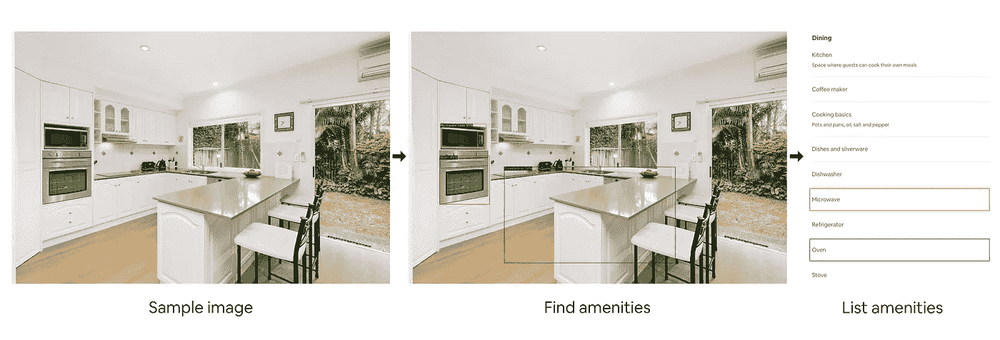

计算机视觉驱动的舒适性检测的工作流程示例。图片来源:[https://www.airbnb.com/rooms/2151100](https://www.airbnb.com/rooms/2151100)

几个月前，我在[读到了 Airbnb 工程团队](https://medium.com/airbnb-engineering/amenity-detection-and-beyond-new-frontiers-of-computer-vision-at-airbnb-144a4441b72e)的一篇文章，描述了他们如何使用计算机视觉来检测照片中的便利设施。

这篇文章读起来像一个食谱。机器学习的秘诀。

像任何初露头角的厨师(或机器学习者)一样，我决定复制它，并加入一些我自己的味道。

等等。

什么是便利设施？

想想房间里有用的东西。比如厨房里的烤箱或者浴室里的淋浴。

为什么在图像中检测这些会有帮助？

这就是业务用例出现的地方。你会经常看到在 MNIST(手写数字的照片)等数据集上建立的计算机视觉模型教程，但很难将这些问题转化为商业用例(除非你是从事检测手写数字业务的邮政服务人员)。

如果你看过 Airbnb 的网站，那里有很多房子和住宿的照片。除了这些地方，还有基于文本的描述细节的细节。比如你看的房子里有没有按摩浴缸。

举个例子怎么样？

假设你想在 Airbnb 上列出你的家。你可以上传一些照片，并填写一些细节。但是很有可能，因为你非常了解自己的位置，你可能会错过一些东西。

这就是自动舒适度检测可以发挥作用的地方。

当你将图片上传到 Airbnb 时，计算机视觉机器学习模型会查看这些图片，试图找到每张图片中的关键设施，并将它们自动添加到你的清单中。

当然，它可以在实际运行之前向您验证它的预测是否正确。但是让它自动发生将有助于确保每个列表上的信息尽可能地被填写。

拥有尽可能详细的信息意味着人们可以根据特定的标准来搜索地点。因此，这对年轻夫妇在按摩浴缸和壁炉前度过一个美好的周末后，可以找到他们想要的东西。

```
A note to the reader, treat this article as a high-level narrative of what happened mixed with a splash of tech. For the nerds like me, the code is available in the [example Google Colab Notebook](https://dbourke.link/airbnbcode).
```

# 为期 42 天的项目:边做边学

在开始这个项目之前，我就像一个拿着一套没动过的刀的厨师。或者在我的情况下，一个还没有使用过[检测器 2](https://github.com/facebookresearch/detectron2) 、[权重&偏差](https://www.wandb.com/)、[流线](https://www.streamlit.io)或者大部分 [PyTorch](https://pytorch.org/) 的机器学习工程师(这些都是机器学习工具)。

我发现在建造东西的时候，我对事物了解得最多。你可能也一样。

所以我打开了一个概念文档，写下了一些标准，并在我的白板上列出了一个 6 周的大纲。

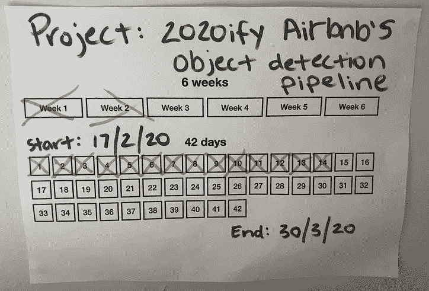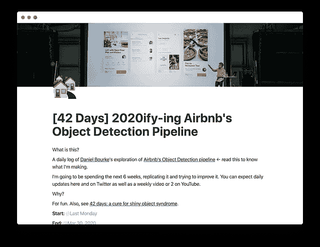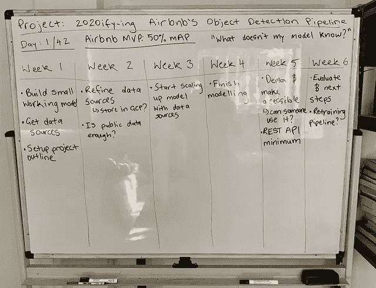

从左到右:一个简单的 [42 天项目模板](https://www.mrdbourke.com/42days)我放在我桌子前面的墙上，所有的[日记风格的项目笔记在观念](https://dbourke.link/airbnb42days)和我的松散绘制的白板指南。

为什么是 6 周？

因为 42 天看起来足够完成一件有意义的事情，但又不至于占据你的生活。

总之。

我想我会花 6 周左右的时间(每天 3 个小时)用我一直想尝试的工具复制 Airbnb 的便利设施检测。

最坏的情况是，我学了一些东西，如果都失败了，也就 6 周。

最好的情况是，我学到了一些东西，并开发了一个非常酷的机器学习应用程序。

不管怎样，都会有一个故事要讲(你正在读它)。

# 分解它

这个有趣的小图形打破了实验中的主要步骤。

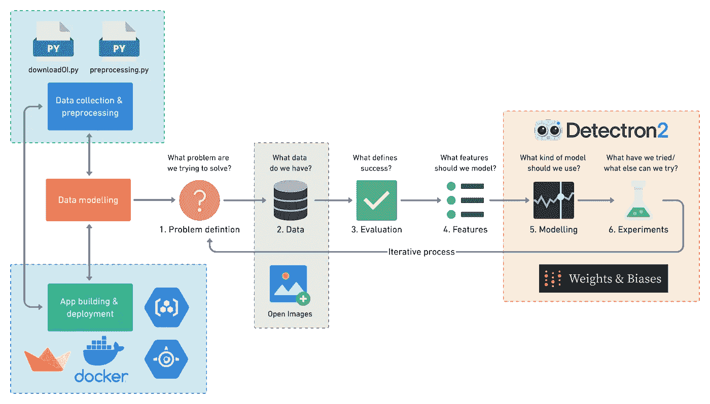

我用来复制 Airbnb 舒适度检测的配方，从数据收集和预处理开始，然后是建模和实验跟踪，最后是应用程序的构建和部署。

有时文字比充满其他图像的图像更容易阅读。

用 Detectron2 复制 Airbnb 的舒适度检测方法:

1.  使用 downloadOI.py(用于从打开的图像中下载特定图像的脚本)收集数据。
2.  使用 preprocessing.py(一个自定义脚本，具有将打开的图像图像和标签转换为 Detectron2 样式数据输入的功能)预处理数据。
3.  检测器 2 的模型数据。
4.  使用权重和偏差跟踪建模实验。
5.  使用 Streamlit 创建面向用户的应用程序。
6.  部署应用程序和模型与 Docker，GCR(谷歌容器注册)和谷歌应用引擎。

我们将使用这些来驱动文章的其余部分。让我们开始吧。

# 数据收集:从打开的图像中下载 Airbnb 目标图像和标签文件

*   **成分:** 1 个下载脚本，4 个标签文件，38，000+ x 个打开的图像
*   **时间:** 1 周
*   **费用:** $0
*   **器皿** : Google Colab，本地机

像所有机器学习项目一样，它从数据开始，也从数据结束。

Airbnb 的文章提到，为了建立他们的概念证明，他们使用了 32k 公共图像和 43k 内部图像。

唉，第一个路障。

当然，除了 2016 年对一个技术支持角色的电话面试，我与 Airbnb 内部没有任何联系，所以内部图像不在讨论范围内。

好消息是他们使用的 32k 公共图片来自 [Open Images](https://storage.googleapis.com/openimages/web/index.html) (一个巨大的免费开源资源，包含来自 600 多个不同类别的数百万张图片)。

然而，如果你打开图片，你会发现有超过一百万张不同的图片。

那交易是什么？

Airbnb 为什么只用 32k？

好问题。

这是因为他们只对与其业务用例相关的图像感兴趣(包含公共设施的房间的图像)。

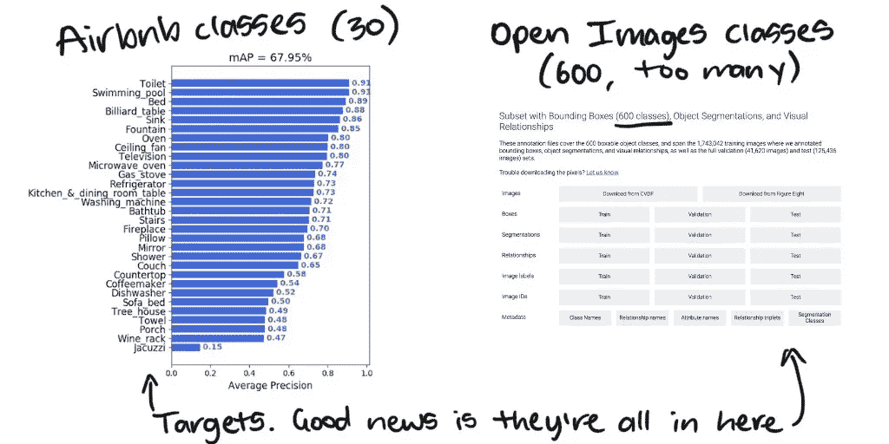

Airbnb 的目标类别(30 种便利设施类型，摘自原始文章)与来自 600 个不同类别的 190 多万张图像的开放图像数据库。

我想，知道了 Airbnb 最关心的目标类别，肯定有办法只从你关心的开放图像中下载图像(而不是整个 190 万+500 GB+的数据集)。

原来是有的。

经过一番搜索，我从 LearnOpenCV 找到了一个关于如何从目标类列表中下载图片的很好的指南。

具体来说，是一个名为 [downloadOI.py](https://github.com/mrdbourke/airbnb-amenity-detection/blob/master/downloadOI.py) 的脚本，它允许您定义您要查找的类以及来自哪个数据集。

让我们看一个例子。

```
!python3 downloadOI.py --dataset "validation" --classes "Kitchen & dining room table"
```

这一行写着，“从开放图像的验证集中获取包含厨房和餐厅桌子的图像。”

运行上面的代码行将目标类中的所有图像下载到与目标数据集同名的文件夹中。

```
# What your image folder(s) look like after using downloadOI.pyvalidation <- top file 
│   kitchen_&_dining_room_table_image_1.jpg <- image 1
│   kitchen_&_dining_room_table_image_2.jpg <- image 2
|   ... <- more images...
```

LearnOpenCV 脚本中最初的 downloadOI.py 运行得非常好，它甚至可以在下载图像时生成标签。但是经过一点试验，我发现这些标签与 Detectron2 不兼容。

因此，我取消了下载时的标签创建，并将脚本修改为只下载图像。我决定编写自己的标签创建代码。

能够下载图像:检查。

现在来看看标签。

开放图像标签更容易访问，可以通过点击[开放图像下载页面](https://storage.googleapis.com/openimages/web/download.html)上的特定下载链接或运行以下代码来下载(花絮:滚动到下载页面的底部查看关于标签的信息)。

```
# Open Images training dataset bounding boxes (1.11G)
!wget https://storage.googleapis.com/openimages/2018_04/train/train-annotations-bbox.csv

# Open Images validation dataset bounding boxes (23.94M)
!wget https://storage.googleapis.com/openimages/v5/validation-annotations-bbox.csv

# Open Images testing bounding boxes (73.89M)
!wget https://storage.googleapis.com/openimages/v5/test-annotations-bbox.csv

# Class names of images (11.73K)
!wget [https://storage.googleapis.com/openimages/v5/class-descriptions-boxable.csv](https://storage.googleapis.com/openimages/v5/class-descriptions-boxable.csv)
```

数据收集的第一阶段获得了以下文件。

*   来自开放图像训练、验证和测试集的 1 类(咖啡机)图像。
*   训练(`train-annotations-bbox.csv`)、验证(`validation-annotations-bbox.csv`)和测试(`test-annotations-bbox.csv`)设置包围盒图像标签。
*   不同打开图像类别的描述(`class-descriptions-boxable.csv`

为什么只有 1 节课？

我的计划是从小处着手。获取数据预处理和使用 1 个类的 Detectron2 模型，然后在需要时扩展。

# 数据准备:将打开的图像数据和标签输入到 Detectron2 样式的输入中

*   **成分:** 5 个预处理功能，4 个标签文件，38，000+ x 个打开的图像，Detectron2 文档
*   **时间:** 1 周+/- 1 周
*   **成本:** $0
*   **器具** : Google Colab，本地机器

这里的技巧是将我的数据文件(一些标签 CSV 和几个图像文件夹)重新混合到 [Detectron2 样式标签](https://detectron2.readthedocs.io/tutorials/datasets.html)中。

我发现如果你想在 Detectron2 中使用你自己的自定义数据，你需要把它转换成一个字典列表。其中每个字典是与 1 幅图像相关联的信息。

让我们看一个例子。

Detectron2 将一个字典列表[作为输入。如果您想使用自己的自定义数据，您必须将标签格式化为这种样式。](https://detectron2.readthedocs.io/tutorials/datasets.html)

现在，这些字段分别是什么意思？

*   `annotations`(列表):一幅图像上的所有注释(标签)，一幅图像可能有不止一个。对于对象检测(我们的用例)，它包含:
*   `bbox`(int 列表):边界框的像素值坐标。
*   `bbox_mode` ( [枚举](https://docs.python.org/3/library/enum.html))`bbox`、[中像素值的顺序和比例详见](https://detectron2.readthedocs.io/modules/structures.html#detectron2.structures.BoxMode)文档。
*   `category_id` (int):物体类别在`bbox`内的数值映射，例子`{'coffeemaker':0, 'fireplace':1}`。
*   `file_name` (str):目标图像的字符串文件路径。
*   `height` (int):目标图像的高度。
*   `width` (int):目标图像的宽度。
*   `image_id` (int):唯一图像标识符，在评估期间用于识别图像。

如果你想用 Detectron2 建立你自己的物体检测模型，你需要为你的每一张图片安装一个。

正如我们将在后面看到的，我对这个项目的第一个主要目标是获得一个运行在定制数据上的小模型(总是从小模型开始)。

从小处着手意味着为 1 类图像(咖啡机)编写数据准备功能，并确保它们与 Detectron2 一起工作。

## 获取图像 id

从开放图像下载数据的好处是每个图像都有一个唯一的标识符。

例如，`1e646e27c250cd56.jpg`是一张咖啡机的图片，其唯一标识符`1e646e27c250cd56`不同于开放图像中的所有其他图像。

所以我写了一个名为`get_image_ids()`的函数，它将遍历一个文件夹并返回该文件夹中所有唯一图像 id 的列表。

这意味着我知道我正在处理的所有图像。

## 格式化现有注释文件

为什么拥有唯一图像 id 列表会有所帮助？

原因如下。

当您从打开的图像下载标签文件并使用 pandas 导入它们时，它们看起来像这样。

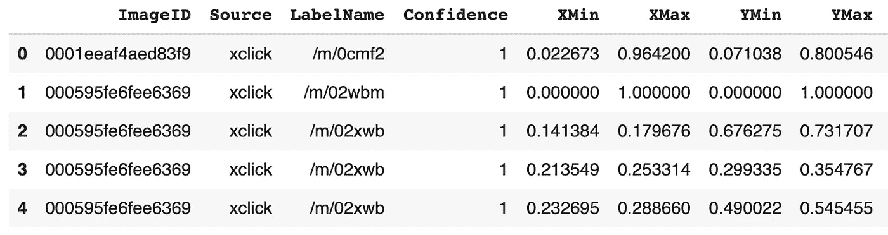

打开图像的验证标签的示例。参见 Colab 上的[完整代码和示例笔记本。](https://dbourke.link/airbnbcode)

看到 ImageID 列了吗？在那里，我们可以匹配从打开的图像中下载的图像 id 列表。

但是等等。

为什么要这么做？

两个原因。

首先，我们需要额外的信息，比如 XMin、XMax、YMin 和 YMax 坐标(我们很快就会看到这样的例子)。

第二，从打开的图像中下载注释文件会导致我们获得数据库中每个图像的注释，但是我们只对目标图像的注释感兴趣。

您可能已经注意到 LabelName 列有一些奇怪的值，如`/m/0cmf2`和`/m/02xwb`，事实证明，这些也是代码。

这就是神秘的`class-descriptions-boxable.csv`发挥作用的地方。

让我们来看看。

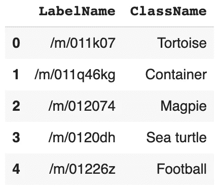

开放图像标签代码到人类可读类名的映射。

我不知道你怎么想，但是这个名字看起来比`/m/0cmf2`和`/m/02xwb`好多了。

有了这些以及一个目标类列表，在我的例子中，只有咖啡机，开始时，我有了创造`format_annotations()`所需的所有材料。

在一个冗长的句子中，`format_annotations()`从打开的图像中下载一个现有的注释文件，比如，`[validation-annotations-bbox.csv](https://storage.googleapis.com/openimages/v5/validation-annotations-bbox.csv)`向其中添加一些有用的信息(比如人类可读的类名和每个类的数字分类 ID)并删除不需要的行(我们不关注的图像)。

来看一个小亮点。

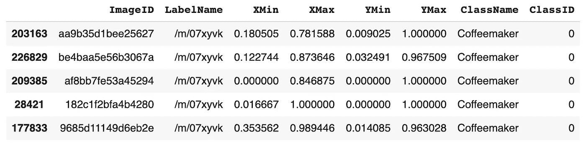

运行 format_annotations()函数会添加 ClassName 和 ClassID 列，并删除不需要的标签行(查看更改后的索引值)。参见 GitHub 上的[完整代码和示例笔记本。](https://dbourke.link/airbnbcode)

运行这个函数负责标签字典的`category_id`部分。至于删除所有非咖啡机行，`validation-annotations-bbox.csv`从 303980 行减少到 62 行。

我们正在取得进展，但还没有完成。

## 将边界框像素值从相对值转换为绝对值

你可能想知道标签字典中的`bbox_mode`是什么意思。

如果没有，我会告诉你我是如何处理的。

`bbox`和`bbox_mode`是舞伴。

再看一下打开的图像标签，您会看到 XMin、XMax、YMin 和 YMax 列。这些是图像上每个边界框的相对像素坐标。

相对像素坐标意味着要找到目标边界框的每个角出现的实际像素值，必须将 XMin、XMax 值乘以图像的宽度，将 YMin 和 YMax 值乘以图像的高度。

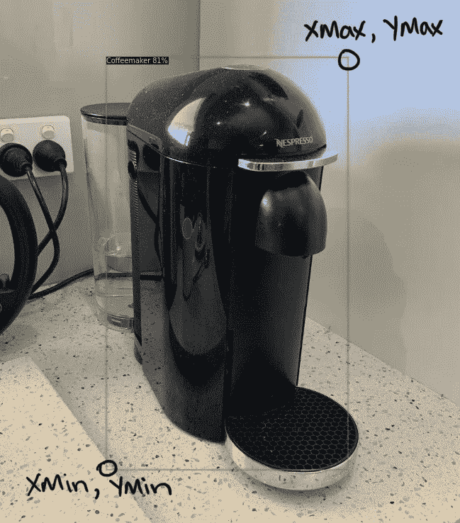

打开的图像带有 XMin、XMax、YMin 和 YMax 的相对像素值坐标。由于边界框是矩形或正方形的，知道左下角和右上角的坐标就足够了。

了解这一点很重要，因为 Detectron2 目前仅支持绝对像素值(相对像素值乘以高度或宽度的结果)。

顺序也很重要。

打开图像边界框的顺序为 XMin、XMax、YMin、YMax，但 Detectron2 需要 XMin、YMin、XMax、YMax。

这就是函数`rel_to_absolute()`的用武之地。

它使用图像的高度、宽度和现有边界框坐标，并使用它们将开放图像样式坐标转换为 Detectron2 样式坐标。

一旦我们完成了转换，`bbox`参数就会以`bbox_mode` ( `BoxMode.XYXY_ABS`)的形式出现。

## 创建图像词典(检测器 2 样式标签)

到目前为止，我们已经创建了一些辅助函数。是时候把所有的东西放在一起了。好消息是，我们已经完成了大部分繁重的工作。

倒数第二个(倒数第二个，是的，还有一个)助手函数是`get_image_dicts()`。

它采用一个目标图像文件夹、一个相关的注释文件和一个目标类列表，然后使用上面的函数、`get_image_ids()`、`format_annotations()`和`rel_to_absolute()`加上一点自己的逻辑来创建 Detectron2 样式标签(一个字典列表)。

哇哦。那是一口。

在这一点上，提醒读者如果你想看到这一点，检查[的例子谷歌 Colab 笔记本](https://dbourke.link/airbnbcode)。

现在，我们将继续这个故事。

哦，对了，关于`get_image_dicts()`还有一件事你应该知道，一旦它创建了图像字典列表，它会将它们保存到一个 JSON 文件中。这确保了我们以后可以使用它们。

get_image_dicts()将打开的图像和标签转换为 Detectron2 样式标签的示例用法(词典列表)。参见 GitHub 上的[完整代码和示例笔记本。](https://dbourke.link/airbnbcode)

我所说的稍后，是指当你[用 Detectron2](https://detectron2.readthedocs.io/tutorials/datasets.html#register-a-dataset) 注册一个数据集的时候。

出于某种原因，当您用 Detectron2 注册数据集时，数据集需要一些预处理，预处理必须用 lambda 函数完成，因此只能接受一个参数。

进入`load_json_labels()`，这是最后一个助手函数，它从目标图像文件夹中导入一个 JSON 文件(记住我们是如何保存它们的，以备后用)。

这里你要注意的技巧是，确保如果你将图像字典保存到文件并重新导入它们，你要确保`bbox_mode`被格式化为 Detectron2 风格的 BoxMode。

BoxMode 是一个 [Python 枚举类型](https://docs.python.org/3/library/enum.html)，一个特殊的类型，根据我的经验，它不能很好地保存到 JSON 中(你也许能在这里启发我)。

嘣。

数据预处理完成。我们所要做的就是用 Detectron2 注册我们的数据集，然后我们就可以开始建模了。

等等，为什么我们需要用 Detectron2 注册数据集？

现在，我不完全确定这一点。但是一旦这样做了，注册的数据集就变成了半不可变的(不能轻易改变)。

这似乎是一个防止未来数据集不匹配的好主意。

一个叫`DatasetCatalog.register()...`的小家伙，还有`MetaDataCatalog.get()`...(这是使用`load_json_labels()`的地方)然后我们出发去建模站。

# 建模和实验:从小处着手，不断迭代

*   **成分:**开放图像的小子集(3 类)，开放图像的 10%子集(所有类)
*   **时间:** 2 周+/- 2 天
*   **成本:** $0
*   **器具**:谷歌实验室，砝码&偏差，探测器 2 模型动物园

我们已经谈了很多了。但好消息是，一旦你准备好了数据集，Detectron2 会让建模阶段变得非常有趣。

在我开始之前，我必须提醒自己机器学习的第一条规则:从小处着手，经常实验，需要时扩大规模。

这看起来像什么？

还记得标签创建是如何从只为一类图像创建标签开始的吗？模特界也是如此。

为什么从小处着手？

你知道俗话说得好。如果船朝着错误的方向行驶，再用力划船也无济于事。

因此，我开始用 1 个类(咖啡机)获得一个 Detectron2 模型。

一旦成功了，我就把它扩大到 2 个班，然后是 3 个班。您必须知道，每次我这样做时，我都会发现我的预处理函数哪里出了问题，需要改进。其中一个主要问题是确保标签只为目标类创建，而不是来自开放图像的所有类。

在让探测器 2 和 3 个班级一起工作后，下一步是开始认真做模型实验。

你看，我在 Airbnb 的文章中读到，他们开始进行迁移学习，但没有取得多大成功，之后他们转向了谷歌的 AutoML。AutoML 工作，但他们说，限制是不能下载模型。

由于我的标准之一是避免使用 Google 的 AutoML(以修复模型可访问性限制),所以我没有使用它。

相反，我参考了 [Detectron2 的模型动物园](https://github.com/facebookresearch/detectron2/blob/master/MODEL_ZOO.md)，这是一个与 [COCO(上下文中的常见对象)数据集](http://cocodataset.org/#home)相关的模型集合，并发现已经有一些对象检测模型准备就绪。

太美了。

我的想法是，我将尝试每个预训练的对象检测模型，利用他们从 COCO 数据集学习的模式，用我自己的数据(一个小数据集)升级模式，看看它是否有效。

我照做了。

我从我想尝试的 Detectron2 模型动物园中定义了一个模型字典。

做了一个小实验。

```
# My first modelling experiment in pseudocode
for model in models_to_try: 
    with random_seed x
    do 3000 iterations 
    on classes coffeemaker, bathtub, tree house 
    save results to Weights & Biases
```

这个实验的目的是看哪个 Detectron2 对象检测模型在我的数据集上表现最好。我假设我可以通过控制除了模型之外的所有东西(因此是随机种子)来解决这个问题。

现在你可能想知道，你是如何决定这些模型的？

问得好。我看了模型动物园网页，选了它们。

好吧，那么，你是如何追踪你的实验结果的？

很高兴你问了。这就是[权重&偏差](https://www.wandb.com)出现的原因。weights&bias 是一个追踪深度学习实验的非凡工具，如果你还没有使用过，你应该使用它。

发生了什么事？

我做了实验。由于权重和偏见，结果是美丽的。

为什么？

因为模型显示他们正在学习一些东西(平均精度，一种评估物体检测模型的度量标准正在提高)，并且每个模型之间没有任何奇怪的差异(意味着实验控制有效)。

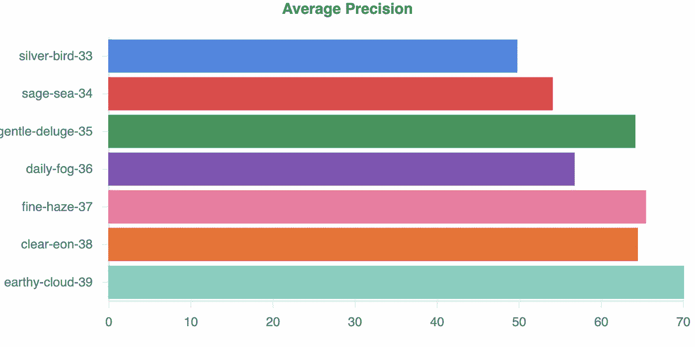

我第一次重大实验的结果。每一根棒线都是权重和偏差的“运行”。实验名称可以在左侧看到，每个实验名称对应于 models_to_try 中不同模型的结果。你可以看到[关于重量&偏差](https://app.wandb.ai/mrdbourke/airbnb-amenity-detection)的完整项目实验。

然后呢？

为了缩小范围，看看我应该使用哪个模型来建立一个大狗模型(一个拥有所有数据并训练更长时间的模型)，我假设了另一个实验。

我会从我的第一个实验中选取前两个模型，*retina net _ R _ 50 _ FPN _ 1x*([细雾-37](https://app.wandb.ai/mrdbourke/airbnb-amenity-detection/runs/18uz78yn) )和*retina net _ R _ 101 _ FPN _ 3x*([earthly-cloud-39](https://app.wandb.ai/mrdbourke/airbnb-amenity-detection/runs/374stxdc))，在一个更大的数据集(占所有数据的 10%)上训练它们一段合理的时间(大约 1000 次迭代)，然后比较结果。

```
# My second modelling experiment in pseudocode
for model in top_2_models: 
    with random_seed x
    do 1000 iterations 
    on 10% of the total data 
    save results to Weights & Biases
```

然后，无论哪一个模型脱颖而出，都将成为大狗模型。

必须知道的是，由于我在自己设定的期限内(整个项目 42 天)，快速试验是最重要的。

在 Airbnb 的文章中，他们提到他们一次训练他们的模型 5 天和 3 天。因为我总共花了 10 天时间做模特，所以我只有一次机会训练一个大狗模特。

到这个阶段，我已经从开放图像下载了完整的训练、验证和测试数据集。为了运行第二个主要实验，这次我决定在整个数据集的一部分上比较两个性能最好的模型(所有 30 个目标类，而不是只有 3 个类)。

数据集状态:

*   34，835 张训练图像
*   860 张验证图像
*   2，493 张测试图像

当对小部分数据进行建模实验时，小部分数据与完整数据具有相同的分布是很重要的。

换句话说，如果您要对 10%的数据进行建模实验，请确保这 10%的数据与整个数据集具有相同的类分布。在 Airbnb 数据集的情况下，如果完整的数据集有大量楼梯的图像，但没有很多葡萄酒架的图像，则较小的版本应该反映这种关系。

我通过从完整的数据集中随机选择示例，并确保类的分布看起来相似，来拆分 10%的训练数据。

```
# Get 10% of samples from train dataset
small_dataset = full_dataset.sample(frac=0.1)
```

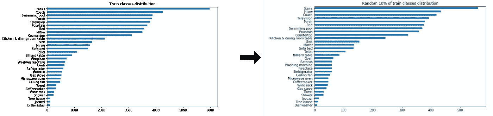

创建与原始训练集具有(大致)相同分布的训练数据的 10%子集。这样做意味着实验可以在较小的规模上运行，但仍然可以代表整个数据集可能发生的情况。对测试数据集进行了同样的处理。

我最后还将来自开放图像的验证和测试集合并成一个数据集`val_test`。这是因为 Airbnb 提到他们使用 10%的测试数据分割进行评估(75k 总图像、67.5k 训练图像、7.5k 测试图像)。

数据集状态:

*   34，835 张训练图像
*   3，353 个测试图像(原始验证和测试集图像合并)

准备好较小的代表性数据集后，我开始了第二个主要实验，确保跟踪权重和偏差方面的一切。

事实证明，两个模型都表现良好，这意味着应该上升的指标(平均精度)在上升，应该下降的指标(损失)在下降。尽管班级数量增加了 10 倍，但我的模型在学习(这是件好事)。

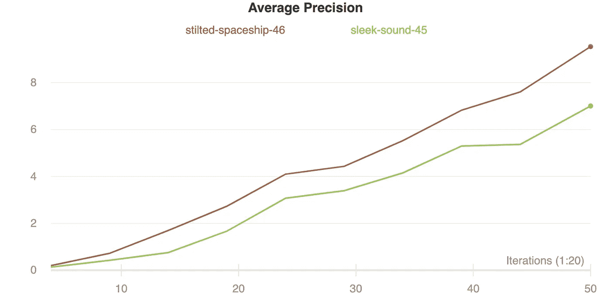

比较*retina net _ R _ 50 _ FPN _ 1x(sleek-sound-45)和*retina net _ R _ 101 _ FPN _ 3x(stilled-space ship-46)在 1000 次迭代中对总数据的 10%进行训练的结果。比仅在 3 个类上训练模型的结果更差(预期)，但平均精度上升是一件好事。

基于我的第二个主要实验的结果，我最终决定*retina net _ R _ 101 _ FPN _ 3x*([高跷-飞船-46](https://app.wandb.ai/mrdbourke/airbnb-amenity-detection/runs/s0z24hvo) )将升级为大狗模型状态。

# 训练大狗模型(根据所有数据训练的模型)

*   **成分:**38000+公开图片(Airbnb 的所有目标类)
*   **时间:**人类时间 3 天，计算时间 18 小时
*   **成本:**$ 150–175 美元(每小时 1.60 美元 P100 GPU +多重故障+未充分利用的实例)
*   **器具**:砝码&偏差，检测器 2*retina net _ R _ 101 _ FPN _ 3x*

Detectron2 的预训练模型是在[大盆](https://engineering.fb.com/data-center-engineering/introducing-big-basin-our-next-generation-ai-hardware/)(一台有 8 个 GPU 的大狗电脑)上训练的。我没有 8 个 GPU(图形处理器，一种能够快速计算的计算机芯片)，迄今为止，我所做的一切都是在谷歌 Colab (1 个 GPU)或我的本地计算机(没有 GPU)上完成的。

根据我之前的实验，用 10%的数据进行 1000 次迭代的训练，我知道使用 1 个 GPU 对整个数据集进行 100，000 次以上迭代的完整训练运行(摘自 Airbnb 的文章和 Detectron2 模型配置文件)需要大约 15 到 20 个小时。

有了这个信封背面的时间线计算，我想我真的只有一次机会来训练一只大狗模型。

最初，我打算做一些超参数调整(调整模型设置以获得更好的结果)，但由于限制，没有像我希望的那样在这里花太多时间。

所以我决定只关注几个:

*   学习率(模型在任一时刻试图提高其知识的程度)。
*   小批量(模型一次看多少张图片)。

根据我的经验，除了模型本身的结构(图层等，反正已经由 Detectron2 决定了)，这两个设置对性能影响最大。

我偶然发现了[线性学习率缩放规则](https://github.com/open-mmlab/mmdetection/blob/master/docs/GETTING_STARTED.md#train-a-model)，读了更多关于它的内容，并决定将其应用于*retina net _ R _ 101 _ FPN _ 3x*[模型的基础设置](https://github.com/facebookresearch/detectron2/blob/master/configs/Base-RetinaNet.yaml)。

线性学习率比例规则说，你的批量大小和学习率应该随着你使用的 GPU 的数量而增加和减少。

例如，由于我使用的是 1 个 GPU，而不是 Detectron2 最初的 8 个 GPU，如果遵守规则，我应该将最初的学习速率和小批量大小除以 8。

```
# Linear learning rate scaling rule
new_learning_rate = old_learning_rate/(new_num_gpus * old_num_gpus)
```

我相应地调整了设置，由于我使用的是迁移学习(不是从头开始训练)，我将新的学习率除以 10。

为什么？

我在 Airbnb 的文章中读到，当他们尝试迁移学习时，他们将学习除以 10，作为一种预防措施，以免在新模型学习时，原始模型模式丢失得太快。

这在直觉上对我来说是有意义的，但是，我肯定有更好的方法或者更好的解释。如果你知道，请告诉我。

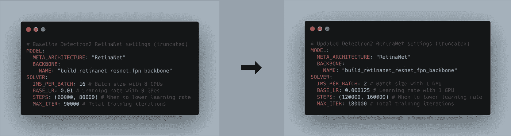

在 8 个 GPU 上训练的原始 Detectron2 RetinaNet 设置和从头开始更新，以反映在 1 个 GPU 上训练的线性学习率调度规则(较低的学习率和批量大小)并使用迁移学习(增加迭代次数和再次降低学习率)。

怎么样了？

好吧，18.5 小时，34，834 幅训练图像和 180，000 个训练步骤在 P100 GPU 上完成后，我的模型在保留的测试集上以 mAP(平均精度)得分 **43.297%** 结束。

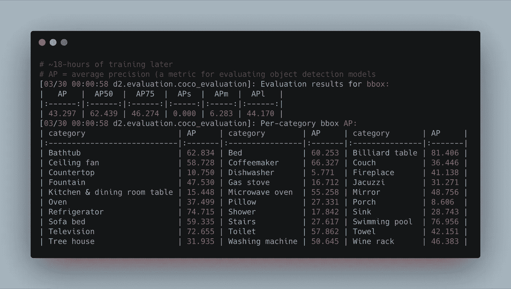

在 P100 GPU 上使用预训练的检测器 2 retinanet_R_101_FPN_3x 模型进行 18 小时迁移学习的最终结果。AP 指标越高越好。请注意，有些类的结果比其他类高，这与它们在数据集中的示例数量相关(示例越多，得分越高)。参见[完整训练跑步、设置和更多关于重量&偏差](https://app.wandb.ai/mrdbourke/airbnb-amenity-detection/runs/2gvwvqbu)的内容。

低于 Airbnb 使用谷歌 AutoML 的 68%地图的结果，但高于他们使用迁移学习的结果。

不过应该指出的是，这些指标(我的和 Airbnb 的)实际上没有可比性，因为我们使用了不同的数据集，我只能访问公共数据，Airbnb 有公共和内部图像数据。

但是计量是计量，对吗？

对计算机视觉模型的真正测试是在实际图像上。让我们看看测试集中的几个(记住，模型以前从未见过这些)。

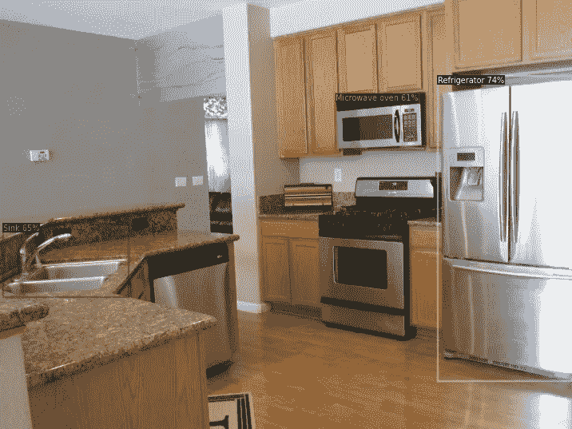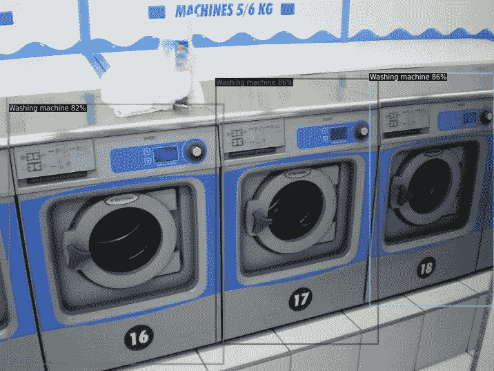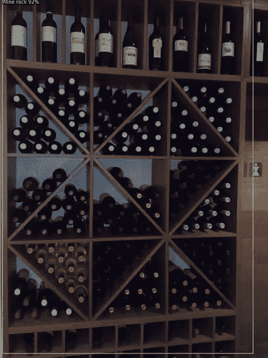

迁移学习训练的 Detectron2 模型的示例，根据开放图像对不可见图像进行舒适度预测。从左到右:厨房里的便利设施被收拾得很好，洗衣机很快就被发现，最后的酒架也被发现。注意:由于这些图像来自开放图像，其中许多不同于标准的 Airbnb 风格的图像。

我的卧室和厨房提供的一些定制图片怎么样？

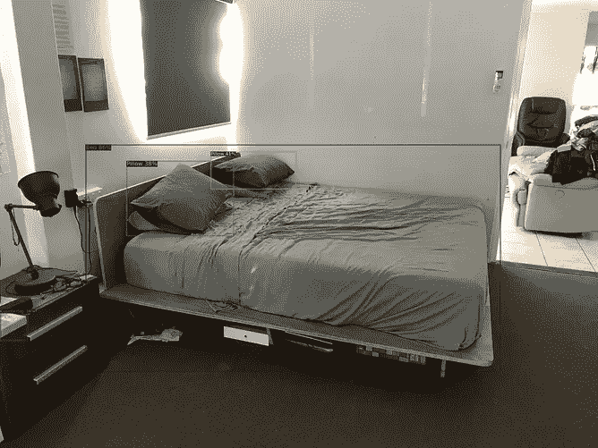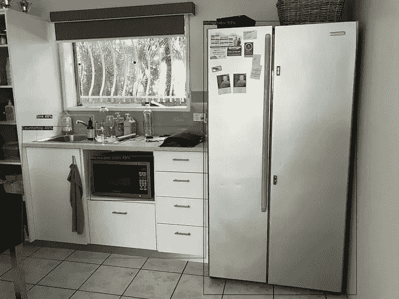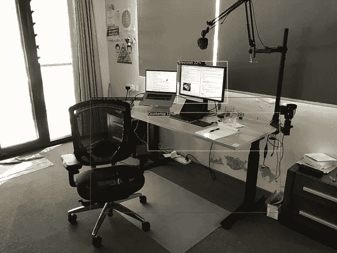

经过充分训练的模型对我家周围的一些图像进行预测的例子。从左到右:我的床收拾得很好，模特也找到了厨房里的大多数便利设施，但很难从我的工作站中挑选出合适的东西(注意:右图中的许多物品不在培训集中)。

> 看到机器学习模型在股票数据上工作:嘿，这太酷了…
> 
> 看到一个机器学习模型在自己的数据上工作:OMG 这是什么魔法？？？

建模完成后(在时间允许的情况下)，是时候让它上线了。

# 应用构建和部署:Jupyter 中的定制模型很酷，但在网络上直播更酷

*   **成分:**完全训练好的定制机器学习模型
*   **时间:** 4 天
*   **成本:** $14 托管每天(我知道，我需要解决这个问题)
*   **器具** : Streamlit，Docker，Google 容器注册，Google 计算引擎

机器学习模型部署似乎仍然有点像黑暗艺术。

首先，在 Jupyter 笔记本上编码和写 Python 脚本是不一样的。然后你就有了你需要的不同的包，从数据科学库到 web 框架。然后你必须围绕你的模型建立某种用户可以与之交互的界面。一旦你做到了这一点，你在哪里举办呢？

对于任何初露头角的机器学习工程师来说，所有这些挑战都值得接受。

毕竟，如果一个模型只存在于 Jupyter 笔记本中，那么它是否存在呢？

如果你像我一样是一个 Jupyter 笔记本战士，好消息是，Streamlit 和 Docker 可以帮助你。

[Streamlit](https://www.streamlit.io) 帮助你为你的机器学习和数据项目建立一个用户界面。更好的是，它也是用 Python 写的。如果你从未尝试过，花半天时间浏览所有的教程，你就可以搞定了。

现在[码头工人](https://docker.com)。Docker 可以帮助你将所有文件(Streamlit 应用、机器学习模型和依赖项)打包成一个漂亮的小包(称为 Docker 映像)。一旦你得到了这个包，你可以把它上传到一个云服务器(例如 Google Cloud ),一切正常，它应该完全像在你的本地系统上那样运行。

所以你让一个训练有素的模型在笔记本上做预测？您部署它的工作流程可能是这样的(我就是这样做的):

1.  创建一个类似于`app`的文件夹。这是您的 Streamlit 应用程序(一个 Python 脚本)、模型工件和所有其他所需文件的位置。
2.  在新文件夹中创建一个全新的 Python 环境。您需要安装准系统依赖项，以便您的应用程序在此环境中运行。在我的例子中，我需要 Streamlit 和 Detectron2 的依赖项。
3.  围绕您的模型构建一个 Streamlit 应用程序(Python 脚本)。
4.  让 Streamlit 应用程序在本地工作。这意味着你可以在电脑上互动和查看应用程序的工作情况。
5.  为您的环境和应用程序文件夹创建 Docker 映像。
6.  将您的 Docker 图片上传到 Docker Hub 或 Docker 托管服务，如 Google Container Repository。
7.  使用云提供商，如 Heroku、Google Cloud 或 AWS 来托管和运行您的 Docker 映像。

如果一切顺利，您应该会得到一个指向您托管的应用程序的 URL。

由于我使用了谷歌的应用引擎，我的结果是这样的:[airbnb-amenity-detection.appspot.com](https://airbnb-amenity-detection.appspot.com/)

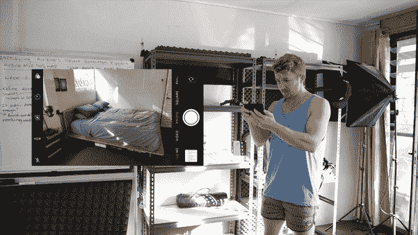

我的 Streamlit 应用程序在我的床的图像上运行的(加速)演示。参见 YouTube 上的[全面部署和应用构建视频。](https://youtu.be/smlQbh6jQvg)

我们非常快速地介绍了应用程序的构建和部署。但是如果你有兴趣了解更多，我会查看以下资源(按顺序)。

*   [Docker 如何帮助你成为更高效的数据科学家](/how-docker-can-help-you-become-a-more-effective-data-scientist-7fc048ef91d5)作者 Hamel Husain
*   [简化部署参考](https://github.com/streamlit/streamlit/wiki/FAQ#q-how-do-i-deploy-streamlit-on-heroku-aws-google-cloud-etc) (AWS、Heroku、Azure)
*   [如何将 Streamlit 应用部署到 Google 云平台](https://blog.jcharistech.com/2020/01/14/how-to-deploy-streamlit-apps-to-google-cloud-platformgcp-app-engine/)JarvisTech

# 标准和评估:比较我的模型和 Airbnb 的

我以一系列我想要达到的标准开始了这个项目。

我们来复习一下。

*   **✅的用户可以通过移动设备访问该应用。**这种做法可行，但不可行。尽管如此，它还是会滴答作响。
*   **🚫击败或至少等同于 Airbnb 的 50% mAP 的 MVP。**我的所有型号都没有达到或超过这个门槛。所以这是一个失败。
*   **✅修复了 Airbnb 使用的 AutoML 模型无法下载的痛点。我训练有素的 Detectron2 模型可供下载，任何人都可以使用。滴答。**
*   **🚫通过某种方式找到模型最不确定的图像/类**。你可以通过查看评估指标打印输出来做到这一点，但我想更多的是一个可视化功能，以实现对表现不佳的类/图像的主动学习方法。失败。
*   💰**运行该模式的成本效益如何？**对于这一个，让我们拿出记事本。

在 Airbnb 看了[一个关于机器学习的视频后，有人提到他们在网站上有超过 5 亿张图片(是的，超过 5 亿张)。对于我们的计算，让我们假设我们想要运行我们的模型跨越所有这些。](https://youtu.be/tPb2u9kwh2w)

使用我训练的 *retinanet_R_101_FPN_3x* 模型和我使用的GPU(英伟达 P100)对每张图像进行预测大约需要 0.2s。

*   GPU 成本:1.46 美元/小时(美国中部 GPU)，0.0004 美元/秒
*   推断时间:0.2s/张，5 张/秒
*   图像总数:5 亿
*   总推理时间:100，000，000 秒(500，000，000/5)
*   每幅图像的推理成本:0.000081 美元
*   推理总成本:40，555.55 美元
*   总推理时间(1 个 GPU):27778 小时(1160 天)。

当然，还需要更多的计算来看这个模型能增加多少价值。但是看到这些会让你知道 Airbnb 的所有图片需要多少概念证明。

很明显，在目前的状态下，在 Airbnb 的 5 亿多张图片上使用该模型可能是不可行的。

然而，这些数字也是使用谷歌云上 1 个租用的 GPU 计算出来的。如果一台本地机器有多个 GPU，成本(和时间)可以大大减少。

最后值得一看的对比是 Airbnb 在他们的文章中使用的最后一个。他们开始了他们的项目，作为一种建立他们自己的定制计算机视觉模型的方式，这将使他们免于使用第三方舒适性检测服务。

他们注意到，第三方舒适度检测服务只显示置信度超过 0.5 的预测结果(得分越高，模型对其预测越有信心)。所以为了进行公平的比较，他们修改了他们的 Google AutoML 模型来做同样的事情。

这样一来，Airbnb 的 Google AutoML 模型的结果从 **68%** 的地图变成了 **46%** 。看到这一点，我用我的模型做了同样的事情，发现结果从 **43.2%** 到 **35.3%** 。

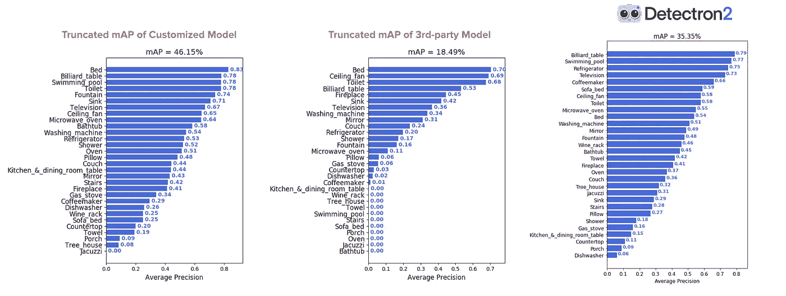

从左到右:Airbnb 的 Google AutoML 模型图在置信度 0.5 截断，第三方模型 Airbnb 试图以置信度 0.5 截断开始(来源:原创 [Airbnb 舒适度检测文章](https://medium.com/airbnb-engineering/amenity-detection-and-beyond-new-frontiers-of-computer-vision-at-airbnb-144a4441b72e))，我训练的 Detectron2 模型在置信度 0.5 截断。**注意:**这些模型不能完全比较，因为我的模型是在不同的数据集上训练的(没有内部图像)。这个形象只是为了给出一个发人深省的对比。**注 2:** 至于我的条形图(最右边)，我想我已经非常接近复制原件了，你不觉得吗？

# 扩展、潜在改进和要点

当然，这个项目并不完美。但我没想到会是这样。我是厨师，不是化学家。

我本想在 42 天结束前多做几件事，比如:

*   **超参数调谐。**尽管我的模型表现很好，但我并没有像我希望的那样做太多的超参数调整。如果我要这么做，我可能会求助于[权重&偏差扫描](https://www.wandb.com/sweeps)(一种用于尝试、调整和跟踪超参数的工具)。有了调整后的超参数，谁知道呢，也许我的模型可以提高 1-5%。
*   **减少了推断时间。**正如在计算模型的业务用例成本时所看到的，为了大规模运行(在 Airbnb 的所有图像上)，推理时间将需要大幅减少或使用更多的处理能力(更多的 GPU)。在进行这个项目 [EfficientDet](https://ai.googleblog.com/2020/04/efficientdet-towards-scalable-and.html) 时，发布了一个高效的对象检测算法。所以这可能是我接下来要尝试的。
*   **下载时创建的标签。**预处理 Open Images 数据以使用 Detectron2 需要几个步骤，这些步骤在下载图像时可能会自动执行。
*   **一个不那么花哨的应用(是我的错，不是 Streamlit 的)。我仍然习惯于部署我在 Jupyter 笔记本上写的代码。将来，我还想拥有自己的服务器，可以将 Docker 容器推送给其他人并与其他人共享。**
*   再培训渠道。如果添加了更多图像或类别，我如何轻松地重新训练模型？现在，这几乎需要重新运行整个项目。
*   **检验功能。**如果我想检查数据并查看厨房&餐桌的所有图像或预测低于某个置信度阈值的所有图像，我不能。这些类型的可视化功能对于进一步的数据探索是至关重要的(也许应该从一开始就构建)。
*   **哪些图像中有人物？**因为我用的是开放图片，所以很多图片里面都有人物。级联模型可以用来过滤掉不想要的图像风格，只关注与 Airbnb 用例相关的图像。

综上所述，这个项目实现了它的主要目标:边做边学。

我学到了一些我以前从未使用过的工具，更重要的是，我可以如何构建未来的项目。

主要的收获是，实验，实验，实验。

# 看看是怎么做的

尽管这篇文章很长，但它只是我在这个项目中采取的实际步骤的一个简短概述。

如果你想看到它们全部展开，你可以阅读观念中的[我的项目笔记(日志风格)。](https://dbourke.link/airbnb42days)

或者观看我创建的 YouTube 系列来配合它。

我创建的 YouTube 系列的第 8 部分是为了配合这个项目。