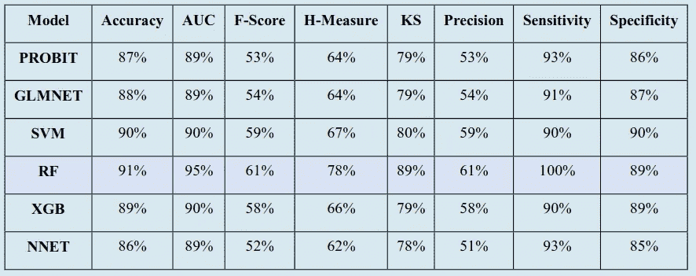
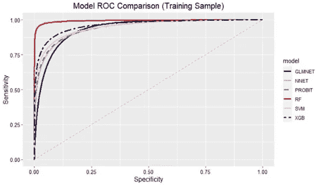
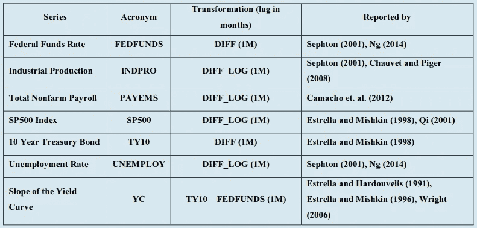
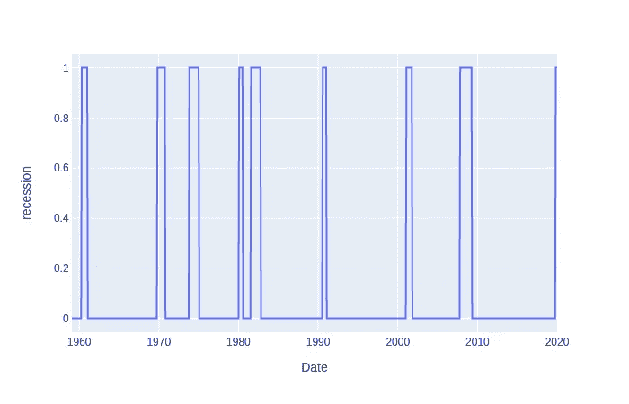
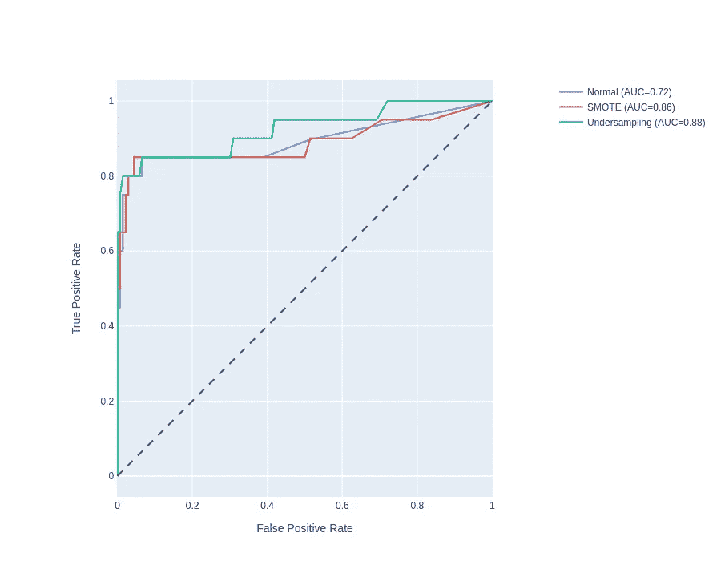
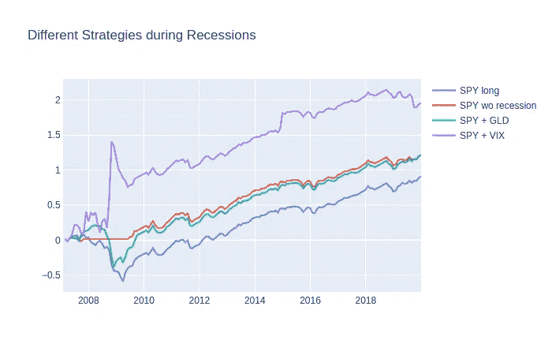
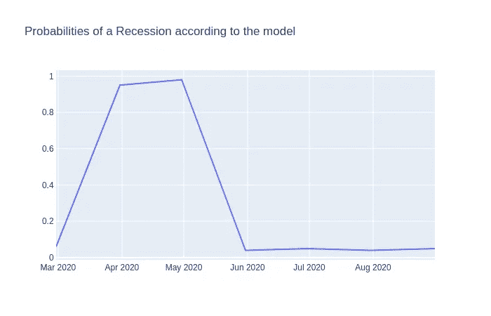

# 使用机器学习来预测衰退

> 原文：<https://towardsdatascience.com/replicating-machine-learning-prediction-of-recessions-yazdani-2020-9b9500131c71?source=collection_archive---------27----------------------->

## 复制“衰退的机器学习预测”(亚兹达尼，2020 年)


可爱的北极熊在打招呼——在金融市场上，熊通常没那么可爱

包含所有代码的笔记本可以在[这里](https://nbviewer.jupyter.org/github/lumalik/recession-replication/blob/master/nbs/recession-repl.ipynb)找到。

我最近发现了一个关于从经济数据中预测美国衰退的有趣的[演示](https://fdpinstitute.org/resources/Documents/webinars%20thoughtleadership%20pieces%20etc/Al%20Yazdani%20Webinar%20July%208,%202020.pdf)。虽然我对这个话题并不完全惊讶，但吸引我眼球的是他们的模型的绝对难以置信的准确性。



最佳模型是 AUC 为 95 %的随机森林！！！



你看那个随机森林的 ROC 曲线！

我们谈论的是曲线下 95 %的区域，完美的灵敏度，和近乎完美的特异性。当然，他们一定犯了错误？文章本身是在付费墙后面的。尽管如此，这种表达提供了足够的信息用于复制。

# 他们是怎么做到的？

根据陈述，他们使用了非常基本的经济指标(联邦基金利率的差异，失业率等。)以及作为整体市场指标的 SP500(美国 500 家最大公司)月度价格差异。他们有时使用对数差异，因为这些差异更可能遵循正态分布。



这些是所使用的预处理步骤和特性

在他们的研究中，他们使用了 1959 年 1 月至 2019 年 12 月的月度数据。

我从哪里获得数据的快速总结:

## Quandl:

*   由 GDP 推断的衰退
*   联邦基金利率
*   工业生产指数
*   非农工资
*   失业率

```
# you can download the data like this -> might require API key
recession_data = quandl.get("FRED/USRECQP", collapse="monthly") fed_funds_data = quandl.get("FRED/FEDFUNDS", collapse="monthly")
indpro_data = quandl.get("FRED/INDPRO", collapse="monthly")
nonfarm_payroll_data = quandl.get("FRED/PAYEMS", collapse="monthly")
unemploy_data = quandl.get("FRED/UNEMPLOY", collapse="monthly")
```

## 市场观察

*   500 先令

## 宏观趋势

*   10 年期国债

关于宏观趋势，只有 1962 年开始的数据可用。因此，我将只考虑 1962 年开始的数据。

```
# load in merged data 
data = pd.read_csv("../data/replication_data.csv", index_col=0)# fill missing recession data
data["recession"] = data["recession"].fillna(method='ffill')
```



这是我们的目标——根据 GDP 推断的衰退

# 准备数据

数据准备非常简单。我们计算对数差和差。此外，我们在测试集上划分序列中的数据，从 1962 年开始，但在其他方面坚持演示中建议的结束日期。

```
# calculate logarithmic differences 
def log_diff(v): 
    log_diff = np.log(v/v.shift(1))
    return log_diff# preprocessing 
data["slope_yc"] = (data["ty10"] - data["fedfunds"]).diff()
data["fedfunds"] = data["fedfunds"].diff()
data["indpro"] = log_diff(data["indpro"]) 
data["nonfarm"] = log_diff(data["nonfarm"])
data["SP500"] = log_diff(data["SP500"])
data["ty10"] = (data["ty10"]).diff()
data["unemploy"] = log_diff(data["unemploy"])
data["recession"] = data["recession"].shift(1)
```

我们的**列车**周期是从**1962–02 到 2006–12。**

我们的**测试**周期为 **2007 年 1 月至 2019 年 12 月。**

```
# get x and y 
X = data.drop(['recession'], axis=1)
y = data["recession"]# divide in train test according to paper 
X_train, y_train = (X.loc["1962-02-28":"2007-01-01"], y.loc["1962-02-28":"2007-01-01"])
X_test, y_test = (X.loc["2007-01-01":], y.loc["2007-01-01":])
```

# 处理阶级不平衡

鉴于他们文章的完整标题是“衰退的机器学习预测:不平衡的分类方法”——衰退是一个非常罕见的事件，这一事实应该在充分拟合模型的过程中发挥主要作用。

首先，我们可能会问自己，这些衰退月份在数据中出现的频率有多高？

```
print(data["recession"].value_counts())0.0    612
1.0     83
Name: recession, dtype: int64
```

少数民族阶层只占 13.56 %！

那么你如何处理阶级不平衡呢？

有两种主要策略:

1.  **欠采样**按顺序

使用欠采样，您从多数类中采样样本以匹配少数类。由于演示没有提到使用了哪种方法，我使用了**随机欠采样**。

2.**过采样**

通过过采样，您可以将数据综合添加到少数类中，以匹配多数类。 **SMOTE** 是一种常用的过采样技术。

我将对训练数据使用过采样和欠采样来帮助拟合我们的模型，并将它们与原始数据进行比较。

```
## Sampling techniques

from imblearn.over_sampling import SMOTE
from imblearn.under_sampling import RandomUnderSampler

# oversample using SMOTE 
sm = SMOTE(random_state=42)
X_train_smote, y_train_smote = sm.fit_resample(X_train, y_train)

# undersample randomly
rus = RandomUnderSampler(random_state=42)
X_train_rnd, y_train_rnd  = rus.fit_resample(X_train, y_train)
```

我们得到了三组不同的火车。原始训练数据，一个带有 SMOTE 的过采样版本和一个随机欠采样版本。

```
train_test_pairs = {"Normal":(X_train, y_train), 
                    "SMOTE":(X_train_smote, y_train_smote), 
                    "Undersampling":(X_train_rnd, y_train_rnd)}
```

由于论文标题强调了这样一个事实，即这是一个不平衡数据的问题——幸运的是，衰退是一种罕见的事件——我预计这些抽样方法的得分会有很大不同。

# 符合我们的模型并进行评估

所以让我们比较三种采样方法——拟合一个随机森林，看看性能。

```
fig = go.Figure()
fig.add_shape(
    type='line', line=dict(dash='dash'),
    x0=0, x1=1, y0=0, y1=1
)

for label, pair in train_test_pairs.items(): 
    clf = RandomForestClassifier(max_depth=10, n_estimators=100, class_weight = "balanced_subsample", random_state=0)
    clf.fit(pair[0], pair[1])
    y_pred= clf.predict(X_test) 
    fpr, tpr, thresholds = metrics.roc_curve(y_test, clf.predict_proba(X_test)[:,1])
    auc = metrics.roc_auc_score(y_test, clf.predict(X_test))

    name = f"{label} (AUC={auc:.2f})"
    fig.add_trace(go.Scatter(x=fpr, y=tpr, name=name, mode='lines'))

fig.update_layout(
    xaxis_title='False Positive Rate',
    yaxis_title='True Positive Rate',
    yaxis=dict(scaleanchor="x", scaleratio=1),
    xaxis=dict(constrain='domain'),
    width=900, height=700
)
fig.show()
```

*请击鼓……*


击鼓！[照片](https://unsplash.com/photos/Dq0ml-Xrf4U)卢兹·门多萨在 Unsplash 上拍摄



不同抽样方法的 ROC 曲线

不错！我们可以看到，取样方法对报告的 AUC 分数有很大的影响。欠采样比 SMOTE 执行得更好，本文中也使用了欠采样。总的来说，我认为**复制是成功的—** 考虑到我丢失了前三年的数据，并且我没有调优任何超参数。

那么，假设我们能够预测衰退，我们能利用这些信息做什么呢？

# 衰退期间你应该把钱投到哪里

我想到了几个策略。为了研究这些策略，我将使用我们的模型中的**预测来拟合训练期。**

## 1)仅限间谍

SP500 指数将作为我们的基准，因为它通常被认为是美国市场的良好代表。

## 2)间谍减去衰退

在经济衰退期间，人们可能想减少风险，把钱拿出来放在一边——也许藏在枕头下？

## 3)间谍和 GLD

黄金似乎总是一个安全的选择。在衰退期间，人们可能会观察到挤兑。

## 4)间谍和 VIX

VIX 是根据 SP500 期权计算的波动指数。它通常也被称为恐惧指数，更高的波动性意味着不稳定的时期。

比较这些交易策略，并使用我们模型的预测，我们得到了以下测试期的图表:



根据测试集上的预测返回不同的策略

这一时期的主要衰退是在 2008 年到 2010 年之间。我们看到，与流行的观点相反，投资黄金实际上不是一个好主意。黄金似乎很容易受到市场总体走势的影响。在经济衰退期间将我们的资金撤出市场是好的，但这并没有给我们带来真正的优势。另一方面，对被动投资者来说，投资于**波动指数(VIX)** 似乎是真正的游戏规则改变者。随着经济衰退的到来，恐惧和波动增加，利润也增加。

# 未来一个月会出现经济衰退吗？

为了确定是否会出现衰退，我们可以获取更多类似这样的最新数据。

```
# features 
fed_funds_data = quandl.get("FRED/FEDFUNDS", collapse="monthly")
indpro_data = quandl.get("FRED/INDPRO", collapse="monthly")
nonfarm_payroll_data = quandl.get("FRED/PAYEMS", collapse="monthly")
unemploy_data = quandl.get("FRED/UNEMPLOY", collapse="monthly")
spy = yf.Ticker("^GSPC").history(period='1d', start='2019-1-1').Close.resample("M").mean()
ty10 = yf.Ticker("^TNX").history(period='1d', start='2019-1-1').Close.resample("M").mean()# subsetting recent data  
data = pd.DataFrame()
data["fedfunds"] = fed_funds_data.loc["01-01-2020":].Value
data["nonfarm"] = nonfarm_payroll_data.loc["01-01-2020":].Value
data["indpro"] = indpro_data.loc["01-01-2020":].Value
data["SP500"] = spy.loc["01-01-2020":]
data["ty10"] = ty10.loc["01-01-2020":]
data["unemploy"] = unemploy_data.loc["01-01-2020":].Value

# preprocessing 
data["slope_yc"] = (data["ty10"] - data["fedfunds"]).diff()
data["fedfunds"] = data["fedfunds"].diff()
data["indpro"] = log_diff(data["indpro"]).fillna(method="ffill") # no recent data
data["nonfarm"] = log_diff(data["nonfarm"])
data["SP500"] = log_diff(data["SP500"])
data["ty10"] = (data["ty10"]).diff()
data["unemploy"] = log_diff(data["unemploy"])
```

我们可以使用我们的模型来估计我们的模型在预测中的置信度。

```
data.dropna(inplace=True)
data["recession_proba"] = clf.predict_proba(data)[:,1]fig = go.Figure()
fig.add_scatter(x= data.index, y=data["recession_proba"], mode='lines', name="SPY long")
fig.update_layout(title_text="Probabilities of a Recession according to the model")
fig.show()
```



根据我们对训练数据的随机森林拟合，对衰退的信心

截至 9 月，我们的模型确信未来一个月不会出现衰退。我们可以看到，由于杰罗姆鲍威尔美联储利率的变化以及失业人数的上升，我们实际上在 4 月和 3 月遇到了**更高的信心水平。**

如果你发现任何错误，有任何问题，或者想要合作，请随时在 [Linkedin](http://www.linkedin.com/in/lukas-malik-3b5201b6) 上联系我。

# 参考

亚兹达尼(2020)。衰退的机器学习预测:不平衡分类方法。《金融数据科学杂志》。演示幻灯片检索自:[https://FDP institute . org/resources/Documents/webinars % 20 thought leadership % 20 pieces % 20 etc/Al % 20 yaz dani % 20 webinar % 20 July % 208，%202020.pdf](https://fdpinstitute.org/resources/Documents/webinars%20thoughtleadership%20pieces%20etc/Al%20Yazdani%20Webinar%20July%208,%202020.pdf)