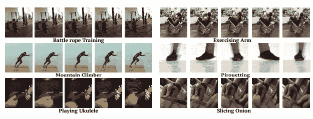
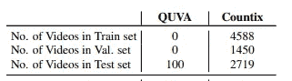
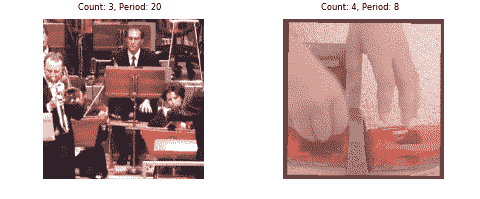
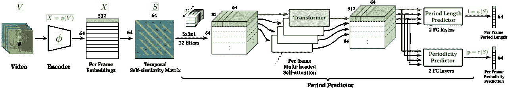
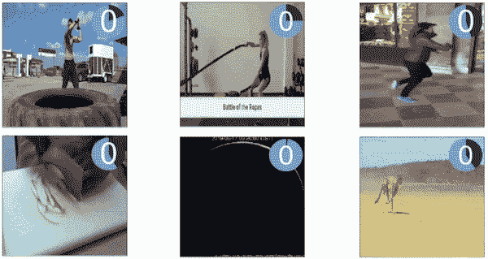
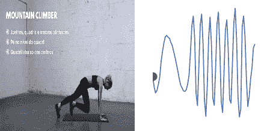

# RepNet:计算视频中的重复动作

> 原文：<https://towardsdatascience.com/repnet-counting-repeating-actions-in-a-video-bec1bdcec149?source=collection_archive---------26----------------------->

## 用于计数重复动作和估计视频中周期的最新模型的方法

克里斯·贾维斯在 [Unsplash](https://unsplash.com?utm_source=medium&utm_medium=referral) 上的照片

虽然我们大多数人都可以在锻炼或测量脉搏时计数，但如果能有一些东西为我们计数，甚至提供关于重复动作的有价值的信息，那就太好了。特别是对于周期较长的动作，如行星周期，或者周期太短的动作，如制造带。

谷歌研究和 DeepMind 团队最近在 2020 年 CPVR 发表的一篇名为**计算时间:野外不可知视频重复计数**的论文解决了这个有趣的问题。

他们采用一种非常“简单”的方法来识别和计数重复的动作，并最终预测动作的周期性。但作者发现的主要障碍是管理足够大的数据集来做到这一点。因此，本文[1]的主要贡献在于:

*   释放**计数**:一个新的视频重复计数数据集，它比先前最大的数据集大 90 倍
*   发布 **RepNet** :一种用于计数和测量“野外”视频中重复周期的神经网络架构[1]，使其优于之前的最先进方法
*   使用合成的、无标签的剪辑并生成可用于训练的增强视频

# Countix 数据集

Countix 中的样本来自[1]

首先，作者提出了一个新的、巨大的带有重复动作的带注释视频数据集——因为现有的重复数据集太小了。

请看上图，它比较了新数据集: **Countix** 和现有的“基准测试”(只有 100 个样本！).Countix 有从野外拍摄的视频(如 YouTube ),团队通过众包收集注释。标注器“分割包含具有明确计数的有效重复的视频部分”[1]。并且它们也继续添加计数值。一个漂亮的过程最终产生了一个比之前的数据集大 90 倍的带注释的数据集。

> 你可以在这里下载 Countix
> 
> 在这里看一看[动力学](https://deepmind.com/research/open-source/kinetics)

## 又一个数据集

除了 Countix(其剪辑来自 [**、动力学**](https://deepmind.com/research/open-source/kinetics) )之外，作者还提出了一种很酷的方式，即**从类似真实重复视频的普通视频中生成合成视频**。

简而言之，他们所做的是:

*   从运动训练集中的真实视频中截取短片，并重复该视频片段一定次数。**这固定了一个计数、周期，并产生一个重复的视频。**
*   为了保持“**真实度**，他们**在重复片段前后预挂起并附加非重复片段**。例如，一个女孩可以走进视频帧，进行一次旋转(就像在**结果可视化**部分的图像 1 的帧 3 中)，然后走开。因此，这种方法将导致重复单次旋转的片段多次——保持开始和结束时的行走片段完好无损。
*   请看下图中的第二帧。这种奇怪的变换是将**摄像机运动增强**应用于视频的结果。正如我们所知，在图像中，我们可以通过旋转、倾斜、通道转换二维图像来轻松执行**图像增强**。类似地，作者以**时间**方式对这些视频应用旋转、平移和缩放变换。时间时尚本质上意味着应用于每一帧的变换不是随机的，并且当播放视频时，它在变换的顺序和流程方面仍然有意义。这个**确保了我们在第二帧中看到的一个流畅的、看似动画的视频**

摄像机运动增强来自[2]

# 让我们训练吧

布莱恩·苏曼在 [Unsplash](https://unsplash.com?utm_source=medium&utm_medium=referral) 上拍摄的照片

模型架构由以下部分组成:

*   **编码器**:包括一个特征提取器(基于 ResNet-50)，一个 3D 卷积层(检测重复运动的不同部分)，以及使用全局 2D 最大池的维数减少
*   **时间自相似性矩阵:**计算两个帧之间的成对相似性(或者，更准确地说，两个帧的编码嵌入)
*   **周期预测器:**使用相似矩阵来预测每帧的周期长度和周期性。该预测器由 32 个 3D conv 层、多头注意力转换器层和作为分类器的 2 个 FC 层组成

模型架构来自[1]

> 这款内容丰富的 [**Colab 笔记本**](https://colab.research.google.com/github/google-research/google-research/blob/master/repnet/repnet_colab.ipynb) 带你经历在**本地视频**和你的**现场网络摄像头**上执行模型和测试的每一步

# 可视化结果

图一。重复计数的应用[2]

速度和周期性来自[2]。这表明该模型甚至能够捕捉不同频率的重复运动；这可以告诉主体是减速还是加速。

# 接下来呢？

你能想出这种方法需要解决的事件或角度吗？这在现实世界中哪里可以工作？哪里没有？

本文提供了 RepNet 的以下实际应用:

*   运动追踪:计数、速度等。
*   依靠心电图视频
*   天文和地球物理变化，如一天的长度或分析天体事件的卫星图像

# 参考资料:

[1]Dwibedi，Debidatta 等，“计算时间:野外的类不可知视频重复计数。”2020 年，*IEEE/CVF 计算机视觉和模式识别会议论文集*。

> [链接到 PDF](https://openaccess.thecvf.com/content_CVPR_2020/papers/Dwibedi_Counting_Out_Time_Class_Agnostic_Video_Repetition_Counting_in_the_CVPR_2020_paper.pdf)

[2]RepNet[1]的项目网页:[https://sites.google.com/view/repnet](https://sites.google.com/view/repnet)

> 感谢您从头到尾的阅读！您可以通过 LinkedIn[联系我，获取任何信息、想法或建议。](https://www.linkedin.com/in/param-raval/)