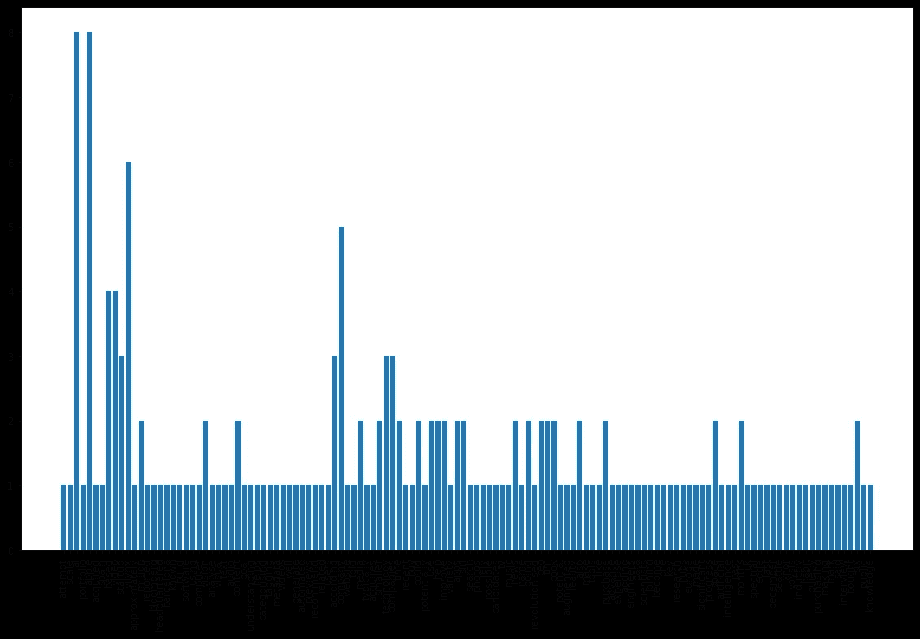
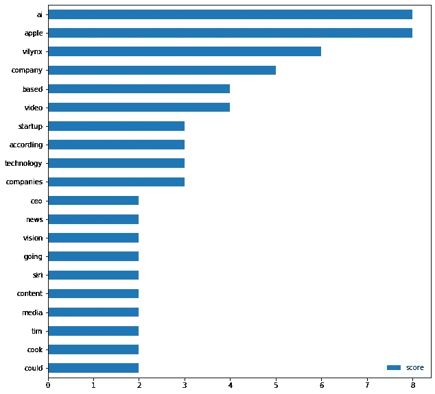
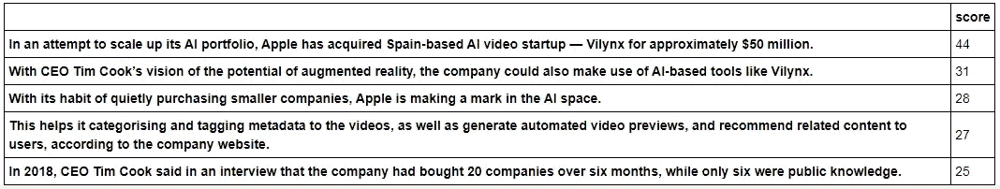
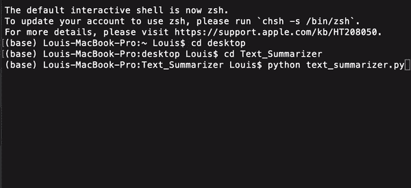

# 报告太长无法阅读？使用 NLP 创建摘要

> 原文：<https://towardsdatascience.com/report-is-too-long-to-read-use-nlp-to-create-a-summary-6f5f7801d355?source=collection_archive---------12----------------------->


塞巴斯蒂安·赫尔曼在 [Unsplash](https://unsplash.com?utm_source=medium&utm_medium=referral) 上的照片

## 创建个人文本摘要的指南

你是否曾经有过多的报告需要阅读，而你只是想快速总结每份报告？你有没有遇到过这样的情况，每个人都只想读一份摘要而不是一份完整的报告？

在 21 世纪，摘要已经成为解决数据过载问题的一种非常有用的方法。在这个故事中，我将向您展示如何使用 Python 中的自然语言处理(NLP)创建您的个人文本摘要。

*前言:创建个人文本摘要并不困难——初学者很容易做到！*

# 什么是文本摘要？

这基本上是一个任务，生成一个准确的总结，同时保持关键信息，不失去整体意义。

有两种常见的总结类型:

*   **抽象概括** > >从原文生成新句子。
*   **摘录摘要** > >识别重要的句子，并使用这些句子创建摘要。

# **我应该使用哪种总结方法，为什么？**

我使用提取摘要是因为我可以将这种方法应用于许多文档，而不必进行大量(令人生畏的)机器学习模型训练任务。

除此之外，提取摘要比抽象摘要给出更好的摘要结果，因为抽象摘要必须从原始文本生成新的句子，这是比数据驱动的方法更难提取重要句子的方法。

# 如何创建自己的文本摘要？

我们将使用单词直方图来排列句子的重要性，然后创建摘要。这样做的好处是，您不需要训练您的模型将它用于您的文档。

## 文本摘要工作流

下面是我们将遵循的工作流程…

*导入文本> > > >清理文本并拆分成句子> >移除停用词> >构建词直方图> >排列句子> >选择前 N 个句子进行汇总*

**(1)样本文本**

我使用了一篇名为**苹果以 5000 万美元收购人工智能初创公司的新闻文章中的文字来推进其应用程序。**你可以在这里找到原来的新闻文章[。](https://analyticsindiamag.com/apple-acquires-ai-startup-for-50-million-to-advance-its-apps/)

也可以从 [my Github](https://github.com/louisteo9/personal-text-summarizer) 下载文本文档。

**(2)导入库**

```
# Natural Language Tool Kit (NLTK)
import nltk
nltk.download('stopwords')
nltk.download('punkt')# Regular Expression for text preprocessing
import re# Heap (priority) queue algorithm to get the top sentences
import heapq# NumPy for numerical computing
import numpy as np# pandas for creating DataFrames
import pandas as pd# matplotlib for plot
from matplotlib import pyplot as plt
%matplotlib inline
```

**(3)导入文本并进行预处理**

有很多方法可以做到这一点。这里的目标是有一个清晰的文本，我们可以把它输入到我们的模型中。

```
# load text file
with open('Apple_Acquires_AI_Startup.txt', 'r') as f:
    file_data = f.read()
```

在这里，我们使用正则表达式来做文本预处理。我们将(A)用空格(如果有的话)替换参考号，即[1]、[10]、[20]，(B)用单个空格替换一个或多个空格。

```
text = file_data
# replace reference number with empty space, if any..
text = re.sub(r'\[[0-9]*\]',' ',text) # replace one or more spaces with single space
text = re.sub(r'\s+',' ',text)
```

接下来，我们用小写字母(没有特殊字符、数字和额外的空格)形成一个**干净的文本**,并将其分割成单个单词，用于单词得分计算和单词直方图的形成。

形成干净文本的原因是算法不会将例如**“理解”**和**理解**视为两个不同的单词。

```
# convert all uppercase characters into lowercase characters
clean_text = text.lower()# replace characters other than [a-zA-Z0-9], digits & one or more spaces with single space
regex_patterns = [r'\W',r'\d',r'\s+']
for regex in regex_patterns:
    clean_text = re.sub(regex,' ',clean_text)
```

**(4)将文本分割成句子**

我们使用 NLTK **sent_tokenize()** 方法将文本分割成句子。我们将评估每个句子的重要性，然后决定我们是否应该在总结中包含每个句子。

```
sentences = nltk.sent_tokenize(text)
```

**(5)删除停止字**

停用词是对句子没有多大意义的英语单词。可以安全地忽略它们，而不会牺牲句子的含义。我们已经在“(2)导入库”部分下载了一个带有英文停用词的文件。

这里，我们将获得停用词列表，并将其存储在 **stop_word** 变量中。

```
# get stop words list
stop_words = nltk.corpus.stopwords.words('english')
```

**(6)建立单词直方图**

让我们根据每个单词在整篇文章中出现的次数来评估它的重要性。

我们将通过(1)拆分 **clean_text** 中的单词，(2)删除停用词，然后(3)检查每个单词在文本中出现的频率。

```
# create an empty dictionary to house the word count
word_count = {}# loop through tokenized words, remove stop words and save word count to dictionary
for word in nltk.word_tokenize(clean_text):
    # remove stop words
    if word not in stop_words:
        # save word count to dictionary
        if word not in word_count.keys():
            word_count[word] = 1
        else:
            word_count[word] += 1
```

让我们绘制单词直方图，看看结果。

```
plt.figure(figsize=(16,10))
plt.xticks(rotation = 90)
plt.bar(word_count.keys(), word_count.values())
plt.show()
```



啊啊啊啊……看剧情有点难。让我们将其转换为水平条形图，并只显示前 20 个单词，下面有一个帮助函数。

```
# helper function for plotting the top words.
def plot_top_words(word_count_dict, show_top_n=20):
    word_count_table = pd.DataFrame.from_dict(word_count_dict, orient = 'index').rename(columns={0: 'score'})
    word_count_table.sort_values(by='score').tail(show_top_n).plot(kind='barh', figsize=(10,10))
    plt.show()
```

让我们展示前 20 个单词。

```
plot_top_words(word_count, 20)
```



从上面的剧情中，我们可以看到**‘ai’**和**‘apple’**这几个字出现在顶部。这很有意义，因为这篇文章是关于苹果收购一家人工智能初创公司的。

**(6)根据分数对句子进行排序**

现在，我们将根据句子得分对每个句子的重要性进行排名。我们将:

*   删除超过 30 个单词的句子，认识到长句子并不总是有意义的* *；
*   然后，将构成句子的每个单词的得分(计数)相加，形成句子得分。

得分高的句子将构成我们的顶级句子。上面的句子将构成我们以后的总结。

** **注:**以我的经验来看， **25** 到 **30** 之间的任何字数都应该给你一个很好的总结。

```
# create empty dictionary to house sentence score    
sentence_score = {}# loop through tokenized sentence, only take sentences that have less than 30 words, then add word score to form sentence score
for sentence in sentences:
    # check if word in sentence is in word_count dictionary
    for word in nltk.word_tokenize(sentence.lower()):
        if word in word_count.keys():
            # only take sentence that has less than 30 words
            if len(sentence.split(' ')) < **30**:
                # add word score to sentence score
                if sentence not in sentence_score.keys():
                    sentence_score[sentence] = word_count[word]
                else:
                    sentence_score[sentence] += word_count[word]
```

我们将 **sentence_score** 字典转换成数据帧，并显示句子和分数。

**注意** : dictionary 不允许你根据分数对句子进行排序，所以你需要将 dictionary 中存储的数据转换成 DataFrame。

```
df_sentence_score = pd.DataFrame.from_dict(sentence_score, orient = 'index').rename(columns={0: 'score'})
df_sentence_score.sort_values(by='score', ascending = False)
```



**(7)选择排名靠前的句子进行总结**

我们使用堆队列算法选择前 3 个句子并存储在 **best_sentences** 变量中。

通常 3-5 句话就足够了。根据你的文档的长度，随意改变要显示的顶部句子的数量。

在这种情况下，我选择了 **3** ，因为我们的文本是一篇相对较短的文章。

```
# display the best 3 sentences for summary            
best_sentences = heapq.nlargest(**3**, sentence_score, key=sentence_score.get)
```

让我们使用循环函数的 **print()** 和**来显示我们的总结文本。**

```
print('SUMMARY')
print('------------------------')# display top sentences based on their sentence sequence in the original text
for sentence in sentences:
    if sentence in best_sentences:
        print (sentence)
```

**这里是** [**我的 Github**](https://github.com/louisteo9/personal-text-summarizer) **的链接，来获取这个 Jupyter 笔记本。**

下面是完整的 Python 脚本，您可以立即使用它来总结您的文本。

# 让我们来看看算法的运行情况！

以下是一篇题为**苹果以 5000 万美元收购 AI 初创公司以推进其应用** *的新闻文章的原文(原文可在此处找到*[](https://analyticsindiamag.com/apple-acquires-ai-startup-for-50-million-to-advance-its-apps/)**)*:*

```
*In an attempt to scale up its AI portfolio, Apple has acquired Spain-based AI video startup — Vilynx for approximately $50 million.Reported by Bloomberg, the AI startup — Vilynx is headquartered in Barcelona, which is known to build software using computer vision to analyse a video’s visual, text, and audio content with the goal of “understanding” what’s in the video. This helps it categorising and tagging metadata to the videos, as well as generate automated video previews, and recommend related content to users, according to the company website.Apple told the media that the company typically acquires smaller technology companies from time to time, and with the recent buy, the company could potentially use Vilynx’s technology to help improve a variety of apps. According to the media, Siri, search, Photos, and other apps that rely on Apple are possible candidates as are Apple TV, Music, News, to name a few that are going to be revolutionised with Vilynx’s technology.With CEO Tim Cook’s vision of the potential of augmented reality, the company could also make use of AI-based tools like Vilynx.The purchase will also advance Apple’s AI expertise, adding up to 50 engineers and data scientists joining from Vilynx, and the startup is going to become one of Apple’s key AI research hubs in Europe, according to the news.Apple has made significant progress in the space of artificial intelligence over the past few months, with this purchase of UK-based Spectral Edge last December, Seattle-based Xnor.ai for $200 million and Voysis and Inductiv to help it improve Siri. With its habit of quietly purchasing smaller companies, Apple is making a mark in the AI space. In 2018, CEO Tim Cook said in an interview that the company had bought 20 companies over six months, while only six were public knowledge.*
```

**

*…文本摘要如下:*

```
*In an attempt to scale up its AI portfolio, Apple has acquired Spain-based AI video startup — Vilynx for approximately $50 million.
With CEO Tim Cook’s vision of the potential of augmented reality, the company could also make use of AI-based tools like Vilynx.
With its habit of quietly purchasing smaller companies, Apple is making a mark in the AI space.*
```

# *结论…还有最后一个提示*

*恭喜你！*

*您已经用 Python 创建了自己的文本摘要器。我希望这份总结看起来相当不错。*

*需要注意的是，我们在文档中使用了**词频**来对句子进行排序。使用这种方法的优点是，它不需要任何事先培训，可以处理任何文本。另一个技巧是，您可以根据自己的喜好进一步调整汇总器，基于:*

*(1) **顶句数量:**这里简单的经验法则是，摘要的长度不要超过原文的 1/4——可以是一句话，一段话，也可以是多段话，取决于原文的长度和你获取摘要的目的。如果你要总结的文字比较长，那么可以增加顶句的数量；或者*

*(2) **句子长度:**平均来说，今天一个句子的长度在 [15 到 20 个单词](https://techcomm.nz/Story?Action=View&Story_id=106#:~:text=How%20many%20words%20should%20we,2009%3B%20Vincent%2C%202014).)之间。因此，限制你的总结者只采用长度超过 25-30 个单词的句子就足够了；但是，可以随意增减字数。*

*谢谢你读了这个故事。在 [medium](https://louisteo9.medium.com/) 上关注我，获得更多关于数据科学和机器学习的分享。*