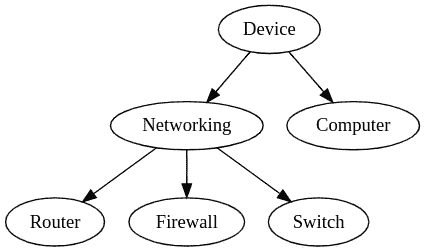

# 用 Python 表示分层数据

> 原文：<https://towardsdatascience.com/represent-hierarchical-data-in-python-cd36ada5c71a?source=collection_archive---------20----------------------->

## 用 anytree 库解析简单的 JSON 表示

Edvard Alexander lvaag 在 [Unsplash](https://unsplash.com?utm_source=medium&utm_medium=referral) 上拍摄的照片

在计算机科学中，处理层次分类数据是非常常见的。应用范围从[维基百科](https://en.wikipedia.org/wiki/Taxonomy_(general))的类别到由聚类算法(如 HDBSCAN)生成的数据的层次结构，等等。

在这篇文章中，让我们从我的工作领域中的一个例子开始:如何正确分类连接到网络的设备。从“设备”的一般概念出发，我们可以定义两大类设备，称为“网络”和“计算机”。第一类可以进一步细分为“路由器”、“交换机”和“防火墙”(当然，为了简单起见，我省略了其他几类)。数据可以这样表示:

用于对联网设备进行分类的分类示例。

这种在层次结构中表示分类数据的方式——其自然适合的数据结构是一个*树*——在技术上被称为 [*分类法*](https://www.britannica.com/science/taxonomy) ，这个术语最初在生物学中用于对物种进行分类。分类的每个元素都是一个*分类节点*。

如果想用人类可读的格式(如 JSON)来表示分类法，最常用的表示方法如下:

这种表示暴露了树的递归性质，但是随着分类的增长，由于大量的嵌套层次，它很快变得难以修改。在这篇文章中，我将展示 JSON 中的另一种表示，以及序列化它的 Python 代码。

## 分层数据的简单 JSON 表示

通过避免任何嵌套结构并将所有对象表示为按每个分类级别划分的平面列表，可以获得表示分类数据的另一种方法。这样，我们之前使用的分类示例如下所示:

和以前一样，每个节点可以包含任意数量的属性。上面的表示很容易在应用程序中解析和修改。然而，相对于前一个，它有一些缺点:

*   它没有显示底层树的递归性质，因此部分地失去了人类的可读性。
*   由于每个分类节点存储了*父*字段，因此它占用了更多内存。

在为分层数据选择正确的表示法时，请考虑这些缺点。现在让我们看看如何用 Python 解析上面的分类法表示。

## 用 Python 解析分层数据

您肯定知道，说到可用库，没有哪种语言比 Python 更好。因此，有几个适合处理分类法的库就不足为奇了:

*   最受欢迎的是`[networkx](https://networkx.github.io/documentation/stable/)`。尽管它是为更复杂的图结构而设计的，`networkx`很容易适应分类法，这只是图的一个特例。
*   另一个不太受欢迎的图书馆是`[anytree](https://anytree.readthedocs.io/en/latest/)`。它实现了一个简单但功能丰富的树数据结构，并且经过了实战测试(它达到了版本 2.8.0，对于 Python 库来说并不常见)。这是我为这篇文章选择的库。
*   其他库包括`[binarytree](https://github.com/joowani/binarytree)` just for 二叉树、 [TreeSwift](https://github.com/niemasd/TreeSwift) 等等。

现在让我们构建一个 TaxonomyParser 类的最小版本，用于反序列化 JSON 表示，并使用惟一的节点标识符在分类法中进行搜索。

这个类唯一需要的属性是`root_key`——用于快速检索根节点——和包含所有树节点的字典`nodes`,这些树节点由它们唯一的`name`索引。由于 JSON 文件中的平面表示，反序列化分层数据的代码(`read_from_json`方法)非常简单。

如果需要在分类法上实现更复杂的搜索条件，该怎么办？例如，假设每个节点包含一个带有正则表达式列表的`regex`属性。给定一个输入关键字，您希望查找正则表达式与该关键字匹配的所有节点。听起来很复杂？得益于`anytree`灵活的界面，这可以通过几行代码实现:

最后，如果您想将图形导出到标准。*点*格式或作为 PNG 图像，`anytree`提供了所有你需要的:

总之，有了`anytree`库，解析和操作本文中呈现的平面表示中存储的分层数据变得非常容易。完整的代码可以在我的 [Github](https://github.com/madagra/taxonomy-parser) 上找到。如果你喜欢这篇文章，并且有任何问题或意见，请不要犹豫，通过 [LinkedIn](https://www.linkedin.com/in/mariodagrada/) 联系我。